<div align="center">


*pronounced **"febz"***

**Self-hosted code search and static change-impact analysis for microservice repositories.**

[](https://github.com/bmeddeb/phebs/actions/workflows/ci.yml)

</div>

---

> Phoebe was the first moon discovered by comparing photographs: one meaningful
> signal in a large static corpus. That is the job.

## Why phebs?

Migration work starts with deceptively simple questions:

- What contract is changing?
- Where is it declared and implemented?
- Which source locations call it?
- What else could be affected?
- What could the analysis not resolve?

phebs puts code search, repository browsing, SCIP navigation, Git history, and
static contract evidence in one self-hosted application. Evidence links to an
immutable repository, commit, file, and source span. Ambiguous relationships
remain candidates or abstentions instead of being promoted into callers.

Static evidence complements runtime telemetry: it can reveal dormant, rare, or
unexercised code paths that a trace did not observe. It does not prove that code
executed in production.

## What is available?

| Surface | What it answers | Posture |
|---|---|---|
| Search and repositories | Find, browse, sync, and index source across GitHub, GitLab, Gitea, generic Git, and local repositories | Shipped |
| Code intelligence | SCIP definitions/references/hover plus Git blame, history, commits, and bounded diffs | Shipped |
| Auth, API, and MCP | Browser sessions, revocable keys, optional OIDC, permissions, audit, OpenAPI, and stateless MCP | Shipped |
| Contract Atlas | Browse protobuf/gRPC and Thrift services, operations, message shapes, and implementations | Experimental, default-dark |
| Caller Map | Find declaration-bound static callers, name matches, unresolved sites, and old-versus-replacement differences | Experimental, default-dark |
| Contract impact | Inspect operation consumers, protobuf/Thrift field references, compatibility previews, proof bundles, and coverage | Experimental, default-dark |
| Kafka topics | Find literal producers and consumers with a first-class unresolved-site census | Experimental, default-dark |
| Change Workbench | Organize a change around Why, What, Where, and How with immutable evidence and human dispositions | Synthetic/development or explicitly capability-gated |

Today a repository is either indexed whole or configured with one exact
analysis unit. The focused path and repository-wide caller overlay are shipped
foundations, but a first-class catalog containing many independently current
services per repository is not implemented yet. The selected next product
program makes services logical views over shared repository generations; see
the [roadmap](./docs/ROADMAP.md#next-microservice-architecture-program).

The experimental evidence packs currently understand committed protobuf/gRPC,
Thrift, generated Go, SCIP field-reference, and Kafka source shapes. They are
disabled in ordinary configuration and make no completeness or accuracy claim.

## Reading static evidence

phebs keeps evidence classes separate:

- **Resolved caller** — a supported source shape was tied to one exact contract
  identity under the pack's documented rules.
- **Name match** — source text matches an operation name but is not proven to
  call that contract.
- **Unresolved candidate** — a supported call shape was found, but ambiguity or
  missing identity prevented a safe binding.
- **Coverage certificate** — the exact analysis scope, repositories,
  revisions, extraction runs, durable outcomes and bounded receipts,
  failures, exclusions, caller progress, and unresolved counts that bound an
  answer.

An empty result is meaningful only in the context of that coverage. Current
answers identify focused-local evidence separately from repository-overlay
callers. Immutable proof bundles retain their original certificate bytes;
live answers use the current versioned certificate shape.

## Five-minute local start

Prerequisites: Git, Go 1.26+, Node 24+, and SurrealDB 3.0+. Exact tool versions
are pinned in the repository.

```bash
git clone https://github.com/bmeddeb/phebs.git
cd phebs

make build
./phebs serve -config phebs.yaml
```

Open <http://127.0.0.1:3070>. On first start, use the one-time setup token from
the server log to create the administrator.

The checked-in `phebs.yaml` indexes a public repository. To connect your own
checkout, use one exact absolute or quoted home-relative path:

```yaml
connections:
  - name: my-service
    type: git
    url: "~/src/my-service"
    watch: true
```

Home-relative paths are portable across engineers; wildcard repository
discovery is deliberately not supported. See the
[annotated configuration](./docs/config.example.yaml) and
[user manual](./docs/MANUAL.md) for connectors, authentication, deployment,
backup, and troubleshooting.

## Try the microservices workflows

The OpenTelemetry demo is the quickest public-corpus evaluation:

```bash
./phebs serve -config phebs-otel-demo.yaml
```

Open <http://127.0.0.1:3071>. The
[workflow guide](./docs/guides/WORKFLOWS.md#opentelemetry-microservices-evaluation) also covers the
Jaeger/Thrift and Kafka demo configurations.

For the retained neutral focused-service cohort—focused Search and local
evidence beside repository-overlay callers and the store-derived Workbench:

```bash
make dev
```

This cohort demonstrates product behavior through ordinary pipelines. It is
not public-corpus accuracy evidence.

## Architecture

phebs is one Go application with an embedded React UI. It serves zoekt
in-process and supervises bounded local children for SurrealDB, index
construction, and optional Buf compatibility. Redis and a hosted control plane
are not required.



Repositories are read at immutable commits. Generated Go may live under
`gen/`, handwritten code under `src/`, and IDL under a separate `idl/` tree.
Optional committed snapshots can add build-unit, deployable, owner, layout,
and generated-from attribution. Git submodules remain explicit repository
boundaries rather than silently traversed content.

Architecture decisions live in the dated [PLAN.md](./PLAN.md) ledger.

## Evidence and safety posture

The retained external Go/gRPC validation gate is `NOT_ESTABLISHED`. No Contract
Atlas, Caller Map, Impact, Topics, Workbench, proof-bundle, or coverage result
establishes:

- runtime use or complete caller coverage;
- compatibility or migration completion;
- decommission safety;
- extraction accuracy.

Unsupported, ambiguous, configuration-driven, failed, stale, and excluded
states remain visible. Permission filtering happens before evidence resolution,
and hidden repositories are not serialized into proof material.

## Documentation

- [User manual](./docs/MANUAL.md) — install, workflows, operations, and
  troubleshooting.
- [Documentation map](./docs/README.md) — every contract, pilot artifact,
  fixture, and retained record.
- [Product vision](./docs/VISION.md) — long-term direction and boundaries.
- [Roadmap](./docs/ROADMAP.md) — current posture and next decisions.
- [Backlog](./docs/BACKLOG.md) — active work and ticket acceptance criteria.
- [Architecture decisions](./PLAN.md) — append-only ADR ledger.

## Lineage and license

phebs is a ground-up, reference-only reimplementation of ideas observed in
[Sourcebot](https://github.com/sourcebot-dev/sourcebot). It does not copy
Sourcebot source code, UI code, or assets.

Core dependencies include
[zoekt](https://github.com/sourcegraph/zoekt),
[SurrealDB](https://surrealdb.com),
[huma](https://github.com/danielgtaylor/huma),
[Base Web](https://baseweb.design), and
[CodeMirror](https://codemirror.net).

Licensed under [Apache-2.0](./LICENSE).
