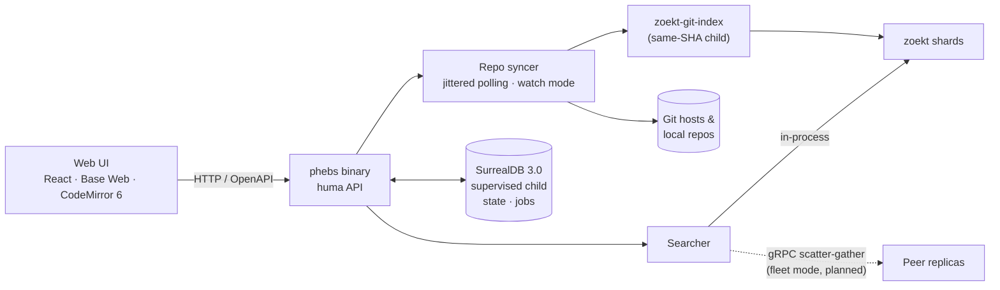

<div align="center">

# phebs

*pronounced **"febz"***

Self-hosted code search in one Go binary.

</div>

---

> In 1899, William Pickering discovered Phoebe — the first moon ever found by
> photography — by comparing plates of Saturn's sky and spotting the single dot
> that moved among thousands of fixed stars.
>
> One moving signal in a massive static corpus. That is the whole job.

## What it is

**phebs** is a ground-up, reference-only Go reimplementation of the ideas in
[Sourcebot](https://github.com/sourcebot-dev/sourcebot): fast, precise code
search you host yourself, without running a constellation of services to get it.

- **One binary.** [zoekt](https://github.com/sourcegraph/zoekt) is linked
  in-process as a library for search; index builds run as an OOM-isolated
  child compiled from the same module version. The web UI is embedded.
- **One database, supervised.** [SurrealDB](https://surrealdb.com) holds repo
  state and job queues on local disk, started and stopped with phebs — zero
  external services.
- **Live search over your working repos.** Watch mode notices commits and
  branch switches in local repositories and reindexes within seconds.
- **Scales sideways (planned).** The fleet profile shards repos across
  replicas by rendezvous hashing with gRPC scatter-gather queries.

## Quick start

```bash
make build                          # UI + zoekt child + ./phebs
./phebs serve -config phebs.yaml    # open http://localhost:3070
```

```yaml
# phebs.yaml
connections:
  - name: zoekt
    type: git
    url: https://github.com/sourcegraph/zoekt.git
  - name: my-project
    type: git
    url: /Users/you/src/my-project
    watch: true                     # commits searchable in seconds
```

**[→ Full user manual](./docs/MANUAL.md)** — configuration reference, GitHub
connections, search syntax, HTTP API, operations, troubleshooting.

## Architecture

zoekt in-process for trigram search · SurrealDB 3.0 for state and queues ·
[huma](https://github.com/danielgtaylor/huma) for the OpenAPI surface ·
Vite + React + [Base Web](https://baseweb.design) + CodeMirror 6 in front ·
gRPC scatter-gather across a rendezvous-hashed fleet (planned, P6).



## Design decisions of record

Every decision lands as a dated ADR bullet in [PLAN.md](./PLAN.md). Highlights:

- **zoekt as a library, not a service.** Search runs in-process; the index
  builder is a child compiled from the same go.mod SHA, so reader/writer
  shard skew is structurally impossible.
- **HEAD-only branch indexing.** The default branch — or, for watched local
  repos, the branch you have checked out.
- **Jittered polling, not LIVE SELECT.** Queue claims poll with jitter; an
  optimistic conditional UPDATE won the claim-semantics spike (zero
  double-claims under concurrency, cheapest lost-race cost).
- **Supervised child over embedded DB.** No embedded SurrealDB engine exists
  for Go; a loopback-only supervised `surreal` process keeps single-command
  dev and deletes the CGo risk.

## Status

**P1 complete** — sync (GitHub + any git URL + local), job queue with crash
recovery, incremental indexing, search API (JSON + SSE), file serving, web
UI, watch mode, Prometheus metrics. See
[BACKLOG.md](./docs/BACKLOG.md) for what's done and what's next
(P2: search contexts → MCP server → GitHub App webhooks).

## Lineage & acknowledgements

- [Sourcebot](https://github.com/sourcebot-dev/sourcebot) — the reference for
  this port. phebs is an independent reimplementation from observed behavior
  and public docs; no upstream code, UI, or assets are used.
- [zoekt](https://github.com/sourcegraph/zoekt) (Apache-2.0) — the search
  core, by Han-Wen Nienhuys, maintained by Sourcegraph.
- [SurrealDB](https://surrealdb.com), [huma](https://github.com/danielgtaylor/huma),
  [Base Web](https://baseweb.design), [CodeMirror](https://codemirror.net).

## License

[Apache-2.0](./LICENSE).
