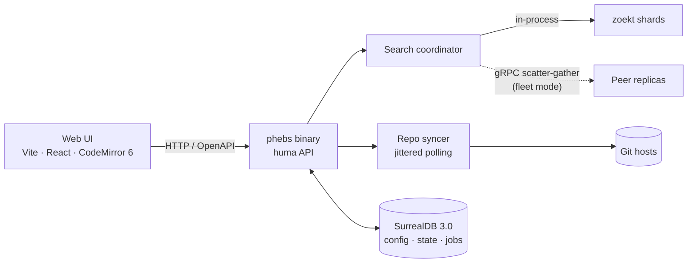

<div align="center">

# phebs

*pronounced **"febz"***

Self-hosted code search in one Go binary.

<!-- badges: build · go version · license (TBD) · status: pre-alpha -->

</div>

---

> In 1899, William Pickering discovered Phoebe — the first moon ever found by
> photography — by comparing plates of Saturn's sky and spotting the single dot
> that moved among thousands of fixed stars.
>
> One moving signal in a massive static corpus. That is the whole job.

## What it is

**phebs** is a ground-up Go port of [Sourcebot](https://github.com/sourcebot-dev/sourcebot):
fast, precise code search you host yourself, without running a constellation of
services to get it.

- **One binary.** [zoekt](https://github.com/sourcegraph/zoekt) is linked
  in-process as a library — no sidecar indexers, no separate webserver fleet.
- **One database.** [SurrealDB](https://surrealdb.com) holds repo config,
  index state, and job queues.
- **Scales sideways.** Fleet mode shards repos across replicas by rendezvous
  hashing and fans queries out over gRPC scatter-gather.

## Architecture

zoekt in-process for trigram search · SurrealDB 3.0 for state · [huma](https://github.com/danielgtaylor/huma)
for the OpenAPI surface · Vite + React + CodeMirror 6 in front · gRPC
scatter-gather across a rendezvous-hashed fleet.



## Design decisions of record

Full rationale lives in [PLAN.md](./PLAN.md) (v2.2). Highlights:

- **zoekt as a library, not a service.** Trigram indexing and search run inside
  the phebs process; shard files are the only artifact.
- **HEAD-only branch indexing.** Index the default branch, nothing else.
  <!-- TODO: one-line rationale from PLAN.md -->
- **Jittered polling, not LIVE SELECT.** Fleet replicas poll SurrealDB for work
  with jitter rather than holding live subscriptions.
  <!-- TODO: one-line rationale (connection fan-out / failure semantics) -->
- **Rendezvous-hashed repo subsets.** Each replica owns a deterministic slice
  of the repo set; queries scatter to all replicas and gather ranked results.

## Status

**Pre-alpha.** P0 spike complete; PLAN.md is the source of truth.

- [x] P0 spike — index + search a real repo end to end
- [ ] Repo syncer with jittered polling
- [ ] Fleet mode (rendezvous hashing, gRPC scatter-gather)
- [ ] Web UI (CodeMirror 6 result rendering)
- [ ] AuthN/AuthZ story
<!-- TODO: reconcile with PLAN.md roadmap -->

## Quick start

<!-- TODO: real commands once the binary lands -->

```bash
go install github.com/<you>/phebs@latest   # TODO: final module path
phebs serve --config phebs.yaml
```

## Deployment profiles

- **Single node** — one process, one SurrealDB, local shard storage. The
  default; suitable for most orgs.
- **Fleet** — N replicas behind a load balancer, each indexing its
  rendezvous-hashed subset, every replica able to answer any query via
  scatter-gather.

## Lineage & acknowledgements

- [Sourcebot](https://github.com/sourcebot-dev/sourcebot) — the origin of this
  port. <!-- TODO: verify upstream license terms before reusing any code, UI, or assets; a clean-room port and a fork carry different obligations -->
- [zoekt](https://github.com/sourcegraph/zoekt) (Apache-2.0) — the search core,
  by Han-Wen Nienhuys, maintained by Sourcegraph.
- [SurrealDB](https://surrealdb.com), [huma](https://github.com/danielgtaylor/huma),
  [CodeMirror](https://codemirror.net).

## License

TBD. <!-- Blocked on the Sourcebot license question above. -->
