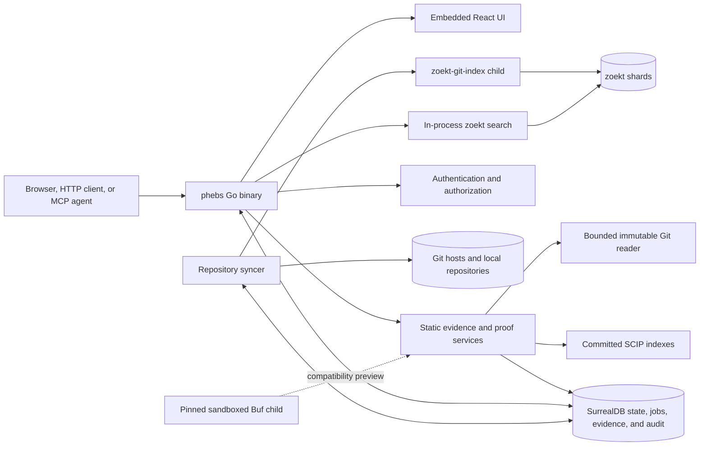

<div align="center">


*pronounced **"febz"***

**Self-hosted code search and static change-impact analysis for microservice repositories.**

[](https://github.com/bmeddeb/phebs/actions/workflows/ci.yml)

</div>

---

> In 1899, William Pickering discovered Phoebe — the first moon found by
> photography — by comparing plates of Saturn's sky and spotting the single dot
> that moved among thousands of fixed stars.
>
> One meaningful signal in a massive static corpus. That is the job.

## What is phebs?

**phebs** is a self-hosted code search and static evidence platform built for
large repositories and microservice systems.

It begins with fast code search, repository browsing, SCIP navigation, and Git
history. Its experimental contract-intelligence layer builds on that
foundation to answer migration questions such as:

- Where is this endpoint declared?
- What are its request and response shapes?
- Which source files contain matching static callers?
- Which implementations register the service?
- What changed between an old endpoint and its replacement?
- Which protobuf or Thrift fields are referenced?
- Which Kafka topics have visible producers or consumers?
- What could not be resolved, and why?
- Which repositories and revisions were actually analyzed?

Every evidence row links back to an immutable repository, commit, file, and
source span. Ambiguous relationships remain visible as unresolved candidates
instead of being promoted into callers.

Static analysis complements runtime telemetry: it can expose dormant, rare, or
unexercised code paths that do not appear in a sampled trace. It does not prove
that code executed in production.

## Highlights

### Code search and repository exploration

- Fast regular-expression search powered by
  [zoekt](https://github.com/sourcegraph/zoekt).
- Persistent repository explorer, source viewer, and folder navigation.
- GitHub, GitHub App, GitLab, Gitea, generic Git URL, and local-repository
  connections.
- Portable `~/...` local repository paths and live watch mode.
- HEAD indexing by default, with an optional bounded revision allowlist.
- Named search contexts for reusable repository scopes.
- JSON and server-sent-event search APIs.

### Code intelligence

- Committed SCIP definitions, references, and hover information.
- Git blame, commit history, commit details, and bounded diffs.
- Immutable source links pinned to the indexed commit.
- Optional `universal-ctags` symbol indexing.

### Contract Atlas

The experimental, default-dark **Contract Atlas** scans supported IDL evidence
and provides a searchable protocol catalog:

- protobuf/gRPC and Thrift services;
- canonical operation identities;
- request and response message shapes;
- protobuf streaming and Thrift `oneway` semantics;
- field numbers, cardinality, unions, exceptions, and result wrappers;
- implementations, matching callers, and unresolved candidates;
- exact source citations and extraction coverage.

A declaration, a name match, and a resolved caller are intentionally different
evidence classes.

### Caller Map and migration comparison

For an exact Contract Atlas identity, the experimental **Caller Map** provides:

- declaration-lineage-bound static callers;
- source-first ordering and bounded pagination;
- repository, build-target, deployable, service, and owner attribution when
  committed metadata is available;
- separate unresolved and name-only candidates;
- old-versus-replacement caller comparison for endpoint migrations;
- explicit coverage and attribution gaps.

This is a static caller inventory over the analyzed source population, not a
claim that every row executes at runtime.

### Contract impact and proof bundles

The experimental **Impact** workflow supports:

- operation-consumer reports across gRPC and Thrift;
- protobuf and Thrift field-reference reports;
- Thrift field `0`;
- compatibility previews through a pinned, sandboxed Buf child;
- immutable proof bundles with exact evidence citations;
- deterministic coverage certificates;
- incomplete, failed, stale, excluded, and unresolved states;
- permission-aware bundle reads and retention.

Coverage describes the analyzed population. It does not turn an empty result
into proof of absence.

### Kafka topic evidence

The experimental **Topics** page and MCP tools expose:

- literal Sarama and `segmentio/kafka-go` producers and consumers;
- exact source citations;
- separate producer and consumer coverage;
- an unresolved-site census for configuration-driven topic expressions;
- topic identities without claiming a Kafka cluster identity.

Kafka declarations are intentionally not presented as a catalog when the
source corpus contains no declaration evidence.

### Change Workbench

The default-dark **Change Workbench** organizes migration and feature work
around four questions:

1. **Why?** Define the reason and measurable success criteria.
2. **What?** Select the exact endpoint being added, changed, migrated, or
   retired.
3. **Where?** Inspect callers, implementations, field references, ownership,
   build units, resource planes, coverage, and unresolved evidence.
4. **How?** Review related implementation history, source anchors, checklist
   suggestions, and human dispositions.

Workbench previews are side-effect-free. Durable creation and disposition
tools require explicit authorization and preserve immutable revisions,
idempotency, visibility, and audit boundaries.

The retained development corpus exercises add, modify, migrate, and retire
stories across separated `idl/`, generated-code, and handwritten `src/`
trees.

### API, MCP, and security

- OpenAPI HTTP API generated with [huma](https://github.com/danielgtaylor/huma).
- Stateless MCP endpoint at `/api/mcp`.
- MCP tools for search, repositories, source, SCIP, history, Contract Atlas,
  Caller Map, caller comparison, proof, Kafka evidence, coverage, and
  capability-gated Workbench actions.
- Local Argon2id authentication, persisted browser sessions, revocable API
  keys, and optional OpenID Connect.
- Permission-aware search and evidence queries.
- Audit log and zero-telemetry local analytics.
- Hidden repositories are filtered before evidence resolution.

## Quick start

### Prerequisites

- Go 1.26 or newer
- Node 24 or newer
- Git
- SurrealDB 3.0 or newer
- Optional: `universal-ctags`
- Optional: language-specific SCIP indexers

The exact release toolchain is pinned in `.go-version`, `.node-version`,
`.surrealdb-version`, and `.golangci-lint-version`.

### Build

```bash
git clone https://github.com/bmeddeb/phebs.git
cd phebs

make build
./phebs version
./phebs serve -config phebs.yaml
```

Open `http://127.0.0.1:3070`. On first start, use the one-time setup token
printed in the server log to create the administrator.

### Minimal configuration

```yaml
server:
  addr: "127.0.0.1:3070"
  data_dir: "~/.phebs"

auth:
  cookie_secure: false # localhost HTTP only

connections:
  - name: zoekt
    type: git
    url: "https://github.com/sourcegraph/zoekt.git"

  - name: my-local-repository
    type: git
    url: "~/src/my-project"
    watch: true
```

A quoted `~/...` path is resolved relative to the current user's home
directory, making the same configuration portable across workstations. Local
wildcards are deliberately not expanded: each connection names one repository
boundary.

Keep secure cookies enabled when serving phebs behind HTTPS.

## Microservices evaluation

### OpenTelemetry demo

The canonical public microservices evaluation indexes the OpenTelemetry Demo
monorepo and enables the provisional protobuf/gRPC evidence readers:

```bash
./phebs serve -config phebs-otel-demo.yaml
```

Open `http://127.0.0.1:3071`. State is isolated under
`~/.phebs-otel-demo`.

### Thrift demo

The Thrift evaluation uses public Jaeger repositories:

```bash
make ui bin/zoekt-git-index bin/buf

PHEBS_ZOEKT_GIT_INDEX="$(pwd)/bin/zoekt-git-index" \
PHEBS_BUF="$(pwd)/bin/buf" \
  go run -tags ui ./cmd/phebs serve -config phebs-thrift-demo.yaml
```

Open `http://127.0.0.1:3073`. State is isolated under
`~/.phebs-thrift-demo`.

### Kafka demo

The Kafka evaluation demonstrates literal evidence alongside an intentionally
prominent unresolved census:

```bash
make ui bin/zoekt-git-index bin/buf

PHEBS_ZOEKT_GIT_INDEX="$(pwd)/bin/zoekt-git-index" \
PHEBS_BUF="$(pwd)/bin/buf" \
  go run -tags ui ./cmd/phebs serve -config phebs-kafka-demo.yaml
```

Open `http://127.0.0.1:3074`, then open **Topics** and search for `important`
or `access_log`. State is isolated under `~/.phebs-kafka-demo`.

### Development Workbench

```bash
make dev
```

The development target enables the retained synthetic Workbench, Contract
Atlas, Investigation, and Thrift field-reference fixtures. These fixtures test
the product workflow; they are not public-corpus accuracy evidence.

## Separated IDL and source trees

phebs does not require IDL and handwritten source files to live beside one
another. A repository may use a layout such as:

```text
idl/
  proto/
  thrift/
gen/
  go/
src/
  service-a/
  service-b/
```

The extractor walks regular Git blobs at an immutable commit. Generated Go
stubs must currently be committed in the same repository for syntactic
gRPC/Thrift caller resolution.

Optional repository-root snapshots can add explicit layout, build-unit, owner,
deployable, and generated-from attribution:

```text
layout-snapshot.json
unit-snapshot.json
generated-from-snapshot.json
```

Submodules are treated as repository boundaries. Their paths and object IDs
are bound into coverage manifests, but phebs does not silently traverse them
or attribute their contents to the parent repository.

## Architecture

phebs is one Go application with an embedded web UI. It supervises local
children for SurrealDB, index construction, and optional Buf compatibility;
Redis and hosted control-plane services are not required.



Key design choices are recorded as dated ADR rows in [PLAN.md](./PLAN.md).

## Evidence posture

The contract-intelligence packs are experimental and default-dark.

Current source-build capabilities include provisional readers for:

- protobuf declarations;
- gRPC registrations and calls;
- Thrift declarations, registrations, and calls;
- protobuf SCIP field references;
- Thrift SCIP field references;
- Kafka producer and consumer topic usage;
- generated-client caller attribution.

Evidence tiers communicate how a row was resolved. Unsupported, ambiguous, or
configuration-driven sites abstain rather than guess.

The external Go/gRPC validation gate remains `NOT_ESTABLISHED`. Nothing in
Contract Atlas, Caller Map, Impact, Topics, Workbench, a proof bundle, or a
coverage certificate establishes:

- runtime use;
- complete caller coverage;
- safe compatibility;
- migration completion;
- decommission safety;
- extraction accuracy.

See the [manual](./docs/MANUAL.md),
[Thrift pack cards](./docs/THRIFT_PACK_CARDS.md),
[Kafka pack cards](./docs/KAFKA_PACK_CARDS.md), and
[decision ledger](./PLAN.md) for the precise contracts.

## Project status

`v0.2.1` is the current patch-release line. It adds the completed local
implementation stacks for:

- Epic 19 — Thrift contract intelligence;
- Epic 20 — declaration-proven Caller Map and comparison;
- Epic 21 — Change Workbench;
- Epic 22 — Thrift field references;
- Epic 23 — Kafka topic evidence.

The first public release,
[`v0.1.0`](https://github.com/bmeddeb/phebs/releases/tag/v0.1.0), remains
available as a verified Linux/amd64 bundle. macOS users build from source.

| Area | Posture |
|---|---|
| Search, repository sync, browsing, auth, API, MCP, SCIP, history | Shipped |
| Backup/restore, audit, permissions, bounded revisions | Shipped |
| Contract Atlas, Impact, proof bundles | Experimental, default-dark |
| Caller Map and caller comparison | Experimental, default-dark |
| Thrift field references and Kafka topics | Experimental, default-dark |
| Change Workbench and Investigation workflows | Synthetic/development or explicitly capability-gated |
| Multi-node fleet profile | Planned |

The detailed implementation and gate record is maintained in
[docs/BACKLOG.md](./docs/BACKLOG.md).

## Documentation

- [User manual](./docs/MANUAL.md)
- [Architecture and ADR ledger](./PLAN.md)
- [Backlog and ticket record](./docs/BACKLOG.md)
- [Documentation map](./docs/README.md)
- [Product vision](./docs/VISION.md)
- [Investigation model](./docs/INVESTIGATIONS.md)
- [Pilot charter](./docs/PILOT_CHARTER.md)
- [MCP envelope](./docs/MCP_ENVELOPE.md)

## Lineage and acknowledgements

phebs is a ground-up, reference-only reimplementation of ideas observed in
[Sourcebot](https://github.com/sourcebot-dev/sourcebot). It does not copy
Sourcebot source code, UI code, or assets.

Core open-source dependencies include:

- [zoekt](https://github.com/sourcegraph/zoekt)
- [SurrealDB](https://surrealdb.com)
- [huma](https://github.com/danielgtaylor/huma)
- [Base Web](https://baseweb.design)
- [CodeMirror](https://codemirror.net)

## License

[Apache-2.0](./LICENSE).
