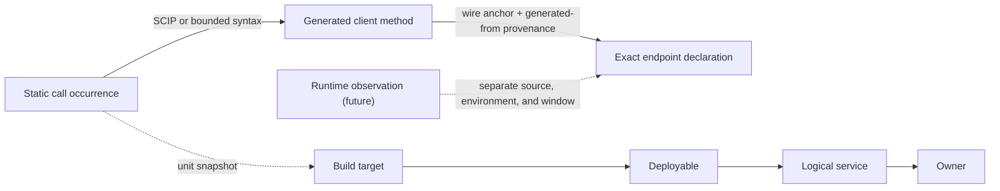
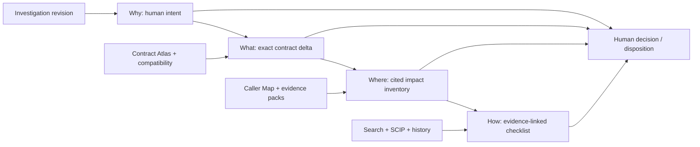

# phebs · backlog

Epics 0–10 historically mirrored the removed `PORT_MAP.md`; later epics extend
the same ticket ledger. Tickets are PR-sized and dependency-ordered for a
stacked workflow. Acceptance criteria (AC) are the merge bar. Decisions get
appended to PLAN.md as dated ADR bullets — no new architecture docs.

Conventions: `T<epic>.<n>` · deps listed only where they cross epics or gate.

---

## EPIC 0 — Bootstrap

**T0.1 · Repo home + module path** ✅ 2026-07-09 — *decision ticket; remote push deferred (local-only for now)*
Pick GitHub home (`phebs` handle is squatted; options: under your user, or org
`phebs-dev` / `getphebs`). AC: repo exists, README.md skeleton pushed, module
path fixed in PLAN.md ADR.

**T0.2 · License** ✅ 2026-07-09 — *decision ticket*
Recommend Apache-2.0 (patent grant, matches zoekt ecosystem); MIT acceptable.
AC: LICENSE + copyright line committed; README license section unblocked.

**T0.3 · Scaffold** ✅ 2026-07-09
`go.mod` (latest stable Go, 1.26 line), layout: `cmd/phebs/`,
`internal/{config,store,sync,indexer,search,api}`, `ui/` (Vite app),
`go:embed` stub for UI. AC: `go build ./...` green on empty skeleton.

**T0.4 · CI** ✅ 2026-07-09 *(workflow committed; first real run needs the remote)*
golangci-lint + `go test ./...` + UI build job. AC: PR gate green on main.

**T0.5 · Dev environment** ✅ 2026-07-09
Makefile/justfile targets (`dev`, `test`, `lint`). Embedded SurrealDB
(`surrealkv://`) is the dev default per PLAN §1; optional compose file exists
only for server-mode testing. AC: `make dev` boots the phebs skeleton on
embedded storage with zero external services.

## EPIC 1 — Skeleton & storage (slice 1) ✅ 2026-07-09 — demoed via `make dev`

**T1.1 · Config schema + loader** ✅ 2026-07-09
Own YAML schema (NOT upstream's JSON schemas): server block, connections list
(github, generic-git), index dir, auth token. AC: invalid config fails fast
with line-level errors; example config in `docs/`.

**T1.2 · SurrealDB schema + store layer** ✅ 2026-07-09 *(supervised-child pivot — see PLAN ADR)*
`DEFINE TABLE` .surql applied at boot for §5 tables: `repo`, `connection`,
`repo_connection`, `connection_sync_job`, `indexing_job`, `user`, `api_key`.
AC: idempotent apply; store package with typed CRUD for repo + jobs behind an
interface (keeps the Postgres exit open per PLAN §3); unit tests against
ephemeral embedded (`surrealkv://`) stores.

**T1.3 · SPIKE: job-claim semantics** ✅ 2026-07-09 *(optimistic claim won — see PLAN ADR)* — *gates EPIC 2*
Benchmark optimistic `UPDATE … WHERE status = 'pending'` claim vs
record-lock pattern under N concurrent pollers; measure double-claim rate and
latency. AC: decision ADR in PLAN.md + chosen claim statement landed in store
layer with a concurrency test proving zero double-claims.

**T1.4 · huma skeleton** ✅ 2026-07-09
`/api/health`, `/api/version`, `/api/openapi.json`, `GET /api/repos` (read
from store). Bearer-token middleware (single API key). AC: OpenAPI doc
renders; endpoints covered by httptest.

## EPIC 2 — Sync (slice 2) ✅ 2026-07-09 — demoed: live sync of a public repo via `make dev`

**T2.1 · Generic-git adapter** ✅ 2026-07-09
Connection → repo rows; clone/fetch **bare** repos via exec git into
deterministic disk layout (`$DATA/repos/<host>/<path>.git`). AC: add a
connection, repos appear in DB and on disk; refetch is incremental.

**T2.2 · GitHub adapter (PAT)** ✅ 2026-07-09 *(fake-API tests; live PAT run done in T6.3)*
List repos by org/user with include/exclude filters (name, archived, fork).
AC: rate-limit aware pagination; repo metadata (defaultBranch, pushedAt,
webUrl, external_*) persisted per §5.

**T2.3 · Jittered poller + sync-job lifecycle** ✅ 2026-07-09
Poll loop with jitter per PLAN.md; job states pending→claimed→running→
done/failed; heartbeat + stale-claim reaper; bounded retries with backoff.
Depends: T1.3. AC: kill -9 during a job → job recovered by reaper; no
double-execution under 3 concurrent pollers (test).

**T2.4 · Repo status + orphan policy** ✅ 2026-07-09

**T2.5 · Local repos + watch mode** ✅ 2026-07-09 — *added post-P1*
Plain local paths as generic-git URLs (hardlink mirrors); `watch: true` polls
the source HEAD and re-syncs/re-indexes on movement; mirror follows the
source's checked-out branch; `sync.poll_interval` tunes end-to-end latency.
AC: commit in a watched repo becomes searchable within seconds (measured
~1.4s at 1s cadence); watcher enqueues exactly one deduped job per HEAD move.

**TD.1 · User manual + README refresh** ✅ 2026-07-10 — *added post-P1*
`docs/MANUAL.md`: install, config reference, connections (GitHub/git/local/
watch), search syntax, UI, API, operations, troubleshooting, development.
README brought to P1 reality (quick start, status, Apache-2.0). Doc rule
added to CLAUDE.md: behavior changes update the manual in the same PR.
Drive-by fixes from verifying the quickstart: `make build` binary now finds
`bin/zoekt-git-index`; UI page title.
`GET /api/repo-status`; orphaned repos (no connection) flagged; cleanup behind
config flag (default off, mirroring upstream's isAutoCleanupDisabled
semantics). AC: status endpoint reflects sync/index state transitions live.

## EPIC 3 — Index (slice 3) ✅ 2026-07-09 — demoed: sync→index chain to shards via `make dev`

**T3.1 · Indexer (same-SHA child builder)** ✅ 2026-07-09 *(>1GB memory soak deferred to P6 capacity spike)*
`indexing_job` consumer → child `zoekt-git-index` **built from our own go.mod
SHA** (`go build github.com/sourcegraph/zoekt/cmd/zoekt-git-index`), OOM-isolated
per PLAN §1; HEAD-only; shards to `$DATA/index`. Search stays in-process. AC: P0 spike behavior reproduced inside the job system; shard
appears after sync completes; memory bounded on a large repo (pick one >1GB).

**T3.2 · Incremental short-circuit** ✅ 2026-07-09
Skip when `indexedCommitHash == HEAD`; `--force` path for manual reindex.
AC: no-op reindex completes <100ms without touching shards.

**T3.3 · Failure taxonomy + metrics** ✅ 2026-07-09
Classified errors (clone-auth, index-oom, corrupt-shard), backoff per class;
Prometheus counters (jobs by state, index duration, shard bytes). AC: /metrics
exposes counters; forced failure lands in the right class with retry schedule.

## EPIC 4 — Search (slice 4) ✅ 2026-07-09 — demoed: search/stream/source/tree live via `make dev`

**T4.1 · Query pipeline** ✅ 2026-07-09 *(visibility via zoekt's `public:` atom; `archived:`/`fork:`/`public:` → RepoSet)*
`zoekt/query.Parse` + metadata pre-pass: `archived:` `fork:` `visibility:`
compiled to `query.RepoSet` from DB. AC: table-driven tests mapping input
strings → expected zoekt query trees.

**T4.2 · `/api/search` (JSON)** ✅ 2026-07-09
`shards.NewDirectorySearcher` singleton with shard watch; bounded result
options (maxMatches, context lines). AC: golden-file tests over a fixture
repo; p50 latency budget recorded in PLAN.md.

**T4.3 · `/api/stream_search` (SSE)** ✅ 2026-07-09 *(flush cadence: per shard batch — documented in search.Stream)*
Streamed via `Searcher.StreamSearch`; decide + document flush cadence
inline (per-chunk vs time-batched). AC: curl shows progressive events;
cancellation propagates (client disconnect stops the search).

**T4.4 · File serving: `/api/source`, `/api/tree`, `/api/folder_contents`** ✅ 2026-07-09
Serve from bare repos via git plumbing (`cat-file`, `ls-tree`) rather than
zoekt content tricks. AC: content matches checkout byte-for-byte; path
traversal fuzz test.

## EPIC 5 — UI (slice 5) ✅ 2026-07-09 — demoed in-browser: search/viewer/repos on Base Web via `make dev`

**T5.5 · UI redesign (Base Web design handoff)** ✅ 2026-07-10 — *added post-P1*
Applied the Uber design-language handoff on stock `baseui` (LightTheme/DarkTheme).
- **a** — theme foundation: dark mode + toggle (localStorage), mono/sans fonts,
  role→hex token map for non-semantic colors, redesigned 56px header shell.
- **b** — syntax highlighting: CM6 `HighlightStyle` in the file viewer + a Lezer
  standalone tokenizer for search-result chunks; styled match highlight;
  redesigned file cards; blue deep-link line.
- **c** — search workbench: facet rail (repos/languages, client-derived),
  keyboard nav (j/k/enter/y/o), collapsible groups, streaming indicator bar +
  skeleton + Stop.
- **d** — file viewer (breadcrumb, sticky metadata header, commit pill,
  permalink/open-in-search) + repos table (status dots, connection pills,
  commit chips, per-row search/reindex, Reindex all).
Deferred (need API additions, flagged in handoff): did-you-mean & speculative
looseners (2b–2d), per-shard progress / stuck-search (3c/3d), file-tree column,
context expander, auto-retry on stream drop.

**T5.1 · Vite + React + TS scaffold, embedded** ✅ 2026-07-09 *(build-tag embed: no committed artifacts, `go build` green without npm)*
`go:embed` production build; dev proxy to huma. AC: single binary serves UI.

**T5.2 · Search page** ✅ 2026-07-09 *(Base Web — public open-source `baseui`, no internal assets)*
Query box + SSE-driven result list (repo/file grouping, match counts).
AC: streaming renders incrementally; empty/error states.

**T5.3 · File viewer** ✅ 2026-07-09
CodeMirror 6 read-only, match decorations, line anchors (`#L42`), language
by extension. AC: deep link to file+line from a search result works.

**T5.4 · Repos page** ✅ 2026-07-09
Table over `/api/repo-status`: sync/index state, timestamps, force-reindex
button. AC: reindex button enqueues job visible in status within one poll.

---

## P1 cut line

Everything above ships = P1 (complete 2026-07-10). The post-P1 roadmap below
closes the Sourcebot free/paid feature gaps (derived 2026-07-10 from a
public-sources feature comparison + PORT_MAP §12). Waves are ordered by
value-over-effort and dependency; tickets are PR-sized, ACs are the merge bar.
Sourcebot tier in each ticket = where that feature sits upstream (free vs
paid/EE), from public docs/pricing only — never their source, never `ee/`.

---

## EPIC 6 — Parity quick wins ✅ 2026-07-10 *(Wave 0 — days each, no architecture change)*

**T6.1 · Broaden syntax highlighting** ✅ 2026-07-10 — *Sourcebot free (100+ langs)*
Added CM6 language packs beyond the initial ~6: official Lezer grammars
(Rust, Java, C/C++, PHP, SQL, HTML, CSS, XML, YAML) + legacy stream modes
(Ruby, shell, C#, Kotlin, Scala, Swift, Lua, Perl, Dart, TOML, Dockerfile) in
`ui/src/lang.ts`, each a lazy code-split chunk. Shared `langName`/`langColor`.
Verified: YAML + TypeScript highlight in the viewer; header shows the language.

**T6.2 · File-tree navigation column** ✅ 2026-07-10 — *Sourcebot free (file explorer)*
240px sticky tree column in `FilePage` over `/api/tree` (`fetchTree`): builds a
nested tree, auto-expands the path to the current file, active-row bar, dirs
toggle, files navigate. Verified: auto-expand + active highlight; clicking a
collapsed dir reveals its files; file rows deep-link. Moves "file explorer"
partial → have. *(buildTree unit test landed with T6.4.)*

**T6.3 · Live GitHub PAT verification** ✅ 2026-07-10 — *closes a testing caveat*
Ran the adapter live (200-repo account): `users:` pagination, `orgs:`,
`repos:`, exclude globs — 5 kept repos (4 private) synced, indexed, searched;
token verified absent from mirrors/data/API. Finding fixed: `users:` naming
the token's own login now lists via `/user/repos` so its private repos are
seen (public endpoint omits them); regression test added. ADR 2026-07-10.

**T6.4 · UI test harness (Vitest)** ✅ 2026-07-10 — *review gap: zero UI tests*
Vitest + jsdom + Testing Library (`test` block in vite.config.ts, `npm test` /
`make ui-test`). 23 cases: streamSearch SSE contract incl. the error-clobber
distinction (fake EventSource), SearchPage streaming/keyboard nav with clamp +
typing guard + collapse guard/facet toggling (styletron+baseui render, mocked
lang/highlight), and the T6.2 buildTree unit tests. CI wiring lands with the
first CI pipeline (none exists yet).

## EPIC 7 — Connectors & freshness ✅ 2026-07-11 *(Wave 1 — the biggest free-tier gap)*

**T7.1 · GitLab connector** ✅ 2026-07-11 — *Sourcebot free* *(fake-API tests; live run pending)*
`type: gitlab` (PAT, optional self-hosted `url:`): groups (subgroups
included), users (requester-scoped — own private projects appear), explicit
repos, excludes, Link-header pagination + 429 Retry-After, §5 metadata,
oauth2-basic authenticated clone. Shared `hostClient` extracted from the
GitHub adapter. Path-traversal guard on server-supplied project paths.

**T7.2 · Gitea connector** ✅ 2026-07-11 — *Sourcebot free*
`type: gitea` (PAT + required base URL): orgs/users/repos on the shared
`hostClient`. **Verified live against a real Gitea 1.26 container**: private
org repo synced, indexed, searched; token-as-basic-username clone auth
confirmed; token absent from data dir. *(Bitbucket Cloud/DC, Azure DevOps,
Gerrit follow as T7.x by demand — same adapter shape.)*

**T7.3 · GitHub App auth** ✅ 2026-07-11 — *Sourcebot paid/EE — OSS in phebs* *(fake-API tests; live App run pending)*
`app:` block (id, installation_id, PEM key by path or inline env) on github
connections; stdlib RS256 JWT → installation token per sync run (always
fresh — AC "tokens refresh"), so no `ghinstallation`/go-github dependency.
No selectors → syncs the installation's granted repos. PAT/anon connections
unchanged (AC "falls back cleanly").
Deps: T2.2.

**T7.4 · Webhook-driven reindex** ✅ 2026-07-11 — *Sourcebot paid/EE — OSS in phebs*
`POST /api/webhook` (HMAC `X-Hub-Signature-256`, constant-time, 404 when no
secret): push → targeted `repo_fetch_job` (fetch + reindex, no host
re-listing); repository/installation events → remote-connection re-sync.
**Verified live**: Gitea container webhook (GitHub-compat headers) → push →
searchable with `resync_interval: "0"`; bad signature 401 live + tested.
Deps: T7.3.

**T7.5 · Periodic re-sync cadence** ✅ 2026-07-11 — *Sourcebot free (auto-freshness)*
`sync.resync_interval` (default `1h`, `"0"` disables) enqueues re-syncs for
remote connections; `EnqueueUnlessInFlight` is the debounce, local repos stay
watch/boot-owned. Moves "periodic re-sync" partial → have.

## EPIC 8 — Differentiators: paid features, OSS in phebs ✅ 2026-07-11 *(Wave 2 — high value)*

**T8.1 · Search contexts** ✅ 2026-07-11 — *Sourcebot paid/EE — OSS in phebs*
Config-defined contexts (name → repo-name globs) + string-level `context:`
extraction ahead of `query.Parse` (zoekt has no such atom), compiled to one
`RepoSet` AND'd over the query; multiple atoms union. Table-driven Compile
tests + e2e over real shards. No DB table — config is the single source;
add CRUD when a UI needs it.

**T8.2 · MCP server** ✅ 2026-07-11 — *Sourcebot paid/EE — OSS in phebs; flagship differentiator (PLAN P4)*
Official go-sdk server at `/api/mcp` (Streamable HTTP, same authentication as
the API): `search_code` (full query syntax incl. `context:`), `read_file`
(ranged), `list_repos`. **Verified live from Claude Code**: a headless
session listed repos, searched the needle, and read the file — all correct.
Deps: T8.1.

**T8.3 · MCP integration + polish** ✅ 2026-07-11
Large-file truncation on line boundaries with a `truncated` flag + ranged
re-reads; binary/unknown-repo tool errors; MANUAL §8 with copy-paste
`claude mcp add` + `.mcp.json` config. AC met by the live agent session.

**TD.2 · Epics 1–8 stabilization review** ✅ 2026-07-11 — *release hardening*
Closed the cross-epic correctness gaps found after Wave 2: fail-closed clone
credential handling and pagination, atomic pending successors + fenced leases,
repo-wide fetch/index/cleanup locking, startup artifact and shard-revision
reconciliation, immutable search/file/MCP refs, lazy request-safe file browsing,
exact query filters, Unicode highlights, accessibility, and durable UI tests /
lint in CI. Regression coverage includes concurrent enqueue/reaper races,
cleanup traversal/collisions, stale shards, failed index-state commits, private
App selectors, malformed URLs, transactional membership rollback, literal
artifact paths, and responsive UI corrections.

## EPIC 9 — Auth & code navigation ✅ 2026-07-11 *(Wave 3 — heavier lifts)*

**T9.1 · DB-backed users, sessions, multiple API keys** ✅ 2026-07-11 — *Sourcebot free (login/members)*
Surreal-backed users/SCS sessions, Argon2id local passwords, hashed named API
keys, one-time setup/bootstrap, login/logout, CSRF, Settings key lifecycle,
and always-on API/MCP auth. Tests cover atomic first-user creation, session
restart persistence, key create/use/revoke, legacy config-key hash migration,
rate limiting, malformed credentials, and CSRF enforcement.

**T9.2 · OIDC / SSO** ✅ 2026-07-11 — *Sourcebot paid/EE (enterprise SSO)*
`coreos/go-oidc` discovery + authorization code/PKCE/state/nonce, verified
ID-token email, stable issuer/subject linking, and T9.1 session bridging with
no seat gate. A fake IdP test completes redirect → callback → persisted user
→ authenticated session, verifies PKCE + nonce wiring, and rejects callback
replay after one-time state consumption.

**T9.3 · Code navigation (SCIP)** ✅ 2026-07-11 — *Sourcebot paid/EE (Pro code nav) — PLAN P4*
Lazy immutable `index.scip` ingestion from the indexed commit; precise
definition/reference/hover API, file-viewer panel, and MCP tools with UTF-8/
UTF-16/UTF-32 conversion and 500-reference cap. Fixture tests prove def/ref/
hover, Unicode positions, revision replacement, strict revision/path
validation, deterministic reference bounds, canceled-ingest snapshot
preservation, bounded semantic/cache/source budgets, oversized hover rejection,
LRU eviction, and graceful `available:false` when the index is absent.

**T9.4 · Git history / blame / commit / diff** ✅ 2026-07-11 — *Sourcebot free (history + blame)*
Revision-pinned `/api/blame`, `/api/commits`, `/api/commit`, `/api/diff`, three
viewer routes, and four MCP tools over bare-mirror Git plumbing. Multi-commit
fixture tests cover blame line mapping, rename-following history, parents/root
commits, binary and truncated diffs, literal/path-safe inputs, invalid refs,
cancellation, paging, mutable-HEAD isolation, producer termination at output
limits, aggregate metadata bounds, and race execution.

**TD.3 · Epic 9 corrective review** ✅ 2026-07-11 — *release hardening*
Closed proxy-aware authentication throttling, credential-free quota exhaustion,
OIDC email auto-linking, reconcile/index publication races, deletion rollback,
SCIP stale-range tolerance/reference semantics/negative caching, non-UTF-8
blame, explicit zero-context diffs, and history pagination request races. Also
made repository locks cancellable, idempotent, and idle-evicted; unreadable shard
audits and filesystem reconciliation are now non-destructive and cancellable.

**TD.4 · Shared bounded Git object reader** ✅ 2026-07-15 — *internal consolidation*
Factor source/history/SCIP Git reads onto one immutable-OID primitive with
per-call byte limits and shared not-found classification. Do not route SCIP
through the current source helper: its global 10 MiB blob contract conflicts
with SCIP's independent 64 MiB index and per-source limits. AC: one tested error
classifier and bounded reader serve all three callers without weakening any cap.

## EPIC 10 — Enterprise surface ✅ 2026-07-11 *(Wave 4 — build-our-own, historical PORT_MAP §12)* — demoed live via `make dev`: audit trail, analytics dashboard, and admin-vs-non-admin visibility over API + stateless MCP. T10.4 was subsequently completed on demand on 2026-07-22.

**T10.1 · Audit log** ✅ 2026-07-11 — *Sourcebot paid/EE — OSS in phebs*
Append-only `audit_event` table (narrow `AuditStore`), huma middleware
recording every mutating operation by operation ID + injected recorder for
the non-huma auth surface (logins incl. failures, setup, logout, key
lifecycle, OIDC); synchronous non-fatal writes; `audit.retention` sweep
(default 90d); admin-gated `GET /api/audit` + `#/audit` page with paging.

**T10.2 · Analytics** ✅ 2026-07-11 — *Sourcebot paid/EE — OSS in phebs*
`usage_event` recorded by one `Searcher.Usage` hook (covers REST/SSE/MCP);
no query text stored; Go-side windowed aggregation; admin-gated
`GET /api/analytics` + `#/analytics` dashboard (tiles, per-day bars, top
repos) with zero chart dependencies. **Zero telemetry** — events never leave
the machine. `analytics.retention` (default 365d) shares the 12h sweep.

**T10.3 · Permission syncing + permission-aware search** ✅ 2026-07-11 — *Sourcebot paid/EE — OSS in phebs; the durable moat*
`repo_permission` edges (`<host>:<login>` → repo) mirrored in the adapters'
per-repo loops for private repos (GitHub/GitLab/Gitea; replace-set writes,
stale-kept on failure); config map links users → identities; enforcement
opt-in via the `permissions:` block. Per-user `RepoSet` compiled in the
search pre-pass (`Searcher.Visible` fills the reserved hook — in-query, not
post-filter); the same predicate gates listings, file/history/code-nav reads,
and all MCP tools (denial ≡ 404). MCP runs stateless to stop session-principal
smearing. Leak tests across search/stream/API/MCP. Deps: T9.1.

**TD.5 · Epic 10 corrective review** ✅ 2026-07-11 — *release hardening*
Closed the adversarial-review findings: permission-denial responses now match
missing-repo responses in body and work performed (no existence/timing
oracle); path-hosted GitLab/Gitea identity hosts are expressible in config;
permissions email keys share auth's NFC normalization; a bare `permissions:`
key enables enforcement as documented; retention prunes count-then-delete
without materializing rows; shutdown drains in-flight requests (and their
audit/usage writes) before the store closes; the audit page dedupes pages
shifted by live writes. Regression tests pin each.

**T10.4 ✅ · Multi-branch / tag indexing (`rev:`)** — *Sourcebot free (up to 64 revs/repo)*
**Architectural, not a ticket-sized change** — HEAD-only is a core P1
assumption (indexer, watch, freshness all lean on it). Gated on real demand;
sequence last. AC: an explicit per-repo branch allowlist (cap ≈8 per PLAN §1)
indexes + serves multiple revisions behind `rev:`.

Implemented on `t10.4-multirev-indexing`: the config admits seven aliased full
branch/tag refs plus implicit HEAD; one child build atomically publishes the
sorted selector/branch/commit set; startup repair verifies exact shard branch
metadata; unqualified queries are forced to HEAD and one `rev:` scope is
resolved only across the principal's visible repositories, with a second
commit check on serialization. Local watch includes only the admitted refs.
Extraction/proof semantics remain HEAD-bound by design.

---

## Contract-intelligence annex *(adopted 2026-07-12 — see the two PLAN.md ADRs of that date)*

> Before you change an RPC or field, phebs identifies who may be affected,
> cites the exact source evidence, and tells you what remains unknown.

Annex, not pivot: "self-hosted code search in one binary" stays the identity;
T11.1 is complete by a human-accepted terminal capacity-stop disposition, and
Epics 12–15 are complete under the explicit 2026-07-22 governance disposition.
Their completion does not establish GATE2-V2 or create a numeric accuracy or
completion claim. Commodity surfaces (spec-to-spec diffing, runtime topology,
catalog UX, PR delivery, scorecards) are integrated or deferred, never rebuilt.
phebs produces immutable, permission-safe proof bundles; workflow layers
(Workbench) reference bundle IDs and never recompute or weaken phebs's
conclusions. Public corpora validate mechanics only; an authorized **external**
design partner is required before broader graph or completion claims — no
implicit employer-estate exception. The retained post-Epic-15 platform-pivot
freeze is in force; Epic 16 remains separately blocked.

## EPIC 11 — Validation gate *(annex Stage 0)*

**T11.1 · SPIKE: Validate revision-pinned Go/gRPC consumer evidence and service identity resolution** ✅ 2026-07-22 — *human-accepted terminal outcome; GATE2-V2 remains `NOT_ESTABLISHED`; Epics 12–15 are released by explicit governance disposition, not by an empirical gate pass. See the superseding PLAN ADR and `spike/t111/REPORT.md`.*
Corpus: ≥4 systems including a multi-service monorepo, shared libraries
containing gRPC calls, multiple versions/vendored copies of generated protobuf
code, conflicting image/deployment/Helm/`service.name` identities, and
tests/mocks/generated/vendor directories. ≥200 positive examples, ≥100 hard
negatives, 30% blind holdout. Public systems validate mechanics, not
production completeness. The spike also fixes the evidence schema (atoms +
`snapshot_evidence` associations, per the PLAN evidence-model ADR) before any
extractor breadth — retrofitting provenance is costlier than starting with it.
AC — four gates, measured separately:
1. **Evidence integrity (fail ⇒ stop the initiative):** 100% of emitted
   evidence resolves to the exact repo/commit/file/span; identical input +
   extractor version ⇒ identical `evidence_atom_id`s; a failed extraction
   never publishes a partial replacement set; permission filtering precedes
   aggregation; no invisible repository or service name — or count — leaks
   through any result, including coverage manifests.
2. **Operation extraction:** ≥98% precision and ≥90% recall on eligible direct
   Go/gRPC patterns; ≥90% precision within every individual fixture;
   registration / client call / test / mock / generated / vendor references
   classified separately. Contract identity is the fully-qualified proto
   service+method — no global service identity required for this gate.
3. **Service/deployable identity:** ≥99% pairwise precision on high-confidence
   merges (target zero false merges in the blind holdout); ≥95% end-to-end
   precision on caller-deployable → operation edges; low coverage acceptable;
   **abstention is success**. Logical service, deployable, build target,
   image, workload, and runtime `service.name` stay distinct related entities.
4. **Field references:** the assertion is `REFERENCES_PROTO_FIELD` only (never
   `READS_RPC_RESPONSE_FIELD`); ≥98% direct getter/selector precision; ≥90%
   recall within the SCIP-eligible population; read/write/test/generated/
   unknown classification; canonical field identity
   `(contract_lineage_id, message_full_name, field_number)` mapped across ≥2
   consumer dependency versions.
Exit: gates 2+3 pass → Epics 12–15 as designed · gate 2 passes, 3 fails →
wedge ships with consumers grouped by repository/build target · gate 1 or 2
fails → stop; post-mortem ADR.

Recorded terminal disposition (2026-07-22): the independently reviewed sealed
campaign ended in a valid capacity stop before selection or disclosure. All
required human reviews and acceptance are recorded complete by the operator.
T11.1 is therefore complete as a validation process, while GATE2-V2 remains
`NOT_ESTABLISHED` and supplies no accuracy number. Governance releases
implementation sequencing for Epics 12–15 under the existing bounded-evidence,
permission, coverage, and abstention requirements. At the time of that
disposition, the remaining acceptance criteria in Epics 13–15 stayed
unsatisfied until implemented and verified. They are now complete under their
individual tickets, including Epic 15's separately retained independent
acceptance gate recorded below.

## EPIC 12 — Provenance schema & protobuf facts ✅ 2026-07-12 *(implemented dark and hardened; T11.1 sequencing release recorded 2026-07-22; runtime posture unchanged)*

**T12.1 · Evidence & assertion store** ✅ 2026-07-12
Content-addressed `evidence_atom` + `snapshot_evidence` associations, semantic
assertions (supporting **and contradicting** atoms), identity assertions,
coverage manifests, extraction runs — per the PLAN evidence-model ADR. Narrow
`EvidenceStore` interface (house style); deterministic confidence tiers only.
AC: an identical blob vendored in two repos yields one atom and two
associations with independent visibility; atomic staged publish survives a
mid-publish kill (prior facts intact, no partial set); proof-aware retention
honored — no deletion of evidence referenced by a retained bundle.

**T12.2 · Extraction job kind** ✅ 2026-07-12
`extraction_job` chained after indexing (as index chains after sync);
extracted-commit short-circuit (T3.2 pattern); `extract` class in the T3.3
failure taxonomy; **pure-reader invariant enforced** (no exec, no dynamic
loading, no corpus writes, no network while parsing). AC: a reindex chains
exactly one extraction per new commit; kill mid-run leaves published facts
intact; invariant violations are structurally impossible in the runner (no
exec/network capability in the extractor context), asserted by test.

**T12.3 · Protobuf declared-plane extractor (dark/provisional scope per the 2026-07-13 ADR)** ✅ 2026-07-12
protocompile-based: `.proto` → services, methods, messages, fields with exact
spans and deterministic `provisional_repo_path_v1_<sha256>` lineage IDs. AC for
this dark stage: on the fixture corpus every declared operation/field is an
assertion whose evidence atom resolves to the pinned commit and span in the
file viewer. Promotion to canonical cross-repository `contract_lineage_id`
remains T13.2 work and provisional facts cannot support product conclusions.

## EPIC 13 — Implementations, consumers, field references ✅ 2026-07-22 *(unblocked by the accepted T11.1 terminal disposition)*

**T13.1 · Implementation & consumer resolution (Go/gRPC) — dark/provisional
scope per the 2026-07-22 disposition** ✅ 2026-07-22
`RegisterXServer` implementation pinning; typed generated-client call-site
resolution; `code_role` classification (production/test/mock/generated/
vendor). Dark-stage AC (T12.3 precedent): the productized extractor runs
inside the T12.2 pure-reader pipeline on the fixture corpus; every
implementation/consumer edge cites evidence atoms resolving to pinned
commit + span in the file viewer; classification and resolution are
deterministic across two runs; no output states or implies measured
accuracy. The original blind-evaluation clause (≥98% precision, ≥90%
recall, ≥90% per-fixture under the T11.1 measurement contract) is
**deferred to the pilot's internal validation gate** — it cannot be
satisfied post-capacity-stop and remains the promotion bar for any
accuracy-bearing claim.

**T13.2 · SCIP proto-field references** ✅ 2026-07-22
`REFERENCES_PROTO_FIELD` assertions from cross-repo SCIP references over
generated accessors; read/write/test/generated/unknown classification; field
lineage across consumer dependency versions. AC: a renamed field (same number,
same lineage) tracks as one identity across two consumer versions. Implemented
as a pure reader over the immutable committed `index.scip`: exact definition
ranges bind generated Go struct fields/getters through protobuf tags and the
source `.proto` declaration; reference occurrences cite exact source spans.
Canonical identity is `(SCIP package lineage excluding dependency version,
message full name, field number)`, with ambiguous or incomplete joins
abstaining instead of guessing. The acceptance fixture renames field 1 across
two repositories and dependency versions while retaining one lineage/object.

**T13.3 · Coverage manifests** ✅ 2026-07-22
Per-answer coverage certificate: repositories searched (the caller's visible
universe only), revisions, protocols supported, extractors applied + failures,
SCIP availability, unresolved candidates, freshness. AC: the certificate
provably changes when one repo's extraction fails; adversarial test shows no
invisible-repo leakage through names or counts. Implemented as
`extract.BuildCoverageCertificate` over the narrow `RunSource` read surface:
deterministic `coverage-certificate-v1` with a sha256 digest over canonical
JSON, every visible repository present (including evidence-free ones), per-run
identity plus complete source-scope counters/digest, freshness against the
indexed commit, and SCIP availability derived only from a current-revision
publication. A durable latest-attempt marker makes staged/aborted replacements
certificate-visible without publishing partial evidence; the same-commit
forced-failure AC runs through the real worker and keeps the prior fresh run
while moving the digest. Store tests pin abort and killed-run sweep lifecycle.
Publication times are excluded from canonical content. The adversarial test
mutates hidden-repo run and attempt state and requires byte-identical
certificates, no hidden names, and zero invisible-repository queries. API
exposure is T14.1.

## EPIC 14 — Query, proof bundles & MCP ✅ 2026-07-22 *(unblocked by the accepted T11.1 terminal disposition)*

**T14.1 · Query API + proof bundles** ✅ 2026-07-22
huma endpoints for `find_operation_consumers`, `find_proto_field_references`,
`get_extraction_coverage`; immutable self-contained proof bundles embedding
assertions, coverage certificate, extractor versions, and `visibility_context`
(principal, authorization provider, permission snapshot, visible-repo-set
digest). Bundles re-authorize on read — a bundle ID is not a bearer
credential; revoked repository access revokes old bundles. AC: admin and
member asking the same question produce different immutable bundle IDs; the
member bundle names no invisible repository.
Implemented as default-dark Huma GET routes over the existing experimental
reader flag. Permission filtering produces the complete visible repository
slice before any evidence lookup. A query resolves all cited atoms and
occurrences, confirms the coverage digest did not move during construction,
and stores canonical `proof-bundle-v1` bytes under a sha256-derived ID while
atomically pinning every named published run. The visibility context commits
to principal, authorization-provider generation, and visible-repository-set
digest. `GET /api/proof_bundles/{id}` reauthorizes every scoped repository on
each read and returns indistinguishable not-found responses for missing or
revoked scope. Tests prove different admin/member IDs, byte-identical repeat
queries, no hidden repository names or hidden evidence calls, retroactive
revocation, one-snapshot read authorization, `422` bounded-query refusals,
single-domain filtered-query invariants, immutable persistence, and proof-aware
retention. MCP exposure is deliberately T14.2; compatibility remains T14.3.

**T14.2 · MCP tools** ✅ 2026-07-22
The proof-backed annex tools on the existing stateless `/api/mcp` server:
`find_operation_consumers`, `find_proto_field_references`, and
`get_extraction_coverage`. Implemented as a transport-only projection of the
same `api.ProofService` used by Huma, returning complete `proof-bundle-v1`
structured content; no MCP-specific filtering, aggregation, or qualification
logic exists. The tools are registered only under the existing experimental
reader opt-in and are otherwise undiscoverable. AC runs one official-SDK
stateless Streamable HTTP agent session through RPC consumers, field
references, and coverage, verifies exact source citations and the agent's
visibility context, and proves zero hidden-repository evidence calls or names.
`check_contract_compatibility` registers with its real pinned-Buf engine in
T14.3; T14.2 intentionally does not advertise a failing placeholder or freeze
a speculative schema.

**T14.3 · Contract compatibility via pinned Buf child** ✅ 2026-07-22
`check_contract_compatibility`: version-pinned `buf` child built from go.mod
(zoekt-git-index house pattern), sandboxed per the PLAN ADR — phebs-produced
descriptor inputs or sanitized temp tree, no network, CPU/memory/time limits,
never `buf generate`/protoc plugins/repository scripts; Buf version, args, and
result recorded in the extraction run. phebs enriches Buf's spec-level
verdicts with evidence-derived consumers and registers the corresponding Huma
endpoint plus MCP tool. AC: a wire-breaking field change
reports the breaking rule **and** the affected consumers with call-site
citations.
Implemented with Buf v1.72.0 as a Go tool and sibling child binary. The only
operation is fixed-policy `buf breaking` (`WIRE`, structured JSON,
symlinks disabled) over validated source files copied into a fresh temp tree;
network and writes outside that tree are denied, with independent input,
output, wall, CPU, and memory ceilings. A startup version/sandbox probe keeps
both transports undiscoverable on a missing or mismatched engine. Canonical
results commit to source digests without retaining blobs and embed a
bundle-local compatibility extraction-run record (engine/version/exact
relative args/exit/result); they do not publish into the repository extraction
table because caller-supplied before/after sets have no indexed repo revision.
Structured violation spans map to `(lineage,message,field_number)` and feed a
bounded multi-filter extension of the shared proof builder, so SCIP consumers
and exact occurrences remain permission-filtered, coverage-confirmed, and
identical over Huma and MCP. Real-Buf tests pin a wire-type break, exact rule,
span, stable identity, compatible rename, source/temp-path non-retention, and
determinism; HTTP and official-SDK MCP acceptance pin affected visible
consumers/citations and hidden-repository non-interference.

**T14.4 · Proof-bundle retention before pilot exposure** ✅ 2026-07-22
Add config-gated proof-bundle expiry before any pilot enables the annex query
surface. Expiration uses store metadata outside canonical bundle content, so
it never changes content IDs. Deleting an expired bundle and its
`proof-bundle:<id>` evidence pins is one transaction; it must not remove any
other bundle/checkpoint pin, and the existing evidence sweeper remains solely
responsible for reclaiming newly unpinned runs. Default retention is disabled
until an operator explicitly configures a lifetime. Reads of expired IDs fail
closed with the same not-found response as missing or unauthorized bundles.
AC: two bundles pin one superseded run; expiring the first preserves the run,
expiring the second makes it sweep-eligible, while an unexpired bundle remains
byte-identical and readable. Must land before Epic 15 pilot exposure.
Implemented with opt-in `proof_bundles.retention`, measured from the latest
successful materialization in store metadata (legacy rows fall back to
creation time). Reads and the bounded boot/hourly sweeper share the same
cutoff. Each bundle deletion transaction rechecks expiry and removes only its
exact `proof-bundle:<id>` pins; independent bundle/checkpoint pins survive,
and only the existing evidence sweeper can reclaim a newly unpinned run. The
AC additionally pins indistinguishable expired/missing/unauthorized 404s,
default-off config, active-bundle byte identity, and checkpoint isolation.

## EPIC 15 — Contract impact report ✅ 2026-07-22 *(read-only; independent acceptance gate closed by operator acceptance)*

Independent acceptance was recorded after review of the shared proof-service
projection, default-dark posture, exact immutable citations, permission
non-interference, bounded conclusions, and the retained full-suite acceptance
run. This closes Epic 15 only: GATE2-V2 remains `NOT_ESTABLISHED`, the broader
platform pivot stays frozen. Epic 16 implementation proceeds under the explicit
2026-07-22 operator bypass in PLAN.md; the validation and continuation records
remain incomplete and authorize no claim.

**T15.1 · Report API + page** ✅ 2026-07-22
For a contract, or a contract change between two extraction runs: known
consumers with exact call sites, field references, compatibility
classification, unresolved candidates, unsupported repositories/patterns,
evidence freshness — every row clickable through to pinned evidence.
Explicitly absent: PR comments/checks (separate ADR — read-only →
code-host-writer posture change), diagrams, service dossiers, runtime data.
AC: demoable via `make dev` on the fixture corpus; bounded-proof language
throughout ("no blockers found within the stated evidence scope"), coverage
certificate rendered with every conclusion.
Implemented as a deterministic `contract-impact-report-v1` projection of the
same immutable, permission-safe proof bundles used by HTTP and MCP; there is
no second persisted report or authorization path. The default-dark Huma
surface builds reports for canonical operations, stable protobuf field
identities, and proposed before/after contract inputs, then reauthorizes saved
report URLs by bundle ID. Each result separates known exact source occurrences
from unresolved syntactic candidates and renders every visible repository's
covered, stale, failed, processing, or unsupported domain state plus the full
coverage certificate. Conclusions bind to that certificate's digest and use
bounded-scope language. Repository evidence rows deep-link to their pinned
commit/path/line; coverage metadata and Buf spans over deliberately unretained
caller inputs are not misrepresented as repository evidence. Following the
T14.3 ADR, proposed changes compare bounded before/after source commitments and
record a bundle-local compatibility run rather than fabricating repository
publication rows for caller-owned inputs. Authenticated `/api/version`
capability discovery keeps both navigation and routes absent by default and
independently gates the contract-change tab on the pinned Buf probe; the
always-open anonymous response reveals no capability names. Go acceptance
proves deterministic readback, exact citations, unresolved and unsupported
rows, hidden-repository non-interference, revocation, change enrichment, and
dark posture; UI tests pin
all three forms, saved reads, caveat/certificate rendering, and immutable source
links. No code-host writer, diagrams, dossiers, or runtime plane was added.

## EPIC 16 — Investigations product slice *(operator-bypassed for implementation 2026-07-22; validation and continuation gates remain evidentially unsatisfied; all code on a post-gate branch)*

Productizes the contract suite: [domain contract](./INVESTIGATION_DOMAIN_CONTRACT.md)
v0.2, [experience spec](./INVESTIGATIONS.md) rev 3, [MCP envelope](./MCP_ENVELOPE.md)
v0.2, [pack manifest](./PACK_MANIFEST.md) v0.2. The synthetic fixtures under
`docs/fixtures/investigations/` are the conformance bar wherever cited.

**T16.1 ✅ · Investigation domain storage** — schema.surql tables and store
methods for Investigation, Revision, Run, RunEvent, RunArtifact, Decision,
Disposition, BaselineDesignation, Watch/WatchRevision per contract §2
mutability rules. AC: table-driven tests prove in-place edits of immutable
entities fail; run state derives only from RunEvents; creation idempotency
key returns the existing Run; supersession is the sole correction path.

Implementation is present on `codex/t16.1-investigation-domain-storage`: ULID
and tuple/content identities, create-once semantic rows, checked mutable
Investigation/Watch projections, contiguous digest-checked RunEvents,
event-derived Run state, concurrent idempotent Run creation, scoped-content
RunArtifacts, and explicit correction records. The schema and every embedded
SurrealQL statement validate; repository-wide compilation/vet and the touched
store package's lint are clean. The
SurrealDB-backed AC suite passed locally with `-run '^TestInvestigation'` on
2026-07-22, including 24-way concurrent Run creation and the full immutable
entity/supersession table.

**T16.2 ✅ · Immutable revisions, pins, retention ownership** *(needs T16.1)* —
Revision freeze; RunArtifact publication binds `PinRun`; pin ownership and
GC per contract §5. AC: pinned artifacts survive sweep; revocation/legal
policy overrides pins; GC refuses while an authorized owner exists.

Implementation is present on `codex/t16.2-investigation-pins-retention`:
artifact plus compatible extraction-run pins publish atomically; immutable
Investigation/Baseline/Dossier owner claims and append-only releases serialize
against bounded collection; Baseline creation acquires its owner in the same
transaction; and four explicit policy overrides can supersede active owners.
Artifact collection releases only its exact evidence-pin namespace and leaves
evidence deletion to the existing proof-aware sweeper. Schema and embedded
SurrealQL validate, package compilation/vet and focused lint are clean. The
SurrealDB-backed `-run '^TestInvestigation'` suite passed on 2026-07-22 in
42.041 seconds, including every owner, override, atomic-publication, and
pin-isolation AC plus the retained T16.1 regressions.

**T16.3 ✅ · Authorization invariants** *(needs T16.1)* — query-time principal
projection on every read; count/existence non-disclosure; opaque ids;
refusal shape of fixture 06; re-authorization on sharing and transfer.
AC: negative-test matrix passes incl. fixtures 05/06 shapes; the suite
executes BOTH an unknown-identity input and an unauthorized-identity input
and asserts identical canonical response bytes, each compared against the
same golden fixture (fixture 06 is the expected
shape, not a one-time validation target); cursors void on ownership
transfer.

Implementation is present on `t16.3-authorization-invariants`:
`store.InvestigationAuthzStore` principal-projects every domain read (unknown
and unauthorized are the identical `ErrNotFound`, and integrity errors surface
only after authorization); owner-authorized reader grants re-check at query
time; ownership moves only through the audited transfer path, which bumps the
investigation's authorization revision and thereby voids per-principal cursors
without deleting them; Watches stay owner-only. `mcp.NotAvailableRefusal`
renders the canonical fixture-06 refusal as a pure function with no
denial-reason input, golden-tested byte-for-byte, and a shape test proves the
minimal refusal carries none of fixture 05's authorized-only sections. The
SurrealDB-backed matrix (all ten reads × owner/grantee/stranger/unknown), the
identical-bytes AC, and the sharing/transfer/cursor lifecycle passed locally
on 2026-07-22 within the `-run '^TestInvestigation'` suite.

Post-merge review hardening on `codex/t16.3-review-fixes` closes the concurrent
forms of the same AC: projected reads bind and finally recheck an exact
transfer-revision plus grant-generation epoch; grant/revoke/cursor changes
serialize with transfer on the Investigation row; revoke/regrant cannot revive
an old cursor; promoting a grantee consumes that grant; and each grant, revoke,
transfer, or cursor mutation commits atomically with its audit event. Focused
regressions cover authorization-epoch ABA, revoke/regrant cursor invalidation,
promoted-grant consumption, and all four audit action classes.
The complete SurrealDB-backed Investigation suite passed after remediation on
2026-07-22 in 63.007 seconds.

**T16.4 ✅ · Guided creation and async run state** *(needs T16.1–T16.3)* —
creation API with scope preview, authorization preflight, estimate, cancel,
bounded retries; publication lease. AC: failed/canceled attempts can never
publish (late-worker test); partial failures surface in the coverage
ledger; creation is idempotent under concurrent submission.

Implementation is present on `codex/t16.4-guided-creation-run-state`: the
permission-first preview resolves only caller-visible indexed repository
snapshots, returns deterministic estimates/blockers, and binds submission to a
digest that is re-preflighted at create time. One transaction freezes the
active Investigation, Revision, queued Run/event, idempotency mapping, audit
record, and `investigation_run_job`; concurrent exact submissions cannot mint
competing objects or queue slots. Attempt leases fence progress, bounded retry
rollover, owner cancellation, and atomic published/failed artifacts. Terminal
publication includes the RunEvent, artifact, evidence pins, active-
Investigation retention owner, and audit row; failure artifacts retain
reconciled partial/failed coverage but structurally reject facts and pins.
The adapter remains unregistered in the production binary until an executable
released pack is available, so the post-gate implementation cannot expose an
undrainable workflow. Pure/API/compile/vet/lint and SurrealQL validation are
green. The complete live SurrealDB-backed Investigation suite passed on
2026-07-22 in 79.323 seconds, including concurrent guided creation, bounded
retry rollover, cancellation and failure late-worker fences, partial-failure
coverage publication, and the retained T16.1–T16.3 regressions.

**T16.5 ✅ · Core views** *(needs T16.4)* — Overview (four cards, derived
eligibility badge with blocker codes), Census, Coverage, Evidence;
empty-state taxonomy first. AC: fixtures 01–05 each render their distinct
state; the eligibility badge has no write path; `make dev` demoable.

Implementation is present on `codex/t16.5-core-views`: one read-only,
principal-scoped API projection carries the existing Investigation envelope
into four table-first views without inventing a parallel confidence or
eligibility model. Overview renders four open summary regions and a derived,
read-only eligibility result; Census preserves facts while separating
unresolved service and owner attribution; Coverage surfaces processing and
hop completeness; Evidence retains proof, snapshot, occurrence, and
verification-action identifiers. Canonical fixtures 01–05 pin five distinct
rendered states, including authoritative bounded zero, incomplete processing,
unresolved attribution, and a refusal that withholds all claim-bearing counts.
Production stays structurally dark when no source is bound. `make dev`
explicitly binds only the checked-in synthetic fixture corpus so this
operator-bypassed slice is demoable without presenting the fixtures as
published evidence. All 77 UI tests, the focused API and whole-repository
compile gates, vet, touched-package lint, and the production UI build are
green. Authenticated browser acceptance exercised all five fixtures at
1440×1000 in light/dark themes and the 390×844 responsive layout with no page
overflow or console diagnostics.

**T16.6 ✅ · MCP envelope implementation** *(needs T16.3; parallel to T16.5)* —
envelope v0.2 on the existing MCP tools; generated JSON Schemas checked in.
AC: all eight fixtures validate against the generated schemas — incl.
fixture 08's irreversible-truncation semantics in result views; refusal
indistinguishability test; server-rendered qualification text only.

Implemented on `codex/t16.6-mcp-envelope`: the shared proof service now
projects its already-authorized immutable answers into the typed
`envelope_version: "1.0"` contract for all four enabled proof/compatibility
MCP tools. Nine deterministic draft-2020-12 schemas are generated from the
same Go source used for MCP `outputSchema` advertisement and checked in under
`schemas/`; a drift test pins the bytes. All eight canonical fixtures pass
both structural and cross-field semantic validation. Fixture 08 additionally
has negative mutations proving hard truncation cannot regain completeness,
continuation, or absence eligibility. Fixture 06 remains byte-identical for
unknown and unauthorized identity reads, and zero-result qualifications are
selected and rendered solely by the server. Stateless proof queries
deliberately expose pack-defined processing counts as `withheld` and remain
`partial`; they do not manufacture an eligible universe or negative proof.

**T16.7 ✅ · Consumer ledger and comparable diff** *(needs T16.2)* —
first/last-seen edge ledger (the retention change from VISION architecture
notes); cause-classified diff per contract §8 with comparison-report
fallback. AC: prohibited causes never render as removals; fixture 07 semantics
enforced plus a new comparable traced-addition/removal fixture added with
this ticket (fixture 08 is truncation and belongs to T16.6); ledger rows
survive run sweep.

Implemented on `codex/t16.7-consumer-ledger`: immutable, principal-scoped
consumer snapshots freeze the claim/schema/identity, pack/rule/extractor,
authorized universe/enumeration, build, snapshot/external-input, completeness,
freshness, and visibility dimensions required by contract §8. Any changed or
failed dimension produces a sorted comparison report with per-side coverage
only and structurally no deltas. Fully comparable snapshots emit only
positively traced relationship additions/removals. A compact first/last-seen
ledger retains inactive removal tombstones and recognizes later
reintroductions; it is authorization-projected and stored independently of
sweepable RunArtifacts. Fixture 07 pins the fallback, fixture 09 pins one
traced addition and removal, pure tests cover every prohibited cause, and the
live store AC covers ledger persistence after artifact sweep.

**T16.8 ✅ · Review projection** *(needs T16.7)* — deterministic ReviewItems,
queues (new consumers, coverage regression, unresolved attribution),
per-principal cursors. AC: identical deltas yield identical item ids; items
supersede and expire by rule; no hand-creation path exists.

Implemented on `codex/t16.8-review-projection`: a versioned pack projection
derives the three fixed queues only from an authorized immutable consumer
snapshot, its comparison, its typed coverage ledger, and unresolved hops whose
fact IDs occur in that snapshot. ReviewItem identities domain-separate the
principal, Investigation, source comparison, projection version, subject,
delta/cause, evidence reference, and human-record-state digest while excluding
evaluation time, so identical semantic inputs reproduce the same IDs.
Publishing a later source sequence supersedes the prior projection; the
versioned lifecycle rule computes expiry from immutable publication time.
Acknowledgement and last-viewed comparison are canonical payloads in the
existing authorization-epoch-bound per-principal cursor and never mutate an
item. The store interface exposes materialize/list/cursor operations but no
ReviewItem create/put method. Pure tests pin deterministic IDs, all three
queues, supersession/expiry and the missing hand-creation path; the live store
test pins idempotent materialization, acknowledgement, lifecycle transition,
and unauthorized non-disclosure.

**T16.9 ✅ · Dossier export** *(needs T16.2, T16.3, T16.5)* — sealed export per
contract §10 with offline verification script. AC: digest chain verifies
offline with no phebs instance; export redacts to recipient scope at export
time; reopening re-authorizes against current ACLs.

Implemented on `codex/t16.9-dossier-export` against the domain contract's
Dossier §10: canonical `phebs-investigation-dossier-v1` JSON contains a
recipient-redacted manifest, separately digested object/finding entries,
authorized locators for non-embedded source material, a domain-separated
SHA-256 root, and an Ed25519 signature with key identity. The standalone
`scripts/verify-dossier.go` checks the complete chain and optional independent
trust anchor without a phebs process or network access, while always stating
that offline integrity is not current authorization or validity. Export
requires a current scope resolver, intersects the principal-scoped snapshot,
omits facts without a positively authorized unit identity, derives
recipient-only snapshot/input manifests and eligibility, and rechecks both
Investigation and repository-scope epochs before returning bytes. Persistence
and the primary-artifact Dossier retention owner commit atomically. Reopen
verifies the sealed bytes, reauthorizes the Investigation, Revision,
RunArtifact, consumer snapshot, optional Baseline/Decision/predecessor, every
included fact and its current unit scope, then rechecks the authorization
epoch. Pure and script tests cover deterministic sealing, every tamper layer,
offline operation, and fail-closed redaction; the live store AC covers
retention and post-export scope revocation.

**Epic 16 implementation is complete.** The operator bypass authorizes this
post-gate implementation only; it does not retroactively satisfy the retained
validation or continuation evidence gates, release a pack, or enable the dark
production creation/export surfaces.

## EPIC 17 — Contract Atlas ✅ 2026-07-23 *(T17.1 stable, T17.2–T17.5 experimental-dark)*

Turns the existing contract facts into a discoverable, read-only catalog.
Users must be able to browse from a visible repository to a declared operation
without already knowing its canonical identifier, inspect the exact evidence
and bounded shape that phebs can support, and hand that operation to the
existing Impact workflow. This is a presentation and query layer over the
annex evidence model, not a new conclusion engine. It remains orthogonal to
Epic 16 and to every validation gate: provisional labels, coverage, tiers,
abstentions, and the ban on accuracy or absence claims all remain in force.

T17.1 uses only established repository-reading boundaries and is always
available. T17.2–T17.5 are registered only when the existing provisional
extraction feature is enabled and advertise an authenticated-only
`contract-atlas` capability; the default and anonymous surfaces remain dark.
Runtime traffic is explicitly absent. Any future runtime overlay requires its
own ADR, partner-supplied observations, and strict source/runtime separation
under the zero-telemetry posture.

**T17.1 · Persistent repository explorer** ✅ 2026-07-23
Extract the FilePage's lazy tree into a shared repository-browser component and
render it as a permanent left rail on Search. The rail lists every repository
visible to the caller through `/api/repo-status`, loads exactly one directory
level at a time through `/api/folder_contents`, supports explicit `repo:`
filter insertion, and opens files without issuing a search. It never calls the
recursive `/api/tree` route. At mobile widths it becomes a collapsible drawer;
the search input and results remain independently usable.

AC: a non-admin rail lists exactly the caller-visible repositories; an
adversarial hidden repository appears in neither rendered state nor the UI's
folder-request ledger. A file is reachable from a cold Search page with zero
search requests. Expanding a directory issues one request and re-expansion
uses the cache. Filter insertion preserves the user's query, avoids duplicate
repo atoms, and quotes repository names through the existing helper. UI tests
cover desktop rail, mobile drawer, loading/error/retry, repository changes,
direct file navigation, and permission-filtered empty state.

Implemented by sharing the revision-pinned lazy folder reader between Search
and FilePage. The Search rail sorts only the permission-filtered status
projection, changes repositories without speculative folder reads, caches
expanded paths by repository/revision/path, links directly to immutable file
routes, and inserts an exact quoted repository atom into the existing query.
The focused UI suite pins cold-page zero-search navigation, hidden-repository
non-disclosure, per-directory request counts and cache reuse, filter
deduplication, retry and empty states, and the mobile drawer lifecycle.

**T17.2 · Same-file protobuf shape facts (`protodecl` v3)** ✅ 2026-07-23
Enrich the declared plane without pretending to link a protobuf module.
`protodecl` adds exact-span `DECLARES_SERVICE` and `DECLARES_MESSAGE` facts,
request/response raw type references and client/server streaming flags to
`DECLARES_OPERATION`, and field type, cardinality, map, and oneof attributes
to `DECLARES_FIELD`. Operation and field canonical objects remain stable. Any
type reference is resolved only when protobuf lexical lookup finds exactly one
declaration in the same source file and therefore the same provisional
lineage. Imported or otherwise unresolved references retain their raw spelling
and import context with an explicit unresolved reason; they are never labeled
external, because the pure-reader has no trusted module/import-root identity.
Shape traversal is an API concern and must be cycle-aware and bounded; the
extractor emits facts, not recursive blobs.

The extractor, evidence schema, and registry pin versions advance together.
The one-blob streaming invariant, all parser complexity bounds, atomic
publication, deterministic ordering, and file-scoped provisional lineage stay
unchanged.

AC: the fixture corpus resolves request and response types declared in the
same file and cites exact operation/message/field spans; imported, missing,
and ambiguous references abstain with distinct reason codes and no external
claim. Scalar, repeated, map, nested-message, and oneof fields preserve their
shape attributes. Empty services and empty messages are still discoverable
through declaration facts. Recursive message definitions do not recurse in
the extractor. Two complete runs are byte-identical, and the registry-pin and
pure-reader guards pass.

Implemented in `protodecl` 3.0.0 with `t17-v1` atoms and v3 rules. Typed JSON
details preserve RPC raw request/response names and streaming flags plus field
type, cardinality, map key/value, and oneof membership. Protobuf lexical lookup
binds only a unique declaration in the same file; unresolved imports, missing
declarations, duplicate declarations, and wrong declaration kinds have
separate reason codes, bounded digest-bound import context, and no external
classification. The fixture suite pins exact spans, scalar/repeated/map/nested
message/oneof shape, empty declarations, finite recursive definitions, and
two-run byte identity. The pure-reader and exact registry-version guards pass;
the persisted worker test is retained for the live SurrealDB-backed gate.

**T17.3 · Bounded, snapshot-consistent Contract Catalog API** ✅ 2026-07-23
Add a read-only `contract-atlas-v1` projection with a paged service/operation
listing and a bounded operation-detail read. Declaration identity is
`(repository, declaration_lineage, service_fqn)`; an operation adds its method.
The API may expose `/service.fqn/Method` as the canonical query spelling, but
name equality never merges declaration lineages. Same-named declarations in
different files or repositories remain separate. SCIP package lineage is a
field-dependency identity and is not presented as a canonical
service/operation lineage.

Visibility filtering happens before every evidence read or count. Each request
builds a coverage certificate over the already-visible repository universe,
selects assertions only from the exact run ids named by that certificate, and
confirms the certificate digest after projection; a changed digest retries or
returns a conflict rather than mixing revisions. Browse responses are
ephemeral and create no proof bundle, but every declaration, message, field,
implementation, caller, and unresolved candidate includes its immutable
repository, commit, path, byte/line span, assertion id, and run id. Coverage
metadata is kept distinct from source evidence.

Lists use stable opaque cursors bound to the complete authorization projection
(principal, provider generation, permission snapshot, and visible-repository
set) and coverage digest. Server-side constants bound page size, expanded
message depth/node count, and relationship rows. Crossing a bound returns an
explicit truncation/completeness state and continuation where safe; it never
silently drops rows or turns a partial result into an absence statement.
Caller and registration facts retain their own lineage and tier. If the
declared-plane relationship cannot be proven, the API labels the name match or
extractor abstention as unresolved rather than attaching it to one declaration
by guess.

AC: unknown, unauthorized, and deleting repositories reveal no names, counts,
cursor differences, or evidence calls. Duplicate service FQNs in two files of
one repository and in two repositories produce distinct declaration rows.
Continuation pages are stable and non-overlapping; a cursor is rejected after
its authorization or coverage binding changes. A publication race cannot
produce a mixed-revision response. Limit tests pin every boundary and
truncation shape. Every claim-bearing detail row has a resolvable immutable
source locator and every response carries the exact coverage digest/state used
to build it.

Implemented as the authenticated-only `contract-atlas` capability and the
ephemeral `GET /api/contract_atlas` and
`GET /api/contract_atlas/operation` projections. Listing scans exact
certificate-selected `proto-contract` runs in stable assertion order and uses
an opaque checksum-bound cursor over query, principal, authorization provider,
permission snapshot, visible-repository digest, coverage digest, repository,
and assertion position. Detail expands only proven same-file message links and
keeps registration/caller name matches in their own lineage and tier, labeling
unproven joins and extractor abstentions separately. Fixed limits cover page
size, assertion scans, source locators, message depth/nodes/fields, and joined
relationships; every crossing is explicit and continuable where the underlying
ordered assertion scan is safe. Both projections rebuild the coverage
certificate after reading and retry or conflict on publication races. The
adversarial suite pins dark/anonymous posture, zero evidence calls for
unknown/hidden/deleting scopes, duplicate-FQN separation, stable pages,
authorization/coverage cursor invalidation, immutable locators, no bundle
write, field/depth/node/relationship/scan bounds, and a mid-read publication
change.

**T17.4 · Contract Atlas UI (protobuf/gRPC)** ✅ 2026-07-23
Add the authenticated capability-gated **Contracts** navigation item and
**Contract Atlas** page. The table-first interface supports repository,
package, protocol, and provisional-lineage filters; a service → operation
tree; bounded request/response message trees; declaration, implementation,
caller, and unresolved evidence links; and tier, freshness, completeness, and
coverage chips. Duplicate declarations and unresolved joins remain visibly
separate. Every source row opens the pinned file revision.

**Analyze impact** navigates to `#/impact?operation=/service.fqn/Method`,
pre-populating but not automatically submitting the existing operation form.
The nav taxonomy decision—Contracts discovers interfaces, Impact answers a
bounded change question, and Investigations manages a durable workflow—lands
as the implementation ADR.

AC: `make dev` exposes the Atlas only for its explicit fixture binding. From a
cold page, a user with no operation identifier can browse to a declaration,
inspect both bounded shapes and evidence limitations, follow a pinned source
link, and open the pre-populated Impact form. Disabled and anonymous servers
advertise no capability, route, OpenAPI operation, or navigation item. UI tests
cover pagination, truncation, duplicate declarations, unsupported/failed/stale
coverage, empty states, and desktop/mobile layouts.

Implemented as the capability-gated `#/contracts` workspace and navigation
item. Exact filters drive a paged, lineage-preserving service → operation
index; selecting an operation loads its bounded message trees, source claims,
separately qualified implementations/callers/abstentions, coverage certificate,
freshness/tier/completeness chips, and immutable file links. Duplicate FQNs
remain separate by repository and provisional lineage. Stale responses are
canceled and generation-guarded. Analyze impact transfers only the canonical
operation into the existing form and does not submit it. Responsive tests pin
the desktop split/mobile stack, pagination, truncation, duplicates, all
coverage states, empty results, exact filters, source links, and stale-request
suppression. Production still derives the capability only from real
provisional evidence. `make dev` explicitly binds the validated synthetic
`docs/fixtures/contracts/contract-atlas.json` adapter, which selects a visible
indexed repository for a resolvable pinned source link, writes no evidence,
and labels every response as synthetic.

**T17.5 · Accessible focused dependency map** ✅ 2026-07-23
Render one deterministic one-hop neighborhood for the selected operation from
the already-authorized T17.3 response: declaration/registration providers,
name-bound caller evidence, and separately labeled unresolved candidates. No
global graph and no graph-only data surface exist. The table remains the
authoritative accessible representation; the diagram has keyboard-readable
labels and a compact mobile fallback. It performs no additional evidence
requests and contains no producer/consumer or runtime edges until separately
released evidence packs provide them.

AC: the graph and table contain the same authorized edge identities and
labels; hidden repositories cannot affect layout, node/edge counts, or empty
state. Identical input yields identical layout. A contract with no edges
renders an honest empty neighborhood naming the exact coverage scope and
completeness state.

Implemented as a pure client projection of the selected operation detail.
Implementation, caller, and unresolved-candidate claims are flattened by
immutable source locator into one stable, sorted edge list. The deterministic
SVG and authoritative accessible table carry the same edge ids and labels;
every diagram node is a keyboard-focusable pinned-source link. Registration
providers, name-bound callers, and dashed extractor abstentions remain
visually and textually distinct. The wide SVG yields to the same table plus a
compact count on mobile. A zero-edge state includes visible-repository count,
coverage digest, and relationship completeness while explicitly refusing a
runtime-absence conclusion. Tests prove graph/table parity, input-order
determinism, coverage-only repository independence, empty/truncated
qualification, mobile fallback, and that rendering performs no additional
catalog or evidence request.

## EPIC 18 — First public release *(complete 2026-07-23)*

The first tag is a product boundary, not a Git bookkeeping event. It must bind
one inspectable version, the server plus its same-module helper binaries,
the supported SurrealDB line, reproducible checksums, a fresh-data smoke, and a
green hosted run. Local success alone cannot authorize publication.

**T18.1 · Release identity contract** ✅ 2026-07-23
Add a dependency-free `phebs version` command and make `make build` accept,
validate, stamp, and verify an explicit SemVer `VERSION`. The exact value must
remain shared by CLI output, startup logs, `/api/version`, and backup manifests.
Ordinary source builds retain a development identity; Git state is never
silently converted into release authority.

AC: `make build VERSION=v0.1.0` produces a binary whose exact stdout is
`v0.1.0\n`; invalid or padded versions fail before compilation; `phebs version`
accepts no arguments and initializes no configuration, database, child
process, or network listener. Existing API and backup tests continue to bind
the same process-global value.

Implemented with a SemVer-validation prerequisite and a post-build execution
check. The main package exposes a narrow writer-injected version command while
all existing version consumers retain the same linker-stamped variable.

**T18.2 · Hermetic local/hosted verification** ✅ 2026-07-23
Pin the Go linter and SurrealDB installer to reviewed versions, separate fast
static/build checks from the live SurrealDB suite, add timeouts and explicit
version assertions, and make the same commands runnable locally. The workflow
must never silently skip store tests because `surreal` is absent.

AC: workflow review shows no floating tool version; a missing or wrong-major
SurrealDB fails before tests; Go test, race/static checks, UI test/lint/build,
and embedded-UI compilation all have named green jobs; local targets execute
the same command families.

Implemented with repository-owned pins for Go 1.26.5, Node 24.18.0 LTS,
golangci-lint 2.12.2, and SurrealDB 3.2.0. Full action commit SHAs, annotated
with their reviewed release tags, replace major-only refs. Static, full Go,
concurrency race, and UI/embedded
builds are separate bounded jobs backed by `make ci-*` targets. The SurrealDB
jobs download the exact Linux release archive, verify its upstream-published
SHA-256 and reported version before tests, and cannot silently skip a missing
database. A permanent source test pins every tool, action, named job, and
download-verification step. The workflow is locally verified; its first hosted
execution remains T18.4 because this repository still has no remote. The
sealed `spike/t111` validation subtree remains compiled and tested but is
excluded from lint because fixing its pre-existing findings would mutate the
preserved evidence artifact.

**T18.3 · Release bundle and fresh-data smoke** ✅ 2026-07-23
Assemble the versioned phebs server, same-module `zoekt-git-index` and Buf
children, license/readme, and a machine-readable manifest with SHA-256
digests. Exercise that assembled bundle from an empty temporary data directory:
bootstrap authentication, sync/index a local fixture repository, search it,
browse a pinned file, and verify the Contract Atlas stays dark without its
explicit fixture/evidence binding.

AC: two builds from the same commit/toolchain produce equal file manifests;
tampering with any bundled executable fails verification; the smoke uses only
the bundle and declared prerequisites, reaches a healthy authenticated server,
and proves sync → index → search plus dark experimental posture.

Implemented with a host-native `make release` boundary that refuses
non-v-prefixed release identities and existing output directories. Its
canonical `phebs-release-manifest-v1` contains no time or output-path field and
binds the explicit commit, pinned Go toolchain, target, stable modes, sizes,
and SHA-256 payload digests. Strict verification rejects manifest schema or
canonicalization drift, unsafe/duplicate/unsorted paths, missing or extra
entries, symlinks/non-regular files, and all mode/size/digest changes.
Permanent tests compare two independently assembled manifests and exercise
tampering and fail-closed input cases. The standalone smoke runner strips
development fixture and child overrides, pins the bundled children plus the
declared SurrealDB prerequisite, and from empty temporary state proves
authenticated startup, local-repository sync/index, exact-commit search and
browse, and the absent Contract Atlas capability/404 route. Hosted clean
checkout execution remains T18.4.

Acceptance closed with the operator's live invocation against the verified
`v0.1.0` bundle for commit
`5a9847ac8d2e33b774d3c27e08eda865ddc53540`; the runner reported
`sync->index->search, pinned browse, Contract Atlas dark`. This authorizes
T18.4 to begin but does not authorize a remote, tag, or publication.

**T18.4 · Public remote, hosted gate, and `v0.1.0`** ✅ 2026-07-23
Create or bind the explicitly approved GitHub repository, push `main`, run the
hosted workflow, then create and push the annotated first tag only from the
exact green commit. Publish checksums and prerequisite/validation caveats; do
not claim the `NOT_ESTABLISHED` contract-intelligence accuracy gate passed.

AC: the repository URL and visibility are operator-approved; branch protection
or the documented equivalent requires the hosted gate; the tag commit equals
the tested main commit; a clean checkout verifies the release manifest and
fresh-data smoke; release notes preserve the default-dark and validation
caveats.

Accepted at the approved public remote
`https://github.com/bmeddeb/phebs`. Push run `30027844408` passed all five
named jobs at exact commit
`fe7b692706017fc57916f8b985d380f868dee2a6`; annotated tag and Latest release
`v0.1.0` resolve to that commit. The published Linux/amd64 archive and adjacent
checksum verify as
`63103500a6b86aa3e4533fb1693065009585f6be509e48aab7b26373405daaf6`.
The canonical manifest binds six payloads, including portable
`phebs-otel-demo.yaml`. Release notes name the Linux-only binary boundary,
macOS source-build path, Git and SurrealDB prerequisites, default-dark and
provisional posture, no-runtime-absence rule, and the still-closed external
`NOT_ESTABLISHED` validation result.

## EPIC 19 — Thrift protocol pack *(adopted and complete 2026-07-25; scoped Atlas/proof parity)*

The operator named the driving combination (Thrift IDL + Apache Thrift Go
runtime, jaeger corpus), satisfying the protocol-pack gate below. Scope:
declarations, Go consumer evidence, catalog/impact/proof/MCP surfaces, UI, and
a `make dev` demo. Non-goals: Buf-style wire-compatibility checking (no Thrift
engine), field-consumer proofs (scip-proto-field is protobuf-only), cross-repo
lineage promotion (shared gRPC-pack limitation, T13.2 direction), and
`extends` inherited-operation expansion (recorded in service detail only).
Pack metadata per the preamble: evidence-pack cards land with T19.2/T19.3;
dark flag `experimental.provisional_thrift_extraction`; extractor versions
`thrift-contract` 1.0.0 / `thrift-consumer` 1.1.0; validation is the T19.1
executable rule gates (no public accuracy claim; GATE2-V2 remains
`NOT_ESTABLISHED`).

**T19.1 ✅ · Thrift validation spike** — `spike/t191/` pins jaeger-idl,
jaeger-client-go (archived → HEAD-frozen), and jaeger; executable gates prove
100% corpus parse rate, scope-precedence reproducibility for the constructs
present in the corpus, zero false name resolutions plus one measured
handler-side semantic-noise emission on the hand-labeled sample, live
cross-corpus name-match joins, and honest abstention without in-repo stubs.
Every live gate verifies locked HEAD and clean tracked bytes first; wildcard
namespace and Go-publicizing variants are synthetic regressions. Binding
decisions D1–D9 in `spike/t191/README.md`.

**T19.2 ✅ · `thriftdecl` extractor + dark flag** — thrift-contract 1.0.0 per
D1/D2/D8: wire-honest `Service.method_args`/`method_result` synthetic
messages (field 0 success, throws as result fields, oneway ⇒ no result
struct), thriftrw on the pure-reader allowlist, `.thrift` symlinks fail
closed, registry pin matrix, evidence-pack card, ADR + MANUAL. AC: T19.1
construct coverage via synthetic fixtures; byte-identical double run; worker
staged→published regression; full suite/vet/lint clean.

**T19.3 ✅ · `thriftgo` consumer extractor** — thrift-consumer 1.1.0 per
D3–D6: generated-header gate, processorMap wire-name universe, exact generated
client-method ↔ wire-literal anchors, unique-match-or-abstain scan;
`REGISTERS_THRIFT_SERVICE`, `CALLS_OPERATION`,
`UNRESOLVED_THRIFT_CALL`/`_REGISTRATION`, `THRIFT_EXTRACTION_GAP`. Ambiguous
calls emit canonical candidate operations. AC: labeled-sample fixtures,
underscore/initialism regression, abstention tests, e2e green.

**T19.4 ✅ · Protocol registry + catalog generalization** — data-only registry
map (protocol → domains, detail schemas, relationship/object triple, field bounds);
`protocol=thrift` accepted; per-protocol field bounds (thrift 0..32767 —
field 0 is the result success slot); `Item.Protocol` from run domain;
protocol-major pagination cursor. AC: Thrift operation/message metadata
survives typed projection; the fixture emits only its selected pack; protobuf
fact-detail JSON is byte-stable while whole responses honestly gain
registered-pack coverage rows/digest plus the cursor change.

**T19.5 ✅ · Proof/impact/envelope/MCP** — protocol-blind entry points query
both consumer domains; `canonicalProofDomains` → 5; (domain, predicate) →
envelope identity kind with `rpc_operation` subjects; MCP prose de-gRPC'd
(tool names wire-frozen). Impact evidence rows retain domain and protocol so
equal cross-protocol operation spellings remain distinguishable. AC: gRPC
outputs unchanged except honest no-run coverage and explicit row identity;
bundle determinism.

**T19.6 ✅ · Contract Atlas UI** — protocol filter option, oneway chip vs
streaming chips, union/exception badge, thrift relationship labels,
`.thrift` language entry. AC: Vitest green; protobuf pages unchanged.

**T19.7 ✅ · Demo + closure** — `phebs-thrift-demo.yaml` (port 3073, three D7
connections, both packs enabled) with a config-admission pin; MANUAL
walkthrough. The Thrift bullet in the protocol-pack candidates section below
is absorbed by this epic. AC: `make dev` demo incl. ≥1 live name-match join
and the oneway chip on `agent.Agent/emitBatch` (operator walkthrough per
MANUAL §2).

**T19.R ✅ · Independent-review remediation** — closes the post-implementation
review findings across T19.1–T19.6: wildcard namespace precedence, compiler-
anchored Go method identities, canonical ambiguity candidates, typed
`oneway`/message metadata, protocol-labeled impact evidence, pack-correct
synthetic fixtures, honest coverage compatibility wording, clean-corpus gate
verification, and corrected validation/reader-envelope claims. AC: focused
extractor/API/UI regressions; full Go suite, vet, golangci-lint, and Vitest
merge bar. Implementation `11802e1`; the operator ran `go test ./... -count=1`
successfully on 2026-07-25 after the focused and live-corpus gates, vet,
golangci-lint, 95/95 Vitest suite, UI lint, and production build were green.

**T19.8 ✅ · Gitlink boundaries + per-domain failure isolation** — the corpus
walker previously aborted every extraction on any submodule pointer, which
made all three jaeger demo repositories unextractable (one failed replacement
per repository, zero declarations). Part 1: gitlinks become explicit
repository boundaries — counted, bound by a domain-separated digest over
sorted `path`/oid records, sampled within 64 paths/4 KiB with an explicit
truncation flag, stamped under the `gitlink-boundary-v1` inventory policy,
validated at publish (shape/bounds/sorted-uniqueness/consistency only —
recalculation authority stays with the walker), surfaced in the certificate,
proof bundles, and Atlas coverage panel; legacy runs without the policy
report **unknown** boundary status, never zero, and are replaced even at an
unchanged commit and extractor version. Candidate symlinks remain hard
failures; gitlink descendants are never cloned, traversed, searched, or
attributed to the parent repository. Part 2: the worker continues past an
ordinary per-domain failure (`errors.Join` aggregate keeps the job retrying),
returns immediately on stale-run conflicts, and stops attempting new domains
once the context is canceled or the extraction deadline expires; on retry,
published domains short-circuit while aborted domains rerun. AC: corpus,
worker, store-validation, and e2e regressions incl. a domain-1-fails/2-3-
publish/retry-skips pin; full merge bar. Live Jaeger follow-up: two distinct
source atoms supporting one `thrift-consumer` assertion exposed a nullable
empty contradiction set at the SurrealDB `array::union` boundary. The merge
now preserves canonical non-null arrays, the SQL independently coalesces both
operands, and a persisted-store regression pins nil and explicit-empty inputs.
Indexer discovery also resolves and validates the configured child to an
absolute executable path before asynchronous jobs can change working
directory; the demo command uses absolute overrides.

### On-demand protocol-pack candidates after Epic 17

These are direction, not scheduled T17 tickets, and do not block completion of
the protobuf/gRPC Atlas. Each claim family requires its own evidence-pack card,
extractor version, coverage semantics, validation plan, ADR, MANUAL update,
registry pin, dark flag, and PR-sized acceptance criteria.

- **HTTP:** separate OpenAPI declaration parsing from language/framework route
  registrations and from client-call extraction. `METHOD /normalized/path` is
  only a shared catalog key after template, mount, gateway, and middleware
  resolution states have been modeled; ambiguous joins abstain.
- **Kafka:** ✅ absorbed by EPIC 23 (2026-07-26; T23.1–T23.4 complete,
  experimental-dark). *(Originally: named by the prospective design partner,
  2026-07-26 — next pack candidate after Epic 20)*: separate topic/schema declarations,
  producer evidence, and consumer evidence. A source literal topic name has
  no proven cluster/environment identity; consumer groups and dynamic
  configuration remain unresolved without an authorized deployment or
  registry connector. The UI is topic-centered—producers → topic/schema →
  consumers—not an endpoint metaphor. Naming the partner interest satisfies
  the gate's who-wants-it trigger only; the pack still requires its own
  validation spike, card, dark flag, and executable acceptance bars before
  any ticket ships.
- **Thrift field references** *(named by the prospective design partner,
  2026-07-26 — adopted as EPIC 22 below, 2026-07-26; this bullet is absorbed
  at T22.5 closure)*: separate generated-accessor
  recognition from the shipped protobuf pack. `scip-proto-field` recognizes
  only protoc-gen-go accessor symbols, and the proof-service field identity
  enforces protobuf wire bounds (1–536,870,911 excluding 19000–19999), which
  rejects Thrift's field 0 success slot outright. A Thrift pack needs its own
  validated recognition rules per generator family (Apache Thrift's exported
  fields/`IsSet*` predicates and thriftrw's differ), a distinct domain and
  dark flag, Thrift field-identity bounds (0–32,767), and a neutral-named
  query tool — `find_proto_field_references` stays wire-frozen and
  protobuf-only. Same spike-first pack process as every other candidate.
- **Thrift:** ✅ absorbed by EPIC 19 (2026-07-25). The operator named the
  language/runtime combination (Thrift IDL + Apache Thrift Go, jaeger
  corpus); the packs shipped with the T19.1 executable rule gates,
  experimental-dark flags, and cards in THRIFT_PACK_CARDS.md.

## EPIC 20 — Static Caller Map and migration inventory *(complete 2026-07-27; experimental-dark)*

### Product outcome

A migration owner starts from a declared protobuf or Thrift endpoint and pages
through the bounded static evidence phebs has for its callers, even when the
IDL, generated clients, and handwritten Go live in different areas of one
monorepo. The primary question is:

> If this endpoint changes or is retired, which source locations and logical
> consumer units require review, and what could phebs not resolve?

The user does not need to know or paste a canonical operation string. Contract
Atlas carries the selected declaration's full identity into a dedicated
**Caller Map** under Contract Impact. The view is source-first: each known call
and unresolved candidate has an immutable citation. When separately sourced
metadata exists, occurrences are grouped by build target, deployable, logical
service, and owner without treating those entities as interchangeable.

This epic does not claim runtime truth, migration completion, or decommission
safety. Static analysis is the primary migration inventory because it can find
rare and currently unexecuted code paths; it may still include dead code and
miss reflection, dynamic dispatch, or generated clients absent from the pinned
tree. A future runtime overlay would add separately sourced observations with
an explicit environment and time window. It must not erase, silently rank, or
reclassify static evidence.

### Functional requirements

1. **Endpoint-selected identity.** A Caller Map request identifies exactly one
   declaration with `(protocol, repository, declaration_lineage,
   canonical_operation)`. Equal operation spellings in another protocol,
   repository, or lineage do not merge. A bare canonical operation remains a
   compatibility query for the existing proof endpoint, not the new page's
   identity. A call is known for that declaration only when generated-code
   provenance carries the join to its declaration lineage; a wire-name-only
   match remains an unresolved candidate. For protobuf, the generated
   `// source:` marker and embedded descriptor name must agree and an immutable
   snapshot must bind their generator-relative name to one repo-relative IDL
   lineage. Layout-root uniqueness alone is insufficient. Apache Thrift Go
   headers provide no source identity, so Thrift requires a direct immutable
   generated-artifact → IDL-lineage mapping. Both successful joins are
   `derived`, never `exact`.
2. **Every occurrence remains visible.** Known calls and unresolved candidates
   are paged source rows with repository, commit, path, byte/line span,
   extractor/run/assertion/atom IDs, tier, code role, and resolution reason.
   Failure to attribute a row to a service never drops it.
3. **Static resolution tiers.** The preferred Go resolver follows an immutable
   symbol-index occurrence to a generated client symbol, the generated
   method's wire-operation anchor, and a proven generated-from relation to the
   declaration. The existing root `index.scip` is one eligible input, but its
   64 MiB ceiling is not silently raised for a large monorepo; T20.1 decides
   whether the current scipfield reader's dedicated root-blob corpus
   capability must gain a bounded commit-bound shard manifest. With no usable
   symbol index, a syntactic resolver may use import path, package alias,
   receiver/type provenance, generated anchors, and explicit generated-from
   metadata. More than one remaining candidate is an abstention. Repository-
   global method-name uniqueness is not an acceptable scale architecture.
4. **Separated unit attribution.** Source occurrence, build target,
   deployable, logical service, and owner are typed relations with independent
   provenance. An occurrence may map to zero, one, or multiple candidate
   units. Ambiguity is rendered and filterable; no path heuristic silently
   becomes ownership truth.
5. **Monorepo layout without adjacency assumptions.** Optional IDL, generated,
   and source roots classify paths such as `idl/**` and `src/**`; they do not
   require declarations and callers to be adjacent and do not silently remove
   unmatched regular blobs from the corpus inventory. Checked-in generated
   stubs remain the wire-anchor input; an immutable symbol index may add typed
   call resolution. phebs never runs repository code generation or a build
   tool.
6. **Migration comparison.** Given an old and replacement endpoint identity,
   the population is the union of their known and unresolved caller evidence.
   Per logical unit and per source row, the machine states are
   `old_only_evidence`, `both_evidence`, `new_only_evidence`, and `unresolved`.
   UI copy uses those exact evidence-qualified meanings rather than
   "unmigrated", "migrated", or "safe".
7. **Coverage and uncertainty stay adjacent.** The page carries the exact
   coverage certificate/digest, failed and stale domains, inventory boundaries,
   unsupported repositories, relationship truncation, and unresolved counts.
   Loading all pages cannot turn missing coverage into a negative conclusion.
8. **Large, paged inventory.** The epic must support at least 10,000 logical
   consumer units in its generated acceptance corpus. T20.1 freezes the
   occurrence population, first-page latency budget, memory budget, and
   publication ceiling before implementation. No response silently truncates,
   and neither the current 200-relationship Atlas detail limit nor the
   5,000-assertion proof-bundle limit caps the browsable inventory.
9. **Authorization before aggregation.** Visibility filtering precedes
   evidence reads, grouping, counts, cursors, and unit attribution. Cursor
   identity binds the principal, permission snapshot, visible repository set,
   endpoint identity, coverage digest, filters, and sort. Unknown,
   unauthorized, and deleting scopes remain indistinguishable.
10. **Read-only and deterministic.** Browsing creates no proof bundle,
    Investigation, code-host write, or runtime telemetry. Equal authorized
    evidence and query state produce equal rows, grouping, cursors, and
    migration classifications. Explicit pinning or Investigation creation is a
    later user action.
11. **One caller vocabulary.** Every experimental projection uses
    `resolved_caller` only for a declaration-lineage-proven occurrence.
    A wire-object match is `matching_call_evidence` for a bare-operation query
    and `unresolved_name_match` for an exact-declaration query. Parser or
    resolver abstentions are `extractor_abstention`. T20.10 migrates the
    Contract Atlas, impact report, Caller Map, UI, and MCP prose together; the
    shipped `known_consumers` label does not survive beside the new taxonomy.
12. **MCP workflow parity through the shared read services.** An agent can
    discover an endpoint without already knowing its canonical operation,
    inspect one exact declaration, page its Caller Map, and compare it with a
    replacement. The read-only tools are `search_contract_operations`,
    `get_contract_operation`, `list_operation_callers`, and
    `compare_operation_callers`. They accept and return the same full endpoint
    identities, filters, coverage/attribution digests, bounds, and opaque
    cursors as the HTTP API; no MCP adapter may read evidence, aggregate rows,
    mint a weaker cursor, or summarize away unresolved evidence. Results are
    bounded pages with continuation, never a whole-fleet context dump.
    `get_extraction_coverage` remains the one coverage tool, and the shipped
    `find_operation_consumers` name and bare-operation proof-bundle semantics
    remain wire-compatible rather than being silently broadened. Ordinary MCP
    browsing is ephemeral and creates no proof bundle or Investigation.

### Experience requirements

The endpoint header shows protocol, fully qualified service and method,
declaration repository/lineage, request and response shape, coverage state,
and a pinned declaration link. The body defaults to consumer-unit groups with
source occurrences nested underneath. Users can switch to an ungrouped source
view and filter by unit, owner, repository/path, code role, resolution tier,
freshness, and known versus unresolved evidence. A group with multiple
candidate unit mappings stays visibly ambiguous.

The page must remain useful without any unit catalog: it then groups by
repository and path area and labels service/build/owner attribution
unavailable. Counts are either exact for the bound snapshot or explicitly
lower-bounded while more pages remain. The accessible table is authoritative;
any diagram is a projection of already-returned rows and is not required for
this epic.

For migration comparison, the summary reports evidence-qualified unit counts
and offers the four machine states above. Opening a unit reveals both old and
replacement endpoint citations. A later Investigation integration may freeze
that comparison and collect human dispositions; it must not recompute or
weaken the Caller Map.

### Non-goals and deployment boundary

- No execution of corpus builds, generators, plugins, tests, binaries, or
  catalog clients; no network access from extractors.
- No inference of runtime traffic, call volume, liveness, or production
  deployment from static code.
- No automatic rewrite, pull request, migration-complete verdict, or
  decommission-safety verdict.
- No global architecture graph, transitive blast-radius claim, Kafka/HTTP
  topology, or field-reference parity for Thrift.
- No company-specific build or service-catalog adapter in the open-source core.
  The first adapter is a neutral immutable snapshot contract and synthetic
  fixture.
- Repository visibility remains the authorization unit. A monorepo containing
  path-restricted content is not an eligible **multi-user** deployment until
  separately designed path/unit authorization exists. A single-operator
  work-machine evaluation under the operator's own already-granted access
  rights is authorized (operator decision record, 2026-07-26): one principal,
  no shared instance, no path-authorization claim made or implied.
- Employer code, names, hosts, credentials, and infrastructure never enter
  this repository or its fixtures — evaluation approval does not relax repo
  hygiene. Work-machine evaluation yields sanitized counts, shapes, failure
  classes, and workflow notes only; the approval record itself is held
  privately, outside this public repository.

**T20.1 · Synthetic monorepo contract and validation spike** ✅ *(2026-07-25)* — generate and
pin a neutral Git corpus with `idl/`, checked-in generated Go, `src/` services,
shared client wrappers, production/test/mock/generated roles, protobuf and
Thrift, duplicate operation spellings, common method-name collisions,
aliases, embedded clients, unresolved dynamic calls, and a separate immutable
unit snapshot. The scale profile contains at least 10,000 logical units; a
small labeled profile drives correctness gates. Measure current extraction,
the 64 MiB root SCIP boundary, publication/retention row ceilings, reverse
lookup, and UI limits. At the frozen target row count, measure the existing
single-transaction publish recount's wall time and memory, atomic supersession
flip, and complete sweep of one superseded run (`evidenceSweepBatchSize` is
currently one run). Freeze the target occurrence population,
publication/memory ceilings, typed-index input shape, and first-page latency
before T20.2.

AC: the corpus is generated from repository-owned neutral templates with no
external or employer bytes; two generations are byte-identical. Symbol-index
bytes are generated once in a separately reviewed preparation step, checked
into `spike/t201`, digest-pinned, and copied verbatim by the corpus generator;
T20.1 never runs an indexer. A checked-in oracle enumerates
candidate-independently every known/unresolved call, generated-from relation,
and unit mapping. It covers generator-relative protobuf paths, vendored
duplicate IDLs, two generated copies of one IDL, missing/conflicting Thrift
mapping, a same-operation assertion with more than 4,096 supporting call-site
references, and one content atom with more than 100 placements. The current
global-name resolver is shown to abstain on deliberate collisions rather than
being described as sufficient. The result names `maxFactsPerRun=5,000`,
`maxEvidenceRowsPerRun=10,000`, `maxEvidenceRefsPerAssertion=4,096`,
`maxEvidenceReferenceEdges=20,000`, the publish-transaction and sweep results,
and every other hard ceiling encountered. It records a go/no-go target table
in this backlog and adds no production behavior or accuracy claim. Where the
current production ceiling prevents a target-cardinality measurement, the
scale harness must invoke the exact production publish/sweep statements
through a test-only admitted-limit seam rather than copying or approximating
the transaction.

Implementation/result: `spike/t201` contains the neutral generator, complete
candidate-independent oracle, separately prepared/digest-pinned small and
scale SCIP blobs, current-reader baseline, and the exact-SQL store measurement
harness. The frozen scale population is 10,010 call occurrences, 10,005 unit
mappings/distinct unit labels, one 10,004-call operation fanout, 101 placements
of one content atom, 20,020 association-plus-assertion rows, and 10,010
reference edges. The committed measurement receipt is
`spike/t201/results.json` (Go 1.26.5, darwin/arm64, 10 GOMAXPROCS,
SurrealDB 3.2.0 `sha256:ee819d…`, `t12-store-v4` /
`t12-evidence-v1`). It is an immutable historical baseline captured before
T20.3's publication marker and field guards, not a receipt for the current
writer. Current-writer measurements use the versioned opt-in harness and a
separate receipt. This is a capacity/rule-validation result, not an accuracy
claim.

| Gate | Frozen target / ceiling | Current observation | Decision for downstream tickets |
|---|---|---|---|
| Worker population and memory | 10,010 calls; incremental Go heap ≤256 MiB over the pre-run baseline | `maxFactsPerRun=5,000` refuses the target before a target-size worker run exists | **GO T20.2:** chunked staging is required; the 256 MiB incremental-heap ceiling is binding |
| Run rows | 20,020 rows; admission target 25,000 | Historical v4 baseline: `maxEvidenceRowsPerRun=10,000`; target measured by passing 25,000 as the admitted variable to the exact production statements. T20.3 subsequently made 25,000 the production ceiling | **GO T20.3:** advance the writer generation and admit exactly the frozen 25,000-row ceiling; store-derived validation remains authoritative |
| Same-operation fanout | 10,004 supporting call IDs in the oracle | `maxEvidenceRefsPerAssertion=4,096` | Keep occurrence assertions source-granular; Caller Map pagination composes them. Do not build one giant stored assertion or raise this bound for aggregation |
| Reference edges | 10,010 | `maxEvidenceReferenceEdges=20,000` | **PASS:** retain the 20,000 edge ceiling for the frozen target |
| Repeated content placement | 101 repository placements | `maxEvidenceOccurrences=100` makes whole-atom `ResolveEvidence` fail closed above the limit | Keep the legacy whole-atom bound; T20.4 caller pages must page occurrence assertions and never use `ResolveEvidence` as a fleet inventory primitive |
| Atomic publish/recount | ≤2.0 s wall, ≤512 MiB Surreal peak RSS, ≤16 MiB Go allocation | Historical v4/pre-guard baseline: 156 ms; 236,732,416 B peak RSS (225.8 MiB); 190,048 B Go allocation; atomic successor visible and predecessor superseded. T20.3's retained v5 gate remeasured publication at 145.348583 ms | **PASS / GO T20.3:** retain the exact single-transaction store recount and supersession flip; no chunk-counter substitute is justified |
| One-run sweep | ≤2.0 s wall, ≤512 MiB Surreal peak RSS | Historical v4/pre-guard baseline: 1,024 ms; 332,562,432 B peak RSS (317.2 MiB); one complete 20,020-row superseded run removed, current shared atoms/rows survived | **PASS for the frozen target / GO T20.5:** this authorizes the 20,020-row workload under the 25,000-row production ceiling. Resumable physical row chunks remain required before raising admission beyond 25,000 because one candidate run is not a row bound |
| Exact reverse first page | 100 rows + one continuation sentinel; ≤250 ms on the reference profile; selected plan must not scan the run | 175 ms API wall / 23.1 ms database plan, but `assertion_run` scanned and filtered all 10,010 rows before `SortTopK` | **NO-GO current plan / GO T20.4:** composite `(run,predicate,object[,lineage])` pagination index is mandatory despite the one-machine wall-time pass |
| Typed-index input | One commit-bound root `index.scip`; ≤64 MiB | 107 documents / 10,005 typed references / 893,956 B (1.33%); byte-identical generation and every indexed path/range validated | **PASS / T20.6 root-only selected:** retain the dedicated root capability; no shard manifest at this target |
| UI inventory | Default 50, maximum 100 rows per server page; at most 500 rendered group/source rows including bounded expansion state | Atlas detail scans 500 assertions and returns at most 200 relationships; proof queries cap at 5,000 assertions / 20,000 evidence references | **NO-GO current surfaces / GO T20.10–T20.12:** Caller Map gets its own strict pages; Atlas/proof limits are not inventory limits |

Other encountered hard bounds remain explicit: ordinary corpus blob 10 MiB,
corpus 200,000 files / 16 MiB aggregate path inventory / 4,096-byte path;
consumer/IDL parser input 4 MiB, proto/Thrift token count 500,000 and nesting
128, import/include context 64 paths / 4 KiB; SCIP 100,000 documents /
1,000,000 occurrences / 16 KiB symbol; `maxEvidenceBatchRows=10,000`,
identity 64 KiB, evidence path 4,096 bytes, coverage 10,000,000 files / 1 TiB
read; `ListAssertions` 5,000; Atlas page 100, scan 500, locator 500,
16 locators per claim, relationship 200, message depth 6 / nodes 256 /
fields 100, cursor 16 KiB; proof 5,000 assertions / 20,000 evidence refs.

**T20.2 · Chunked SDK and worker staging** ✅ *(2026-07-26; needs T20.1)* — replace the
in-memory 5,000-fact run collection with deterministic bounded fact chunks
streamed into one staged run. Chunk identity and retry behavior are
idempotent; extractors still retain derived names and bounded per-file state,
never the complete corpus or run fact set.

AC: the frozen large profile stages within the T20.1 worker memory ceiling;
equal inputs produce equal chunk order, IDs, facts, and coverage; duplicate
delivery changes no row or counter; cancellation, stale lease, malformed
chunk, or extractor failure leaves the entire run non-visible. Existing small
runs and pure-reader guards remain byte-compatible.

Implementation/result: `Emit` remains the extractor-facing one-fact API and
the trusted worker now forms ordered 256-fact `t20-fact-chunk-v1` transports.
Each chunk ID binds its schema, sequence, exact fact order, provenance,
assertion fields, and citation; exact replay is a no-op before either
`AddEvidence` or worker counters, while the unchanged content-keyed store
transaction independently makes ambiguous transaction retry safe. Only the
active chunk, exact derived atom/assertion identity sets, and at most 49 chunk
IDs are retained; no run-wide fact or blob collection exists. The independent
worker ceiling is now 12,500 facts, aligned with half of T20.3's frozen
25,000-row admission target.

The exact frozen 10,010-fact T20.1 corpus/oracle profile staged as 40 chunks
with 21,420,792 bytes measured incremental Go heap on the reference run,
below the 256 MiB ceiling. Tests pin
equal chunk order/IDs/rows/counts, reordered identity, duplicate replay,
malformed shapes, cancellation, staging conflict, late extractor failure, and
over-limit abort. No persisted evidence byte, publication algorithm, API,
MCP, or UI schema changed; `maxEvidenceRowsPerRun=10,000` still prevents
production target publication until T20.3.

**T20.3 · High-cardinality publication integrity** ✅ — preserve
atomic replacement while scaling store validation.
If the current single-transaction recount passes T20.1 it remains
authoritative; otherwise each idempotent AddEvidence transaction derives and
seals its own chunk counters/digest, and final publication verifies the
complete store-owned chunk set before one supersession flip. Extractor-supplied
counts never become authority.

This is the explicit `t12-store-v5` writer generation under the T12
store-versioning ADR. Its exclusive one-time migration and writer guards land
in the same PR. `t12-evidence-v1` remains unchanged unless persisted readable
evidence bytes change.

AC: target-cardinality publish meets the frozen wall/memory budget, recomputes
or derives exact assertion/atom/unresolved/reference totals, and exposes no
partial successor under failure, cancellation, stale revision, or concurrent
publish. Old readers hide the new writer generation; migration is idempotent;
rollback/mixed writers fail closed.

Implementation: the writer is `t12-store-v5`, the unchanged readable format
is `t12-evidence-v1`, and the idempotent v4→v5 migration marker is
`t12-evidence-migration-v3`. Whole-run admission is 25,000
association-plus-assertion rows; the separate 10,000-row per-kind batch,
4,096-reference-per-assertion, 20,000-reference-edge, and 100-occurrence
bounds remain unchanged. `PublishExtractionRun` still executes the exact
store-derived recount/supersession statement that passed T20.1—there is no
extractor counter or persisted chunk accumulator.

Writer safety is two-layered. The database field guard rejects known retired
v1–v4 run writes even after an older binary reapplies its schema, while begin,
stage, publish, and abort each require the active migration-generation marker.
A mixed/rollback opener therefore stops both generations from mutating until
exclusive v5 startup restores the marker. Compatible published
`t12-evidence-v1` proof remains readable/pinnable across unknown future writer
strings, preserving the T12 format contract; exact staged reads and all
mutations remain v5-only. The target integration test drives 10,010 facts /
20,020 rows through production `AddEvidence`, replays a chunk, refuses a
caller-count lie and cancellation with the predecessor still solely visible,
then requires one ≤2 s recounted publication and exact stored totals. Existing
tests retain stale-revision and concurrent-publisher atomicity, migration
idempotence, forward-compatible reads, and malformed/unknown fail-closed
classification.

Acceptance receipt (2026-07-26): the focused production-path gate passed all
three retained cases. The exact 10,010-fact / 20,020-row successor published
in 145.348583 ms against the frozen 2 s ceiling; v4→v5 migration/pin
canonicalization and rollback/mixed-writer refusal also passed. This is a
capacity and integrity result, not an extraction-accuracy claim. The
25,000-row value is the frozen admission ceiling, not an unbounded raise.
T20.1's 1.024 s complete-target sweep is a historical v4/pre-guard result;
the T20.3/T20.4 opt-in measurement re-executed publication and one complete
20,020-row sweep with the then-current production statements, guards, and
limits and emitted a distinct `t20-store-measurement-v2` receipt. T20.5
advances later output to v3 for chunk/run accounting. Admission remains capped
at 25,000.

**T20.4 · Composite reverse query and index** ✅ *(2026-07-26; needs T20.3)* — add the
EvidenceStore page primitive and composite index shape for exact
`(run, predicate, object[, lineage])` pagination. The store already has
`assertion_run` and `(predicate, object)` indexes; captured SurrealDB query
plans, not an assumption of no index, determine the new composite. This schema
change advances the writer generation beyond T20.3 under the T12 ADR while
retaining `t12-evidence-v1`.

AC: exact reverse pages use the selected index plan, remain stable and
non-overlapping, and avoid a run-wide assertion scan at the frozen target.
Limit/cursor predicates cannot skip or duplicate equal semantic keys. The
migration is idempotent, old writers/readers fail closed as specified by T12,
and an unsupported index/query plan fails the T20.1 latency gate rather than
shipping a scan.

Implementation: `t12-store-v6` / `t12-evidence-migration-v4` adds the
generation-named `assertion_reverse_v6` index over
`(run_id, predicate, object, repo, lineage, subject, assertion_id)` and the
strict `EvidenceStore.ListReverseAssertions` page primitive. Bare-operation
and lineage-exact queries use the same fixed SQL/index; `WITH INDEX` makes an
unsupported plan fail the captured-plan gate instead of shipping a fallback.
Because SurrealDB does not itself error when that named index has been removed,
each page first verifies the exact generation in the database catalog; absence
fails before the data query. Publication eligibility and assertion selection
stay in one statement. Pages default to 50, cap at 100, return only renderable
rows, and carry an explicit next key bound to the complete
repository/run/predicate/object/query-lineage scope plus the last
`(row lineage, subject, assertion id)` tuple. Cross-scope, malformed, and
oversized continuations fail before the store query.

The readable format remains `t12-evidence-v1`; only compatible v5 run metadata
migrates. Rollback safety now includes the synchronous, generation-named
`extraction_run_writer_v6` database event installed before migration. A v5
binary can overwrite the field assertion it knows, but it cannot remove the
unknown v6 event, whose transaction-local throw rejects every retired v1–v5
run mutation. The retained target gate stages 10,010 assertions in
production-sized 256-fact chunks, requires a 100-row first page within 250 ms,
checks a non-overlapping second page, and recursively rejects a plan that
selects `assertion_run`, a table scan, or examines the complete 10,010-row
population.

Acceptance receipt (2026-07-26): migration and rollback/mixed-writer refusal
passed; stable/cursor-bound pages passed, including removal refusal and
idempotent index reinstall. The exact target returned 100 rows in 8.9935 ms
after 1,616 `assertion_reverse_v6` candidates, with neither `assertion_run`
nor an assertion-table scan. The separately committed current-writer receipt
`spike/t201/results-current-writer-v6.json`
(`sha256:85b8cc2d…`) binds the v6 event and exact production limits:
publication was 154 ms / 248,741,888 B peak Surreal RSS and the complete
20,020-row sweep was 1,130 ms / 336,035,840 B peak RSS, inside the frozen
2 s / 512 MiB gates. Its 144 ms first-page field remains the legacy T20.1
`ListAssertions` comparison probe, not the 8.9935 ms T20.4 page result. This
is a one-machine capacity/plan observation, not a universal performance or
accuracy claim.

**T20.5 · High-cardinality retention** ✅ *(2026-07-26; needs T20.3)* — reclaim a superseded
target-size run without one unbounded deletion transaction. Eligibility and
pin absence are rechecked before a durable non-visible deletion state; physical
association/assertion cleanup may then proceed in bounded resumable chunks,
and shared atoms are deleted only after their last reference disappears.
Any new schema fields or indexes advance the writer generation again under
the same T12 ADR.

AC: a pinned run never enters deletion; a crash at every chunk boundary resumes
without resurrecting evidence or deleting shared atoms; a complete target-size
sweep meets the T20.1 budget and reports logical runs separately from physical
rows. The current one-run candidate bound remains explicit rather than being
mistaken for a row bound.

Implementation: `t12-store-v7` / `t12-evidence-migration-v5` retains readable
format `t12-evidence-v1` and the v6 reverse index. One guarded transaction
marks an eligible unpinned run `deleting` with durable phase `associations`;
subsequent calls delete at most 512 associations or assertions and atomically
advance through `assertions` and `finalize`. Orphan checks occur in the same
transaction as association deletion, after the selected rows are removed, so
shared atoms survive and the last referencing chunk owns cleanup. Finalization
rechecks zero child rows and zero pins. The API returns logical runs and each
physical row kind separately, and maintenance yields after 64 steps. The
generation-named v7 event blocks retired v1–v6 writers. Deterministic tests pin
the no-pin transition, phase-only crash resumption, one-kind-per-chunk bound,
no resurrection, shared-atom survival, accounting, migration, and invalid
phase refusal. The opt-in target gate now emits
`t20-store-measurement-v3`.

Acceptance receipt (2026-07-26): all focused migration, pin, crash-resumption,
shared-atom, and rollback guards passed. The target-size run completed in 42
steps and reported one logical run, 10,010 association rows, 10,010 assertion
rows, and zero shared atom rows deleted. It took 1,897 ms with 265,093,120 B
peak Surreal RSS, inside the frozen 2 s / 512 MiB gates. The same run retained
the exact publication/recount and reverse-plan probes. Receipt:
`spike/t201/results-current-writer-v7.json`
(`sha256:f4b7e4e591797c2672049b135a202ffde0ce868ced69a6fdd02ee4a45adb963b`).
This is a one-machine capacity and integrity result, not an extraction-accuracy
or universal latency claim.

**T20.6 · Monorepo symbol-index corpus capability** ✅ *(2026-07-26; needs T20.1)* — retain
the current dedicated root `index.scip` blob path when it meets the frozen
gate. If T20.1 selects sharding, add a canonical commit-bound manifest whose
bounded entries name safe Git paths, blob OIDs/digests, path scopes, and total
budgets; the shared corpus opens only admitted immutable blobs and never
discovers or downloads an index.

AC: the T20.1-selected input preserves the frozen small-profile occurrences.
If T20.1 selects sharding, root and sharded inputs must agree, while unknown
versions, overlap, gaps, duplicate paths/scopes, digest/OID mismatch, and
oversized parts/totals fail closed. In either mode, symlinks and stale commit
bindings fail closed, selection is deterministic, and hidden/unadmitted blobs
are never read.

Implementation/result: T20.1 selected the existing root-only mode: its
893,956-byte scale index is 1.33% of the unchanged 64 MiB dedicated ceiling,
so T20.6 adds no shard manifest, manifest parser, version negotiation, or
alternate part path. The production capability has no path parameter. It
first walks the complete exact-commit tree, retains the root `index.scip`
blob OID, and reads only that admitted immutable object through the shared
no-replacement/no-lazy-fetch Git layer. The trusted wrapper separately
requires the root path in the completed inventory, applies the 64 MiB
per-index and 512 MiB aggregate-run limits, and recomputes SHA-256 before
giving bytes to the extractor. A root index symlink now hard-fails instead of
being reported as absent.

Acceptance sends the frozen small profile through the production Git corpus
and preserves byte-identical input, digest, seven documents, and five
non-definition occurrences. Adversarial cases pin an old commit despite a
newer commit and mutable replace ref, reject a forged trusted digest and
oversized capability result, reject the root symlink, and require zero inner
reads for an unadmitted root. T20.1 did not select sharding, so the AC's
unknown manifest version, overlapping/gapped/duplicate scopes, part
OID/digest, and aggregate-part cases have no admitted input surface; they fail
closed structurally because no manifest or part capability exists. A future
sharded mode requires a separately reviewed, versioned ticket. This establishes
input integrity and capacity only, not extraction accuracy.

**T20.7 · Immutable monorepo layout and consumer-unit snapshot** ✅
*(2026-07-26; needs T20.1)* — introduce digest-bound layout classification and a narrow,
protocol-neutral unit-source interface. The neutral snapshot models typed
units and relations for source root, build target, deployable, logical service,
owner, protobuf generator invocation root/direct mapping, and Thrift direct
generated-from mapping, with an immutable repository revision or external
content digest. It is read-only and may return zero/one/many unit candidates.

AC: separated `idl/` and `src/` roots join without path adjacency; roots alone
never prove generated-from; unmatched files remain inventoried; overlapping
roots and malformed/unsafe snapshots fail closed; zero/multiple mappings
survive as explicit states. Changing only unit metadata changes the attribution
digest and cursor binding, not source assertion identity. No build or catalog
executable is invoked.

Implementation/result: three optional regular blobs at fixed repository-root
paths form one trusted `sdk.AttributionSource`: `layout-snapshot.json`
(`t20-layout-snapshot-v1`), the T20.1 `unit-snapshot.json`
(`t20-unit-snapshot-v1`), and the T20.1
`generated-from-snapshot.json` (`t20-generated-from-v1`). The verified corpus
reads only present, fully inventoried snapshots through its ordinary 10 MiB
blob cap and existing 512 MiB aggregate budget. It strictly rejects unknown
fields/versions/trailing JSON, unsafe or absent referenced files, false
declared states, duplicate relations, empty/overlapping roots, and inputs over
128 roots, 25,000 mappings, or 64 values per attribution hop. All three fixed
paths hard-fail when represented by a symlink.

Layout roots classify `idl`, `generated`, and `source` paths but never filter
the full regular-file inventory and never produce a generated-from candidate.
When a layout is present, unit and generated/declaration relations must agree
with its typed root and protocol. Unit mappings prefer an exact source line
and otherwise use a path-level entry; zero mappings, multiple candidates,
multi-valued candidates, and an explicit empty mapping remain respectively
`unavailable` or `ambiguous`, with every typed value retained. Protobuf accepts
an explicit direct relation or an explicit generated-root → generator
invocation-root relation which still requires the T20.8 caller to supply the
agreeing generator-relative `.proto` path. Thrift accepts direct mappings
only.

The I/O-free result returns defensive copies, exact
repository/commit/path/blob-digest provenance, stable candidate IDs, and one
digest over the selected immutable snapshot set. Metadata-only changes alter
that digest while assertion detail remains outside semantic assertion identity;
T20.11 consumes the digest in cursor binding. The SDK provenance union admits
a future independently verified `external_digest` adapter without granting a
catalog/network capability; this ticket ships only commit-bound repository
inputs. The unchanged frozen T20.1 small and scale profiles pass through the
production validator, including all 10,005 scale mappings. No build, generator,
plugin, binary, catalog client, filesystem path, or network capability is
exposed to an extractor.

**T20.8 · Typed Go caller and generated-from resolution** ✅
*(2026-07-26; needs T20.3,
T20.6, T20.7)* — join a symbol-index call occurrence to a generated client
method, its generator-anchored wire operation, and exactly one declaration
lineage. For protobuf, require agreeing generated source marker/descriptor name
plus an immutable invocation-root or direct mapping. For Apache Thrift Go,
require a direct immutable mapping because its generated header has no source
path. Successful end-to-end callers are tier `derived`.

AC: the small oracle proves no cross-client or cross-lineage false join for
repeated `Get` spellings across protobuf and Thrift, generator-relative paths,
vendored duplicates, two generated copies, and absent/conflicting Thrift
mappings; each resolves only with the exact admitted mapping or abstains.
`Create` and `Execute` were candidate names in the original sketch but are not
present in the frozen T20.1 oracle and are not claimed by this ticket. Renaming
a local variable does not alter a typed result. Missing, malformed, empty, or
path-stale symbol input remains domain-local.

Implementation/result: two independent dark domains, `grpc-caller` and
`thrift-caller` (both 1.0.0), stream the admitted root `index.scip` and use
only exact SCIP symbol occurrences. A generated gRPC interface method binds
only when its SCIP definition range, unique `// source:` marker, full-method
literal, and `ServiceDesc.ServiceName` agree; the generator-relative path must
then select exactly one T20.7 direct or invocation-root relation. A generated
Apache Thrift client method binds only when its SCIP definition range, complete
compiler header, and unique client `Call` wire literal agree, followed by one
direct relation. The relation's declaration evidence lineage is the emitted
assertion lineage, correcting the earlier T20.7 source-side `repo:path`
projection to the declaration readers' provisional
`provisional_repo_path_v1_<sha256(repo NUL path)>` identity.

Each resolved occurrence becomes a source-granular `CALLS_OPERATION` assertion
at tier `derived`; missing or conflicting admitted mappings become
operation-keyed `UNRESOLVED_CALLER` assertions, counted per occurrence rather
than per file. Immutable unit-attribution state/candidates and the selected
snapshot digest are copied into deterministic detail for the later paged
service; they do not alter semantic assertion identity. Missing or zero-byte
root input is explicitly unavailable (with distinct coverage markers), while
malformed input or an indexed document whose path no longer exists produces
one bounded source-backed `CALLER_EXTRACTION_GAP` in only that protocol domain.
The frozen small oracle, exact worker publication, local-variable rename,
missing/conflicting mapping, repeated occurrence accounting,
path-stale/malformed/empty input, non-call SCIP spans, and deterministic reader
inventory are pinned. SCIP itself does not bind source-document content by
default, so a same-path content-stale index is not freshness proof; operators
must regenerate and commit it with source changes. Legacy name-only
consumer domains remain unchanged for existing experimental proof surfaces;
T20.10 reads only the new declaration-proven domains. No type checker, build,
generator, module download, filesystem, network, or accuracy claim is added.

**T20.9 · Package-aware syntactic fallback** ✅
*(2026-07-26; needs T20.7, T20.8)* — when no
usable typed occurrence exists, trace bounded import aliases, explicit
receiver/type provenance, generated client constructors, and embedded clients
to one generated wire anchor and one admitted declaration mapping. Dynamic
values, reflection, interface flows outside the bounded rules, and every
remaining ambiguity emit operation-keyed abstentions.

AC: every supported construct and reason code is table-pinned; common method
names never cross clients; a typed result wins without being duplicated by the
fallback; unsupported flows do not become guessed callers; two runs are
byte-identical.

Implementation/result: `grpc-caller` and `thrift-caller` advance to 1.1.0 and
add a second, independently identified `resolution=syntax` path. The reader
derives one generated package import identity from the repository-root
`go.mod` plus each admitted generated path, then indexes only the same
generator-anchored methods and T20.7 mappings used by typed resolution.
Fallback recognizes explicit imported client parameters and aliases, generated
constructor assignments, named client fields, and embedded clients. Resolved
rows remain declaration-lineage-proven but are tier `heuristic`, making their
lower resolution strength visible.

The bounded reason table is `unsupported_receiver_flow`,
`ambiguous_method_candidates`, `ambiguous_receiver_provenance`, and
`dot_import_unsupported`, plus the T20.8 generated-from reasons. Candidate
abstentions are emitted once per canonical operation; equal method spellings
from different imported clients never select a winner. SCIP method ranges
suppress an overlapping syntactic selector occurrence, including wider
client-selector ranges, off-by-one producer ranges, and typed abstentions.
Fallback still operates when the root index is absent or malformed, while the
SCIP coverage state/gap remains independently visible. A missing or invalid
module directive makes package fallback unavailable without weakening typed
publication. The table-driven fixture pins all five supported provenance
shapes, every fallback reason, two different `Get` operations, typed
precedence, absent-SCIP operation, and two-run byte/order determinism. No
general assignment dataflow, interface propagation, reflection, type checker,
build, module download, filesystem, network, completeness, or accuracy claim
is introduced. Generated/caller Go documents above 4 MiB or containing invalid
UTF-8 remain an explicit v1 reader boundary: corpus/candidate/read scope stays
manifest-bound, but those documents yield neither a caller row nor a per-file
gap row.

**T20.10 · Shared snapshot-consistent Caller Map service/API and vocabulary migration** ✅
*(2026-07-26; needs T20.4, T20.7–T20.9)* — add an ephemeral paged read for one complete
declaration identity, with source and unit-grouped orderings plus filters for
unit/owner/path/code-role/tier/freshness/resolution. Bind every page to
authorization, coverage, endpoint, attribution-snapshot digest, filters,
ordering, and position. Contract discovery, exact operation detail, caller
pagination, and later comparison are transport-neutral in-process read
services used by both Huma and MCP; transport adapters cannot query or
aggregate evidence. In the same ticket, bump the experimental Atlas and impact
report schemas: declaration-proven rows become `resolved_caller`;
bare-operation object matches become `matching_call_evidence`; name matches
against an exact declaration become `unresolved_name_match`; extractor
abstentions remain `extractor_abstention`. Existing MCP tool names stay
wire-frozen, but their prose/structured projections adopt the same meanings.

AC: equal operation spellings across lineages/protocols never merge; an
unattributed source occurrence remains returned; pages are stable,
non-overlapping, and explicitly incomplete until exhausted; publication,
permission, coverage, or attribution-snapshot digest changes invalidate the
cursor. Hidden repositories cannot affect rows, groups, counts, work shape, or
serialized bytes. Every source row opens at its exact commit/span. No response
or UI fixture calls an `unresolved_name_match` a known consumer.

Implementation/result: authenticated `GET /api/contract_callers` and the
transport-neutral `CallerMapService` accept the complete
`(protocol, repository, declaration_lineage, canonical_operation)` identity.
The service verifies that exact declaration publication before reading only
the matching `grpc-caller` or `thrift-caller` run. It globally orders the
authorized projection by source or unit, supports every specified filter, and
returns bounded 50-row pages (100 maximum) with exact assertion/atom/run and
repository/commit/path/byte/line citations. Unattributed and ambiguous unit
states remain rows; operation-keyed `UNRESOLVED_CALLER` evidence remains an
`extractor_abstention`.

The opaque cursor binds normalized query and page size, stable principal,
authorization provider and permission snapshot, visible-repository-set,
coverage certificate, caller-attribution snapshot, and offset. A changed
publication, coverage counter, permission projection, or attribution digest
returns conflict. Collection confirms visibility, coverage, and attribution
after the bounded scan; hidden-repository mutation is pinned byte-identical
with an identical store-call ledger. The reader scans at most 50,000 candidate
assertions and resolves source atoms only for the returned page.

`grpc-caller` and `thrift-caller` advance to 1.2.0 solely to expose their
already-selected attribution digest in the run manifest, so cursors can bind
it without retaining or rereading snapshot blobs. `contract-atlas-v2` adds
the exact caller domains and uses `resolved_implementation`,
`matching_registration_evidence`, `resolved_caller`,
`unresolved_name_match`, and `extractor_abstention`.
`contract-impact-report-v2` replaces the ambiguous arrays with
`resolved_evidence`, `matching_call_evidence`, and
`extractor_abstentions`; its bare-operation query includes both new caller
domains and both legacy consumer domains without merging their classifications.
Existing MCP tool names remain unchanged; their
descriptions, normalized questions, and decision vocabulary now call a bare
operation result matching call evidence rather than a known-caller roster.
Caller Map MCP registration and the dedicated UI land separately in completed
T20.11 and T20.12. All surfaces stay experimental-dark and make no completeness,
runtime-use, decommissioning-safety, or accuracy claim.

**T20.R · T20.8–T20.10 adversarial correction** ✅ *(2026-07-26; needs
T20.8–T20.10)* — reconcile extractor accounting, fallback shadowing, and the
three read-surface vocabularies before integration. Non-call SCIP abstentions
use the exact indexed range for both evidence and unresolved identity; a
zero-byte index is coverage-marked unavailable without inventing a byte span;
typed/fallback suppression uses range overlap; and an unknown short-declaration
RHS clears prior client provenance. Fixtures pin the Thrift wire-name/Go-name
length mismatch at EOF, wide SCIP ranges, lexical shadowing, quoted module
directives, worker publication, and two-run determinism. Impact, Atlas, Caller
Map, and the synthetic catalog fixture now use the same
`resolved_caller`/`resolved_implementation` vocabulary; lineage-proven
heuristic fallback rows stay resolved callers, while name-only legacy rows
remain matching evidence. Digest-bearing caller runs from before 1.2.0 return
typed `409` until republished. Kafka producer/consumer readers advance to
1.1.0 because T22/T23 integration changed their recognition semantics.
Coverage defaults are explicitly nine domains. The frozen oracle and
same-path SCIP freshness limits are stated without expanding the evidence
claim.

**T20.11 · MCP endpoint discovery and paged Caller Map** ✅
*(2026-07-26; needs T20.10)* —
register `search_contract_operations`, `get_contract_operation`, and
`list_operation_callers` only when the same experimental Caller Map services
and authenticated capability used by HTTP are available. Discovery returns
full selectable declaration identities; detail returns the endpoint header,
shapes, immutable declaration citation, and adjacent coverage; caller pages
retain every source citation, unit-attribution ambiguity, unresolved row,
digest, filter, and continuation cursor from the shared service. The MCP
projection is structured content over the same response types, not a second
query engine or an agent-oriented summary.

AC: an official-SDK stateless MCP session discovers one duplicate-named
operation, selects the intended protocol/repository/lineage, reads its detail,
and exhausts more than one caller page without typing a canonical identifier
before discovery. Its page bytes and cursor behavior match direct shared
service calls. Exact tool counts and input/output schemas are pinned in dark
and enabled modes. A hidden repository cannot affect discovery, detail,
caller rows, counts, cursors, serialized bytes, or the store-call ledger.
Oversized limits and stale authorization/coverage/attribution cursors fail
with the shared typed refusal. Calls persist no bundle or Investigation.
`find_operation_consumers` remains present with its existing bare-operation
proof-bundle contract, and `get_extraction_coverage` is reused rather than
duplicated.

Implementation/result: the command constructs one `ContractCatalogService`
and one `CallerMapService`, then supplies those same instances to Huma and MCP.
The three-tool annex registers all-or-none only when both services exist.
Discovery returns the shared bounded catalog page; exact detail adds a
protocol-qualified endpoint header around the unchanged Atlas v2 detail; and
caller paging forwards every shared filter and returns `CallerMapPage`
structured content without adapter-side querying, grouping, filtering, or
summarization. The existing four proof tools, optional compatibility tool, and
their persistence behavior are untouched.

Schema tests pin 10 dark, the isolated 13-tool Caller Map annex, the
T20.13-complete 14-tool comparison annex, the 18-tool caller-pack posture
without Buf, and 19 fully experimental tools plus every new input/output
field. The acceptance harness uses the
official SDK's stateless Streamable HTTP transport, discovers two
same-spelling operations, selects one complete returned identity, resolves its
detail, and exhausts multiple caller pages against direct shared-service
results. An in-memory official-SDK twin runs in restricted environments.
Hidden repository publication and evidence mutation leave discovery, detail,
caller rows, counts, cursor, serialized content, and the store-call ledger
unchanged. Shared `400` oversized-page and `409` stale-coverage-cursor
refusals pass through as tool errors, and the read-only fixture rejects any
evidence write. The same integration test found and pinned one shared catalog
defect: caller subjects use `path:start-end`, so relationship citations now
accept that form only when both path and atom byte span agree exactly.
Declarations retain strict path matching. The annex remains authenticated,
experimental-dark, bounded, and makes no runtime-use, completeness, safety, or
accuracy claim.

**T20.12 · Caller Map UI with strict paged DOM** ✅ *(2026-07-26; needs T20.10)* — route a
Contract Atlas operation selection directly to a dedicated Caller Map page.
Implement the endpoint header, grouped/ungrouped table, nested source
citations, filters, unresolved queue, progressive exact/lower-bound counts,
coverage panel, pagination, and desktop/mobile states. Use strict server
pagination and render only the current bounded page plus bounded expansion
state—no DOM windowing dependency and no accumulation of 10,000 hidden rows.
Do not add a second top-level navigation item: Contracts discovers endpoints;
Contract Impact owns caller and migration work.

AC: from a cold Contracts page a user reaches callers without typing an
operation; all pages of a 10,000-unit fixture are incrementally reachable while
the DOM remains within the declared bound; source/group views preserve the
same occurrence identities; ambiguity, no-attribution, failed/stale/
unsupported coverage, cursor invalidation, loading/error/retry, keyboard
navigation, and mobile layouts are tested. Rendering makes no extra evidence
or diagram request.

Implementation/result: Contract Atlas operation detail now offers `View
callers` only when the authenticated `contract-caller-map` capability is
present. The link carries the selected protocol, declaration repository,
lineage, and canonical operation into the dedicated `#/callers` route; the
route reuses the existing Impact navigation state and adds no Callers item.
Missing identity fails locally before any request.

The page calls only the shared `GET /api/contract_callers` read. It exposes
unit, owner, path-prefix, code-role, tier, freshness, resolution, and server
ordering controls; exact declaration/source links; attribution candidates and
ambiguity/unavailability; an unresolved review shortcut; exact or lower-bound
progress; full coverage rows including stale and failed replacements; and
typed retry/restart behavior for invalid snapshot cursors. Source and unit
presentation are local views of the same current-page occurrence IDs and make
no additional request.

Pages are fixed at the server maximum of 100 rows and previous navigation
retains only bounded cursor strings. Prior pages are never mounted. Resolved
singleton attribution is inline and only one ambiguous candidate list can be
mounted at once, keeping rows plus bounded expansion below the frozen 500-node
inventory bound without a windowing dependency. The UI gate exhausts all 100
pages of a 10,000-occurrence/10,000-unit fixture while asserting no more than
100 occurrence rows in the DOM, and separately pins the one-list/64-candidate
expansion bound. Loading, empty, generic error/retry, stale-cursor restart,
keyboard focus, responsive layout, every filter, exact citations, coverage
states, and capability routing pass. Rendering issues no evidence or diagram
request and creates no proof bundle or Investigation.

**T20.13 · Old-to-replacement endpoint comparison** ✅
*(2026-07-26; needs T20.10–T20.12)* —
select two full endpoint identities and classify the union of their static
caller evidence at occurrence and unit level. Render
`old_only_evidence`/`both_evidence`/`new_only_evidence`/`unresolved` verbatim,
with both coverage and attribution digests plus citations. Register
`compare_operation_callers` over the same comparison service, exact identities,
filters, bounds, and cursor as HTTP; the MCP adapter performs no classification
or summarization. Investigation handoff may create an explicit user-authorized
snapshot; ordinary HTTP and MCP comparison remains ephemeral.

AC: duplicate operation names and unit ambiguity cannot cross-contaminate the
comparison; identical inputs are deterministic; changing either coverage or
unit-attribution digest invalidates pagination; empty old-only evidence says
no matching evidence within scope, never complete or safe. If the optional
Investigation handoff lands, reauthorization and immutable-snapshot tests use
Epic 16's existing boundaries rather than a new persistence model. An
official-SDK MCP acceptance test proves byte-equivalent classifications and
citations from the shared service, dark-mode absence, bounded continuation,
and hidden-repository non-interference.

Implementation/result: authenticated `GET /api/compare_operation_callers`,
the `compare_operation_callers` MCP tool, and `#/compare-callers` project one
shared `CallerComparisonService`. Both complete endpoint identities are
resolved under one authorization projection, one sorted union coverage
certificate, and the two endpoint-specific attribution digests. The result is
therefore one comparison snapshot rather than two independently timed Caller
Map reads. Its opaque cursor binds the normalized query and page size,
principal/provider/permission snapshot, visible repository set, union
coverage digest, both attribution digests, and offset.

Occurrence comparison keys are immutable `repo@commit:path:start-end`
citations. Unit grouping is admitted only for a resolved call occurrence with
exactly one consistent attribution candidate, and its identity is namespaced
by repository; ambiguous, unavailable, and extractor-abstention rows retain
unique unresolved occurrence keys instead of contaminating a unit. The four
machine classes are rendered verbatim. Each side returns an exact occurrence
count and at most four source citations with an explicit truncation flag. The
combined scan stops at 50,000 rows, pages stop at 100, and only the current UI
page is mounted.

The UI begins from **Compare replacement** on an exact Caller Map header. Its
replacement picker reuses bounded Contract Atlas discovery, then exposes the
shared unit/owner/path/code-role/tier/freshness/resolution/ordering filters,
occurrence or unit level, classification filter, both endpoint identities and
digests, exact citations, shared coverage, stale-cursor restart, and the
canonical caveat under the existing Impact navigation item. The official SDK
MCP harness pins dark registration, schema count, bounded continuation, and
byte-equivalent shared-service content; an in-memory twin covers restricted
test environments. Direct service tests pin duplicate-name isolation, unit
ambiguity, deterministic bytes and work, hidden-repository non-interference,
coverage/attribution cursor invalidation, empty-scope language, and fail-closed
validation. The optional Investigation handoff did not land; ordinary reads
remain ephemeral.

**T20.14 · Scale, failure, and end-to-end closure** ✅ *(2026-07-27; needs T20.1–T20.13)* —
exercise the generated large profile through sync → index → extract → Atlas →
Caller Map → migration comparison in `make dev`, including one injected domain
failure, one malformed unit snapshot, a permission change, and cursor
invalidation. Record achieved reference-hardware publish, query, DOM, and
sweep measurements without turning them into universal performance claims.

AC: the frozen T20.1 correctness and resource gates pass; full Go/UI suites,
vet, lint, determinism, schema-migration, and dark-posture guards pass; the demo
starts from an empty data directory and reaches a cited caller without manual
canonical-identifier entry. The epic remains experimental-dark and carries
the external `NOT_ESTABLISHED` accuracy posture.

Implemented as the retained `make t20-closure` acceptance target plus the
embedded-UI Vitest scale profiles. Keeping failure injection test-only avoids
adding production failure switches to `make dev`; both paths use the same
shared services and UI components. The exact committed receipt is
`spike/t201/results-t20.14.json`
(`sha256:bad98140f0974a5f929355390d4b9bbb538d8f503d62421ca20fa2888046e1f2`).
On the recorded macOS/arm64 reference machine, the frozen 10,010-call /
10,005-mapping corpus produced 10,004 caller and comparison identities:
sync 205 ms, index 199 ms, extraction 227,416 ms, Atlas 12 ms, Caller Map
17,983 ms, and comparison 18,098 ms. Both service pages returned 100 rows with
continuation; both UI profiles mounted only 100 current-page rows. The gate
also proved independent publication after an injected domain failure,
fail-closed malformed attribution without healthy-run displacement, cursor
invalidation, visibility revocation, and one exact caller citation discovered
through Atlas. The receipt incorporates the separately reviewed v7 store
publication/sweep evidence. These values are one-machine observations, not an
SLA, completeness, safety, runtime-use, or accuracy claim.

## EPIC 21 — Change Workbench: Why → What → Where → How *(proposed 2026-07-25; implementation-authorized dark, production enablement blocked)*

### Product outcome

A developer can turn an add, modify, migrate, or retire ticket into one
revisioned, evidence-backed Investigation:

1. **Why — Intent and success:** the human records the problem, desired
   outcome, success criteria, non-goals, and assumptions.
2. **What — Contract change:** the developer selects exact current and
   replacement contract identities or supplies a bounded proposed IDL source
   commitment.
3. **Where — Impact inventory:** phebs composes source callers, references,
   implementations, tests, optional consumer-unit attribution, unresolved
   evidence, and analysis gaps without turning any of them into runtime truth.
4. **How — Implementation plan:** phebs presents cited implementation
   entrypoints, related code and history, and an evidence-linked checklist that
   the human accepts, edits, or rejects.

The Workbench is a guided view over the existing Investigation lifecycle,
Contract Atlas, proof/compatibility services, Epic 20 Caller Map, code
navigation, search, and history. It is not a parallel evidence store or a
second authorization engine. A ticket system is an optional source reference,
not the product's authority: the first open-source workflow accepts bounded
user-entered text and never contacts an employer system.

### Capability inventory at adoption

| Workbench question | Reused capability | Honest starting boundary |
|---|---|---|
| Why | Investigation identity, immutable revisions, normalized question, decision sought, decisions, dispositions, watches, audit, retention, and dossier export | the production workflow has no structured success-criteria brief or complete creation/editing UI; the current rich Investigation view is a development fixture adapter |
| What | Contract Atlas discovery/detail for protobuf and Thrift; exact declaration citations and request/response shapes; pinned Buf WIRE comparison for bounded protobuf before/after source sets | the current Impact form accepts raw identifiers/JSON; compatibility is protobuf wire-only and does not establish application compatibility |
| Where | proof bundles, operation/field evidence, exact source citations, coverage certificates, extractor abstentions, and Epic 20's declaration-proven paged Caller Map plus old-to-replacement comparison across shared service/API, UI, and MCP workflows with unit attribution | bare-operation `matching_call_evidence` is not a proven service roster; Kafka exists as a separate topic-evidence plane, while Redis, document-store, and SQL evidence packs do not exist |
| How | repository explorer, code search, file reads, SCIP definition/reference/hover, blame, commits, and diffs | these are separate tools today; phebs does not yet assemble related implementation evidence or a human-owned checklist |

### Governance and sequencing

Epic 21 inherits Epic 16's unresolved product gate because its brief,
snapshots, human records, retention, and authorization are Investigation
children. The 2026-07-22 Epic 16 operator bypass authorized implementation
only; it did not establish validation or pilot continuation. The operator's
2026-07-25 direction to plan and execute this separate epic authorizes the same
bounded posture for Epic 21: specifications, tests, synthetic demos, and
production-unregistered/default-dark implementation may proceed. It does not
authorize a pilot clock, external use/claim, evidence-pack release, or
production registration of Workbench creation, mutation, dossier, UI, or MCP
surfaces. Those remain blocked until the retained `ESTABLISHED` validation and
an explicit pilot-continuation Decision both exist. T21.14 closes
implementation only and cannot clear that gate.

T21.1–T21.5 do not depend on Epic 20. They freeze the inventory/glossary,
reuse existing Investigation machinery behind its dark boundary, and improve
the already-experimental Impact explanation surface. T21.6 begins after
T20.10 supplies shared exact-identity reads. T21.7 deliberately depends on
T20.13, not T20.14: the completed dark Caller Map/comparison service now
unblocks T21.7 integration before Epic 20's scale-closure ticket, but the
Workbench's own T21.14 closure and any enablement still require T20.14.

T16.8 remains authoritative and is not superseded. ReviewItems are
machine-derived, reproducible inbox projections with only
`open`/`superseded`/`expired` lifecycle and no creation API. The Workbench does
not add a ChecklistItem or Task record and never mutates a ReviewItem. Its
“checklist” is a presentation of deterministic unaccepted suggestions plus
immutable, human-authored Dispositions in a fixed category vocabulary.
Correcting text or state appends a superseding Disposition. There are no
comments, arbitrary/custom states, assignments, assignees, due dates,
priorities, or general issue-tracker queries. The actor is audit provenance,
not an assignment.

### Scenario contract

The Workbench changes emphasis by ticket kind rather than forcing every ticket
through a caller-only report:

- **Add:** no current endpoint is required. What commits to the proposed
  contract; Where emphasizes analogous declarations, implementations,
  tests, and explicitly selected resource dependencies; How surfaces reusable
  patterns. An empty caller set is expected and is not presented as a finding.
- **Modify:** What compares the selected declaration with the proposal; Where
  combines compatibility findings, affected stable fields, and caller
  evidence; How links each affected surface to implementation and tests.
- **Migrate/replace:** What carries two complete endpoint identities; Where
  reuses Epic 20's four evidence states
  (`old_only_evidence`, `both_evidence`, `new_only_evidence`, `unresolved`);
  How turns reviewed rows into a human-owned migration checklist.
- **Retire:** What identifies the exact retiring declaration; Where keeps
  resolved callers, needs-review evidence, unsupported planes, and analysis
  gaps adjacent. No empty result or completed checklist means safe to
  decommission.

### User vocabulary

Internal evidence names remain available in technical details, but primary UI
and agent explanations use:

| User term | Meaning |
|---|---|
| **Matching static evidence** | a source occurrence whose extracted object matches the question; it is not necessarily tied to one declaration lineage or logical service |
| **Resolved caller** | a source occurrence joined through generated-client provenance to the exact selected declaration lineage; introduced only after Epic 20 establishes that join |
| **Name match needing review** | an occurrence with a matching operation name but no proof of the selected declaration lineage |
| **Could not resolve** | an extractor-observed relevant construct that the bounded resolver deliberately abstained from assigning |
| **Analysis scope & gaps** | the human-facing summary of visible repositories, revisions, evidence domains, freshness, failures, unsupported planes, inventory boundaries, and unresolved counts |
| **Coverage certificate** | the canonical deterministic receipt behind Analysis scope & gaps; it is an advanced audit artifact, not an accuracy/completeness score |
| **Implementation evidence** | cited source/history that may inform How; it is not an instruction or generated correctness claim |
| **Success criterion** | a human-authored condition for the ticket; phebs may attach evidence but cannot declare the business outcome true |

Every section heading that uses a bounded or evidence-qualified term has a
help button. Desktop hover and keyboard focus show a short explanation; click
or tap opens the same dismissible popover; Escape and outside-click close it.
The trigger has a specific accessible name and is never a hover-only HTML
`title`. The first sentence answers “What does this mean here?”; optional
expanded detail links to the exact evidence, scope, or unsupported capability.
UI help, API vocabulary, MCP tool descriptions, and MANUAL prose derive from
one reviewed glossary source or are guarded against semantic drift.

### Functional requirements

1. **Investigation-native lifecycle.** A Workbench has no independent owner,
   authorization scope, retention policy, cursor authority, or completion
   state. Its immutable briefs and snapshots are children of one Investigation
   revision and use Epic 16 sharing, transfer, audit, reauthorization,
   supersession, artifact retention, and dossier boundaries. This dependency
   also carries Epic 16's unresolved validation/continuation gate: dark
   implementation is not production enablement.
2. **Human authority over Why.** Phebs may structure user text and detect empty
   fields; it cannot invent the business reason, success criteria, non-goals,
   assumptions, rollout decision, or acceptance. Changes create a new immutable
   revision. Ticket URLs/identifiers are optional bounded strings with no
   connector or bearer semantics.
3. **Exact What identity.** Existing endpoints use
   `(protocol, repository, declaration_lineage, canonical_operation)`.
   Replace/migrate carries two identities. A proposed endpoint or shape is a
   bounded path/content commitment evaluated in the existing pure-reader/
   sandbox posture; it is not silently inserted into repository evidence.
   Protobuf and Thrift preview parsing reuse their production 4 MiB-per-file,
   500,000-token, and 128-level structural-depth preflights before invoking
   the in-process parser. Aggregate/file-count and compatibility-child limits
   remain independently enforced.
4. **Evidence planes stay typed.** Where separates source occurrence, exact
   contract identity, build target, deployable, logical service, owner,
   message/topic, datastore resource, and runtime observation. These entities
   never become aliases. Missing or ambiguous attribution cannot remove a
   source row.
5. **No fictional infrastructure map.** Contract/code evidence is the initial
   supported static plane. Kafka, Redis, document-store, SQL, and runtime
   sections render `unsupported` unless a separately versioned, validated,
   enabled evidence pack supplies typed relationships. User-added resource
   notes are labeled human assertions, never extractor evidence.
6. **Evidence-qualified How.** Related implementation files, definitions,
   references, tests, mocks, documentation, and historical changes retain
   immutable citations and the query/rule that selected them. Similarity is
   not a correctness ranking. Unsupported or broad results remain review
   queues rather than silently selected edits.
7. **Disposition-backed checklist, not ReviewItems or tasks.** Deterministic
   suggestions cite their source evidence and begin unaccepted. The displayed
   checklist is derived from those suggestions plus immutable Dispositions in
   the fixed categories `accepted`, `rejected`, `completed`, `reopened`, and
   `waived`; corrections append a superseding record. No ChecklistItem/Task
   table, ReviewItem mutation, comment, assignment, due date, priority, or
   custom state exists. Machine state never upgrades the Investigation to
   migration-complete or safe-to-retire.
8. **One vocabulary and explanation contract.** The retired
   `known_consumers` field is not rendered. Mode-specific evidence categories use the
   glossary above. Analysis scope & gaps is always adjacent to Where and to any
   conclusion. The canonical certificate/digest stays inspectable without
   leading the experience with storage terminology.
9. **Authorization and snapshot consistency.** Visibility filtering precedes
   discovery, evidence reads, related-code selection, aggregation, help term
   capability state, counts, and cursors. A Workbench view binds its
   Investigation revision, endpoint/source commitments, authorized repository
   snapshot, coverage digest, attribution digest, filters, and result
   positions. Changes invalidate or explicitly refresh the view; revisions are
   never silently mixed.
10. **Bounded and resumable.** Every inventory, related-code, history, and
    checklist list is paged or explicitly bounded with visible truncation.
    Reloading resumes through the Investigation cursor without accumulating a
    fleet in the browser or MCP context. Equal authorized state yields equal
    read projections.
11. **Read/write separation.** Browsing Why/What/Where/How is read-only.
    Creating/revising a brief or recording a checklist disposition is an
    explicit authenticated mutation with preview/expected revision,
    idempotency, audit, and conflict behavior. Starting a compatibility or
    other retained analysis run is also an explicit labeled action. Merely
    viewing evidence never creates a bundle, run, disposition, or completion
    claim.
12. **Shared services and MCP parity.** UI, Huma, and MCP call the same
    Workbench services. MCP returns bounded structured projections and reuses
    Epic 20's discovery/caller/comparison tools plus core search/navigation/
    history tools; it cannot recompute evidence or summarize away gaps. Any
    MCP mutation names its effect, consumes the same preview/revision guard,
    and is separately schema/count/dark-posture tested. Workbench MCP writes
    additionally require an explicit immutable `investigation:write`
    capability on the named API key; principal authority remains a second
    required check. Existing and legacy keys migrate as read-only for these
    new mutations. Browser-session writes continue to require CSRF and the
    same principal authority.

### Experience requirements

The Workbench header shows ticket kind, Investigation/revision, owner,
authorized snapshot, endpoint identities or proposal commitment, overall
evidence freshness, and human workflow state. Four persistent steps—Why,
What, Where, How—are directly addressable and resumable; the UI never implies
that moving to the next step approves the previous one.

Why is an editable brief with success criteria, non-goals, assumptions, and
open questions. What selects from Contract Atlas or accepts bounded proposed
IDL files and renders the exact delta/compatibility limits. Where defaults to
source-first evidence categories, unit grouping only when attributable, and a
prominent Analysis scope & gaps summary. How shows evidence-linked candidate
entrypoints and a checklist projection, keeping deterministic suggestions
versus immutable human Dispositions visually distinct.

Every section help button uses the shared accessible popover behavior. Short
help copy is useful without opening documentation; expanded detail shows the
exact reason code, provenance tier, coverage state, or unsupported-plane
explanation. Mobile, keyboard-only, reduced-motion, and screen-reader flows are
acceptance surfaces, not follow-up polish.

### Non-goals and authority boundary

- No Jira, issue tracker, service catalog, build graph, or employer connector
  in this epic; user-entered references are inert text.
- No repository code execution, builds, generators, tests, plugins, or
  dependency downloads.
- No automatic source edit, code generation, pull request, rollout, or
  deployment action.
- No general issue tracker: no task object, comments, assignments, due dates,
  priorities, custom states, or mutation of T16.8 ReviewItems.
- No LLM-authored business intent or success criteria in the deterministic
  core. An agent may propose text, but only an explicit human mutation records
  it.
- No runtime traffic, liveness, volume, or production-use inference.
- No Kafka/Redis/document-store/SQL dependency claim without its own validated
  evidence pack; a shared rendering seam is not evidence.
- No “all callers,” “fully migrated,” “complete,” or “safe to retire” verdict.
- No employer names, schemas, code, hosts, credentials, or infrastructure in
  fixtures, demos, screenshots, or retained notes.

**T21.1 ✅ 2026-07-26 · Inventory, scenario, and vocabulary contract** — freeze the four
scenario journeys against a neutral synthetic ticket/corpus and mechanically
inventory which existing service answers each step. Produce one canonical
versioned glossary input for user terms, short help, expanded help,
evidence/authority boundary, and supported capability predicate. This ticket
adds no production behavior.

AC: add, modify, migrate, and retire stories enumerate every input, shared
service call, output, mutation, evidence source, bound, unsupported plane, and
human decision. The migration from `known_consumers`/`unresolved_candidates`
to `resolved_evidence`/`matching_call_evidence`/`extractor_abstentions`, plus
the `coverage-certificate-v1`/`coverage` projection, is traced from persisted
evidence through API, UI, and MCP; no story calls a matching object a resolved
caller. The glossary has
stable ids, deterministic canonical bytes/digest, unique terms, bounded UTF-8
content, capability-safe help, and tests that generate/verify all language
projections without network access. The result either confirms the ticket
sequence below or revises it before schema work. A gate matrix records each
ticket's Epic 20 dependency, whether it may land production-unregistered, and
the retained `ESTABLISHED`/pilot-continuation condition for production
registration and use.

**T21.2 ✅ 2026-07-26 · Investigation-bound immutable change brief** *(needs T21.1)* — add a
versioned canonical Change Brief record bound to one Investigation revision,
with ticket kind, problem, desired outcome, ordered success criteria,
non-goals, assumptions, open questions, optional inert external reference, and
the What selection/proposal descriptor. It is a child record, not a parallel
owner/lifecycle.

AC: canonical equal briefs yield equal content ids; every mutation creates a
new Investigation revision and preserves prior bytes; parent authorization is
resolved before the brief read; sharing, transfer, revocation, deletion,
retention, audit, and dossier export reuse Epic 16 behavior. Unknown,
unauthorized, corrupt-under-denial, and deleted records are indistinguishable.
Bounds, normalization, schema migration, concurrent revision CAS, and old
Investigation compatibility are table-pinned.

Implementation is present on `codex/t21.2-change-brief`: canonical
`change-brief-v1` content ids bind bounded Why fields and exact What
selection/proposal commitments to one immutable Investigation Revision. The
only write atomically appends the Revision and brief, advances the parent
pointer under expected-revision/owner/lifecycle CAS, and records audit
provenance; old bytes have no update path. Principal-projected reads authorize
and recheck the parent before decoding. Sharing, revocation, ownership
transfer, terminal archive behavior, corruption/deletion non-disclosure, old
Revision compatibility after store reopen, and two-writer CAS are covered
against live SurrealDB. Dossier v1 carries an optional canonical brief entry,
so legacy dossiers and old Investigations remain compatible while new exports
retain the revision's brief under the existing signed, reauthorized boundary.
No API, UI, MCP, or production Workbench registration is added. The uncached
repository-wide Go suite, `go vet ./...`, and golangci-lint merge bar pass.

**T21.3 ✅ 2026-07-26 · Previewed Workbench creation and revision service** *(needs T21.2)* —
add shared preview/create/revise/read services. Preview resolves the visible
repository snapshot, exact endpoint identities or proposed-source
commitments, requested evidence capabilities, work estimate, blockers, and
digest without writing. Create/revise consumes that digest, expected revision,
and idempotency key and appends one audit event.

AC: the same authorized preview and idempotency key create one Investigation
revision under concurrency; drifted permissions, repositories, endpoint
identity, proposal bytes, capability availability, or current revision rejects
without a partial write. Reads and previews are side-effect free. Huma is a
thin transport; input limits and unknown/unauthorized refusals are pinned.

Implementation is present on `codex/t21.3-workbench-service`: one shared
service canonicalizes bounded Why/What input, converts proposal bytes to
path/hash/size commitments, and binds the current principal authorization,
repository commits, exact endpoint snapshots, requested capability state, and
work estimate in `change-workbench-preview-v1`. Create and revise re-preview,
then atomically commit one idempotency receipt, Investigation Revision, Change
Brief, parent pointer, and audit event; equal concurrent requests converge,
while permission, repository, declaration, proposal, capability, or current
Revision drift leaves no partial graph. Read and preview paths are
side-effect-free, parent authorization remains query-time, and reader grants
cannot preview a mutation. Huma only forwards the four service operations
behind an optional adapter with schema/body bounds and byte-identical
unknown/unauthorized refusals. The production binary supplies neither the
resolver nor the adapter, so routes, OpenAPI, capability advertisement, UI,
and MCP remain dark pending their owning tickets and retained gates. The
uncached repository-wide Go suite, `go vet ./...`, and golangci-lint merge bar
pass.

**T21.4 ✅ 2026-07-26 · Canonical glossary projections and merge-bar drift guard** *(needs
T21.1)* — generate typed Go and TypeScript projections plus MANUAL/MCP
verification inputs from the canonical glossary. Each term carries short and
expanded help, evidence/authority boundaries, applicable modes, and capability
requirements. This ticket adds no UI behavior.

AC: canonical equal input yields byte-equal generated projections and digest;
unknown fields, duplicate/stale ids, unsafe or oversized text, invalid
capabilities, and output drift fail closed. Every qualified term used by
Impact, Atlas, planned Caller Map/Workbench, MCP descriptions, and the MANUAL
is registered. The drift verifier runs in the ordinary repository merge bar,
not only when a developer invokes the generator, and fails on hand-edited Go,
TypeScript, schema, MCP, or required MANUAL projection text.

Implementation is present on `codex/t21.4-glossary-projections`: the exact
T21.1 glossary moved into `internal/glossary` with its frozen digest unchanged.
A strict closed validator rejects unknown fields, duplicate or stale
term/capability ids, unsafe or oversized help, invalid registrations and
predicates, and ambiguous aliases. One offline generator produces typed Go
and TypeScript terms, a draft-2020-12 source schema, MCP description inputs,
and the marked MANUAL fallback. Equal canonical input produces byte-equal
outputs. The repository verifier regenerates in memory and refuses drift in
all five targets; it runs from the ordinary Go suite and the `make test`,
`make lint`, and `ci-static` paths. Generated TypeScript and MCP inputs remain
unconsumed, so this ticket adds no UI, route, capability, or tool behavior.
The uncached repository-wide Go suite, `go vet ./...`, golangci-lint, all UI
tests, UI lint, and the production UI build pass.

**T21.5 ✅ 2026-07-26 · Accessible section help and current Impact terminology** *(needs
T21.4)* — add one reusable help trigger/popover to Contract Impact's
mode-specific T20.10 vocabulary, using the broader canonical glossary terms to
qualify rather than rename those categories. Render Coverage certificate as
advanced detail beneath Analysis scope & gaps.

AC: Hover, keyboard focus, click/tap, Escape, outside-click, focus return,
screen-reader name/description, viewport collision, mobile, reduced-motion,
and the MANUAL documentation fallback are tested. No primary UI says `Known
consumers`; field references are not called consumers; short help answers what
the section means and expanded help exposes the evidence boundary. Help never
claims enabled support for a dark/absent pack.

Implemented as one generated-glossary-driven, portal-based help control shared
by every qualified Impact section. The primary UI retains **Resolved
evidence**, **Matching call evidence**, and **Extractor abstentions** from the
v2 schema; **Matching static evidence** help qualifies the matching-call
section and **Could not resolve** qualifies abstentions without reviving the
retired v1 fields. Coverage certificate is a collapsed advanced receipt under
the **Analysis scope & gaps** summary. Focus and pointer openings, click/tap
pinning, explicit and outside dismissal, Escape focus return, accessible
names/descriptions, capability-unavailable copy, narrow-viewport
clamping/flipping, and reduced motion are pinned by component and report
tests; the generated MANUAL block remains the non-interactive fallback. No
evidence, authorization, API, MCP, registration, or retained-gate behavior
changes.
Rendered built-bundle QA passes at desktop and `390x844`: help remains within
the viewport without page overflow, the advanced receipt expands, focus
returns after Escape, and the console is clean. The uncached repository-wide
Go suite, `go vet ./...`, golangci-lint, all UI tests, UI lint, the production
UI build, and glossary drift verification pass.

**T21.6 ✅ 2026-07-26 · What: exact contract target and additive proposed delta** *(needs
T21.3, T20.10)* — compose Contract Atlas discovery/detail and the bounded
compatibility engine into the Workbench. Refactor a shared pure evaluation
boundary as needed, but keep the shipped HTTP
`/api/check_contract_compatibility` and wire-frozen
`check_contract_compatibility` MCP tool unchanged: they still persist and
return content-addressed proof bundles. The Workbench's explicit retained
compatibility analysis is an additive Investigation run/artifact; no existing
bundle is converted, deleted, retargeted, or given a second identity.
Add/modify/migrate/retire enforce their required identity cardinality.
Proposed source sets remain outside published repository evidence.

AC: duplicate operation spellings cannot cross repository, lineage, or
protocol; proposal digest/path changes invalidate the preview; add requires no
current endpoint, migrate requires two distinct exact identities, and retire
requires one. Protobuf and Thrift previews reject before parsing above 4 MiB,
500,000 tokens, or 128 structural levels per file; aggregate, file-count, and
Buf limits also remain enforced. Preview creates no bundle/run; explicit
retained Workbench analysis is idempotent, audited, and revision-bound.
Existing compatibility HTTP/MCP schemas, proof-bundle ids/bytes, reauthorization,
and retention semantics have byte/regression guards. Protobuf WIRE limits stay
visible; Thrift or other unsupported compatibility renders unavailable rather
than compatible. Source links pin declaration commits/spans.

Implemented on `codex/t21.6-exact-contract-target`: Workbench What now
enforces ticket-kind cardinality over the complete protocol/repository/
lineage/operation identity, and a production-grade resolver composes current
repository visibility with protocol-qualified Contract Atlas detail. It
omits hidden and missing targets identically, rejects stale or mismatched
declarations, and returns only commit- and span-pinned source citations.
Proposal preview runs shared protobuf/Thrift byte, token, and structural-depth
preflights before the in-process parsers while retaining the independent
aggregate and file-count ceilings. It exposes pinned protobuf Buf `WIRE`
limits and reports Thrift compatibility as unavailable, never compatible;
preview remains side-effect-free and proposed bytes remain outside persisted
briefs and repository evidence.

An explicit protobuf-modify action recomputes source commitments, exact target,
authorization, capability policy, and current Workbench Revision before
creating one idempotent audited Investigation run/artifact. Successful and
bounded failed attempts are terminal and retry-stable. The artifact is
additive and source-free; the implementation never calls the proof-bundle
store. The compatibility checker's pure preparation boundary is shared with
the unchanged checker execution path, while regression tests pin the existing
HTTP response bytes/content-addressed bundle identity and the existing MCP
schema, reauthorization, and retention suites. No Workbench adapter or
production registration is added. The uncached repository-wide Go suite,
`go vet ./...`, golangci-lint, and diff hygiene merge bars pass.

**T21.R ✅ 2026-07-26 · Pre-integration review correction** *(needs T21.6;
blocks T21.7+)* — close the five independently verified acceptance gaps before
later Workbench projections consume T21.6 artifacts, and fold in the adjacent
bounded consistency corrections.

AC: compatibility HTTP/MCP lexical refusals keep their shipped bytes; Thrift
dotted identifiers keep their shipped token accounting; an oversized visible
repository universe cannot preview `Ready`; retained compatibility accepts
only baseline bytes re-read from the authorized selected commit; hover help
remains operable while the pointer crosses into its portaled dialog. Nil and
empty selections have one identity, compatibility availability agrees with
the action, mutation receipts reverify their principal/key and recover a
committed write after client cancellation, abandoned analysis leases recover
only after an age/attempt fence, retained failures cannot persist proposal
symbols, glossary text cannot inject MANUAL markup, and internal protocol
qualification does not silently revise the public Atlas v2 detail schema.

Implemented on `codex/t21.r-review-fixes`. The pure-reader preflight preserves
both legacy surfaces with protocol-specific lexing and exact HTTP/MCP refusal
guards. Preview shares persistence's 64 KiB declared-universe ceiling and
returns `DECLARED_UNIVERSE_TOO_LARGE` without a digest or write. Compatibility
re-authorizes the repository at the selected commit and reads every baseline
path from the bounded Git layer; submitted and repository bytes must match and
all declaration-source paths must be present before a run exists. A
five-minute stale lease may be atomically fenced and requeued through at most
three attempts; live leases cannot be stolen. Receipts and diagnostics fail
closed, the help portal has a tested hover bridge, generated glossary input
rejects markup syntax, and Atlas protocol remains internal-only JSON state.
Production registration and the retained validation/pilot gates remain
unchanged.

**T21.7 ✅ 2026-07-26 · Where: composable impact inventory** *(needs T21.3, T21.6, T21.R,
T20.13)* — compose the snapshot-consistent Caller Map/comparison, field
reference reads, Atlas declaration/implementation evidence, unit attribution,
and Analysis scope & gaps into one typed, paged Workbench projection. The
field-reference read is a shared side-effect-free engine also used by the
proof-bundle endpoint; Workbench browsing does not mint a proof bundle. Add a
protocol-neutral resource-plane registry that can render enabled, unsupported,
failed, stale, and human-asserted states but contributes no relationships
without a real pack.

AC: the four ticket kinds select the scenario contract above; resolved callers,
name matches, extractor abstentions, implementations, field references, unit
ambiguity, and unsupported planes remain separate. Hidden repositories cannot
affect rows, counts, capability states, gaps, cursors, or bytes. Exhausting
pages never upgrades an unsupported/stale/failed plane to absence. No adapter
queries evidence outside the reused shared services. T20.14 remains required
by T21.14 before Workbench implementation closure.

Implemented on `codex/t21.7-composable-impact-inventory`. The internal
`workbench-impact-inventory-v1` reader selects one scenario-specific
composition from the current authorized Revision: add reads analogous Atlas
declarations and implementations without treating an empty caller set as a
finding; modify combines the current exact Caller Map, one exact retained
compatibility artifact, and its affected stable-field reads; migrate uses the
single shared old-to-replacement comparison; retire keeps exact callers,
name-match review, abstentions, unsupported planes, and gaps adjacent. Atlas
implementations, unproven name matches, extractor abstentions, resolved caller
rows, unit ambiguity, comparison classes, and field references remain distinct
typed collections.

One opaque composite cursor binds the principal, Revision/brief, filters, page
size, Atlas details, retained compatibility artifact, resource states, and
each underlying service snapshot/cursor. All streams advance together;
finished streams are re-read only for snapshot verification, and unsupported,
failed, stale, or human-asserted planes repeat unchanged until the whole
projection completes. A new shared field-reference reader applies the proof
engine's existing visibility, coverage-certificate sandwich, assertion join,
and evidence resolution without persistence; the existing proof endpoint alone
persists its returned value under the unchanged proof-bundle contract. The
Workbench compositor has no evidence-store dependency. Registry entries
without a real pack cannot return relationships; Kafka, Redis, document-store,
SQL, and runtime start explicitly unsupported. Selected hidden endpoints fail
closed and unrelated hidden repositories remain outside lower-service bytes.
Enabled pack output is bounded to 200 relationships and 16 canonical
citations per relationship; hidden citations are filtered before
serialization, malformed or oversized output fails closed, and cancellation
propagates. If a proof run becomes unpinnable after evaluation, the proof
endpoint rebuilds the authorization/coverage/evidence value before retrying
rather than repeating an immutable stale record.
No route, OpenAPI operation, advertised capability, UI, MCP tool, proof bundle,
or Investigation mutation is added. T20.14 remains required by T21.14.

**T21.8 ✅ 2026-07-27 · How: related implementation evidence** *(needs T21.3, T21.6)* —
build a bounded shared service that starts from the selected contract and
explicit user anchors and returns cited declaration/implementation files,
generated boundaries, definitions/references, tests/mocks/docs by code role,
and selected historical commits/diffs. Each row records the deterministic
selection rule or explicit user pin.

AC: source/history reads use immutable indexed commits and existing
authorization; broad or ambiguous selection returns bounded review candidates,
not a recommended edit. Generated/vendor/test/mock roles stay visible.
Unsupported SCIP/history produces a gap, not an inferred path. Equal state
yields equal ordering/cursors, and no corpus executable or mutable mirror HEAD
is read.

Implemented on `codex/t21.8-related-implementation-evidence` as the internal
`workbench-related-implementation-v1` shared reader. It reauthorizes the
current Workbench Revision and visible indexed repository set, resolves each
selected protocol-qualified Atlas operation, and reads its declaration and
implementation citations only at the exact indexed commit. Up to 32 explicit
user anchors may add exact repository/commit/path/position pins. Every selected
source is re-read through the bounded Git object layer and carries a content
digest; no omitted ref can fall through to mirror `HEAD`.

Bounded operation identifiers scope indexed search to cited repositories. Each
query overreads one 51st file so the retained 50-file ceiling emits an explicit
truncation gap instead of making an omitted tail look complete.
Search matches, SCIP definitions/references, and the two most recent
path-history commits plus one exact selected diff are typed
`review_candidate`, never recommended edits. Declaration, implementation, and
explicit-anchor rows alone are `selected`, and every row names its
deterministic selection rule or explicit-pin rule. Production, test, mock,
generated, vendor, and documentation roles remain visible; generated and
vendor boundaries remain explicit. Missing or failed search, SCIP, source
position, or history capabilities produce sorted gaps instead of inferred
paths.

Explicit anchor line and UTF-8/16/32 character boundaries are validated against
the immutable source bytes before the pin becomes selected. The service caps
anchors, source seeds and aggregate source bytes, search queries/candidates,
SCIP anchors/references, history files/commits, diff
excerpts/files, total rows, pages, and cursor bytes. Canonical rows and gaps
feed an opaque cursor bound to principal, Revision/brief, normalized anchors,
visible repository commits, relevant Atlas bytes, and the complete composed
snapshot. Authorization and indexed commits are checked again after
composition; hidden lower-reader rows are discarded before they can affect
bytes. No Huma route, OpenAPI operation, advertised capability, UI, MCP tool,
proof bundle, corpus executable, code mutation, or Investigation mutation is
added; production remains unregistered/default-dark.

**T21.9 ✅ 2026-07-27 · Disposition-backed implementation checklist** *(needs T21.3,
T21.7, T21.8)* — derive deterministic unaccepted suggestions from exact
Workbench evidence and project a human-owned checklist solely from those
suggestions plus immutable, superseding Dispositions in the five fixed
categories. Every suggestion and Disposition retains its evidence references
and originating Workbench revision.

AC: there is no ChecklistItem/Task table or create/put/mutate ReviewItem
operation. Suggestion regeneration never mutates human state; stale evidence
is visible and cannot silently retarget a Disposition. Mutations require owner
authority, expected revision, idempotency, actor, and rationale where required;
reader grants cannot mutate. Text correction/reopen appends a superseding
Disposition. Schema and API guards reject comments, assignment/assignee, due
date, priority, and unknown/custom state fields. Completing every displayed
entry does not create a migration-complete or safe-to-retire Decision.

Implemented on `codex/t21.9-disposition-checklist` as the internal,
production-unregistered `workbench-checklist-v1` shared service. It reads only
the current authorized T21.7 impact and T21.8 implementation projections and
derives content-addressed suggestions from the originating Investigation
Revision, the complete normalized evidence-input/snapshot digest, the
deterministic selection rule, and canonical exact evidence references.
Suggestions are never persisted. Evidence regeneration therefore produces new
unaccepted suggestion identities while immutable disposition histories over
the prior snapshot remain visible as `stale`; neither read nor regeneration
can retarget a human record.

The additive `investigation_workbench_disposition` table stores only immutable
`workbench-disposition-v1` rows embedding the exact suggestion. Its vocabulary
is closed to `accepted`, `rejected`, `completed`, `reopened`, and `waived`;
rejected, reopened, and waived require a rationale. Owner-only appends recheck
the expected current Revision, derive the actor from the principal, enforce an
exact principal-scoped idempotency receipt, append corrections/reopens through
one unique predecessor, and write the audit event in the same transaction.
Reader grants can list the history but cannot append. Strict mutation decoding
rejects unknown fields, including comments, assignment/assignee, due date,
priority, and custom state. Store validation independently closes categories,
revision/evidence identity, content/request digests, rationale, and chain
order.

Composition reads at most five 100-row pages from each evidence service and
caps 1,000 suggestions, 32 references per suggestion, 100 checklist entries
per page, 1,000 retained Dispositions, and 64 supersessions. Evidence-page and
suggestion ceilings create explicit review entries. Opaque cursors bind the
principal, Revision/brief, evidence input, and complete projected snapshot.
There is no ChecklistItem/Task table, ReviewItem mutation, Decision dependency,
proof bundle, Huma/OpenAPI route, advertised capability, UI, or MCP tool.
Dispositioning every current entry changes no migration-complete,
safe-to-retire, pilot, accuracy, or production-enablement state.

**T21.10 ✅ 2026-07-27 · Workbench shell and Why/What UI** *(needs T21.3, T21.5, T21.6)* —
add the production-unregistered experimental Workbench shell, guided
create/resume flow, persistent four-step navigation, editable Why brief, and
What selection/proposal/compatibility views. Users may start from bounded
ticket text or a Contract Atlas operation.

AC: add, modify, migrate, and retire reach a revision-bound What view; browser
back/forward/deep-link/reload preserve exact Investigation revision. Dirty
edits, preview drift, permission loss, source-limit refusal,
compatibility-unavailable, conflict/retry, loading, mobile, keyboard, and
screen-reader paths are tested. No navigation or preview writes implicitly.
Only the synthetic `make dev` adapter can register this route before the
retained enablement gate is satisfied.

Implemented on `codex/t21.10-workbench-shell`: the capability-gated Workbench
shell starts from bounded ticket text, resumes an authorized current
Investigation into an exact revision URL, or carries one complete
protocol/repository/lineage/operation identity from Contract Atlas. Its
persistent Why/What/Where/How rail preserves Investigation and Revision IDs;
T21.10 renders editable Why and mode-correct What controls while the latter
two steps state their T21.11 deferral without reading or writing. Preview and
create/append are separate explicit controls; editing after preview visibly
expires its digest, and retained proposals render only their path/hash/size
commitment because source bytes are not stored. Exact-revision mismatch,
permission loss, source bounds, compatibility unavailability, conflict,
loading, responsive, keyboard, and assistive semantics have UI coverage.
Ordinary `serve` keeps `Options.Workbench` nil. Only `make dev` and
`make dev-api` set the exact synthetic flag, and registration fails closed
unless both documented Investigation and Contract Atlas fixture adapters are
also bound. This completion is a synthetic demonstration, not production
enablement or validation.

**T21.11 ✅ 2026-07-27 · Where/How and checklist UI** *(needs T21.7–T21.10)* — render the
paged source-first impact inventory, unit ambiguity, unsupported planes,
Analysis scope & gaps, related implementation/history evidence, deterministic
suggestions, and fixed-category Disposition projection.

AC: each scenario reaches cited evidence and the disposition-backed checklist;
source links pin commits/spans, gaps remain adjacent, and suggested versus
human-recorded state is visually and semantically distinct. Empty evidence,
stale/failed coverage, unsupported planes, cursor invalidation, pagination,
conflict/retry, mobile, keyboard, screen-reader, and bounded-DOM behavior are
tested. The UI has no comments, assignment, due date, priority, custom state,
or implicit completion path.
Interaction coverage must exercise real hash navigation and a real mobile
viewport/state transition; a responsive data attribute or keydown event whose
claimed destination never renders does not satisfy this ticket.

Implemented on `codex/t21.11-where-how-checklist`: one all-or-none conditional
HTTP projection exposes the shared T21.7 impact, T21.8 implementation, and
T21.9 checklist readers plus the existing fixed-category Disposition append
only when the synthetic Workbench and all three evidence services are bound.
Ordinary serve keeps the routes, OpenAPI operations, capability, and UI dark.
Where renders the current bounded page of source-first rows, exact
commit/line-span links, unit ambiguity, unsupported/failed/stale resource
state, and adjacent Analysis scope & gaps; filters and opaque cursors remain
server inputs. How renders the current bounded implementation/history page,
up to 32 explicit immutable anchors, and the deterministic checklist. Machine
suggestions remain visually separate from immutable human records; stale root
suggestions cannot be dispositioned, corrections explicitly supersede the
active record, and rejected/reopened/waived require rationale. Pagination
replaces rather than accumulates rows. Empty evidence, non-disclosing
permission loss, stale snapshots/cursors, conflict retry, source links,
unsupported planes, honest zero states, keyboard focus, real hash navigation,
and a 390 px Where-to-How state transition are regression-tested. There is no
comment, assignment, due date, priority, custom state, task, implicit write,
implicit completion, proof-bundle write, or production enablement.

Review correction: migration comparison sides, affected-field occurrences,
and enabled resource-plane relationships now expose the exact source
citations already carried by their shared-service rows. The heterogeneous
header count is explicitly an evidence-group count. A disposition conflict
cannot succeed by replaying its stale `supersedes` identity: the user first
restarts the exact checklist projection, and the retry binds the refreshed
active record. Tests pin the new identity rather than mocking an unchanged
second mutation as successful.

**T21.12 · API-key capability for Investigation mutations** *(needs T21.3)* —
extend named API keys with immutable reviewed capabilities and define
`investigation:write` as the additional gate for Workbench MCP mutations.
Principal/owner authorization remains mandatory and cannot be expanded by the
key capability. Browser-session writes continue through CSRF and do not use
the bearer capability.

AC: named keys default to read-only unless the user explicitly selects
`investigation:write` in the CSRF-protected key-creation UI/API. Existing keys
and the migration-only legacy config key receive no Workbench-write capability
and require replacement, without changing their tokens, hashes, or existing
read behavior. Capability values are closed, immutable after creation,
listed without secrets, audited, and covered by an idempotent schema migration.
Read-only/leaked keys cannot preview-bind a write, create/revise a Workbench,
or record a Disposition even when their principal owns the Investigation.
Write-capable keys still fail for non-owners, stale previews/revisions, disabled
users, or revoked/expired keys. The MANUAL threat model names the increased
authority and recommends one narrowly capable key per agent.

**T21.13 · MCP Workbench parity and explicit mutations** *(needs T21.7–T21.9,
T21.12)* — expose `preview_change_workbench`, `create_change_workbench`,
`get_change_workbench`, and `record_change_disposition` only over the real
shared services and synthetic/dark capability. Evidence drill-down reuses
Epic 20 and core MCP tools rather than duplicating them. The two mutation tools
require a named API key with `investigation:write`; session or read-only/legacy
bearer contexts cannot invoke them.

AC: official-SDK sessions execute one read-only preview, one explicit
preview-bound idempotent creation, paged evidence drill-down, and one
expected-revision Disposition. Tool discovery/count/schema tests cover dark,
read-only-key, write-key, revoked-key, and unavailable-service states; mutation
tools are not advertised to credentials that cannot invoke them. Mutation
descriptions state the durable write effect. HTTP/MCP projections match shared
services, hidden repositories do not perturb responses or call ledgers, stale
previews/revisions fail closed, and no adapter reads evidence or invents
checklist/conclusion text.

**T21.14 · Scenario, failure, accessibility, and implementation closure**
*(needs T21.1–T21.13 and T20.14)* — exercise add, modify, migrate, and retire
against a neutral microservices monorepo in the synthetic `make dev` adapter,
with protobuf and Thrift declarations, separated `idl/`/`src/`, duplicate
names, ambiguous callers, failed/stale coverage, missing SCIP/history, unit
ambiguity, and unsupported Kafka/Redis/document-store planes.

AC: one clean synthetic run completes each four-step story through UI and MCP
without manual canonical-id entry after endpoint discovery. Full Go/UI suites,
vet, lint, schema/determinism/dark/authz/key-capability guards, accessibility
checks, and a bounded browser acceptance pass are green. Help copy is
understandable without the MANUAL, technical receipts remain inspectable, and
no fixture/output claims runtime use, complete migration, or retirement
safety. This closes default-dark implementation only: production Workbench
routes/tools/export stay unregistered until the retained `ESTABLISHED` plus
pilot-continuation gate is satisfied, and the external accuracy posture remains
`NOT_ESTABLISHED`.

## EPIC 22 — Thrift field references *(proposed 2026-07-26; experimental-dark)*

### Product outcome

A migration owner asks "which source locations read or write field N of
`scope.Message`?" for Thrift exactly as they do for protobuf today:
occurrence-scoped, exact-span, classification-labeled evidence rows with
immutable citations, honest abstention, and no accuracy claim. Named by the
prospective design partner (2026-07-26); the partner's estate is
thriftrw-heavy, so the thriftrw generator family ships first and Apache
Thrift second.

### Functional requirements

- **FR22.1** New domain `scip-thrift-field`, extractor `thriftfield`, atom
  schema `t22-v1`, dark flag
  `experimental.provisional_thrift_field_extraction` (own flag; composes in
  the registry beside the proto and thrift packs).
- **FR22.2** Predicate `REFERENCES_THRIFT_FIELD`, object `scope.Message#ID`,
  identifier bounds 0..32,767 — field 0 (the result success slot) is a
  first-class identity. Detail `thrift-field-reference-detail-v1`
  {name, classification, dependency_version, generator: apache|thriftrw,
  source_binding: module_digest|module_path|none}.
- **FR22.3** Recognition is a per-generator-family three-way join — document
  eligibility, in-file field-identity confirmation, SCIP definition binding
  by exact byte-span equality — never a symbol-string regex. thriftrw
  confirms against the generated package's own embedded `ThriftModule`
  descriptor (FilePath/SHA1/Raw IDL, parsed with the already-allowlisted
  thriftrw parser) with `wire.Field{ID:}` AST cross-checks; Apache confirms
  via `thrift:"name,ID"` struct tags with scope derived from the generated
  package. Rules are frozen by the T22.1 decision table before extractor
  code.
- **FR22.4** Lineage reuses the `contract_scip_package_v1` recipe — no third
  lineage family; it never joins thriftdecl's `provisional_repo_path_v1`
  lineage (parity with the protobuf posture).
- **FR22.5** Tier follows binding strength: `derived` by default; `exact`
  only where the spike proved digest-verified in-file identity
  (`source_binding=module_digest`).
- **FR22.6** Neutral protocol-blind query surface `find_field_references`
  (HTTP + MCP) fans one (lineage, message, N) identity across every
  registered field-reference domain whose bounds admit N;
  `find_proto_field_references` stays wire-frozen and protobuf-only.
- **FR22.7** Abstention is silent (scipfield posture): index-absent →
  coverage `scip-index-absent`; malformed index → hard error, zero facts.
- **FR22.8** No accuracy claims anywhere; GATE2-V2 stays `NOT_ESTABLISHED`;
  employer references stay genericized.

### Non-goals

Cross-repo lineage promotion; catalog/Atlas listing for the field-reference
domain (parity with scip-proto-field's deliberate exclusion); Thrift
wire-compatibility checking; runtime or absence claims; schema-registry or
deployment identity.

**T22.1 · Validation spike** — `spike/t221` pins uber/cadence (thriftrw
`.gen/go` + in-repo call sites; the `idls` gitlink recorded), cadence-idl at
exactly the commit cadence's gitlink names (digest joins become
exact-by-construction), and the t191 jaeger pins for the Apache family.
Authored, digest-pinned SCIP fixtures (t201 prepared-once policy) with a
hand-labeled needle sample, independently authored adversarial entries, and
a recorded deferral of real-indexer symbol-shape comparison to T22.2 fixture
authoring; the authoring circularity is disclosed in the README. Gates G1–G9: ThriftModule presence/shape and
SHA1(Raw) integrity; gitlink alignment + FilePath/digest join rate (decides
exact-tier eligibility); field-ID recovery agreement (wire.Field AST vs Raw
IDL parse); Apache tag joins + confirmation that no in-file identity exists;
per-family document eligibility with zero false-eligible files; exact-span
SCIP joins that independently derive and compare scope/message/name/ID,
validate definition and reference ranges under the declared position
encoding, preserve unknown roles, and abstain on duplicate definitions;
field-0 identity and spelling alignment with thriftdecl; lineage
stability/disjointness; and a bounded generated-file probe (observed:
cadence's largest generated file is 3,455,648 bytes — 82% of the 4 MiB
ceiling — recorded, never silently raised). The authored needle indexes do
not validate the inherited 64 MiB / 100k-document / 1M-occurrence scale
bounds; T22.2's real-indexer fixture must measure or narrow those limits.
AC: offline suite skips clean without the corpus while running the rule
adversaries; pinned-corpus gates green; decision table D1–D10 frozen in
spike/t221/README.md; no accuracy vocabulary.

**T22.2 ✅ · thriftfield extractor, thriftrw family** *(2026-07-26; needs T22.1)* —
`internal/extract/extractors/thriftfield` at 1.0.0 behind the new flag;
registry composes as a third `evidenceExtractors` parameter with the pin
matrix extended; evidence-pack card appended to docs/THRIFT_PACK_CARDS.md;
ADR + MANUAL same PR. AC: exact-span + classification fixtures;
renamed-field identity stability; duplicate-(message,ID) abstention; field-0
emission; missing-index stable-empty; malformed-index hard fail; position
encodings; byte-identical double run; worker staged→published regression;
full merge bar.

Implementation note: official `scip-go` v0.2.7 generated the committed
two-document fixture; its receipt binds command, tool metadata, neutral
project root, index digest/size, and 69-occurrence census. The fixture forced
metadata-level encoding fallback in both field readers (real documents omit
their override) and
records scip-go's read-access classification for a direct assignment rather
than manufacturing a write role. Synthetic gates retain the full precedence
matrix. Unmeasured inherited protobuf limits were narrowed to 32 MiB index /
50,000 documents / 500,000 occurrences / 8 KiB symbols while retaining the
T22.1-measured 4 MiB generated-file ceiling. This ticket adds only independent
dark ingestion; Apache support and the neutral public surface remain T22.3
and T22.4.

**T22.3 ✅ · Apache Thrift family** *(2026-07-26; needs T22.2)* — thrift-tag recognition
per the decision table, version 1.1.0, synthetic fixtures (no public Apache
corpus commits a SCIP index); tier `derived`, `source_binding=none`. AC:
tag-parse table tests incl. required/optional and field 0; scope-derivation
abstention cases; both-generators-in-one-repo co-existence fixture; card
updated; merge bar.

Implementation note: the same `scip-thrift-field` reader now recognizes the
modern and legacy Apache generator-header lines only as anchored comment
prefixes, then requires at least one valid `thrift:"name,ID[,flags]"` tagged
field. The generated Go package supplies scope; exact SCIP definition span,
identifier, and enclosing type must agree. Duplicate wire identities abstain,
malformed candidates fail the staged run, and Apache rows are always
`derived`/`source_binding=none`. Synthetic gates cover default, required,
optional and field-0 tags, wrong owner and untagged definitions, marker
lookalikes, invalid scope, and one repository containing both exact thriftrw
and derived Apache evidence. No query surface or accuracy claim is added.

**T22.4 · Neutral proof/report/envelope/MCP surface** *(needs T22.2;
coordinate with T20.10 before starting — same internal/api files)* —
`protocolPacks` gains fieldReferenceDomain/fieldReferencePredicate columns;
`find_field_references` (HTTP + MCP) fans by bounds admission;
`canonicalProofDomains` → 6; the impact-report route gains a presence-aware
`field_number` so field 0 becomes addressable (today it is unreachable at
three layers: `validateFieldIdentity` min 1, the `FieldNumber > 0` route
discriminator, and the UI guard); impactProtocol/impactAssertionKind/
impactEvidenceLabels/impactCoverageState and the envelope gain the thrift
cases (identity kind `thrift_field`); the report-kind allowlist admits the
new bundle kind. AC: protobuf responses byte-stable except honestly added
coverage rows (T19.5 precedent, pinned); field-0 round trip; MCP tool
count/schema pins updated for dark and enabled states; bundle determinism;
`find_proto_field_references` byte-untouched.

**T22.5 · UI generalization, demo, closure** *(needs T22.4)* — Impact field
mode accepts field 0 with a protocol-aware guard; evidence-row kind union
extended; `make dev` demo via a neutral synthetic fixture repo with a
committed authored `index.scip` exercising a thriftrw-shaped digest join;
MANUAL walkthrough; absorb the Thrift-field candidate bullet above. AC:
Vitest green; protobuf pages unchanged; operator walkthrough per MANUAL.

## EPIC 23 — Kafka topic evidence *(complete 2026-07-26; experimental-dark)*

### Product outcome

Topic-centered evidence: producers → topic → consumers. The answerable
question is "which source locations produce to or consume from topic X",
with source-literal evidence only, honest abstention for dynamic topics, and
no cluster, environment, runtime, or completeness claim. Named by the
prospective design partner (2026-07-26). Round-one client libraries:
IBM/sarama and segmentio/kafka-go.

### Evidence separation (three planes, never merged)

- **Producer evidence** — sarama `ProducerMessage{Topic: <literal>}` /
  `SendMessage(s)`; segmentio `kafka.Writer{Topic: <literal>}` /
  `WriteMessages` with literal-topic messages. Literal-or-abstain: no
  dataflow and no constant propagation beyond a same-file `const`;
  non-literal topics emit `UNRESOLVED_KAFKA_PRODUCER`.
- **Consumer evidence** — sarama `ConsumerGroup.Consume` literal topic
  slices; segmentio `ReaderConfig{Topic:/GroupTopics:, GroupID:}`. Group ids
  are detail, never identity. Non-literal topics emit
  `UNRESOLVED_KAFKA_CONSUMER`.
- **Declarations plane — decided by the spike, honestly possibly empty in
  round one.** No in-code topic declaration exists; candidate sources
  (config files, schema-registry exports) are T23.1 questions. Round one may
  ship a topic-keyed producer/consumer index with **no catalog/Atlas
  surface**, and the spec says so plainly.

### Identity boundary and non-goals

A topic is a source spelling — object `topic:<literal>` — and **carries no
cluster or environment identity claim**. Non-goals: cluster/runtime
identity; schema-registry connectors in round one; dynamic topic
resolution; "all producers/consumers" completeness claims; broker or
configuration inference. Tier policy: heuristic/derived only — no `exact`
without wire-level evidence, which static source cannot provide.

### Pack metadata

Domains `kafka-producer` / `kafka-consumer` (reserved: `kafka-topic`); dark
flag `experimental.provisional_kafka_extraction`; extractor `kafkago` 1.1.0
(advanced from the spike's 1.0.0 after the reviewed lexical-constant change);
own evidence-pack card; own spike.

**T23.1 ✅ · Validation spike** — `spike/t231`; pin two-to-four OSS corpora
exercising sarama and segmentio in production shapes (selection is part of
the spike); freeze per-library recognition rules, the literal-or-abstain
boundary, topic spelling, the declarations-plane verdict, tier policy, and
the UI shape in a decision table with executable gates and a hand-labeled
sample. Adds no production behavior.

Implemented on `codex/t23.1-kafka-spike`: four exact public pins include
production witnesses for both families (jaeger v1 sarama and
zeromicro/go-queue Segmentio) plus the two library rule corpora. Exact-span
hand labels pin literal and abstention outcomes, tiers, dual-Sarama-import
refusal, direct-only `WriteMessages(..., kafka.Message{Topic: ...})`
recognition, and the distinction from consumer `CommitMessages`. Kafka's
reserved `.`/`..` names fail closed. K5 surveys the full locked Go
populations before explicit exclusions; K6 pins the scoped
files/evidence/abstentions/excluded-test tuple so drift cannot pass as a log
message. The resulting KD1–KD10 table keeps declarations empty, records
franz-go as a separate future gate, and authorizes T23.2 specification work
only — no production extractor behavior or accuracy claim.

**T23.2 ✅ · kafkago extractors, both planes** *(needs T23.1 — spec revised
2026-07-26 from the frozen KD1–KD10 table)* — package
`internal/extract/extractors/kafkago` at 1.1.0 provides two `sdk.Extractor`
implementations sharing one frozen recognizer: domain `kafka-producer` and
domain `kafka-consumer`, both behind the dark flag
`experimental.provisional_kafka_extraction`, atom schema `t23-v1`.
Recognition implements KD3–KD6 exactly: qualified-selector shapes only over
the two sarama import paths (era recorded) and segmentio; `kafka.Message{
Topic:}` only as a direct `WriteMessages` argument, never `CommitMessages`;
document eligibility = round-one import present and not `_test.go`;
dual-sarama-import files abstain `ambiguous-library-import`;
literal-or-abstain with an explicitly initialized, lexically visible
package- or function-local same-file `const` only, under Kafka's 1–249
`[a-zA-Z0-9._-]` bounds with `.`/`..` rejected. Evidence rows:
`PRODUCES_TO_TOPIC` / `CONSUMES_FROM_TOPIC`, object `topic:<literal>`,
detail `kafka-topic-evidence-detail-v1` {libraries, import_paths, shapes,
bindings, group_ids (consumer detail only)} — a canonical sorted aggregate
over the claim's sites, because same-file same-topic sites share one
assertion identity and the store rejects conflicting attribute tuples
(T23.R); per-site spans live on the atoms, tier is the assertion field
(strongest site binding), and no span enters the detail. Abstention rows: `UNRESOLVED_KAFKA_PRODUCER` /
`UNRESOLVED_KAFKA_CONSUMER`, object `unresolved:<shape-class>` from the
frozen six-class vocabulary, detail `kafka-topic-unresolved-detail-v1`
{schema, shape} — a pure function of the assertion identity, because
`ComputeAssertionID` excludes detail and a file abstaining through two
libraries under one shape class must not carry ambiguous per-library
detail; per-site spans stay on the atoms. Tier per KD9:
composites `derived`, arity-based `Consume`/`ConsumePartition` `heuristic`.
Subjects use the per-repo `provisional_repo_path_v1` lineage recipe — call
sites have no cross-repo package identity, and this pack never joins the
contract SCIP lineage family. New evidence-pack card file
docs/KAFKA_PACK_CARDS.md; registry pin matrix extended; ADR + MANUAL same
PR. AC: table-driven fixtures reproduce every spike synthetic shape and the
committed hand-label outcomes (exact spans, tiers, six abstention classes);
byte-identical double run; staged→published worker regression; missing
import → zero rows; `_test.go` → zero rows; dark by default with the flag
composing beside the existing packs; full merge bar.

**T23.3 ✅ · topic-keyed proof + MCP surface** *(needs T23.2)* — one
topic-centered query surface, named for what it is: `find_kafka_topic_usage`
(HTTP + MCP; topic semantics are Kafka-specific, so no neutral fan-out is
pretended, and no operation tool is reused). Input: one topic spelling
validated by the KD2 bounds. Output: producer rows and consumer rows
(group id as detail), each with immutable citations, plus a first-class
unresolved census — per-plane counts by shape class that are **always
present, even when zero** — so KD10's honesty requirement is structural,
not editorial. Counts are supporting source sites (atoms), not collapsed
assertions, and producer/consumer published-run counts independently state
whether each plane's zeros were measured. Collection is one bounded
authorization-scoped prefix query per published repository/plane; a clipped
plane marks every class in that plane as a lower bound. Whole-file extraction
gaps remain separately visible in the coverage certificate. Envelope gains
identity kind `kafka_topic` with coverage and
the explicit no-completeness posture; proof bundles gain a topic-keyed kind
with deterministic ordering. The reverse index needs no store change
(predicate-parameterized since T20.4). AC: illegal topic spellings refused
at validation; responses deterministic and byte-stable across reruns;
existing protobuf/Thrift proof and MCP responses byte-untouched; MCP tool
count/schema pins updated for dark and enabled states; envelope kind
round-trips; merge bar.

**T23.4 ✅ · topic-centered UI, demo, closure** *(needs T23.3)* — a read-only
topic page in the annex UI: search a topic literal → producers → topic →
consumers, never an endpoint metaphor; the unresolved census renders as a
first-class panel ("N producer source sites and M consumer source sites could
not be resolved from source — this view is not complete") rather than a
footnote. Per-plane no-run states keep an independently published producer or
consumer run from making the other plane's zeros look measured, and the panel
points to the coverage certificate for whole-file extraction gaps.
Demo via `phebs-kafka-demo.yaml` over public corpora (amended at
implementation from the originally sketched synthetic fixture repo: Kafka
needs no committed index, so the thrift-demo precedent of public pinned
connections applies directly — sarama's examples carry qualified literal
producers and kafka-go's environment-driven examples showcase the census);
MANUAL walkthrough; Vitest green; protobuf/Thrift pages unchanged; the
Kafka candidate bullet above is absorbed; epic-closure ADR records what
shipped dark and what remains gated. Each ticket keeps the standard pack
discipline: ADR + MANUAL same PR, dark posture, full merge bar.

## P5 hardening *(unscheduled — pull on demand)*

**T-P5.1 ✅ · `phebs backup` / `phebs restore` subcommands** — cold copy works
today (MANUAL §9 *Backup & restore*) but costs downtime. `phebs backup`:
exec the supervised pinned `surreal` binary's `export` against the running
instance into one artifact plus a manifest binding config digest, binary
digest, and store schema version. `phebs restore`: refuse unless `$DATA` is
absent or empty, import, then let sync + reconcile backfill mirrors and
shards. Also supplies the version-pinned export/import commands that
docs/RESTORE_PROCEDURE.md's acceptance boundary needs named. AC: backup
succeeds against a live server without stopping writes and its manifest
digests verify; restore into an empty `$DATA` reaches a serving instance
that reindexes with no operator action; both refuse existing/partial
targets; MANUAL §9 updated in the same PR.

Implemented on `t-p5.1-backup-restore`: a lifecycle-owned private runtime
descriptor exposes only the healthy local child needed for live export; a
canonical `phebs-backup-manifest-v1` binds both executable digests, raw config,
database/store identities, classified inventory, and export bytes. Restore
verifies every binding before touching an absent/empty target, imports through
an undiscoverable isolated child, and validates the store. The acceptance test
also deletes all derived state and pins the normal reconcile → sync → index
startup chain rebuilding the shard without an operator reindex request.

**T-P5.2 ✅ · Portable home-relative local repository paths** — allow one
distributable config to point at the same checkout location beneath each
operator's home without exposing a username or asking the operator to edit an
absolute path. `connections[].url: "~/src/project"` remains one exact generic
Git repository: config resolves it without a shell, Git/watch receive the
absolute path, and repository identity is the stable `local/src/project`.
Absolute and `file://` paths retain their existing identity semantics.

AC: config accepts a quoted `~/...` path with watch mode; two different homes
derive the same repository name; the persisted clone URL is absolute; initial
sync, checked-out-branch following, and watch polling use the resolved path;
named-user expansion, traversal, controls, glob metacharacters, and
`file://~/...` fail closed. There is no local wildcard discovery. Config,
sync, watch, example/manual, and compatibility tests land together;
`store/child.go` remains unchanged because it owns only the Phebs data
directory child.

## Deliberate non-goals *(per historical PORT_MAP §7/§12)*

SCIM provisioning, multi-org RBAC / seats, and a cloned "Ask" chat app —
phebs stays **MCP-first** (agents bring their own chat) and **single-tenant**.
Kubernetes/Helm waits for the P6 fleet profile. Anonymous-access and
entitlement gating are deleted outright (config bool, no license backend).

---

## Standing rules

- Decisions land as dated ADR bullets in PLAN.md, same PR as the change.
- Every epic ends with a `make dev` demo state — no epic is "done" if it
  can't be shown end-to-end.
- Upstream repo is behavior reference only; `ee/` paths never opened.
- Personal hardware, personal time, no employer code or credentials.
