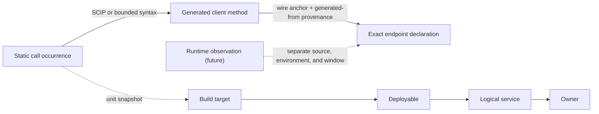
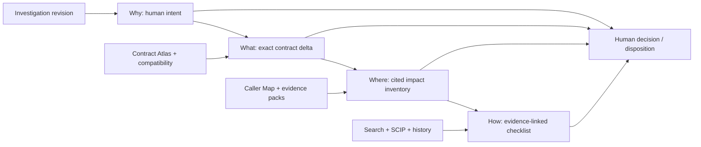

# phebs · completed backlog

> Historical ticket archive created by T24.4. For current sequencing and
> acceptance criteria, use the [active backlog](./BACKLOG.md) and
> [roadmap](./ROADMAP.md). Ticket narratives below are retained as completed
> engineering history.

Epics 0–10 historically mirrored the removed `PORT_MAP.md`; later epics extend
the same ticket ledger. Tickets are PR-sized and dependency-ordered for a
stacked workflow. Acceptance criteria (AC) are the merge bar. Decisions get
appended to PLAN.md as dated ADR bullets — no new architecture docs.

Conventions: `T<epic>.<n>` · deps listed only where they cross epics or gate.

---

## EPIC 0 — Bootstrap

**T0.1 · Repo home + module path** ✅ 2026-07-09 — *decision ticket; remote push deferred (local-only for now)*
Pick GitHub home (`phebs` handle is squatted; options: under your user, or org
`phebs-dev` / `getphebs`). AC: repo exists, README.md skeleton pushed, module
path fixed in PLAN.md ADR.

**T0.2 · License** ✅ 2026-07-09 — *decision ticket*
Recommend Apache-2.0 (patent grant, matches zoekt ecosystem); MIT acceptable.
AC: LICENSE + copyright line committed; README license section unblocked.

**T0.3 · Scaffold** ✅ 2026-07-09
`go.mod` (latest stable Go, 1.26 line), layout: `cmd/phebs/`,
`internal/{config,store,sync,indexer,search,api}`, `ui/` (Vite app),
`go:embed` stub for UI. AC: `go build ./...` green on empty skeleton.

**T0.4 · CI** ✅ 2026-07-09 *(workflow committed; first real run needs the remote)*
golangci-lint + `go test ./...` + UI build job. AC: PR gate green on main.

**T0.5 · Dev environment** ✅ 2026-07-09
Makefile/justfile targets (`dev`, `test`, `lint`). Embedded SurrealDB
(`surrealkv://`) is the dev default per PLAN §1; optional compose file exists
only for server-mode testing. AC: `make dev` boots the phebs skeleton on
embedded storage with zero external services.

## EPIC 1 — Skeleton & storage (slice 1) ✅ 2026-07-09 — demoed via `make dev`

**T1.1 · Config schema + loader** ✅ 2026-07-09
Own YAML schema (NOT upstream's JSON schemas): server block, connections list
(github, generic-git), index dir, auth token. AC: invalid config fails fast
with line-level errors; example config in `docs/`.

**T1.2 · SurrealDB schema + store layer** ✅ 2026-07-09 *(supervised-child pivot — see PLAN ADR)*
`DEFINE TABLE` .surql applied at boot for §5 tables: `repo`, `connection`,
`repo_connection`, `connection_sync_job`, `indexing_job`, `user`, `api_key`.
AC: idempotent apply; store package with typed CRUD for repo + jobs behind an
interface (keeps the Postgres exit open per PLAN §3); unit tests against
ephemeral embedded (`surrealkv://`) stores.

**T1.3 · SPIKE: job-claim semantics** ✅ 2026-07-09 *(optimistic claim won — see PLAN ADR)* — *gates EPIC 2*
Benchmark optimistic `UPDATE … WHERE status = 'pending'` claim vs
record-lock pattern under N concurrent pollers; measure double-claim rate and
latency. AC: decision ADR in PLAN.md + chosen claim statement landed in store
layer with a concurrency test proving zero double-claims.

**T1.4 · huma skeleton** ✅ 2026-07-09
`/api/health`, `/api/version`, `/api/openapi.json`, `GET /api/repos` (read
from store). Bearer-token middleware (single API key). AC: OpenAPI doc
renders; endpoints covered by httptest.

## EPIC 2 — Sync (slice 2) ✅ 2026-07-09 — demoed: live sync of a public repo via `make dev`

**T2.1 · Generic-git adapter** ✅ 2026-07-09
Connection → repo rows; clone/fetch **bare** repos via exec git into
deterministic disk layout (`$DATA/repos/<host>/<path>.git`). AC: add a
connection, repos appear in DB and on disk; refetch is incremental.

**T2.2 · GitHub adapter (PAT)** ✅ 2026-07-09 *(fake-API tests; live PAT run done in T6.3)*
List repos by org/user with include/exclude filters (name, archived, fork).
AC: rate-limit aware pagination; repo metadata (defaultBranch, pushedAt,
webUrl, external_*) persisted per §5.

**T2.3 · Jittered poller + sync-job lifecycle** ✅ 2026-07-09
Poll loop with jitter per PLAN.md; job states pending→claimed→running→
done/failed; heartbeat + stale-claim reaper; bounded retries with backoff.
Depends: T1.3. AC: kill -9 during a job → job recovered by reaper; no
double-execution under 3 concurrent pollers (test).

**T2.4 · Repo status + orphan policy** ✅ 2026-07-09

**T2.5 · Local repos + watch mode** ✅ 2026-07-09 — *added post-P1*
Plain local paths as generic-git URLs (hardlink mirrors); `watch: true` polls
the source HEAD and re-syncs/re-indexes on movement; mirror follows the
source's checked-out branch; `sync.poll_interval` tunes end-to-end latency.
AC: commit in a watched repo becomes searchable within seconds (measured
~1.4s at 1s cadence); watcher enqueues exactly one deduped job per HEAD move.

**TD.1 · User manual + README refresh** ✅ 2026-07-10 — *added post-P1*
`docs/MANUAL.md`: install, config reference, connections (GitHub/git/local/
watch), search syntax, UI, API, operations, troubleshooting, development.
README brought to P1 reality (quick start, status, Apache-2.0). Doc rule
added to CLAUDE.md: behavior changes update the manual in the same PR.
Drive-by fixes from verifying the quickstart: `make build` binary now finds
`bin/zoekt-git-index`; UI page title.
`GET /api/repo-status`; orphaned repos (no connection) flagged; cleanup behind
config flag (default off, mirroring upstream's isAutoCleanupDisabled
semantics). AC: status endpoint reflects sync/index state transitions live.

## EPIC 3 — Index (slice 3) ✅ 2026-07-09 — demoed: sync→index chain to shards via `make dev`

**T3.1 · Indexer (same-SHA child builder)** ✅ 2026-07-09 *(>1GB memory soak deferred to P6 capacity spike)*
`indexing_job` consumer → child `zoekt-git-index` **built from our own go.mod
SHA** (`go build github.com/sourcegraph/zoekt/cmd/zoekt-git-index`), OOM-isolated
per PLAN §1; HEAD-only; shards to `$DATA/index`. Search stays in-process. AC: P0 spike behavior reproduced inside the job system; shard
appears after sync completes; memory bounded on a large repo (pick one >1GB).

**T3.2 · Incremental short-circuit** ✅ 2026-07-09
Skip when `indexedCommitHash == HEAD`; `--force` path for manual reindex.
AC: no-op reindex completes <100ms without touching shards.

**T3.3 · Failure taxonomy + metrics** ✅ 2026-07-09
Classified errors (clone-auth, index-oom, corrupt-shard), backoff per class;
Prometheus counters (jobs by state, index duration, shard bytes). AC: /metrics
exposes counters; forced failure lands in the right class with retry schedule.

## EPIC 4 — Search (slice 4) ✅ 2026-07-09 — demoed: search/stream/source/tree live via `make dev`

**T4.1 · Query pipeline** ✅ 2026-07-09 *(visibility via zoekt's `public:` atom; `archived:`/`fork:`/`public:` → RepoSet)*
`zoekt/query.Parse` + metadata pre-pass: `archived:` `fork:` `visibility:`
compiled to `query.RepoSet` from DB. AC: table-driven tests mapping input
strings → expected zoekt query trees.

**T4.2 · `/api/search` (JSON)** ✅ 2026-07-09
`shards.NewDirectorySearcher` singleton with shard watch; bounded result
options (maxMatches, context lines). AC: golden-file tests over a fixture
repo; p50 latency budget recorded in PLAN.md.

**T4.3 · `/api/stream_search` (SSE)** ✅ 2026-07-09 *(flush cadence: per shard batch — documented in search.Stream)*
Streamed via `Searcher.StreamSearch`; decide + document flush cadence
inline (per-chunk vs time-batched). AC: curl shows progressive events;
cancellation propagates (client disconnect stops the search).

**T4.4 · File serving: `/api/source`, `/api/tree`, `/api/folder_contents`** ✅ 2026-07-09
Serve from bare repos via git plumbing (`cat-file`, `ls-tree`) rather than
zoekt content tricks. AC: content matches checkout byte-for-byte; path
traversal fuzz test.

## EPIC 5 — UI (slice 5) ✅ 2026-07-09 — demoed in-browser: search/viewer/repos on Base Web via `make dev`

**T5.5 · UI redesign (Base Web design handoff)** ✅ 2026-07-10 — *added post-P1*
Applied the Uber design-language handoff on stock `baseui` (LightTheme/DarkTheme).
- **a** — theme foundation: dark mode + toggle (localStorage), mono/sans fonts,
  role→hex token map for non-semantic colors, redesigned 56px header shell.
- **b** — syntax highlighting: CM6 `HighlightStyle` in the file viewer + a Lezer
  standalone tokenizer for search-result chunks; styled match highlight;
  redesigned file cards; blue deep-link line.
- **c** — search workbench: facet rail (repos/languages, client-derived),
  keyboard nav (j/k/enter/y/o), collapsible groups, streaming indicator bar +
  skeleton + Stop.
- **d** — file viewer (breadcrumb, sticky metadata header, commit pill,
  permalink/open-in-search) + repos table (status dots, connection pills,
  commit chips, per-row search/reindex, Reindex all).
Deferred (need API additions, flagged in handoff): did-you-mean & speculative
looseners (2b–2d), per-shard progress / stuck-search (3c/3d), file-tree column,
context expander, auto-retry on stream drop.

**T5.1 · Vite + React + TS scaffold, embedded** ✅ 2026-07-09 *(build-tag embed: no committed artifacts, `go build` green without npm)*
`go:embed` production build; dev proxy to huma. AC: single binary serves UI.

**T5.2 · Search page** ✅ 2026-07-09 *(Base Web — public open-source `baseui`, no internal assets)*
Query box + SSE-driven result list (repo/file grouping, match counts).
AC: streaming renders incrementally; empty/error states.

**T5.3 · File viewer** ✅ 2026-07-09
CodeMirror 6 read-only, match decorations, line anchors (`#L42`), language
by extension. AC: deep link to file+line from a search result works.

**T5.4 · Repos page** ✅ 2026-07-09
Table over `/api/repo-status`: sync/index state, timestamps, force-reindex
button. AC: reindex button enqueues job visible in status within one poll.

---

## P1 cut line

Everything above ships = P1 (complete 2026-07-10). The post-P1 roadmap below
closes the Sourcebot free/paid feature gaps (derived 2026-07-10 from a
public-sources feature comparison + PORT_MAP §12). Waves are ordered by
value-over-effort and dependency; tickets are PR-sized, ACs are the merge bar.
Sourcebot tier in each ticket = where that feature sits upstream (free vs
paid/EE), from public docs/pricing only — never their source, never `ee/`.

---

## EPIC 6 — Parity quick wins ✅ 2026-07-10 *(Wave 0 — days each, no architecture change)*

**T6.1 · Broaden syntax highlighting** ✅ 2026-07-10 — *Sourcebot free (100+ langs)*
Added CM6 language packs beyond the initial ~6: official Lezer grammars
(Rust, Java, C/C++, PHP, SQL, HTML, CSS, XML, YAML) + legacy stream modes
(Ruby, shell, C#, Kotlin, Scala, Swift, Lua, Perl, Dart, TOML, Dockerfile) in
`ui/src/lang.ts`, each a lazy code-split chunk. Shared `langName`/`langColor`.
Verified: YAML + TypeScript highlight in the viewer; header shows the language.

**T6.2 · File-tree navigation column** ✅ 2026-07-10 — *Sourcebot free (file explorer)*
240px sticky tree column in `FilePage` over `/api/tree` (`fetchTree`): builds a
nested tree, auto-expands the path to the current file, active-row bar, dirs
toggle, files navigate. Verified: auto-expand + active highlight; clicking a
collapsed dir reveals its files; file rows deep-link. Moves "file explorer"
partial → have. *(buildTree unit test landed with T6.4.)*

**T6.3 · Live GitHub PAT verification** ✅ 2026-07-10 — *closes a testing caveat*
Ran the adapter live (200-repo account): `users:` pagination, `orgs:`,
`repos:`, exclude globs — 5 kept repos (4 private) synced, indexed, searched;
token verified absent from mirrors/data/API. Finding fixed: `users:` naming
the token's own login now lists via `/user/repos` so its private repos are
seen (public endpoint omits them); regression test added. ADR 2026-07-10.

**T6.4 · UI test harness (Vitest)** ✅ 2026-07-10 — *review gap: zero UI tests*
Vitest + jsdom + Testing Library (`test` block in vite.config.ts, `npm test` /
`make ui-test`). 23 cases: streamSearch SSE contract incl. the error-clobber
distinction (fake EventSource), SearchPage streaming/keyboard nav with clamp +
typing guard + collapse guard/facet toggling (styletron+baseui render, mocked
lang/highlight), and the T6.2 buildTree unit tests. CI wiring lands with the
first CI pipeline (none exists yet).

## EPIC 7 — Connectors & freshness ✅ 2026-07-11 *(Wave 1 — the biggest free-tier gap)*

**T7.1 · GitLab connector** ✅ 2026-07-11 — *Sourcebot free* *(fake-API tests; live run pending)*
`type: gitlab` (PAT, optional self-hosted `url:`): groups (subgroups
included), users (requester-scoped — own private projects appear), explicit
repos, excludes, Link-header pagination + 429 Retry-After, §5 metadata,
oauth2-basic authenticated clone. Shared `hostClient` extracted from the
GitHub adapter. Path-traversal guard on server-supplied project paths.

**T7.2 · Gitea connector** ✅ 2026-07-11 — *Sourcebot free*
`type: gitea` (PAT + required base URL): orgs/users/repos on the shared
`hostClient`. **Verified live against a real Gitea 1.26 container**: private
org repo synced, indexed, searched; token-as-basic-username clone auth
confirmed; token absent from data dir. *(Bitbucket Cloud/DC, Azure DevOps,
Gerrit follow as T7.x by demand — same adapter shape.)*

**T7.3 · GitHub App auth** ✅ 2026-07-11 — *Sourcebot paid/EE — OSS in phebs* *(fake-API tests; live App run pending)*
`app:` block (id, installation_id, PEM key by path or inline env) on github
connections; stdlib RS256 JWT → installation token per sync run (always
fresh — AC "tokens refresh"), so no `ghinstallation`/go-github dependency.
No selectors → syncs the installation's granted repos. PAT/anon connections
unchanged (AC "falls back cleanly").
Deps: T2.2.

**T7.4 · Webhook-driven reindex** ✅ 2026-07-11 — *Sourcebot paid/EE — OSS in phebs*
`POST /api/webhook` (HMAC `X-Hub-Signature-256`, constant-time, 404 when no
secret): push → targeted `repo_fetch_job` (fetch + reindex, no host
re-listing); repository/installation events → remote-connection re-sync.
**Verified live**: Gitea container webhook (GitHub-compat headers) → push →
searchable with `resync_interval: "0"`; bad signature 401 live + tested.
Deps: T7.3.

**T7.5 · Periodic re-sync cadence** ✅ 2026-07-11 — *Sourcebot free (auto-freshness)*
`sync.resync_interval` (default `1h`, `"0"` disables) enqueues re-syncs for
remote connections; `EnqueueUnlessInFlight` is the debounce, local repos stay
watch/boot-owned. Moves "periodic re-sync" partial → have.

## EPIC 8 — Differentiators: paid features, OSS in phebs ✅ 2026-07-11 *(Wave 2 — high value)*

**T8.1 · Search contexts** ✅ 2026-07-11 — *Sourcebot paid/EE — OSS in phebs*
Config-defined contexts (name → repo-name globs) + string-level `context:`
extraction ahead of `query.Parse` (zoekt has no such atom), compiled to one
`RepoSet` AND'd over the query; multiple atoms union. Table-driven Compile
tests + e2e over real shards. No DB table — config is the single source;
add CRUD when a UI needs it.

**T8.2 · MCP server** ✅ 2026-07-11 — *Sourcebot paid/EE — OSS in phebs; flagship differentiator (PLAN P4)*
Official go-sdk server at `/api/mcp` (Streamable HTTP, same authentication as
the API): `search_code` (full query syntax incl. `context:`), `read_file`
(ranged), `list_repos`. **Verified live from Claude Code**: a headless
session listed repos, searched the needle, and read the file — all correct.
Deps: T8.1.

**T8.3 · MCP integration + polish** ✅ 2026-07-11
Large-file truncation on line boundaries with a `truncated` flag + ranged
re-reads; binary/unknown-repo tool errors; MANUAL §8 with copy-paste
`claude mcp add` + `.mcp.json` config. AC met by the live agent session.

**TD.2 · Epics 1–8 stabilization review** ✅ 2026-07-11 — *release hardening*
Closed the cross-epic correctness gaps found after Wave 2: fail-closed clone
credential handling and pagination, atomic pending successors + fenced leases,
repo-wide fetch/index/cleanup locking, startup artifact and shard-revision
reconciliation, immutable search/file/MCP refs, lazy request-safe file browsing,
exact query filters, Unicode highlights, accessibility, and durable UI tests /
lint in CI. Regression coverage includes concurrent enqueue/reaper races,
cleanup traversal/collisions, stale shards, failed index-state commits, private
App selectors, malformed URLs, transactional membership rollback, literal
artifact paths, and responsive UI corrections.

## EPIC 9 — Auth & code navigation ✅ 2026-07-11 *(Wave 3 — heavier lifts)*

**T9.1 · DB-backed users, sessions, multiple API keys** ✅ 2026-07-11 — *Sourcebot free (login/members)*
Surreal-backed users/SCS sessions, Argon2id local passwords, hashed named API
keys, one-time setup/bootstrap, login/logout, CSRF, Settings key lifecycle,
and always-on API/MCP auth. Tests cover atomic first-user creation, session
restart persistence, key create/use/revoke, legacy config-key hash migration,
rate limiting, malformed credentials, and CSRF enforcement.

**T9.2 · OIDC / SSO** ✅ 2026-07-11 — *Sourcebot paid/EE (enterprise SSO)*
`coreos/go-oidc` discovery + authorization code/PKCE/state/nonce, verified
ID-token email, stable issuer/subject linking, and T9.1 session bridging with
no seat gate. A fake IdP test completes redirect → callback → persisted user
→ authenticated session, verifies PKCE + nonce wiring, and rejects callback
replay after one-time state consumption.

**T9.3 · Code navigation (SCIP)** ✅ 2026-07-11 — *Sourcebot paid/EE (Pro code nav) — PLAN P4*
Lazy immutable `index.scip` ingestion from the indexed commit; precise
definition/reference/hover API, file-viewer panel, and MCP tools with UTF-8/
UTF-16/UTF-32 conversion and 500-reference cap. Fixture tests prove def/ref/
hover, Unicode positions, revision replacement, strict revision/path
validation, deterministic reference bounds, canceled-ingest snapshot
preservation, bounded semantic/cache/source budgets, oversized hover rejection,
LRU eviction, and graceful `available:false` when the index is absent.

**T9.4 · Git history / blame / commit / diff** ✅ 2026-07-11 — *Sourcebot free (history + blame)*
Revision-pinned `/api/blame`, `/api/commits`, `/api/commit`, `/api/diff`, three
viewer routes, and four MCP tools over bare-mirror Git plumbing. Multi-commit
fixture tests cover blame line mapping, rename-following history, parents/root
commits, binary and truncated diffs, literal/path-safe inputs, invalid refs,
cancellation, paging, mutable-HEAD isolation, producer termination at output
limits, aggregate metadata bounds, and race execution.

**TD.3 · Epic 9 corrective review** ✅ 2026-07-11 — *release hardening*
Closed proxy-aware authentication throttling, credential-free quota exhaustion,
OIDC email auto-linking, reconcile/index publication races, deletion rollback,
SCIP stale-range tolerance/reference semantics/negative caching, non-UTF-8
blame, explicit zero-context diffs, and history pagination request races. Also
made repository locks cancellable, idempotent, and idle-evicted; unreadable shard
audits and filesystem reconciliation are now non-destructive and cancellable.

**TD.4 · Shared bounded Git object reader** ✅ 2026-07-15 — *internal consolidation*
Factor source/history/SCIP Git reads onto one immutable-OID primitive with
per-call byte limits and shared not-found classification. Do not route SCIP
through the current source helper: its global 10 MiB blob contract conflicts
with SCIP's independent 64 MiB index and per-source limits. AC: one tested error
classifier and bounded reader serve all three callers without weakening any cap.

## EPIC 10 — Enterprise surface ✅ 2026-07-11 *(Wave 4 — build-our-own, historical PORT_MAP §12)* — demoed live via `make dev`: audit trail, analytics dashboard, and admin-vs-non-admin visibility over API + stateless MCP. T10.4 was subsequently completed on demand on 2026-07-22.

**T10.1 · Audit log** ✅ 2026-07-11 — *Sourcebot paid/EE — OSS in phebs*
Append-only `audit_event` table (narrow `AuditStore`), huma middleware
recording every mutating operation by operation ID + injected recorder for
the non-huma auth surface (logins incl. failures, setup, logout, key
lifecycle, OIDC); synchronous non-fatal writes; `audit.retention` sweep
(default 90d); admin-gated `GET /api/audit` + `#/audit` page with paging.

**T10.2 · Analytics** ✅ 2026-07-11 — *Sourcebot paid/EE — OSS in phebs*
`usage_event` recorded by one `Searcher.Usage` hook (covers REST/SSE/MCP);
no query text stored; Go-side windowed aggregation; admin-gated
`GET /api/analytics` + `#/analytics` dashboard (tiles, per-day bars, top
repos) with zero chart dependencies. **Zero telemetry** — events never leave
the machine. `analytics.retention` (default 365d) shares the 12h sweep.

**T10.3 · Permission syncing + permission-aware search** ✅ 2026-07-11 — *Sourcebot paid/EE — OSS in phebs; the durable moat*
`repo_permission` edges (`<host>:<login>` → repo) mirrored in the adapters'
per-repo loops for private repos (GitHub/GitLab/Gitea; replace-set writes,
stale-kept on failure); config map links users → identities; enforcement
opt-in via the `permissions:` block. Per-user `RepoSet` compiled in the
search pre-pass (`Searcher.Visible` fills the reserved hook — in-query, not
post-filter); the same predicate gates listings, file/history/code-nav reads,
and all MCP tools (denial ≡ 404). MCP runs stateless to stop session-principal
smearing. Leak tests across search/stream/API/MCP. Deps: T9.1.

**TD.5 · Epic 10 corrective review** ✅ 2026-07-11 — *release hardening*
Closed the adversarial-review findings: permission-denial responses now match
missing-repo responses in body and work performed (no existence/timing
oracle); path-hosted GitLab/Gitea identity hosts are expressible in config;
permissions email keys share auth's NFC normalization; a bare `permissions:`
key enables enforcement as documented; retention prunes count-then-delete
without materializing rows; shutdown drains in-flight requests (and their
audit/usage writes) before the store closes; the audit page dedupes pages
shifted by live writes. Regression tests pin each.

**T10.4 ✅ · Multi-branch / tag indexing (`rev:`)** — *Sourcebot free (up to 64 revs/repo)*
**Architectural, not a ticket-sized change** — HEAD-only is a core P1
assumption (indexer, watch, freshness all lean on it). Gated on real demand;
sequence last. AC: an explicit per-repo branch allowlist (cap ≈8 per PLAN §1)
indexes + serves multiple revisions behind `rev:`.

Implemented on `t10.4-multirev-indexing`: the config admits seven aliased full
branch/tag refs plus implicit HEAD; one child build atomically publishes the
sorted selector/branch/commit set; startup repair verifies exact shard branch
metadata; unqualified queries are forced to HEAD and one `rev:` scope is
resolved only across the principal's visible repositories, with a second
commit check on serialization. Local watch includes only the admitted refs.
Extraction/proof semantics remain HEAD-bound by design.

---

## Contract-intelligence annex *(adopted 2026-07-12 — see the two PLAN.md ADRs of that date)*

> Before you change an RPC or field, phebs identifies who may be affected,
> cites the exact source evidence, and tells you what remains unknown.

Annex, not pivot: "self-hosted code search in one binary" stays the identity;
T11.1 is complete by a human-accepted terminal capacity-stop disposition, and
Epics 12–15 are complete under the explicit 2026-07-22 governance disposition.
Their completion does not establish GATE2-V2 or create a numeric accuracy or
completion claim. Commodity surfaces (spec-to-spec diffing, runtime topology,
catalog UX, PR delivery, scorecards) are integrated or deferred, never rebuilt.
phebs produces immutable, permission-safe proof bundles; workflow layers
(Workbench) reference bundle IDs and never recompute or weaken phebs's
conclusions. Public corpora validate mechanics only; an authorized **external**
design partner is required before broader graph or completion claims — no
implicit employer-estate exception. The retained post-Epic-15 platform-pivot
freeze is in force; Epic 16 remains separately blocked.

## EPIC 11 — Validation gate *(annex Stage 0)*

**T11.1 · SPIKE: Validate revision-pinned Go/gRPC consumer evidence and service identity resolution** ✅ 2026-07-22 — *human-accepted terminal outcome; GATE2-V2 remains `NOT_ESTABLISHED`; Epics 12–15 are released by explicit governance disposition, not by an empirical gate pass. See the superseding PLAN ADR and `spike/t111/REPORT.md`.*
Corpus: ≥4 systems including a multi-service monorepo, shared libraries
containing gRPC calls, multiple versions/vendored copies of generated protobuf
code, conflicting image/deployment/Helm/`service.name` identities, and
tests/mocks/generated/vendor directories. ≥200 positive examples, ≥100 hard
negatives, 30% blind holdout. Public systems validate mechanics, not
production completeness. The spike also fixes the evidence schema (atoms +
`snapshot_evidence` associations, per the PLAN evidence-model ADR) before any
extractor breadth — retrofitting provenance is costlier than starting with it.
AC — four gates, measured separately:
1. **Evidence integrity (fail ⇒ stop the initiative):** 100% of emitted
   evidence resolves to the exact repo/commit/file/span; identical input +
   extractor version ⇒ identical `evidence_atom_id`s; a failed extraction
   never publishes a partial replacement set; permission filtering precedes
   aggregation; no invisible repository or service name — or count — leaks
   through any result, including coverage manifests.
2. **Operation extraction:** ≥98% precision and ≥90% recall on eligible direct
   Go/gRPC patterns; ≥90% precision within every individual fixture;
   registration / client call / test / mock / generated / vendor references
   classified separately. Contract identity is the fully-qualified proto
   service+method — no global service identity required for this gate.
3. **Service/deployable identity:** ≥99% pairwise precision on high-confidence
   merges (target zero false merges in the blind holdout); ≥95% end-to-end
   precision on caller-deployable → operation edges; low coverage acceptable;
   **abstention is success**. Logical service, deployable, build target,
   image, workload, and runtime `service.name` stay distinct related entities.
4. **Field references:** the assertion is `REFERENCES_PROTO_FIELD` only (never
   `READS_RPC_RESPONSE_FIELD`); ≥98% direct getter/selector precision; ≥90%
   recall within the SCIP-eligible population; read/write/test/generated/
   unknown classification; canonical field identity
   `(contract_lineage_id, message_full_name, field_number)` mapped across ≥2
   consumer dependency versions.
Exit: gates 2+3 pass → Epics 12–15 as designed · gate 2 passes, 3 fails →
wedge ships with consumers grouped by repository/build target · gate 1 or 2
fails → stop; post-mortem ADR.

Recorded terminal disposition (2026-07-22): the independently reviewed sealed
campaign ended in a valid capacity stop before selection or disclosure. All
required human reviews and acceptance are recorded complete by the operator.
T11.1 is therefore complete as a validation process, while GATE2-V2 remains
`NOT_ESTABLISHED` and supplies no accuracy number. Governance releases
implementation sequencing for Epics 12–15 under the existing bounded-evidence,
permission, coverage, and abstention requirements. At the time of that
disposition, the remaining acceptance criteria in Epics 13–15 stayed
unsatisfied until implemented and verified. They are now complete under their
individual tickets, including Epic 15's separately retained independent
acceptance gate recorded below.

## EPIC 12 — Provenance schema & protobuf facts ✅ 2026-07-12 *(implemented dark and hardened; T11.1 sequencing release recorded 2026-07-22; runtime posture unchanged)*

**T12.1 · Evidence & assertion store** ✅ 2026-07-12
Content-addressed `evidence_atom` + `snapshot_evidence` associations, semantic
assertions (supporting **and contradicting** atoms), identity assertions,
coverage manifests, extraction runs — per the PLAN evidence-model ADR. Narrow
`EvidenceStore` interface (house style); deterministic confidence tiers only.
AC: an identical blob vendored in two repos yields one atom and two
associations with independent visibility; atomic staged publish survives a
mid-publish kill (prior facts intact, no partial set); proof-aware retention
honored — no deletion of evidence referenced by a retained bundle.

**T12.2 · Extraction job kind** ✅ 2026-07-12
`extraction_job` chained after indexing (as index chains after sync);
extracted-commit short-circuit (T3.2 pattern); `extract` class in the T3.3
failure taxonomy; **pure-reader invariant enforced** (no exec, no dynamic
loading, no corpus writes, no network while parsing). AC: a reindex chains
exactly one extraction per new commit; kill mid-run leaves published facts
intact; invariant violations are structurally impossible in the runner (no
exec/network capability in the extractor context), asserted by test.

**T12.3 · Protobuf declared-plane extractor (dark/provisional scope per the 2026-07-13 ADR)** ✅ 2026-07-12
protocompile-based: `.proto` → services, methods, messages, fields with exact
spans and deterministic `provisional_repo_path_v1_<sha256>` lineage IDs. AC for
this dark stage: on the fixture corpus every declared operation/field is an
assertion whose evidence atom resolves to the pinned commit and span in the
file viewer. Promotion to canonical cross-repository `contract_lineage_id`
remains T13.2 work and provisional facts cannot support product conclusions.

## EPIC 13 — Implementations, consumers, field references ✅ 2026-07-22 *(unblocked by the accepted T11.1 terminal disposition)*

**T13.1 · Implementation & consumer resolution (Go/gRPC) — dark/provisional
scope per the 2026-07-22 disposition** ✅ 2026-07-22
`RegisterXServer` implementation pinning; typed generated-client call-site
resolution; `code_role` classification (production/test/mock/generated/
vendor). Dark-stage AC (T12.3 precedent): the productized extractor runs
inside the T12.2 pure-reader pipeline on the fixture corpus; every
implementation/consumer edge cites evidence atoms resolving to pinned
commit + span in the file viewer; classification and resolution are
deterministic across two runs; no output states or implies measured
accuracy. The original blind-evaluation clause (≥98% precision, ≥90%
recall, ≥90% per-fixture under the T11.1 measurement contract) is
**deferred to the pilot's internal validation gate** — it cannot be
satisfied post-capacity-stop and remains the promotion bar for any
accuracy-bearing claim.

**T13.2 · SCIP proto-field references** ✅ 2026-07-22
`REFERENCES_PROTO_FIELD` assertions from cross-repo SCIP references over
generated accessors; read/write/test/generated/unknown classification; field
lineage across consumer dependency versions. AC: a renamed field (same number,
same lineage) tracks as one identity across two consumer versions. Implemented
as a pure reader over the immutable committed `index.scip`: exact definition
ranges bind generated Go struct fields/getters through protobuf tags and the
source `.proto` declaration; reference occurrences cite exact source spans.
Canonical identity is `(SCIP package lineage excluding dependency version,
message full name, field number)`, with ambiguous or incomplete joins
abstaining instead of guessing. The acceptance fixture renames field 1 across
two repositories and dependency versions while retaining one lineage/object.

**T13.3 · Coverage manifests** ✅ 2026-07-22
Per-answer coverage certificate: repositories searched (the caller's visible
universe only), revisions, protocols supported, extractors applied + failures,
SCIP availability, unresolved candidates, freshness. AC: the certificate
provably changes when one repo's extraction fails; adversarial test shows no
invisible-repo leakage through names or counts. Implemented as
`extract.BuildCoverageCertificate` over the narrow `RunSource` read surface:
deterministic `coverage-certificate-v1` with a sha256 digest over canonical
JSON, every visible repository present (including evidence-free ones), per-run
identity plus complete source-scope counters/digest, freshness against the
indexed commit, and SCIP availability derived only from a current-revision
publication. A durable latest-attempt marker makes staged/aborted replacements
certificate-visible without publishing partial evidence; the same-commit
forced-failure AC runs through the real worker and keeps the prior fresh run
while moving the digest. Store tests pin abort and killed-run sweep lifecycle.
Publication times are excluded from canonical content. The adversarial test
mutates hidden-repo run and attempt state and requires byte-identical
certificates, no hidden names, and zero invisible-repository queries. API
exposure is T14.1.

## EPIC 14 — Query, proof bundles & MCP ✅ 2026-07-22 *(unblocked by the accepted T11.1 terminal disposition)*

**T14.1 · Query API + proof bundles** ✅ 2026-07-22
huma endpoints for `find_operation_consumers`, `find_proto_field_references`,
`get_extraction_coverage`; immutable self-contained proof bundles embedding
assertions, coverage certificate, extractor versions, and `visibility_context`
(principal, authorization provider, permission snapshot, visible-repo-set
digest). Bundles re-authorize on read — a bundle ID is not a bearer
credential; revoked repository access revokes old bundles. AC: admin and
member asking the same question produce different immutable bundle IDs; the
member bundle names no invisible repository.
Implemented as default-dark Huma GET routes over the existing experimental
reader flag. Permission filtering produces the complete visible repository
slice before any evidence lookup. A query resolves all cited atoms and
occurrences, confirms the coverage digest did not move during construction,
and stores canonical `proof-bundle-v1` bytes under a sha256-derived ID while
atomically pinning every named published run. The visibility context commits
to principal, authorization-provider generation, and visible-repository-set
digest. `GET /api/proof_bundles/{id}` reauthorizes every scoped repository on
each read and returns indistinguishable not-found responses for missing or
revoked scope. Tests prove different admin/member IDs, byte-identical repeat
queries, no hidden repository names or hidden evidence calls, retroactive
revocation, one-snapshot read authorization, `422` bounded-query refusals,
single-domain filtered-query invariants, immutable persistence, and proof-aware
retention. MCP exposure is deliberately T14.2; compatibility remains T14.3.

**T14.2 · MCP tools** ✅ 2026-07-22
The proof-backed annex tools on the existing stateless `/api/mcp` server:
`find_operation_consumers`, `find_proto_field_references`, and
`get_extraction_coverage`. Implemented as a transport-only projection of the
same `api.ProofService` used by Huma, returning complete `proof-bundle-v1`
structured content; no MCP-specific filtering, aggregation, or qualification
logic exists. The tools are registered only under the existing experimental
reader opt-in and are otherwise undiscoverable. AC runs one official-SDK
stateless Streamable HTTP agent session through RPC consumers, field
references, and coverage, verifies exact source citations and the agent's
visibility context, and proves zero hidden-repository evidence calls or names.
`check_contract_compatibility` registers with its real pinned-Buf engine in
T14.3; T14.2 intentionally does not advertise a failing placeholder or freeze
a speculative schema.

**T14.3 · Contract compatibility via pinned Buf child** ✅ 2026-07-22
`check_contract_compatibility`: version-pinned `buf` child built from go.mod
(zoekt-git-index house pattern), sandboxed per the PLAN ADR — phebs-produced
descriptor inputs or sanitized temp tree, no network, CPU/memory/time limits,
never `buf generate`/protoc plugins/repository scripts; Buf version, args, and
result recorded in the extraction run. phebs enriches Buf's spec-level
verdicts with evidence-derived consumers and registers the corresponding Huma
endpoint plus MCP tool. AC: a wire-breaking field change
reports the breaking rule **and** the affected consumers with call-site
citations.
Implemented with Buf v1.72.0 as a Go tool and sibling child binary. The only
operation is fixed-policy `buf breaking` (`WIRE`, structured JSON,
symlinks disabled) over validated source files copied into a fresh temp tree;
network and writes outside that tree are denied, with independent input,
output, wall, CPU, and memory ceilings. A startup version/sandbox probe keeps
both transports undiscoverable on a missing or mismatched engine. Canonical
results commit to source digests without retaining blobs and embed a
bundle-local compatibility extraction-run record (engine/version/exact
relative args/exit/result); they do not publish into the repository extraction
table because caller-supplied before/after sets have no indexed repo revision.
Structured violation spans map to `(lineage,message,field_number)` and feed a
bounded multi-filter extension of the shared proof builder, so SCIP consumers
and exact occurrences remain permission-filtered, coverage-confirmed, and
identical over Huma and MCP. Real-Buf tests pin a wire-type break, exact rule,
span, stable identity, compatible rename, source/temp-path non-retention, and
determinism; HTTP and official-SDK MCP acceptance pin affected visible
consumers/citations and hidden-repository non-interference.

**T14.4 · Proof-bundle retention before pilot exposure** ✅ 2026-07-22
Add config-gated proof-bundle expiry before any pilot enables the annex query
surface. Expiration uses store metadata outside canonical bundle content, so
it never changes content IDs. Deleting an expired bundle and its
`proof-bundle:<id>` evidence pins is one transaction; it must not remove any
other bundle/checkpoint pin, and the existing evidence sweeper remains solely
responsible for reclaiming newly unpinned runs. Default retention is disabled
until an operator explicitly configures a lifetime. Reads of expired IDs fail
closed with the same not-found response as missing or unauthorized bundles.
AC: two bundles pin one superseded run; expiring the first preserves the run,
expiring the second makes it sweep-eligible, while an unexpired bundle remains
byte-identical and readable. Must land before Epic 15 pilot exposure.
Implemented with opt-in `proof_bundles.retention`, measured from the latest
successful materialization in store metadata (legacy rows fall back to
creation time). Reads and the bounded boot/hourly sweeper share the same
cutoff. Each bundle deletion transaction rechecks expiry and removes only its
exact `proof-bundle:<id>` pins; independent bundle/checkpoint pins survive,
and only the existing evidence sweeper can reclaim a newly unpinned run. The
AC additionally pins indistinguishable expired/missing/unauthorized 404s,
default-off config, active-bundle byte identity, and checkpoint isolation.

## EPIC 15 — Contract impact report ✅ 2026-07-22 *(read-only; independent acceptance gate closed by operator acceptance)*

Independent acceptance was recorded after review of the shared proof-service
projection, default-dark posture, exact immutable citations, permission
non-interference, bounded conclusions, and the retained full-suite acceptance
run. This closes Epic 15 only: GATE2-V2 remains `NOT_ESTABLISHED`, the broader
platform pivot stays frozen. Epic 16 implementation proceeds under the explicit
2026-07-22 operator bypass in PLAN.md; the validation and continuation records
remain incomplete and authorize no claim.

**T15.1 · Report API + page** ✅ 2026-07-22
For a contract, or a contract change between two extraction runs: known
consumers with exact call sites, field references, compatibility
classification, unresolved candidates, unsupported repositories/patterns,
evidence freshness — every row clickable through to pinned evidence.
Explicitly absent: PR comments/checks (separate ADR — read-only →
code-host-writer posture change), diagrams, service dossiers, runtime data.
AC: demoable via `make dev` on the fixture corpus; bounded-proof language
throughout ("no blockers found within the stated evidence scope"), coverage
certificate rendered with every conclusion.
Implemented as a deterministic `contract-impact-report-v1` projection of the
same immutable, permission-safe proof bundles used by HTTP and MCP; there is
no second persisted report or authorization path. The default-dark Huma
surface builds reports for canonical operations, stable protobuf field
identities, and proposed before/after contract inputs, then reauthorizes saved
report URLs by bundle ID. Each result separates known exact source occurrences
from unresolved syntactic candidates and renders every visible repository's
covered, stale, failed, processing, or unsupported domain state plus the full
coverage certificate. Conclusions bind to that certificate's digest and use
bounded-scope language. Repository evidence rows deep-link to their pinned
commit/path/line; coverage metadata and Buf spans over deliberately unretained
caller inputs are not misrepresented as repository evidence. Following the
T14.3 ADR, proposed changes compare bounded before/after source commitments and
record a bundle-local compatibility run rather than fabricating repository
publication rows for caller-owned inputs. Authenticated `/api/version`
capability discovery keeps both navigation and routes absent by default and
independently gates the contract-change tab on the pinned Buf probe; the
always-open anonymous response reveals no capability names. Go acceptance
proves deterministic readback, exact citations, unresolved and unsupported
rows, hidden-repository non-interference, revocation, change enrichment, and
dark posture; UI tests pin
all three forms, saved reads, caveat/certificate rendering, and immutable source
links. No code-host writer, diagrams, dossiers, or runtime plane was added.

## EPIC 16 — Investigations product slice *(operator-bypassed for implementation 2026-07-22; validation and continuation gates remain evidentially unsatisfied; all code on a post-gate branch)*

Productizes the contract suite: [domain contract](./INVESTIGATION_DOMAIN_CONTRACT.md)
v0.2, [experience spec](./INVESTIGATIONS.md) rev 3, [MCP envelope](./MCP_ENVELOPE.md)
v0.2, [pack manifest](./PACK_MANIFEST.md) v0.2. The synthetic fixtures under
`docs/fixtures/investigations/` are the conformance bar wherever cited.

**T16.1 ✅ · Investigation domain storage** — schema.surql tables and store
methods for Investigation, Revision, Run, RunEvent, RunArtifact, Decision,
Disposition, BaselineDesignation, Watch/WatchRevision per contract §2
mutability rules. AC: table-driven tests prove in-place edits of immutable
entities fail; run state derives only from RunEvents; creation idempotency
key returns the existing Run; supersession is the sole correction path.

Implementation is present on `codex/t16.1-investigation-domain-storage`: ULID
and tuple/content identities, create-once semantic rows, checked mutable
Investigation/Watch projections, contiguous digest-checked RunEvents,
event-derived Run state, concurrent idempotent Run creation, scoped-content
RunArtifacts, and explicit correction records. The schema and every embedded
SurrealQL statement validate; repository-wide compilation/vet and the touched
store package's lint are clean. The
SurrealDB-backed AC suite passed locally with `-run '^TestInvestigation'` on
2026-07-22, including 24-way concurrent Run creation and the full immutable
entity/supersession table.

**T16.2 ✅ · Immutable revisions, pins, retention ownership** *(needs T16.1)* —
Revision freeze; RunArtifact publication binds `PinRun`; pin ownership and
GC per contract §5. AC: pinned artifacts survive sweep; revocation/legal
policy overrides pins; GC refuses while an authorized owner exists.

Implementation is present on `codex/t16.2-investigation-pins-retention`:
artifact plus compatible extraction-run pins publish atomically; immutable
Investigation/Baseline/Dossier owner claims and append-only releases serialize
against bounded collection; Baseline creation acquires its owner in the same
transaction; and four explicit policy overrides can supersede active owners.
Artifact collection releases only its exact evidence-pin namespace and leaves
evidence deletion to the existing proof-aware sweeper. Schema and embedded
SurrealQL validate, package compilation/vet and focused lint are clean. The
SurrealDB-backed `-run '^TestInvestigation'` suite passed on 2026-07-22 in
42.041 seconds, including every owner, override, atomic-publication, and
pin-isolation AC plus the retained T16.1 regressions.

**T16.3 ✅ · Authorization invariants** *(needs T16.1)* — query-time principal
projection on every read; count/existence non-disclosure; opaque ids;
refusal shape of fixture 06; re-authorization on sharing and transfer.
AC: negative-test matrix passes incl. fixtures 05/06 shapes; the suite
executes BOTH an unknown-identity input and an unauthorized-identity input
and asserts identical canonical response bytes, each compared against the
same golden fixture (fixture 06 is the expected
shape, not a one-time validation target); cursors void on ownership
transfer.

Implementation is present on `t16.3-authorization-invariants`:
`store.InvestigationAuthzStore` principal-projects every domain read (unknown
and unauthorized are the identical `ErrNotFound`, and integrity errors surface
only after authorization); owner-authorized reader grants re-check at query
time; ownership moves only through the audited transfer path, which bumps the
investigation's authorization revision and thereby voids per-principal cursors
without deleting them; Watches stay owner-only. `mcp.NotAvailableRefusal`
renders the canonical fixture-06 refusal as a pure function with no
denial-reason input, golden-tested byte-for-byte, and a shape test proves the
minimal refusal carries none of fixture 05's authorized-only sections. The
SurrealDB-backed matrix (all ten reads × owner/grantee/stranger/unknown), the
identical-bytes AC, and the sharing/transfer/cursor lifecycle passed locally
on 2026-07-22 within the `-run '^TestInvestigation'` suite.

Post-merge review hardening on `codex/t16.3-review-fixes` closes the concurrent
forms of the same AC: projected reads bind and finally recheck an exact
transfer-revision plus grant-generation epoch; grant/revoke/cursor changes
serialize with transfer on the Investigation row; revoke/regrant cannot revive
an old cursor; promoting a grantee consumes that grant; and each grant, revoke,
transfer, or cursor mutation commits atomically with its audit event. Focused
regressions cover authorization-epoch ABA, revoke/regrant cursor invalidation,
promoted-grant consumption, and all four audit action classes.
The complete SurrealDB-backed Investigation suite passed after remediation on
2026-07-22 in 63.007 seconds.

**T16.4 ✅ · Guided creation and async run state** *(needs T16.1–T16.3)* —
creation API with scope preview, authorization preflight, estimate, cancel,
bounded retries; publication lease. AC: failed/canceled attempts can never
publish (late-worker test); partial failures surface in the coverage
ledger; creation is idempotent under concurrent submission.

Implementation is present on `codex/t16.4-guided-creation-run-state`: the
permission-first preview resolves only caller-visible indexed repository
snapshots, returns deterministic estimates/blockers, and binds submission to a
digest that is re-preflighted at create time. One transaction freezes the
active Investigation, Revision, queued Run/event, idempotency mapping, audit
record, and `investigation_run_job`; concurrent exact submissions cannot mint
competing objects or queue slots. Attempt leases fence progress, bounded retry
rollover, owner cancellation, and atomic published/failed artifacts. Terminal
publication includes the RunEvent, artifact, evidence pins, active-
Investigation retention owner, and audit row; failure artifacts retain
reconciled partial/failed coverage but structurally reject facts and pins.
The adapter remains unregistered in the production binary until an executable
released pack is available, so the post-gate implementation cannot expose an
undrainable workflow. Pure/API/compile/vet/lint and SurrealQL validation are
green. The complete live SurrealDB-backed Investigation suite passed on
2026-07-22 in 79.323 seconds, including concurrent guided creation, bounded
retry rollover, cancellation and failure late-worker fences, partial-failure
coverage publication, and the retained T16.1–T16.3 regressions.

**T16.5 ✅ · Core views** *(needs T16.4)* — Overview (four cards, derived
eligibility badge with blocker codes), Census, Coverage, Evidence;
empty-state taxonomy first. AC: fixtures 01–05 each render their distinct
state; the eligibility badge has no write path; `make dev` demoable.

Implementation is present on `codex/t16.5-core-views`: one read-only,
principal-scoped API projection carries the existing Investigation envelope
into four table-first views without inventing a parallel confidence or
eligibility model. Overview renders four open summary regions and a derived,
read-only eligibility result; Census preserves facts while separating
unresolved service and owner attribution; Coverage surfaces processing and
hop completeness; Evidence retains proof, snapshot, occurrence, and
verification-action identifiers. Canonical fixtures 01–05 pin five distinct
rendered states, including authoritative bounded zero, incomplete processing,
unresolved attribution, and a refusal that withholds all claim-bearing counts.
Production stays structurally dark when no source is bound. `make dev`
explicitly binds only the checked-in synthetic fixture corpus so this
operator-bypassed slice is demoable without presenting the fixtures as
published evidence. All 77 UI tests, the focused API and whole-repository
compile gates, vet, touched-package lint, and the production UI build are
green. Authenticated browser acceptance exercised all five fixtures at
1440×1000 in light/dark themes and the 390×844 responsive layout with no page
overflow or console diagnostics.

**T16.6 ✅ · MCP envelope implementation** *(needs T16.3; parallel to T16.5)* —
envelope v0.2 on the existing MCP tools; generated JSON Schemas checked in.
AC: all eight fixtures validate against the generated schemas — incl.
fixture 08's irreversible-truncation semantics in result views; refusal
indistinguishability test; server-rendered qualification text only.

Implemented on `codex/t16.6-mcp-envelope`: the shared proof service now
projects its already-authorized immutable answers into the typed
`envelope_version: "1.0"` contract for all four enabled proof/compatibility
MCP tools. Nine deterministic draft-2020-12 schemas are generated from the
same Go source used for MCP `outputSchema` advertisement and checked in under
`schemas/`; a drift test pins the bytes. All eight canonical fixtures pass
both structural and cross-field semantic validation. Fixture 08 additionally
has negative mutations proving hard truncation cannot regain completeness,
continuation, or absence eligibility. Fixture 06 remains byte-identical for
unknown and unauthorized identity reads, and zero-result qualifications are
selected and rendered solely by the server. Stateless proof queries
deliberately expose pack-defined processing counts as `withheld` and remain
`partial`; they do not manufacture an eligible universe or negative proof.

**T16.7 ✅ · Consumer ledger and comparable diff** *(needs T16.2)* —
first/last-seen edge ledger (the retention change from VISION architecture
notes); cause-classified diff per contract §8 with comparison-report
fallback. AC: prohibited causes never render as removals; fixture 07 semantics
enforced plus a new comparable traced-addition/removal fixture added with
this ticket (fixture 08 is truncation and belongs to T16.6); ledger rows
survive run sweep.

Implemented on `codex/t16.7-consumer-ledger`: immutable, principal-scoped
consumer snapshots freeze the claim/schema/identity, pack/rule/extractor,
authorized universe/enumeration, build, snapshot/external-input, completeness,
freshness, and visibility dimensions required by contract §8. Any changed or
failed dimension produces a sorted comparison report with per-side coverage
only and structurally no deltas. Fully comparable snapshots emit only
positively traced relationship additions/removals. A compact first/last-seen
ledger retains inactive removal tombstones and recognizes later
reintroductions; it is authorization-projected and stored independently of
sweepable RunArtifacts. Fixture 07 pins the fallback, fixture 09 pins one
traced addition and removal, pure tests cover every prohibited cause, and the
live store AC covers ledger persistence after artifact sweep.

**T16.8 ✅ · Review projection** *(needs T16.7)* — deterministic ReviewItems,
queues (new consumers, coverage regression, unresolved attribution),
per-principal cursors. AC: identical deltas yield identical item ids; items
supersede and expire by rule; no hand-creation path exists.

Implemented on `codex/t16.8-review-projection`: a versioned pack projection
derives the three fixed queues only from an authorized immutable consumer
snapshot, its comparison, its typed coverage ledger, and unresolved hops whose
fact IDs occur in that snapshot. ReviewItem identities domain-separate the
principal, Investigation, source comparison, projection version, subject,
delta/cause, evidence reference, and human-record-state digest while excluding
evaluation time, so identical semantic inputs reproduce the same IDs.
Publishing a later source sequence supersedes the prior projection; the
versioned lifecycle rule computes expiry from immutable publication time.
Acknowledgement and last-viewed comparison are canonical payloads in the
existing authorization-epoch-bound per-principal cursor and never mutate an
item. The store interface exposes materialize/list/cursor operations but no
ReviewItem create/put method. Pure tests pin deterministic IDs, all three
queues, supersession/expiry and the missing hand-creation path; the live store
test pins idempotent materialization, acknowledgement, lifecycle transition,
and unauthorized non-disclosure.

**T16.9 ✅ · Dossier export** *(needs T16.2, T16.3, T16.5)* — sealed export per
contract §10 with offline verification script. AC: digest chain verifies
offline with no phebs instance; export redacts to recipient scope at export
time; reopening re-authorizes against current ACLs.

Implemented on `codex/t16.9-dossier-export` against the domain contract's
Dossier §10: canonical `phebs-investigation-dossier-v1` JSON contains a
recipient-redacted manifest, separately digested object/finding entries,
authorized locators for non-embedded source material, a domain-separated
SHA-256 root, and an Ed25519 signature with key identity. The standalone
`scripts/verify-dossier.go` checks the complete chain and optional independent
trust anchor without a phebs process or network access, while always stating
that offline integrity is not current authorization or validity. Export
requires a current scope resolver, intersects the principal-scoped snapshot,
omits facts without a positively authorized unit identity, derives
recipient-only snapshot/input manifests and eligibility, and rechecks both
Investigation and repository-scope epochs before returning bytes. Persistence
and the primary-artifact Dossier retention owner commit atomically. Reopen
verifies the sealed bytes, reauthorizes the Investigation, Revision,
RunArtifact, consumer snapshot, optional Baseline/Decision/predecessor, every
included fact and its current unit scope, then rechecks the authorization
epoch. Pure and script tests cover deterministic sealing, every tamper layer,
offline operation, and fail-closed redaction; the live store AC covers
retention and post-export scope revocation.

**Epic 16 implementation is complete.** The operator bypass authorizes this
post-gate implementation only; it does not retroactively satisfy the retained
validation or continuation evidence gates, release a pack, or enable the dark
production creation/export surfaces.

## EPIC 17 — Contract Atlas ✅ 2026-07-23 *(T17.1 stable, T17.2–T17.5 experimental-dark)*

Turns the existing contract facts into a discoverable, read-only catalog.
Users must be able to browse from a visible repository to a declared operation
without already knowing its canonical identifier, inspect the exact evidence
and bounded shape that phebs can support, and hand that operation to the
existing Impact workflow. This is a presentation and query layer over the
annex evidence model, not a new conclusion engine. It remains orthogonal to
Epic 16 and to every validation gate: provisional labels, coverage, tiers,
abstentions, and the ban on accuracy or absence claims all remain in force.

T17.1 uses only established repository-reading boundaries and is always
available. T17.2–T17.5 are registered only when the existing provisional
extraction feature is enabled and advertise an authenticated-only
`contract-atlas` capability; the default and anonymous surfaces remain dark.
Runtime traffic is explicitly absent. Any future runtime overlay requires its
own ADR, partner-supplied observations, and strict source/runtime separation
under the zero-telemetry posture.

**T17.1 · Persistent repository explorer** ✅ 2026-07-23
Extract the FilePage's lazy tree into a shared repository-browser component and
render it as a permanent left rail on Search. The rail lists every repository
visible to the caller through `/api/repo-status`, loads exactly one directory
level at a time through `/api/folder_contents`, supports explicit `repo:`
filter insertion, and opens files without issuing a search. It never calls the
recursive `/api/tree` route. At mobile widths it becomes a collapsible drawer;
the search input and results remain independently usable.

AC: a non-admin rail lists exactly the caller-visible repositories; an
adversarial hidden repository appears in neither rendered state nor the UI's
folder-request ledger. A file is reachable from a cold Search page with zero
search requests. Expanding a directory issues one request and re-expansion
uses the cache. Filter insertion preserves the user's query, avoids duplicate
repo atoms, and quotes repository names through the existing helper. UI tests
cover desktop rail, mobile drawer, loading/error/retry, repository changes,
direct file navigation, and permission-filtered empty state.

Implemented by sharing the revision-pinned lazy folder reader between Search
and FilePage. The Search rail sorts only the permission-filtered status
projection, changes repositories without speculative folder reads, caches
expanded paths by repository/revision/path, links directly to immutable file
routes, and inserts an exact quoted repository atom into the existing query.
The focused UI suite pins cold-page zero-search navigation, hidden-repository
non-disclosure, per-directory request counts and cache reuse, filter
deduplication, retry and empty states, and the mobile drawer lifecycle.

**T17.2 · Same-file protobuf shape facts (`protodecl` v3)** ✅ 2026-07-23
Enrich the declared plane without pretending to link a protobuf module.
`protodecl` adds exact-span `DECLARES_SERVICE` and `DECLARES_MESSAGE` facts,
request/response raw type references and client/server streaming flags to
`DECLARES_OPERATION`, and field type, cardinality, map, and oneof attributes
to `DECLARES_FIELD`. Operation and field canonical objects remain stable. Any
type reference is resolved only when protobuf lexical lookup finds exactly one
declaration in the same source file and therefore the same provisional
lineage. Imported or otherwise unresolved references retain their raw spelling
and import context with an explicit unresolved reason; they are never labeled
external, because the pure-reader has no trusted module/import-root identity.
Shape traversal is an API concern and must be cycle-aware and bounded; the
extractor emits facts, not recursive blobs.

The extractor, evidence schema, and registry pin versions advance together.
The one-blob streaming invariant, all parser complexity bounds, atomic
publication, deterministic ordering, and file-scoped provisional lineage stay
unchanged.

AC: the fixture corpus resolves request and response types declared in the
same file and cites exact operation/message/field spans; imported, missing,
and ambiguous references abstain with distinct reason codes and no external
claim. Scalar, repeated, map, nested-message, and oneof fields preserve their
shape attributes. Empty services and empty messages are still discoverable
through declaration facts. Recursive message definitions do not recurse in
the extractor. Two complete runs are byte-identical, and the registry-pin and
pure-reader guards pass.

Implemented in `protodecl` 3.0.0 with `t17-v1` atoms and v3 rules. Typed JSON
details preserve RPC raw request/response names and streaming flags plus field
type, cardinality, map key/value, and oneof membership. Protobuf lexical lookup
binds only a unique declaration in the same file; unresolved imports, missing
declarations, duplicate declarations, and wrong declaration kinds have
separate reason codes, bounded digest-bound import context, and no external
classification. The fixture suite pins exact spans, scalar/repeated/map/nested
message/oneof shape, empty declarations, finite recursive definitions, and
two-run byte identity. The pure-reader and exact registry-version guards pass;
the persisted worker test is retained for the live SurrealDB-backed gate.

**T17.3 · Bounded, snapshot-consistent Contract Catalog API** ✅ 2026-07-23
Add a read-only `contract-atlas-v1` projection with a paged service/operation
listing and a bounded operation-detail read. Declaration identity is
`(repository, declaration_lineage, service_fqn)`; an operation adds its method.
The API may expose `/service.fqn/Method` as the canonical query spelling, but
name equality never merges declaration lineages. Same-named declarations in
different files or repositories remain separate. SCIP package lineage is a
field-dependency identity and is not presented as a canonical
service/operation lineage.

Visibility filtering happens before every evidence read or count. Each request
builds a coverage certificate over the already-visible repository universe,
selects assertions only from the exact run ids named by that certificate, and
confirms the certificate digest after projection; a changed digest retries or
returns a conflict rather than mixing revisions. Browse responses are
ephemeral and create no proof bundle, but every declaration, message, field,
implementation, caller, and unresolved candidate includes its immutable
repository, commit, path, byte/line span, assertion id, and run id. Coverage
metadata is kept distinct from source evidence.

Lists use stable opaque cursors bound to the complete authorization projection
(principal, provider generation, permission snapshot, and visible-repository
set) and coverage digest. Server-side constants bound page size, expanded
message depth/node count, and relationship rows. Crossing a bound returns an
explicit truncation/completeness state and continuation where safe; it never
silently drops rows or turns a partial result into an absence statement.
Caller and registration facts retain their own lineage and tier. If the
declared-plane relationship cannot be proven, the API labels the name match or
extractor abstention as unresolved rather than attaching it to one declaration
by guess.

AC: unknown, unauthorized, and deleting repositories reveal no names, counts,
cursor differences, or evidence calls. Duplicate service FQNs in two files of
one repository and in two repositories produce distinct declaration rows.
Continuation pages are stable and non-overlapping; a cursor is rejected after
its authorization or coverage binding changes. A publication race cannot
produce a mixed-revision response. Limit tests pin every boundary and
truncation shape. Every claim-bearing detail row has a resolvable immutable
source locator and every response carries the exact coverage digest/state used
to build it.

Implemented as the authenticated-only `contract-atlas` capability and the
ephemeral `GET /api/contract_atlas` and
`GET /api/contract_atlas/operation` projections. Listing scans exact
certificate-selected `proto-contract` runs in stable assertion order and uses
an opaque checksum-bound cursor over query, principal, authorization provider,
permission snapshot, visible-repository digest, coverage digest, repository,
and assertion position. Detail expands only proven same-file message links and
keeps registration/caller name matches in their own lineage and tier, labeling
unproven joins and extractor abstentions separately. Fixed limits cover page
size, assertion scans, source locators, message depth/nodes/fields, and joined
relationships; every crossing is explicit and continuable where the underlying
ordered assertion scan is safe. Both projections rebuild the coverage
certificate after reading and retry or conflict on publication races. The
adversarial suite pins dark/anonymous posture, zero evidence calls for
unknown/hidden/deleting scopes, duplicate-FQN separation, stable pages,
authorization/coverage cursor invalidation, immutable locators, no bundle
write, field/depth/node/relationship/scan bounds, and a mid-read publication
change.

**T17.4 · Contract Atlas UI (protobuf/gRPC)** ✅ 2026-07-23
Add the authenticated capability-gated **Contracts** navigation item and
**Contract Atlas** page. The table-first interface supports repository,
package, protocol, and provisional-lineage filters; a service → operation
tree; bounded request/response message trees; declaration, implementation,
caller, and unresolved evidence links; and tier, freshness, completeness, and
coverage chips. Duplicate declarations and unresolved joins remain visibly
separate. Every source row opens the pinned file revision.

**Analyze impact** navigates to `#/impact?operation=/service.fqn/Method`,
pre-populating but not automatically submitting the existing operation form.
The nav taxonomy decision—Contracts discovers interfaces, Impact answers a
bounded change question, and Investigations manages a durable workflow—lands
as the implementation ADR.

AC: `make dev` exposes the Atlas only for its explicit fixture binding. From a
cold page, a user with no operation identifier can browse to a declaration,
inspect both bounded shapes and evidence limitations, follow a pinned source
link, and open the pre-populated Impact form. Disabled and anonymous servers
advertise no capability, route, OpenAPI operation, or navigation item. UI tests
cover pagination, truncation, duplicate declarations, unsupported/failed/stale
coverage, empty states, and desktop/mobile layouts.

Implemented as the capability-gated `#/contracts` workspace and navigation
item. Exact filters drive a paged, lineage-preserving service → operation
index; selecting an operation loads its bounded message trees, source claims,
separately qualified implementations/callers/abstentions, coverage certificate,
freshness/tier/completeness chips, and immutable file links. Duplicate FQNs
remain separate by repository and provisional lineage. Stale responses are
canceled and generation-guarded. Analyze impact transfers only the canonical
operation into the existing form and does not submit it. Responsive tests pin
the desktop split/mobile stack, pagination, truncation, duplicates, all
coverage states, empty results, exact filters, source links, and stale-request
suppression. Production still derives the capability only from real
provisional evidence. `make dev` explicitly binds the validated synthetic
`docs/fixtures/contracts/contract-atlas.json` adapter, which selects a visible
indexed repository for a resolvable pinned source link, writes no evidence,
and labels every response as synthetic.

**T17.5 · Accessible focused dependency map** ✅ 2026-07-23
Render one deterministic one-hop neighborhood for the selected operation from
the already-authorized T17.3 response: declaration/registration providers,
name-bound caller evidence, and separately labeled unresolved candidates. No
global graph and no graph-only data surface exist. The table remains the
authoritative accessible representation; the diagram has keyboard-readable
labels and a compact mobile fallback. It performs no additional evidence
requests and contains no producer/consumer or runtime edges until separately
released evidence packs provide them.

AC: the graph and table contain the same authorized edge identities and
labels; hidden repositories cannot affect layout, node/edge counts, or empty
state. Identical input yields identical layout. A contract with no edges
renders an honest empty neighborhood naming the exact coverage scope and
completeness state.

Implemented as a pure client projection of the selected operation detail.
Implementation, caller, and unresolved-candidate claims are flattened by
immutable source locator into one stable, sorted edge list. The deterministic
SVG and authoritative accessible table carry the same edge ids and labels;
every diagram node is a keyboard-focusable pinned-source link. Registration
providers, name-bound callers, and dashed extractor abstentions remain
visually and textually distinct. The wide SVG yields to the same table plus a
compact count on mobile. A zero-edge state includes visible-repository count,
coverage digest, and relationship completeness while explicitly refusing a
runtime-absence conclusion. Tests prove graph/table parity, input-order
determinism, coverage-only repository independence, empty/truncated
qualification, mobile fallback, and that rendering performs no additional
catalog or evidence request.

## EPIC 18 — First public release *(complete 2026-07-23)*

The first tag is a product boundary, not a Git bookkeeping event. It must bind
one inspectable version, the server plus its same-module helper binaries,
the supported SurrealDB line, reproducible checksums, a fresh-data smoke, and a
green hosted run. Local success alone cannot authorize publication.

**T18.1 · Release identity contract** ✅ 2026-07-23
Add a dependency-free `phebs version` command and make `make build` accept,
validate, stamp, and verify an explicit SemVer `VERSION`. The exact value must
remain shared by CLI output, startup logs, `/api/version`, and backup manifests.
Ordinary source builds retain a development identity; Git state is never
silently converted into release authority.

AC: `make build VERSION=v0.1.0` produces a binary whose exact stdout is
`v0.1.0\n`; invalid or padded versions fail before compilation; `phebs version`
accepts no arguments and initializes no configuration, database, child
process, or network listener. Existing API and backup tests continue to bind
the same process-global value.

Implemented with a SemVer-validation prerequisite and a post-build execution
check. The main package exposes a narrow writer-injected version command while
all existing version consumers retain the same linker-stamped variable.

**T18.2 · Hermetic local/hosted verification** ✅ 2026-07-23
Pin the Go linter and SurrealDB installer to reviewed versions, separate fast
static/build checks from the live SurrealDB suite, add timeouts and explicit
version assertions, and make the same commands runnable locally. The workflow
must never silently skip store tests because `surreal` is absent.

AC: workflow review shows no floating tool version; a missing or wrong-major
SurrealDB fails before tests; Go test, race/static checks, UI test/lint/build,
and embedded-UI compilation all have named green jobs; local targets execute
the same command families.

Implemented with repository-owned pins for Go 1.26.5, Node 24.18.0 LTS,
golangci-lint 2.12.2, and SurrealDB 3.2.0. Full action commit SHAs, annotated
with their reviewed release tags, replace major-only refs. Static, full Go,
concurrency race, and UI/embedded
builds are separate bounded jobs backed by `make ci-*` targets. The SurrealDB
jobs download the exact Linux release archive, verify its upstream-published
SHA-256 and reported version before tests, and cannot silently skip a missing
database. A permanent source test pins every tool, action, named job, and
download-verification step. The workflow is locally verified; its first hosted
execution remains T18.4 because this repository still has no remote. The
sealed `spike/t111` validation subtree remains compiled and tested but is
excluded from lint because fixing its pre-existing findings would mutate the
preserved evidence artifact.

**T18.3 · Release bundle and fresh-data smoke** ✅ 2026-07-23
Assemble the versioned phebs server, same-module `zoekt-git-index` and Buf
children, license/readme, and a machine-readable manifest with SHA-256
digests. Exercise that assembled bundle from an empty temporary data directory:
bootstrap authentication, sync/index a local fixture repository, search it,
browse a pinned file, and verify the Contract Atlas stays dark without its
explicit fixture/evidence binding.

AC: two builds from the same commit/toolchain produce equal file manifests;
tampering with any bundled executable fails verification; the smoke uses only
the bundle and declared prerequisites, reaches a healthy authenticated server,
and proves sync → index → search plus dark experimental posture.

Implemented with a host-native `make release` boundary that refuses
non-v-prefixed release identities and existing output directories. Its
canonical `phebs-release-manifest-v1` contains no time or output-path field and
binds the explicit commit, pinned Go toolchain, target, stable modes, sizes,
and SHA-256 payload digests. Strict verification rejects manifest schema or
canonicalization drift, unsafe/duplicate/unsorted paths, missing or extra
entries, symlinks/non-regular files, and all mode/size/digest changes.
Permanent tests compare two independently assembled manifests and exercise
tampering and fail-closed input cases. The standalone smoke runner strips
development fixture and child overrides, pins the bundled children plus the
declared SurrealDB prerequisite, and from empty temporary state proves
authenticated startup, local-repository sync/index, exact-commit search and
browse, and the absent Contract Atlas capability/404 route. Hosted clean
checkout execution remains T18.4.

Acceptance closed with the operator's live invocation against the verified
`v0.1.0` bundle for commit
`5a9847ac8d2e33b774d3c27e08eda865ddc53540`; the runner reported
`sync->index->search, pinned browse, Contract Atlas dark`. This authorizes
T18.4 to begin but does not authorize a remote, tag, or publication.

**T18.4 · Public remote, hosted gate, and `v0.1.0`** ✅ 2026-07-23
Create or bind the explicitly approved GitHub repository, push `main`, run the
hosted workflow, then create and push the annotated first tag only from the
exact green commit. Publish checksums and prerequisite/validation caveats; do
not claim the `NOT_ESTABLISHED` contract-intelligence accuracy gate passed.

AC: the repository URL and visibility are operator-approved; branch protection
or the documented equivalent requires the hosted gate; the tag commit equals
the tested main commit; a clean checkout verifies the release manifest and
fresh-data smoke; release notes preserve the default-dark and validation
caveats.

Accepted at the approved public remote
`https://github.com/bmeddeb/phebs`. Push run `30027844408` passed all five
named jobs at exact commit
`fe7b692706017fc57916f8b985d380f868dee2a6`; annotated tag and Latest release
`v0.1.0` resolve to that commit. The published Linux/amd64 archive and adjacent
checksum verify as
`63103500a6b86aa3e4533fb1693065009585f6be509e48aab7b26373405daaf6`.
The canonical manifest binds six payloads, including portable
`phebs-otel-demo.yaml`. Release notes name the Linux-only binary boundary,
macOS source-build path, Git and SurrealDB prerequisites, default-dark and
provisional posture, no-runtime-absence rule, and the still-closed external
`NOT_ESTABLISHED` validation result.

## EPIC 19 — Thrift protocol pack *(adopted and complete 2026-07-25; scoped Atlas/proof parity)*

The operator named the driving combination (Thrift IDL + Apache Thrift Go
runtime, jaeger corpus), satisfying the protocol-pack gate below. Scope:
declarations, Go consumer evidence, catalog/impact/proof/MCP surfaces, UI, and
a `make dev` demo. Non-goals: Buf-style wire-compatibility checking (no Thrift
engine), field-consumer proofs (scip-proto-field is protobuf-only), cross-repo
lineage promotion (shared gRPC-pack limitation, T13.2 direction), and
`extends` inherited-operation expansion (recorded in service detail only).
Pack metadata per the preamble: evidence-pack cards land with T19.2/T19.3;
dark flag `experimental.provisional_thrift_extraction`; extractor versions
`thrift-contract` 1.0.0 / `thrift-consumer` 1.1.0; validation is the T19.1
executable rule gates (no public accuracy claim; GATE2-V2 remains
`NOT_ESTABLISHED`).

**T19.1 ✅ · Thrift validation spike** — `spike/t191/` pins jaeger-idl,
jaeger-client-go (archived → HEAD-frozen), and jaeger; executable gates prove
100% corpus parse rate, scope-precedence reproducibility for the constructs
present in the corpus, zero false name resolutions plus one measured
handler-side semantic-noise emission on the hand-labeled sample, live
cross-corpus name-match joins, and honest abstention without in-repo stubs.
Every live gate verifies locked HEAD and clean tracked bytes first; wildcard
namespace and Go-publicizing variants are synthetic regressions. Binding
decisions D1–D9 in `spike/t191/README.md`.

**T19.2 ✅ · `thriftdecl` extractor + dark flag** — thrift-contract 1.0.0 per
D1/D2/D8: wire-honest `Service.method_args`/`method_result` synthetic
messages (field 0 success, throws as result fields, oneway ⇒ no result
struct), thriftrw on the pure-reader allowlist, `.thrift` symlinks fail
closed, registry pin matrix, evidence-pack card, ADR + MANUAL. AC: T19.1
construct coverage via synthetic fixtures; byte-identical double run; worker
staged→published regression; full suite/vet/lint clean.

**T19.3 ✅ · `thriftgo` consumer extractor** — thrift-consumer 1.1.0 per
D3–D6: generated-header gate, processorMap wire-name universe, exact generated
client-method ↔ wire-literal anchors, unique-match-or-abstain scan;
`REGISTERS_THRIFT_SERVICE`, `CALLS_OPERATION`,
`UNRESOLVED_THRIFT_CALL`/`_REGISTRATION`, `THRIFT_EXTRACTION_GAP`. Ambiguous
calls emit canonical candidate operations. AC: labeled-sample fixtures,
underscore/initialism regression, abstention tests, e2e green.

**T19.4 ✅ · Protocol registry + catalog generalization** — data-only registry
map (protocol → domains, detail schemas, relationship/object triple, field bounds);
`protocol=thrift` accepted; per-protocol field bounds (thrift 0..32767 —
field 0 is the result success slot); `Item.Protocol` from run domain;
protocol-major pagination cursor. AC: Thrift operation/message metadata
survives typed projection; the fixture emits only its selected pack; protobuf
fact-detail JSON is byte-stable while whole responses honestly gain
registered-pack coverage rows/digest plus the cursor change.

**T19.5 ✅ · Proof/impact/envelope/MCP** — protocol-blind entry points query
both consumer domains; `canonicalProofDomains` → 5; (domain, predicate) →
envelope identity kind with `rpc_operation` subjects; MCP prose de-gRPC'd
(tool names wire-frozen). Impact evidence rows retain domain and protocol so
equal cross-protocol operation spellings remain distinguishable. AC: gRPC
outputs unchanged except honest no-run coverage and explicit row identity;
bundle determinism.

**T19.6 ✅ · Contract Atlas UI** — protocol filter option, oneway chip vs
streaming chips, union/exception badge, thrift relationship labels,
`.thrift` language entry. AC: Vitest green; protobuf pages unchanged.

**T19.7 ✅ · Demo + closure** — `phebs-thrift-demo.yaml` (port 3073, three D7
connections, both packs enabled) with a config-admission pin; MANUAL
walkthrough. The Thrift bullet in the protocol-pack candidates section below
is absorbed by this epic. AC: `make dev` demo incl. ≥1 live name-match join
and the oneway chip on `agent.Agent/emitBatch` (operator walkthrough per
MANUAL §2).

**T19.R ✅ · Independent-review remediation** — closes the post-implementation
review findings across T19.1–T19.6: wildcard namespace precedence, compiler-
anchored Go method identities, canonical ambiguity candidates, typed
`oneway`/message metadata, protocol-labeled impact evidence, pack-correct
synthetic fixtures, honest coverage compatibility wording, clean-corpus gate
verification, and corrected validation/reader-envelope claims. AC: focused
extractor/API/UI regressions; full Go suite, vet, golangci-lint, and Vitest
merge bar. Implementation `11802e1`; the operator ran `go test ./... -count=1`
successfully on 2026-07-25 after the focused and live-corpus gates, vet,
golangci-lint, 95/95 Vitest suite, UI lint, and production build were green.

**T19.8 ✅ · Gitlink boundaries + per-domain failure isolation** — the corpus
walker previously aborted every extraction on any submodule pointer, which
made all three jaeger demo repositories unextractable (one failed replacement
per repository, zero declarations). Part 1: gitlinks become explicit
repository boundaries — counted, bound by a domain-separated digest over
sorted `path`/oid records, sampled within 64 paths/4 KiB with an explicit
truncation flag, stamped under the `gitlink-boundary-v1` inventory policy,
validated at publish (shape/bounds/sorted-uniqueness/consistency only —
recalculation authority stays with the walker), surfaced in the certificate,
proof bundles, and Atlas coverage panel; legacy runs without the policy
report **unknown** boundary status, never zero, and are replaced even at an
unchanged commit and extractor version. Candidate symlinks remain hard
failures; gitlink descendants are never cloned, traversed, searched, or
attributed to the parent repository. Part 2: the worker continues past an
ordinary per-domain failure (`errors.Join` aggregate keeps the job retrying),
returns immediately on stale-run conflicts, and stops attempting new domains
once the context is canceled or the extraction deadline expires; on retry,
published domains short-circuit while aborted domains rerun. AC: corpus,
worker, store-validation, and e2e regressions incl. a domain-1-fails/2-3-
publish/retry-skips pin; full merge bar. Live Jaeger follow-up: two distinct
source atoms supporting one `thrift-consumer` assertion exposed a nullable
empty contradiction set at the SurrealDB `array::union` boundary. The merge
now preserves canonical non-null arrays, the SQL independently coalesces both
operands, and a persisted-store regression pins nil and explicit-empty inputs.
Indexer discovery also resolves and validates the configured child to an
absolute executable path before asynchronous jobs can change working
directory; the demo command uses absolute overrides.

### On-demand protocol-pack candidates after Epic 17

These are direction, not scheduled T17 tickets, and do not block completion of
the protobuf/gRPC Atlas. Each claim family requires its own evidence-pack card,
extractor version, coverage semantics, validation plan, ADR, MANUAL update,
registry pin, dark flag, and PR-sized acceptance criteria.

- **HTTP:** separate OpenAPI declaration parsing from language/framework route
  registrations and from client-call extraction. `METHOD /normalized/path` is
  only a shared catalog key after template, mount, gateway, and middleware
  resolution states have been modeled; ambiguous joins abstain.
- **Kafka:** ✅ absorbed by EPIC 23 (2026-07-26; T23.1–T23.4 complete,
  experimental-dark). *(Originally: named by the prospective design partner,
  2026-07-26 — next pack candidate after Epic 20)*: separate topic/schema declarations,
  producer evidence, and consumer evidence. A source literal topic name has
  no proven cluster/environment identity; consumer groups and dynamic
  configuration remain unresolved without an authorized deployment or
  registry connector. The UI is topic-centered—producers → topic/schema →
  consumers—not an endpoint metaphor. Naming the partner interest satisfies
  the gate's who-wants-it trigger only; the pack still requires its own
  validation spike, card, dark flag, and executable acceptance bars before
  any ticket ships.
- **Thrift field references:** ✅ absorbed by EPIC 22 (2026-07-27;
  experimental-dark). The separate generator rules, field-0 identity,
  neutral query/report/MCP/UI path, committed synthetic demo, and legacy
  protobuf stability are closed by T22.1–T22.5; no accuracy claim was added.
- **Thrift:** ✅ absorbed by EPIC 19 (2026-07-25). The operator named the
  language/runtime combination (Thrift IDL + Apache Thrift Go, jaeger
  corpus); the packs shipped with the T19.1 executable rule gates,
  experimental-dark flags, and cards in THRIFT_PACK_CARDS.md.

## EPIC 20 — Static Caller Map and migration inventory *(complete 2026-07-27; experimental-dark)*

### Product outcome

A migration owner starts from a declared protobuf or Thrift endpoint and pages
through the bounded static evidence phebs has for its callers, even when the
IDL, generated clients, and handwritten Go live in different areas of one
monorepo. The primary question is:

> If this endpoint changes or is retired, which source locations and logical
> consumer units require review, and what could phebs not resolve?

The user does not need to know or paste a canonical operation string. Contract
Atlas carries the selected declaration's full identity into a dedicated
**Caller Map** under Contract Impact. The view is source-first: each known call
and unresolved candidate has an immutable citation. When separately sourced
metadata exists, occurrences are grouped by build target, deployable, logical
service, and owner without treating those entities as interchangeable.

This epic does not claim runtime truth, migration completion, or decommission
safety. Static analysis is the primary migration inventory because it can find
rare and currently unexecuted code paths; it may still include dead code and
miss reflection, dynamic dispatch, or generated clients absent from the pinned
tree. A future runtime overlay would add separately sourced observations with
an explicit environment and time window. It must not erase, silently rank, or
reclassify static evidence.

### Functional requirements

1. **Endpoint-selected identity.** A Caller Map request identifies exactly one
   declaration with `(protocol, repository, declaration_lineage,
   canonical_operation)`. Equal operation spellings in another protocol,
   repository, or lineage do not merge. A bare canonical operation remains a
   compatibility query for the existing proof endpoint, not the new page's
   identity. A call is known for that declaration only when generated-code
   provenance carries the join to its declaration lineage; a wire-name-only
   match remains an unresolved candidate. For protobuf, the generated
   `// source:` marker and embedded descriptor name must agree and an immutable
   snapshot must bind their generator-relative name to one repo-relative IDL
   lineage. Layout-root uniqueness alone is insufficient. Apache Thrift Go
   headers provide no source identity, so Thrift requires a direct immutable
   generated-artifact → IDL-lineage mapping. Both successful joins are
   `derived`, never `exact`.
2. **Every occurrence remains visible.** Known calls and unresolved candidates
   are paged source rows with repository, commit, path, byte/line span,
   extractor/run/assertion/atom IDs, tier, code role, and resolution reason.
   Failure to attribute a row to a service never drops it.
3. **Static resolution tiers.** The preferred Go resolver follows an immutable
   symbol-index occurrence to a generated client symbol, the generated
   method's wire-operation anchor, and a proven generated-from relation to the
   declaration. The existing root `index.scip` is one eligible input, but its
   64 MiB ceiling is not silently raised for a large monorepo; T20.1 decides
   whether the current scipfield reader's dedicated root-blob corpus
   capability must gain a bounded commit-bound shard manifest. With no usable
   symbol index, a syntactic resolver may use import path, package alias,
   receiver/type provenance, generated anchors, and explicit generated-from
   metadata. More than one remaining candidate is an abstention. Repository-
   global method-name uniqueness is not an acceptable scale architecture.
4. **Separated unit attribution.** Source occurrence, build target,
   deployable, logical service, and owner are typed relations with independent
   provenance. An occurrence may map to zero, one, or multiple candidate
   units. Ambiguity is rendered and filterable; no path heuristic silently
   becomes ownership truth.
5. **Monorepo layout without adjacency assumptions.** Optional IDL, generated,
   and source roots classify paths such as `idl/**` and `src/**`; they do not
   require declarations and callers to be adjacent and do not silently remove
   unmatched regular blobs from the corpus inventory. Checked-in generated
   stubs remain the wire-anchor input; an immutable symbol index may add typed
   call resolution. phebs never runs repository code generation or a build
   tool.
6. **Migration comparison.** Given an old and replacement endpoint identity,
   the population is the union of their known and unresolved caller evidence.
   Per logical unit and per source row, the machine states are
   `old_only_evidence`, `both_evidence`, `new_only_evidence`, and `unresolved`.
   UI copy uses those exact evidence-qualified meanings rather than
   "unmigrated", "migrated", or "safe".
7. **Coverage and uncertainty stay adjacent.** The page carries the exact
   coverage certificate/digest, failed and stale domains, inventory boundaries,
   unsupported repositories, relationship truncation, and unresolved counts.
   Loading all pages cannot turn missing coverage into a negative conclusion.
8. **Large, paged inventory.** The epic must support at least 10,000 logical
   consumer units in its generated acceptance corpus. T20.1 freezes the
   occurrence population, first-page latency budget, memory budget, and
   publication ceiling before implementation. No response silently truncates,
   and neither the current 200-relationship Atlas detail limit nor the
   5,000-assertion proof-bundle limit caps the browsable inventory.
9. **Authorization before aggregation.** Visibility filtering precedes
   evidence reads, grouping, counts, cursors, and unit attribution. Cursor
   identity binds the principal, permission snapshot, visible repository set,
   endpoint identity, coverage digest, filters, and sort. Unknown,
   unauthorized, and deleting scopes remain indistinguishable.
10. **Read-only and deterministic.** Browsing creates no proof bundle,
    Investigation, code-host write, or runtime telemetry. Equal authorized
    evidence and query state produce equal rows, grouping, cursors, and
    migration classifications. Explicit pinning or Investigation creation is a
    later user action.
11. **One caller vocabulary.** Every experimental projection uses
    `resolved_caller` only for a declaration-lineage-proven occurrence.
    A wire-object match is `matching_call_evidence` for a bare-operation query
    and `unresolved_name_match` for an exact-declaration query. Parser or
    resolver abstentions are `extractor_abstention`. T20.10 migrates the
    Contract Atlas, impact report, Caller Map, UI, and MCP prose together; the
    shipped `known_consumers` label does not survive beside the new taxonomy.
12. **MCP workflow parity through the shared read services.** An agent can
    discover an endpoint without already knowing its canonical operation,
    inspect one exact declaration, page its Caller Map, and compare it with a
    replacement. The read-only tools are `search_contract_operations`,
    `get_contract_operation`, `list_operation_callers`, and
    `compare_operation_callers`. They accept and return the same full endpoint
    identities, filters, coverage/attribution digests, bounds, and opaque
    cursors as the HTTP API; no MCP adapter may read evidence, aggregate rows,
    mint a weaker cursor, or summarize away unresolved evidence. Results are
    bounded pages with continuation, never a whole-fleet context dump.
    `get_extraction_coverage` remains the one coverage tool, and the shipped
    `find_operation_consumers` name and bare-operation proof-bundle semantics
    remain wire-compatible rather than being silently broadened. Ordinary MCP
    browsing is ephemeral and creates no proof bundle or Investigation.

### Experience requirements

The endpoint header shows protocol, fully qualified service and method,
declaration repository/lineage, request and response shape, coverage state,
and a pinned declaration link. The body defaults to consumer-unit groups with
source occurrences nested underneath. Users can switch to an ungrouped source
view and filter by unit, owner, repository/path, code role, resolution tier,
freshness, and known versus unresolved evidence. A group with multiple
candidate unit mappings stays visibly ambiguous.

The page must remain useful without any unit catalog: it then groups by
repository and path area and labels service/build/owner attribution
unavailable. Counts are either exact for the bound snapshot or explicitly
lower-bounded while more pages remain. The accessible table is authoritative;
any diagram is a projection of already-returned rows and is not required for
this epic.

For migration comparison, the summary reports evidence-qualified unit counts
and offers the four machine states above. Opening a unit reveals both old and
replacement endpoint citations. A later Investigation integration may freeze
that comparison and collect human dispositions; it must not recompute or
weaken the Caller Map.

### Non-goals and deployment boundary

- No execution of corpus builds, generators, plugins, tests, binaries, or
  catalog clients; no network access from extractors.
- No inference of runtime traffic, call volume, liveness, or production
  deployment from static code.
- No automatic rewrite, pull request, migration-complete verdict, or
  decommission-safety verdict.
- No global architecture graph, transitive blast-radius claim, Kafka/HTTP
  topology, or field-reference parity for Thrift.
- No company-specific build or service-catalog adapter in the open-source core.
  The first adapter is a neutral immutable snapshot contract and synthetic
  fixture.
- Repository visibility remains the authorization unit. A monorepo containing
  path-restricted content is not an eligible **multi-user** deployment until
  separately designed path/unit authorization exists. A single-operator
  work-machine evaluation under the operator's own already-granted access
  rights is authorized (operator decision record, 2026-07-26): one principal,
  no shared instance, no path-authorization claim made or implied.
- Employer code, names, hosts, credentials, and infrastructure never enter
  this repository or its fixtures — evaluation approval does not relax repo
  hygiene. Work-machine evaluation yields sanitized counts, shapes, failure
  classes, and workflow notes only; the approval record itself is held
  privately, outside this public repository.

**T20.1 · Synthetic monorepo contract and validation spike** ✅ *(2026-07-25)* — generate and
pin a neutral Git corpus with `idl/`, checked-in generated Go, `src/` services,
shared client wrappers, production/test/mock/generated roles, protobuf and
Thrift, duplicate operation spellings, common method-name collisions,
aliases, embedded clients, unresolved dynamic calls, and a separate immutable
unit snapshot. The scale profile contains at least 10,000 logical units; a
small labeled profile drives correctness gates. Measure current extraction,
the 64 MiB root SCIP boundary, publication/retention row ceilings, reverse
lookup, and UI limits. At the frozen target row count, measure the existing
single-transaction publish recount's wall time and memory, atomic supersession
flip, and complete sweep of one superseded run (`evidenceSweepBatchSize` is
currently one run). Freeze the target occurrence population,
publication/memory ceilings, typed-index input shape, and first-page latency
before T20.2.

AC: the corpus is generated from repository-owned neutral templates with no
external or employer bytes; two generations are byte-identical. Symbol-index
bytes are generated once in a separately reviewed preparation step, checked
into `spike/t201`, digest-pinned, and copied verbatim by the corpus generator;
T20.1 never runs an indexer. A checked-in oracle enumerates
candidate-independently every known/unresolved call, generated-from relation,
and unit mapping. It covers generator-relative protobuf paths, vendored
duplicate IDLs, two generated copies of one IDL, missing/conflicting Thrift
mapping, a same-operation assertion with more than 4,096 supporting call-site
references, and one content atom with more than 100 placements. The current
global-name resolver is shown to abstain on deliberate collisions rather than
being described as sufficient. The result names `maxFactsPerRun=5,000`,
`maxEvidenceRowsPerRun=10,000`, `maxEvidenceRefsPerAssertion=4,096`,
`maxEvidenceReferenceEdges=20,000`, the publish-transaction and sweep results,
and every other hard ceiling encountered. It records a go/no-go target table
in this backlog and adds no production behavior or accuracy claim. Where the
current production ceiling prevents a target-cardinality measurement, the
scale harness must invoke the exact production publish/sweep statements
through a test-only admitted-limit seam rather than copying or approximating
the transaction.

Implementation/result: `spike/t201` contains the neutral generator, complete
candidate-independent oracle, separately prepared/digest-pinned small and
scale SCIP blobs, current-reader baseline, and the exact-SQL store measurement
harness. The frozen scale population is 10,010 call occurrences, 10,005 unit
mappings/distinct unit labels, one 10,004-call operation fanout, 101 placements
of one content atom, 20,020 association-plus-assertion rows, and 10,010
reference edges. The committed measurement receipt is
`spike/t201/results.json` (Go 1.26.5, darwin/arm64, 10 GOMAXPROCS,
SurrealDB 3.2.0 `sha256:ee819d…`, `t12-store-v4` /
`t12-evidence-v1`). It is an immutable historical baseline captured before
T20.3's publication marker and field guards, not a receipt for the current
writer. Current-writer measurements use the versioned opt-in harness and a
separate receipt. This is a capacity/rule-validation result, not an accuracy
claim.

| Gate | Frozen target / ceiling | Current observation | Decision for downstream tickets |
|---|---|---|---|
| Worker population and memory | 10,010 calls; incremental Go heap ≤256 MiB over the pre-run baseline | `maxFactsPerRun=5,000` refuses the target before a target-size worker run exists | **GO T20.2:** chunked staging is required; the 256 MiB incremental-heap ceiling is binding |
| Run rows | 20,020 rows; admission target 25,000 | Historical v4 baseline: `maxEvidenceRowsPerRun=10,000`; target measured by passing 25,000 as the admitted variable to the exact production statements. T20.3 subsequently made 25,000 the production ceiling | **GO T20.3:** advance the writer generation and admit exactly the frozen 25,000-row ceiling; store-derived validation remains authoritative |
| Same-operation fanout | 10,004 supporting call IDs in the oracle | `maxEvidenceRefsPerAssertion=4,096` | Keep occurrence assertions source-granular; Caller Map pagination composes them. Do not build one giant stored assertion or raise this bound for aggregation |
| Reference edges | 10,010 | `maxEvidenceReferenceEdges=20,000` | **PASS:** retain the 20,000 edge ceiling for the frozen target |
| Repeated content placement | 101 repository placements | `maxEvidenceOccurrences=100` makes whole-atom `ResolveEvidence` fail closed above the limit | Keep the legacy whole-atom bound; T20.4 caller pages must page occurrence assertions and never use `ResolveEvidence` as a fleet inventory primitive |
| Atomic publish/recount | ≤2.0 s wall, ≤512 MiB Surreal peak RSS, ≤16 MiB Go allocation | Historical v4/pre-guard baseline: 156 ms; 236,732,416 B peak RSS (225.8 MiB); 190,048 B Go allocation; atomic successor visible and predecessor superseded. T20.3's retained v5 gate remeasured publication at 145.348583 ms | **PASS / GO T20.3:** retain the exact single-transaction store recount and supersession flip; no chunk-counter substitute is justified |
| One-run sweep | ≤2.0 s wall, ≤512 MiB Surreal peak RSS | Historical v4/pre-guard baseline: 1,024 ms; 332,562,432 B peak RSS (317.2 MiB); one complete 20,020-row superseded run removed, current shared atoms/rows survived | **PASS for the frozen target / GO T20.5:** this authorizes the 20,020-row workload under the 25,000-row production ceiling. Resumable physical row chunks remain required before raising admission beyond 25,000 because one candidate run is not a row bound |
| Exact reverse first page | 100 rows + one continuation sentinel; ≤250 ms on the reference profile; selected plan must not scan the run | 175 ms API wall / 23.1 ms database plan, but `assertion_run` scanned and filtered all 10,010 rows before `SortTopK` | **NO-GO current plan / GO T20.4:** composite `(run,predicate,object[,lineage])` pagination index is mandatory despite the one-machine wall-time pass |
| Typed-index input | One commit-bound root `index.scip`; ≤64 MiB | 107 documents / 10,005 typed references / 893,956 B (1.33%); byte-identical generation and every indexed path/range validated | **PASS / T20.6 root-only selected:** retain the dedicated root capability; no shard manifest at this target |
| UI inventory | Default 50, maximum 100 rows per server page; at most 500 rendered group/source rows including bounded expansion state | Atlas detail scans 500 assertions and returns at most 200 relationships; proof queries cap at 5,000 assertions / 20,000 evidence references | **NO-GO current surfaces / GO T20.10–T20.12:** Caller Map gets its own strict pages; Atlas/proof limits are not inventory limits |

Other encountered hard bounds remain explicit: ordinary corpus blob 10 MiB,
corpus 200,000 files / 16 MiB aggregate path inventory / 4,096-byte path;
consumer/IDL parser input 4 MiB, proto/Thrift token count 500,000 and nesting
128, import/include context 64 paths / 4 KiB; SCIP 100,000 documents /
1,000,000 occurrences / 16 KiB symbol; `maxEvidenceBatchRows=10,000`,
identity 64 KiB, evidence path 4,096 bytes, coverage 10,000,000 files / 1 TiB
read; `ListAssertions` 5,000; Atlas page 100, scan 500, locator 500,
16 locators per claim, relationship 200, message depth 6 / nodes 256 /
fields 100, cursor 16 KiB; proof 5,000 assertions / 20,000 evidence refs.

**T20.2 · Chunked SDK and worker staging** ✅ *(2026-07-26; needs T20.1)* — replace the
in-memory 5,000-fact run collection with deterministic bounded fact chunks
streamed into one staged run. Chunk identity and retry behavior are
idempotent; extractors still retain derived names and bounded per-file state,
never the complete corpus or run fact set.

AC: the frozen large profile stages within the T20.1 worker memory ceiling;
equal inputs produce equal chunk order, IDs, facts, and coverage; duplicate
delivery changes no row or counter; cancellation, stale lease, malformed
chunk, or extractor failure leaves the entire run non-visible. Existing small
runs and pure-reader guards remain byte-compatible.

Implementation/result: `Emit` remains the extractor-facing one-fact API and
the trusted worker now forms ordered 256-fact `t20-fact-chunk-v1` transports.
Each chunk ID binds its schema, sequence, exact fact order, provenance,
assertion fields, and citation; exact replay is a no-op before either
`AddEvidence` or worker counters, while the unchanged content-keyed store
transaction independently makes ambiguous transaction retry safe. Only the
active chunk, exact derived atom/assertion identity sets, and at most 49 chunk
IDs are retained; no run-wide fact or blob collection exists. The independent
worker ceiling is now 12,500 facts, aligned with half of T20.3's frozen
25,000-row admission target.

The exact frozen 10,010-fact T20.1 corpus/oracle profile staged as 40 chunks
with 21,420,792 bytes measured incremental Go heap on the reference run,
below the 256 MiB ceiling. Tests pin
equal chunk order/IDs/rows/counts, reordered identity, duplicate replay,
malformed shapes, cancellation, staging conflict, late extractor failure, and
over-limit abort. No persisted evidence byte, publication algorithm, API,
MCP, or UI schema changed; `maxEvidenceRowsPerRun=10,000` still prevents
production target publication until T20.3.

**T20.3 · High-cardinality publication integrity** ✅ — preserve
atomic replacement while scaling store validation.
If the current single-transaction recount passes T20.1 it remains
authoritative; otherwise each idempotent AddEvidence transaction derives and
seals its own chunk counters/digest, and final publication verifies the
complete store-owned chunk set before one supersession flip. Extractor-supplied
counts never become authority.

This is the explicit `t12-store-v5` writer generation under the T12
store-versioning ADR. Its exclusive one-time migration and writer guards land
in the same PR. `t12-evidence-v1` remains unchanged unless persisted readable
evidence bytes change.

AC: target-cardinality publish meets the frozen wall/memory budget, recomputes
or derives exact assertion/atom/unresolved/reference totals, and exposes no
partial successor under failure, cancellation, stale revision, or concurrent
publish. Old readers hide the new writer generation; migration is idempotent;
rollback/mixed writers fail closed.

Implementation: the writer is `t12-store-v5`, the unchanged readable format
is `t12-evidence-v1`, and the idempotent v4→v5 migration marker is
`t12-evidence-migration-v3`. Whole-run admission is 25,000
association-plus-assertion rows; the separate 10,000-row per-kind batch,
4,096-reference-per-assertion, 20,000-reference-edge, and 100-occurrence
bounds remain unchanged. `PublishExtractionRun` still executes the exact
store-derived recount/supersession statement that passed T20.1—there is no
extractor counter or persisted chunk accumulator.

Writer safety is two-layered. The database field guard rejects known retired
v1–v4 run writes even after an older binary reapplies its schema, while begin,
stage, publish, and abort each require the active migration-generation marker.
A mixed/rollback opener therefore stops both generations from mutating until
exclusive v5 startup restores the marker. Compatible published
`t12-evidence-v1` proof remains readable/pinnable across unknown future writer
strings, preserving the T12 format contract; exact staged reads and all
mutations remain v5-only. The target integration test drives 10,010 facts /
20,020 rows through production `AddEvidence`, replays a chunk, refuses a
caller-count lie and cancellation with the predecessor still solely visible,
then requires one ≤2 s recounted publication and exact stored totals. Existing
tests retain stale-revision and concurrent-publisher atomicity, migration
idempotence, forward-compatible reads, and malformed/unknown fail-closed
classification.

Acceptance receipt (2026-07-26): the focused production-path gate passed all
three retained cases. The exact 10,010-fact / 20,020-row successor published
in 145.348583 ms against the frozen 2 s ceiling; v4→v5 migration/pin
canonicalization and rollback/mixed-writer refusal also passed. This is a
capacity and integrity result, not an extraction-accuracy claim. The
25,000-row value is the frozen admission ceiling, not an unbounded raise.
T20.1's 1.024 s complete-target sweep is a historical v4/pre-guard result;
the T20.3/T20.4 opt-in measurement re-executed publication and one complete
20,020-row sweep with the then-current production statements, guards, and
limits and emitted a distinct `t20-store-measurement-v2` receipt. T20.5
advances later output to v3 for chunk/run accounting. Admission remains capped
at 25,000.

**T20.4 · Composite reverse query and index** ✅ *(2026-07-26; needs T20.3)* — add the
EvidenceStore page primitive and composite index shape for exact
`(run, predicate, object[, lineage])` pagination. The store already has
`assertion_run` and `(predicate, object)` indexes; captured SurrealDB query
plans, not an assumption of no index, determine the new composite. This schema
change advances the writer generation beyond T20.3 under the T12 ADR while
retaining `t12-evidence-v1`.

AC: exact reverse pages use the selected index plan, remain stable and
non-overlapping, and avoid a run-wide assertion scan at the frozen target.
Limit/cursor predicates cannot skip or duplicate equal semantic keys. The
migration is idempotent, old writers/readers fail closed as specified by T12,
and an unsupported index/query plan fails the T20.1 latency gate rather than
shipping a scan.

Implementation: `t12-store-v6` / `t12-evidence-migration-v4` adds the
generation-named `assertion_reverse_v6` index over
`(run_id, predicate, object, repo, lineage, subject, assertion_id)` and the
strict `EvidenceStore.ListReverseAssertions` page primitive. Bare-operation
and lineage-exact queries use the same fixed SQL/index; `WITH INDEX` makes an
unsupported plan fail the captured-plan gate instead of shipping a fallback.
Because SurrealDB does not itself error when that named index has been removed,
each page first verifies the exact generation in the database catalog; absence
fails before the data query. Publication eligibility and assertion selection
stay in one statement. Pages default to 50, cap at 100, return only renderable
rows, and carry an explicit next key bound to the complete
repository/run/predicate/object/query-lineage scope plus the last
`(row lineage, subject, assertion id)` tuple. Cross-scope, malformed, and
oversized continuations fail before the store query.

The readable format remains `t12-evidence-v1`; only compatible v5 run metadata
migrates. Rollback safety now includes the synchronous, generation-named
`extraction_run_writer_v6` database event installed before migration. A v5
binary can overwrite the field assertion it knows, but it cannot remove the
unknown v6 event, whose transaction-local throw rejects every retired v1–v5
run mutation. The retained target gate stages 10,010 assertions in
production-sized 256-fact chunks, requires a 100-row first page within 250 ms,
checks a non-overlapping second page, and recursively rejects a plan that
selects `assertion_run`, a table scan, or examines the complete 10,010-row
population.

Acceptance receipt (2026-07-26): migration and rollback/mixed-writer refusal
passed; stable/cursor-bound pages passed, including removal refusal and
idempotent index reinstall. The exact target returned 100 rows in 8.9935 ms
after 1,616 `assertion_reverse_v6` candidates, with neither `assertion_run`
nor an assertion-table scan. The separately committed current-writer receipt
`spike/t201/results-current-writer-v6.json`
(`sha256:85b8cc2d…`) binds the v6 event and exact production limits:
publication was 154 ms / 248,741,888 B peak Surreal RSS and the complete
20,020-row sweep was 1,130 ms / 336,035,840 B peak RSS, inside the frozen
2 s / 512 MiB gates. Its 144 ms first-page field remains the legacy T20.1
`ListAssertions` comparison probe, not the 8.9935 ms T20.4 page result. This
is a one-machine capacity/plan observation, not a universal performance or
accuracy claim.

**T20.5 · High-cardinality retention** ✅ *(2026-07-26; needs T20.3)* — reclaim a superseded
target-size run without one unbounded deletion transaction. Eligibility and
pin absence are rechecked before a durable non-visible deletion state; physical
association/assertion cleanup may then proceed in bounded resumable chunks,
and shared atoms are deleted only after their last reference disappears.
Any new schema fields or indexes advance the writer generation again under
the same T12 ADR.

AC: a pinned run never enters deletion; a crash at every chunk boundary resumes
without resurrecting evidence or deleting shared atoms; a complete target-size
sweep meets the T20.1 budget and reports logical runs separately from physical
rows. The current one-run candidate bound remains explicit rather than being
mistaken for a row bound.

Implementation: `t12-store-v7` / `t12-evidence-migration-v5` retains readable
format `t12-evidence-v1` and the v6 reverse index. One guarded transaction
marks an eligible unpinned run `deleting` with durable phase `associations`;
subsequent calls delete at most 512 associations or assertions and atomically
advance through `assertions` and `finalize`. Orphan checks occur in the same
transaction as association deletion, after the selected rows are removed, so
shared atoms survive and the last referencing chunk owns cleanup. Finalization
rechecks zero child rows and zero pins. The API returns logical runs and each
physical row kind separately, and maintenance yields after 64 steps. The
generation-named v7 event blocks retired v1–v6 writers. Deterministic tests pin
the no-pin transition, phase-only crash resumption, one-kind-per-chunk bound,
no resurrection, shared-atom survival, accounting, migration, and invalid
phase refusal. The opt-in target gate now emits
`t20-store-measurement-v3`.

Acceptance receipt (2026-07-26): all focused migration, pin, crash-resumption,
shared-atom, and rollback guards passed. The target-size run completed in 42
steps and reported one logical run, 10,010 association rows, 10,010 assertion
rows, and zero shared atom rows deleted. It took 1,897 ms with 265,093,120 B
peak Surreal RSS, inside the frozen 2 s / 512 MiB gates. The same run retained
the exact publication/recount and reverse-plan probes. Receipt:
`spike/t201/results-current-writer-v7.json`
(`sha256:f4b7e4e591797c2672049b135a202ffde0ce868ced69a6fdd02ee4a45adb963b`).
This is a one-machine capacity and integrity result, not an extraction-accuracy
or universal latency claim.

**T20.6 · Monorepo symbol-index corpus capability** ✅ *(2026-07-26; needs T20.1)* — retain
the current dedicated root `index.scip` blob path when it meets the frozen
gate. If T20.1 selects sharding, add a canonical commit-bound manifest whose
bounded entries name safe Git paths, blob OIDs/digests, path scopes, and total
budgets; the shared corpus opens only admitted immutable blobs and never
discovers or downloads an index.

AC: the T20.1-selected input preserves the frozen small-profile occurrences.
If T20.1 selects sharding, root and sharded inputs must agree, while unknown
versions, overlap, gaps, duplicate paths/scopes, digest/OID mismatch, and
oversized parts/totals fail closed. In either mode, symlinks and stale commit
bindings fail closed, selection is deterministic, and hidden/unadmitted blobs
are never read.

Implementation/result: T20.1 selected the existing root-only mode: its
893,956-byte scale index is 1.33% of the unchanged 64 MiB dedicated ceiling,
so T20.6 adds no shard manifest, manifest parser, version negotiation, or
alternate part path. The production capability has no path parameter. It
first walks the complete exact-commit tree, retains the root `index.scip`
blob OID, and reads only that admitted immutable object through the shared
no-replacement/no-lazy-fetch Git layer. The trusted wrapper separately
requires the root path in the completed inventory, applies the 64 MiB
per-index and 512 MiB aggregate-run limits, and recomputes SHA-256 before
giving bytes to the extractor. A root index symlink now hard-fails instead of
being reported as absent.

Acceptance sends the frozen small profile through the production Git corpus
and preserves byte-identical input, digest, seven documents, and five
non-definition occurrences. Adversarial cases pin an old commit despite a
newer commit and mutable replace ref, reject a forged trusted digest and
oversized capability result, reject the root symlink, and require zero inner
reads for an unadmitted root. T20.1 did not select sharding, so the AC's
unknown manifest version, overlapping/gapped/duplicate scopes, part
OID/digest, and aggregate-part cases have no admitted input surface; they fail
closed structurally because no manifest or part capability exists. A future
sharded mode requires a separately reviewed, versioned ticket. This establishes
input integrity and capacity only, not extraction accuracy.

**T20.7 · Immutable monorepo layout and consumer-unit snapshot** ✅
*(2026-07-26; needs T20.1)* — introduce digest-bound layout classification and a narrow,
protocol-neutral unit-source interface. The neutral snapshot models typed
units and relations for source root, build target, deployable, logical service,
owner, protobuf generator invocation root/direct mapping, and Thrift direct
generated-from mapping, with an immutable repository revision or external
content digest. It is read-only and may return zero/one/many unit candidates.

AC: separated `idl/` and `src/` roots join without path adjacency; roots alone
never prove generated-from; unmatched files remain inventoried; overlapping
roots and malformed/unsafe snapshots fail closed; zero/multiple mappings
survive as explicit states. Changing only unit metadata changes the attribution
digest and cursor binding, not source assertion identity. No build or catalog
executable is invoked.

Implementation/result: three optional regular blobs at fixed repository-root
paths form one trusted `sdk.AttributionSource`: `layout-snapshot.json`
(`t20-layout-snapshot-v1`), the T20.1 `unit-snapshot.json`
(`t20-unit-snapshot-v1`), and the T20.1
`generated-from-snapshot.json` (`t20-generated-from-v1`). The verified corpus
reads only present, fully inventoried snapshots through its ordinary 10 MiB
blob cap and existing 512 MiB aggregate budget. It strictly rejects unknown
fields/versions/trailing JSON, unsafe or absent referenced files, false
declared states, duplicate relations, empty/overlapping roots, and inputs over
128 roots, 25,000 mappings, or 64 values per attribution hop. All three fixed
paths hard-fail when represented by a symlink.

Layout roots classify `idl`, `generated`, and `source` paths but never filter
the full regular-file inventory and never produce a generated-from candidate.
When a layout is present, unit and generated/declaration relations must agree
with its typed root and protocol. Unit mappings prefer an exact source line
and otherwise use a path-level entry; zero mappings, multiple candidates,
multi-valued candidates, and an explicit empty mapping remain respectively
`unavailable` or `ambiguous`, with every typed value retained. Protobuf accepts
an explicit direct relation or an explicit generated-root → generator
invocation-root relation which still requires the T20.8 caller to supply the
agreeing generator-relative `.proto` path. Thrift accepts direct mappings
only.

The I/O-free result returns defensive copies, exact
repository/commit/path/blob-digest provenance, stable candidate IDs, and one
digest over the selected immutable snapshot set. Metadata-only changes alter
that digest while assertion detail remains outside semantic assertion identity;
T20.11 consumes the digest in cursor binding. The SDK provenance union admits
a future independently verified `external_digest` adapter without granting a
catalog/network capability; this ticket ships only commit-bound repository
inputs. The unchanged frozen T20.1 small and scale profiles pass through the
production validator, including all 10,005 scale mappings. No build, generator,
plugin, binary, catalog client, filesystem path, or network capability is
exposed to an extractor.

**T20.8 · Typed Go caller and generated-from resolution** ✅
*(2026-07-26; needs T20.3,
T20.6, T20.7)* — join a symbol-index call occurrence to a generated client
method, its generator-anchored wire operation, and exactly one declaration
lineage. For protobuf, require agreeing generated source marker/descriptor name
plus an immutable invocation-root or direct mapping. For Apache Thrift Go,
require a direct immutable mapping because its generated header has no source
path. Successful end-to-end callers are tier `derived`.

AC: the small oracle proves no cross-client or cross-lineage false join for
repeated `Get` spellings across protobuf and Thrift, generator-relative paths,
vendored duplicates, two generated copies, and absent/conflicting Thrift
mappings; each resolves only with the exact admitted mapping or abstains.
`Create` and `Execute` were candidate names in the original sketch but are not
present in the frozen T20.1 oracle and are not claimed by this ticket. Renaming
a local variable does not alter a typed result. Missing, malformed, empty, or
path-stale symbol input remains domain-local.

Implementation/result: two independent dark domains, `grpc-caller` and
`thrift-caller` (both 1.0.0), stream the admitted root `index.scip` and use
only exact SCIP symbol occurrences. A generated gRPC interface method binds
only when its SCIP definition range, unique `// source:` marker, full-method
literal, and `ServiceDesc.ServiceName` agree; the generator-relative path must
then select exactly one T20.7 direct or invocation-root relation. A generated
Apache Thrift client method binds only when its SCIP definition range, complete
compiler header, and unique client `Call` wire literal agree, followed by one
direct relation. The relation's declaration evidence lineage is the emitted
assertion lineage, correcting the earlier T20.7 source-side `repo:path`
projection to the declaration readers' provisional
`provisional_repo_path_v1_<sha256(repo NUL path)>` identity.

Each resolved occurrence becomes a source-granular `CALLS_OPERATION` assertion
at tier `derived`; missing or conflicting admitted mappings become
operation-keyed `UNRESOLVED_CALLER` assertions, counted per occurrence rather
than per file. Immutable unit-attribution state/candidates and the selected
snapshot digest are copied into deterministic detail for the later paged
service; they do not alter semantic assertion identity. Missing or zero-byte
root input is explicitly unavailable (with distinct coverage markers), while
malformed input or an indexed document whose path no longer exists produces
one bounded source-backed `CALLER_EXTRACTION_GAP` in only that protocol domain.
The frozen small oracle, exact worker publication, local-variable rename,
missing/conflicting mapping, repeated occurrence accounting,
path-stale/malformed/empty input, non-call SCIP spans, and deterministic reader
inventory are pinned. SCIP itself does not bind source-document content by
default, so a same-path content-stale index is not freshness proof; operators
must regenerate and commit it with source changes. Legacy name-only
consumer domains remain unchanged for existing experimental proof surfaces;
T20.10 reads only the new declaration-proven domains. No type checker, build,
generator, module download, filesystem, network, or accuracy claim is added.

**T20.9 · Package-aware syntactic fallback** ✅
*(2026-07-26; needs T20.7, T20.8)* — when no
usable typed occurrence exists, trace bounded import aliases, explicit
receiver/type provenance, generated client constructors, and embedded clients
to one generated wire anchor and one admitted declaration mapping. Dynamic
values, reflection, interface flows outside the bounded rules, and every
remaining ambiguity emit operation-keyed abstentions.

AC: every supported construct and reason code is table-pinned; common method
names never cross clients; a typed result wins without being duplicated by the
fallback; unsupported flows do not become guessed callers; two runs are
byte-identical.

Implementation/result: `grpc-caller` and `thrift-caller` advance to 1.1.0 and
add a second, independently identified `resolution=syntax` path. The reader
derives one generated package import identity from the repository-root
`go.mod` plus each admitted generated path, then indexes only the same
generator-anchored methods and T20.7 mappings used by typed resolution.
Fallback recognizes explicit imported client parameters and aliases, generated
constructor assignments, named client fields, and embedded clients. Resolved
rows remain declaration-lineage-proven but are tier `heuristic`, making their
lower resolution strength visible.

The bounded reason table is `unsupported_receiver_flow`,
`ambiguous_method_candidates`, `ambiguous_receiver_provenance`, and
`dot_import_unsupported`, plus the T20.8 generated-from reasons. Candidate
abstentions are emitted once per canonical operation; equal method spellings
from different imported clients never select a winner. SCIP method ranges
suppress an overlapping syntactic selector occurrence, including wider
client-selector ranges, off-by-one producer ranges, and typed abstentions.
Fallback still operates when the root index is absent or malformed, while the
SCIP coverage state/gap remains independently visible. A missing or invalid
module directive makes package fallback unavailable without weakening typed
publication. The table-driven fixture pins all five supported provenance
shapes, every fallback reason, two different `Get` operations, typed
precedence, absent-SCIP operation, and two-run byte/order determinism. No
general assignment dataflow, interface propagation, reflection, type checker,
build, module download, filesystem, network, completeness, or accuracy claim
is introduced. Generated/caller Go documents above 4 MiB or containing invalid
UTF-8 remain an explicit v1 reader boundary: corpus/candidate/read scope stays
manifest-bound, but those documents yield neither a caller row nor a per-file
gap row.

**T20.10 · Shared snapshot-consistent Caller Map service/API and vocabulary migration** ✅
*(2026-07-26; needs T20.4, T20.7–T20.9)* — add an ephemeral paged read for one complete
declaration identity, with source and unit-grouped orderings plus filters for
unit/owner/path/code-role/tier/freshness/resolution. Bind every page to
authorization, coverage, endpoint, attribution-snapshot digest, filters,
ordering, and position. Contract discovery, exact operation detail, caller
pagination, and later comparison are transport-neutral in-process read
services used by both Huma and MCP; transport adapters cannot query or
aggregate evidence. In the same ticket, bump the experimental Atlas and impact
report schemas: declaration-proven rows become `resolved_caller`;
bare-operation object matches become `matching_call_evidence`; name matches
against an exact declaration become `unresolved_name_match`; extractor
abstentions remain `extractor_abstention`. Existing MCP tool names stay
wire-frozen, but their prose/structured projections adopt the same meanings.

AC: equal operation spellings across lineages/protocols never merge; an
unattributed source occurrence remains returned; pages are stable,
non-overlapping, and explicitly incomplete until exhausted; publication,
permission, coverage, or attribution-snapshot digest changes invalidate the
cursor. Hidden repositories cannot affect rows, groups, counts, work shape, or
serialized bytes. Every source row opens at its exact commit/span. No response
or UI fixture calls an `unresolved_name_match` a known consumer.

Implementation/result: authenticated `GET /api/contract_callers` and the
transport-neutral `CallerMapService` accept the complete
`(protocol, repository, declaration_lineage, canonical_operation)` identity.
The service verifies that exact declaration publication before reading only
the matching `grpc-caller` or `thrift-caller` run. It globally orders the
authorized projection by source or unit, supports every specified filter, and
returns bounded 50-row pages (100 maximum) with exact assertion/atom/run and
repository/commit/path/byte/line citations. Unattributed and ambiguous unit
states remain rows; operation-keyed `UNRESOLVED_CALLER` evidence remains an
`extractor_abstention`.

The opaque cursor binds normalized query and page size, stable principal,
authorization provider and permission snapshot, visible-repository-set,
coverage certificate, caller-attribution snapshot, and offset. A changed
publication, coverage counter, permission projection, or attribution digest
returns conflict. Collection confirms visibility, coverage, and attribution
after the bounded scan; hidden-repository mutation is pinned byte-identical
with an identical store-call ledger. The reader scans at most 50,000 candidate
assertions and resolves source atoms only for the returned page.

`grpc-caller` and `thrift-caller` advance to 1.2.0 solely to expose their
already-selected attribution digest in the run manifest, so cursors can bind
it without retaining or rereading snapshot blobs. `contract-atlas-v2` adds
the exact caller domains and uses `resolved_implementation`,
`matching_registration_evidence`, `resolved_caller`,
`unresolved_name_match`, and `extractor_abstention`.
`contract-impact-report-v2` replaces the ambiguous arrays with
`resolved_evidence`, `matching_call_evidence`, and
`extractor_abstentions`; its bare-operation query includes both new caller
domains and both legacy consumer domains without merging their classifications.
Existing MCP tool names remain unchanged; their
descriptions, normalized questions, and decision vocabulary now call a bare
operation result matching call evidence rather than a known-caller roster.
Caller Map MCP registration and the dedicated UI land separately in completed
T20.11 and T20.12. All surfaces stay experimental-dark and make no completeness,
runtime-use, decommissioning-safety, or accuracy claim.

**T20.R · T20.8–T20.10 adversarial correction** ✅ *(2026-07-26; needs
T20.8–T20.10)* — reconcile extractor accounting, fallback shadowing, and the
three read-surface vocabularies before integration. Non-call SCIP abstentions
use the exact indexed range for both evidence and unresolved identity; a
zero-byte index is coverage-marked unavailable without inventing a byte span;
typed/fallback suppression uses range overlap; and an unknown short-declaration
RHS clears prior client provenance. Fixtures pin the Thrift wire-name/Go-name
length mismatch at EOF, wide SCIP ranges, lexical shadowing, quoted module
directives, worker publication, and two-run determinism. Impact, Atlas, Caller
Map, and the synthetic catalog fixture now use the same
`resolved_caller`/`resolved_implementation` vocabulary; lineage-proven
heuristic fallback rows stay resolved callers, while name-only legacy rows
remain matching evidence. Digest-bearing caller runs from before 1.2.0 return
typed `409` until republished. Kafka producer/consumer readers advance to
1.1.0 because T22/T23 integration changed their recognition semantics.
Coverage defaults are explicitly nine domains. The frozen oracle and
same-path SCIP freshness limits are stated without expanding the evidence
claim.

**T20.11 · MCP endpoint discovery and paged Caller Map** ✅
*(2026-07-26; needs T20.10)* —
register `search_contract_operations`, `get_contract_operation`, and
`list_operation_callers` only when the same experimental Caller Map services
and authenticated capability used by HTTP are available. Discovery returns
full selectable declaration identities; detail returns the endpoint header,
shapes, immutable declaration citation, and adjacent coverage; caller pages
retain every source citation, unit-attribution ambiguity, unresolved row,
digest, filter, and continuation cursor from the shared service. The MCP
projection is structured content over the same response types, not a second
query engine or an agent-oriented summary.

AC: an official-SDK stateless MCP session discovers one duplicate-named
operation, selects the intended protocol/repository/lineage, reads its detail,
and exhausts more than one caller page without typing a canonical identifier
before discovery. Its page bytes and cursor behavior match direct shared
service calls. Exact tool counts and input/output schemas are pinned in dark
and enabled modes. A hidden repository cannot affect discovery, detail,
caller rows, counts, cursors, serialized bytes, or the store-call ledger.
Oversized limits and stale authorization/coverage/attribution cursors fail
with the shared typed refusal. Calls persist no bundle or Investigation.
`find_operation_consumers` remains present with its existing bare-operation
proof-bundle contract, and `get_extraction_coverage` is reused rather than
duplicated.

Implementation/result: the command constructs one `ContractCatalogService`
and one `CallerMapService`, then supplies those same instances to Huma and MCP.
The three-tool annex registers all-or-none only when both services exist.
Discovery returns the shared bounded catalog page; exact detail adds a
protocol-qualified endpoint header around the unchanged Atlas v2 detail; and
caller paging forwards every shared filter and returns `CallerMapPage`
structured content without adapter-side querying, grouping, filtering, or
summarization. The existing four proof tools, optional compatibility tool, and
their persistence behavior are untouched.

Schema tests pin 10 dark, the isolated 13-tool Caller Map annex, the
T20.13-complete 14-tool comparison annex, the 18-tool caller-pack posture
without Buf, and 19 fully experimental tools plus every new input/output
field. The acceptance harness uses the
official SDK's stateless Streamable HTTP transport, discovers two
same-spelling operations, selects one complete returned identity, resolves its
detail, and exhausts multiple caller pages against direct shared-service
results. An in-memory official-SDK twin runs in restricted environments.
Hidden repository publication and evidence mutation leave discovery, detail,
caller rows, counts, cursor, serialized content, and the store-call ledger
unchanged. Shared `400` oversized-page and `409` stale-coverage-cursor
refusals pass through as tool errors, and the read-only fixture rejects any
evidence write. The same integration test found and pinned one shared catalog
defect: caller subjects use `path:start-end`, so relationship citations now
accept that form only when both path and atom byte span agree exactly.
Declarations retain strict path matching. The annex remains authenticated,
experimental-dark, bounded, and makes no runtime-use, completeness, safety, or
accuracy claim.

**T20.12 · Caller Map UI with strict paged DOM** ✅ *(2026-07-26; needs T20.10)* — route a
Contract Atlas operation selection directly to a dedicated Caller Map page.
Implement the endpoint header, grouped/ungrouped table, nested source
citations, filters, unresolved queue, progressive exact/lower-bound counts,
coverage panel, pagination, and desktop/mobile states. Use strict server
pagination and render only the current bounded page plus bounded expansion
state—no DOM windowing dependency and no accumulation of 10,000 hidden rows.
Do not add a second top-level navigation item: Contracts discovers endpoints;
Contract Impact owns caller and migration work.

AC: from a cold Contracts page a user reaches callers without typing an
operation; all pages of a 10,000-unit fixture are incrementally reachable while
the DOM remains within the declared bound; source/group views preserve the
same occurrence identities; ambiguity, no-attribution, failed/stale/
unsupported coverage, cursor invalidation, loading/error/retry, keyboard
navigation, and mobile layouts are tested. Rendering makes no extra evidence
or diagram request.

Implementation/result: Contract Atlas operation detail now offers `View
callers` only when the authenticated `contract-caller-map` capability is
present. The link carries the selected protocol, declaration repository,
lineage, and canonical operation into the dedicated `#/callers` route; the
route reuses the existing Impact navigation state and adds no Callers item.
Missing identity fails locally before any request.

The page calls only the shared `GET /api/contract_callers` read. It exposes
unit, owner, path-prefix, code-role, tier, freshness, resolution, and server
ordering controls; exact declaration/source links; attribution candidates and
ambiguity/unavailability; an unresolved review shortcut; exact or lower-bound
progress; full coverage rows including stale and failed replacements; and
typed retry/restart behavior for invalid snapshot cursors. Source and unit
presentation are local views of the same current-page occurrence IDs and make
no additional request.

Pages are fixed at the server maximum of 100 rows and previous navigation
retains only bounded cursor strings. Prior pages are never mounted. Resolved
singleton attribution is inline and only one ambiguous candidate list can be
mounted at once, keeping rows plus bounded expansion below the frozen 500-node
inventory bound without a windowing dependency. The UI gate exhausts all 100
pages of a 10,000-occurrence/10,000-unit fixture while asserting no more than
100 occurrence rows in the DOM, and separately pins the one-list/64-candidate
expansion bound. Loading, empty, generic error/retry, stale-cursor restart,
keyboard focus, responsive layout, every filter, exact citations, coverage
states, and capability routing pass. Rendering issues no evidence or diagram
request and creates no proof bundle or Investigation.

**T20.13 · Old-to-replacement endpoint comparison** ✅
*(2026-07-26; needs T20.10–T20.12)* —
select two full endpoint identities and classify the union of their static
caller evidence at occurrence and unit level. Render
`old_only_evidence`/`both_evidence`/`new_only_evidence`/`unresolved` verbatim,
with both coverage and attribution digests plus citations. Register
`compare_operation_callers` over the same comparison service, exact identities,
filters, bounds, and cursor as HTTP; the MCP adapter performs no classification
or summarization. Investigation handoff may create an explicit user-authorized
snapshot; ordinary HTTP and MCP comparison remains ephemeral.

AC: duplicate operation names and unit ambiguity cannot cross-contaminate the
comparison; identical inputs are deterministic; changing either coverage or
unit-attribution digest invalidates pagination; empty old-only evidence says
no matching evidence within scope, never complete or safe. If the optional
Investigation handoff lands, reauthorization and immutable-snapshot tests use
Epic 16's existing boundaries rather than a new persistence model. An
official-SDK MCP acceptance test proves byte-equivalent classifications and
citations from the shared service, dark-mode absence, bounded continuation,
and hidden-repository non-interference.

Implementation/result: authenticated `GET /api/compare_operation_callers`,
the `compare_operation_callers` MCP tool, and `#/compare-callers` project one
shared `CallerComparisonService`. Both complete endpoint identities are
resolved under one authorization projection, one sorted union coverage
certificate, and the two endpoint-specific attribution digests. The result is
therefore one comparison snapshot rather than two independently timed Caller
Map reads. Its opaque cursor binds the normalized query and page size,
principal/provider/permission snapshot, visible repository set, union
coverage digest, both attribution digests, and offset.

Occurrence comparison keys are immutable `repo@commit:path:start-end`
citations. Unit grouping is admitted only for a resolved call occurrence with
exactly one consistent attribution candidate, and its identity is namespaced
by repository; ambiguous, unavailable, and extractor-abstention rows retain
unique unresolved occurrence keys instead of contaminating a unit. The four
machine classes are rendered verbatim. Each side returns an exact occurrence
count and at most four source citations with an explicit truncation flag. The
combined scan stops at 50,000 rows, pages stop at 100, and only the current UI
page is mounted.

The UI begins from **Compare replacement** on an exact Caller Map header. Its
replacement picker reuses bounded Contract Atlas discovery, then exposes the
shared unit/owner/path/code-role/tier/freshness/resolution/ordering filters,
occurrence or unit level, classification filter, both endpoint identities and
digests, exact citations, shared coverage, stale-cursor restart, and the
canonical caveat under the existing Impact navigation item. The official SDK
MCP harness pins dark registration, schema count, bounded continuation, and
byte-equivalent shared-service content; an in-memory twin covers restricted
test environments. Direct service tests pin duplicate-name isolation, unit
ambiguity, deterministic bytes and work, hidden-repository non-interference,
coverage/attribution cursor invalidation, empty-scope language, and fail-closed
validation. The optional Investigation handoff did not land; ordinary reads
remain ephemeral.

**T20.14 · Scale, failure, and end-to-end closure** ✅ *(2026-07-27; needs T20.1–T20.13)* —
exercise the generated large profile through sync → index → extract → Atlas →
Caller Map → migration comparison in `make dev`, including one injected domain
failure, one malformed unit snapshot, a permission change, and cursor
invalidation. Record achieved reference-hardware publish, query, DOM, and
sweep measurements without turning them into universal performance claims.

AC: the frozen T20.1 correctness and resource gates pass; full Go/UI suites,
vet, lint, determinism, schema-migration, and dark-posture guards pass; the demo
starts from an empty data directory and reaches a cited caller without manual
canonical-identifier entry. The epic remains experimental-dark and carries
the external `NOT_ESTABLISHED` accuracy posture.

Implemented as the retained `make t20-closure` acceptance target plus the
embedded-UI Vitest scale profiles. Keeping failure injection test-only avoids
adding production failure switches to `make dev`; both paths use the same
shared services and UI components. The exact committed receipt is
`spike/t201/results-t20.14.json`
(`sha256:bad98140f0974a5f929355390d4b9bbb538d8f503d62421ca20fa2888046e1f2`).
On the recorded macOS/arm64 reference machine, the frozen 10,010-call /
10,005-mapping corpus produced 10,004 caller and comparison identities:
sync 205 ms, index 199 ms, extraction 227,416 ms, Atlas 12 ms, Caller Map
17,983 ms, and comparison 18,098 ms. Both service pages returned 100 rows with
continuation; both UI profiles mounted only 100 current-page rows. The gate
also proved independent publication after an injected domain failure,
fail-closed malformed attribution without healthy-run displacement, cursor
invalidation, visibility revocation, and one exact caller citation discovered
through Atlas. The receipt incorporates the separately reviewed v7 store
publication/sweep evidence. These values are one-machine observations, not an
SLA, completeness, safety, runtime-use, or accuracy claim.

## EPIC 21 — Change Workbench: Why → What → Where → How *(implementation complete 2026-07-27; production-unregistered/default-dark)*

### Product outcome

A developer can turn an add, modify, migrate, or retire ticket into one
revisioned, evidence-backed Investigation:

1. **Why — Intent and success:** the human records the problem, desired
   outcome, success criteria, non-goals, and assumptions.
2. **What — Contract change:** the developer selects exact current and
   replacement contract identities or supplies a bounded proposed IDL source
   commitment.
3. **Where — Impact inventory:** phebs composes source callers, references,
   implementations, tests, optional consumer-unit attribution, unresolved
   evidence, and analysis gaps without turning any of them into runtime truth.
4. **How — Implementation plan:** phebs presents cited implementation
   entrypoints, related code and history, and an evidence-linked checklist that
   the human accepts, edits, or rejects.

The Workbench is a guided view over the existing Investigation lifecycle,
Contract Atlas, proof/compatibility services, Epic 20 Caller Map, code
navigation, search, and history. It is not a parallel evidence store or a
second authorization engine. A ticket system is an optional source reference,
not the product's authority: the first open-source workflow accepts bounded
user-entered text and never contacts an employer system.

### Capability inventory at adoption

| Workbench question | Reused capability | Honest starting boundary |
|---|---|---|
| Why | Investigation identity, immutable revisions, normalized question, decision sought, decisions, dispositions, watches, audit, retention, and dossier export | the production workflow has no structured success-criteria brief or complete creation/editing UI; the current rich Investigation view is a development fixture adapter |
| What | Contract Atlas discovery/detail for protobuf and Thrift; exact declaration citations and request/response shapes; pinned Buf WIRE comparison for bounded protobuf before/after source sets | the current Impact form accepts raw identifiers/JSON; compatibility is protobuf wire-only and does not establish application compatibility |
| Where | proof bundles, operation/field evidence, exact source citations, coverage certificates, extractor abstentions, and Epic 20's declaration-proven paged Caller Map plus old-to-replacement comparison across shared service/API, UI, and MCP workflows with unit attribution | bare-operation `matching_call_evidence` is not a proven service roster; Kafka exists as a separate topic-evidence plane, while Redis, document-store, and SQL evidence packs do not exist |
| How | repository explorer, code search, file reads, SCIP definition/reference/hover, blame, commits, and diffs | these are separate tools today; phebs does not yet assemble related implementation evidence or a human-owned checklist |

### Governance and sequencing

Epic 21 inherits Epic 16's unresolved product gate because its brief,
snapshots, human records, retention, and authorization are Investigation
children. The 2026-07-22 Epic 16 operator bypass authorized implementation
only; it did not establish validation or pilot continuation. The operator's
2026-07-25 direction to plan and execute this separate epic authorizes the same
bounded posture for Epic 21: specifications, tests, synthetic demos, and
production-unregistered/default-dark implementation may proceed. It does not
authorize a pilot clock, external use/claim, evidence-pack release, or
production registration of Workbench creation, mutation, dossier, UI, or MCP
surfaces. Those remain blocked until the retained `ESTABLISHED` validation and
an explicit pilot-continuation Decision both exist. T21.14 closes
implementation only and cannot clear that gate.

T21.1–T21.5 do not depend on Epic 20. They freeze the inventory/glossary,
reuse existing Investigation machinery behind its dark boundary, and improve
the already-experimental Impact explanation surface. T21.6 begins after
T20.10 supplies shared exact-identity reads. T21.7 deliberately depends on
T20.13, not T20.14: the completed dark Caller Map/comparison service now
unblocks T21.7 integration before Epic 20's scale-closure ticket, but the
Workbench's own T21.14 closure and any enablement still require T20.14.

T16.8 remains authoritative and is not superseded. ReviewItems are
machine-derived, reproducible inbox projections with only
`open`/`superseded`/`expired` lifecycle and no creation API. The Workbench does
not add a ChecklistItem or Task record and never mutates a ReviewItem. Its
“checklist” is a presentation of deterministic unaccepted suggestions plus
immutable, human-authored Dispositions in a fixed category vocabulary.
Correcting text or state appends a superseding Disposition. There are no
comments, arbitrary/custom states, assignments, assignees, due dates,
priorities, or general issue-tracker queries. The actor is audit provenance,
not an assignment.

### Scenario contract

The Workbench changes emphasis by ticket kind rather than forcing every ticket
through a caller-only report:

- **Add:** no current endpoint is required. What commits to the proposed
  contract; Where emphasizes analogous declarations, implementations,
  tests, and explicitly selected resource dependencies; How surfaces reusable
  patterns. An empty caller set is expected and is not presented as a finding.
- **Modify:** What compares the selected declaration with the proposal; Where
  combines compatibility findings, affected stable fields, and caller
  evidence; How links each affected surface to implementation and tests.
- **Migrate/replace:** What carries two complete endpoint identities; Where
  reuses Epic 20's four evidence states
  (`old_only_evidence`, `both_evidence`, `new_only_evidence`, `unresolved`);
  How turns reviewed rows into a human-owned migration checklist.
- **Retire:** What identifies the exact retiring declaration; Where keeps
  resolved callers, needs-review evidence, unsupported planes, and analysis
  gaps adjacent. No empty result or completed checklist means safe to
  decommission.

### User vocabulary

Internal evidence names remain available in technical details, but primary UI
and agent explanations use:

| User term | Meaning |
|---|---|
| **Matching static evidence** | a source occurrence whose extracted object matches the question; it is not necessarily tied to one declaration lineage or logical service |
| **Resolved caller** | a source occurrence joined through generated-client provenance to the exact selected declaration lineage; introduced only after Epic 20 establishes that join |
| **Name match needing review** | an occurrence with a matching operation name but no proof of the selected declaration lineage |
| **Could not resolve** | an extractor-observed relevant construct that the bounded resolver deliberately abstained from assigning |
| **Analysis scope & gaps** | the human-facing summary of visible repositories, revisions, evidence domains, freshness, failures, unsupported planes, inventory boundaries, and unresolved counts |
| **Coverage certificate** | the canonical deterministic receipt behind Analysis scope & gaps; it is an advanced audit artifact, not an accuracy/completeness score |
| **Implementation evidence** | cited source/history that may inform How; it is not an instruction or generated correctness claim |
| **Success criterion** | a human-authored condition for the ticket; phebs may attach evidence but cannot declare the business outcome true |

Every section heading that uses a bounded or evidence-qualified term has a
help button. Desktop hover and keyboard focus show a short explanation; click
or tap opens the same dismissible popover; Escape and outside-click close it.
The trigger has a specific accessible name and is never a hover-only HTML
`title`. The first sentence answers “What does this mean here?”; optional
expanded detail links to the exact evidence, scope, or unsupported capability.
UI help, API vocabulary, MCP tool descriptions, and MANUAL prose derive from
one reviewed glossary source or are guarded against semantic drift.

### Functional requirements

1. **Investigation-native lifecycle.** A Workbench has no independent owner,
   authorization scope, retention policy, cursor authority, or completion
   state. Its immutable briefs and snapshots are children of one Investigation
   revision and use Epic 16 sharing, transfer, audit, reauthorization,
   supersession, artifact retention, and dossier boundaries. This dependency
   also carries Epic 16's unresolved validation/continuation gate: dark
   implementation is not production enablement.
2. **Human authority over Why.** Phebs may structure user text and detect empty
   fields; it cannot invent the business reason, success criteria, non-goals,
   assumptions, rollout decision, or acceptance. Changes create a new immutable
   revision. Ticket URLs/identifiers are optional bounded strings with no
   connector or bearer semantics.
3. **Exact What identity.** Existing endpoints use
   `(protocol, repository, declaration_lineage, canonical_operation)`.
   Replace/migrate carries two identities. A proposed endpoint or shape is a
   bounded path/content commitment evaluated in the existing pure-reader/
   sandbox posture; it is not silently inserted into repository evidence.
   Protobuf and Thrift preview parsing reuse their production 4 MiB-per-file,
   500,000-token, and 128-level structural-depth preflights before invoking
   the in-process parser. Aggregate/file-count and compatibility-child limits
   remain independently enforced.
4. **Evidence planes stay typed.** Where separates source occurrence, exact
   contract identity, build target, deployable, logical service, owner,
   message/topic, datastore resource, and runtime observation. These entities
   never become aliases. Missing or ambiguous attribution cannot remove a
   source row.
5. **No fictional infrastructure map.** Contract/code evidence is the initial
   supported static plane. Kafka, Redis, document-store, SQL, and runtime
   sections render `unsupported` unless a separately versioned, validated,
   enabled evidence pack supplies typed relationships. User-added resource
   notes are labeled human assertions, never extractor evidence.
6. **Evidence-qualified How.** Related implementation files, definitions,
   references, tests, mocks, documentation, and historical changes retain
   immutable citations and the query/rule that selected them. Similarity is
   not a correctness ranking. Unsupported or broad results remain review
   queues rather than silently selected edits.
7. **Disposition-backed checklist, not ReviewItems or tasks.** Deterministic
   suggestions cite their source evidence and begin unaccepted. The displayed
   checklist is derived from those suggestions plus immutable Dispositions in
   the fixed categories `accepted`, `rejected`, `completed`, `reopened`, and
   `waived`; corrections append a superseding record. No ChecklistItem/Task
   table, ReviewItem mutation, comment, assignment, due date, priority, or
   custom state exists. Machine state never upgrades the Investigation to
   migration-complete or safe-to-retire.
8. **One vocabulary and explanation contract.** The retired
   `known_consumers` field is not rendered. Mode-specific evidence categories use the
   glossary above. Analysis scope & gaps is always adjacent to Where and to any
   conclusion. The canonical certificate/digest stays inspectable without
   leading the experience with storage terminology.
9. **Authorization and snapshot consistency.** Visibility filtering precedes
   discovery, evidence reads, related-code selection, aggregation, help term
   capability state, counts, and cursors. A Workbench view binds its
   Investigation revision, endpoint/source commitments, authorized repository
   snapshot, coverage digest, attribution digest, filters, and result
   positions. Changes invalidate or explicitly refresh the view; revisions are
   never silently mixed.
10. **Bounded and resumable.** Every inventory, related-code, history, and
    checklist list is paged or explicitly bounded with visible truncation.
    Reloading resumes through the Investigation cursor without accumulating a
    fleet in the browser or MCP context. Equal authorized state yields equal
    read projections.
11. **Read/write separation.** Browsing Why/What/Where/How is read-only.
    Creating/revising a brief or recording a checklist disposition is an
    explicit authenticated mutation with preview/expected revision,
    idempotency, audit, and conflict behavior. Starting a compatibility or
    other retained analysis run is also an explicit labeled action. Merely
    viewing evidence never creates a bundle, run, disposition, or completion
    claim.
12. **Shared services and MCP parity.** UI, Huma, and MCP call the same
    Workbench services. MCP returns bounded structured projections and reuses
    Epic 20's discovery/caller/comparison tools plus core search/navigation/
    history tools; it cannot recompute evidence or summarize away gaps. Any
    MCP mutation names its effect, consumes the same preview/revision guard,
    and is separately schema/count/dark-posture tested. Workbench MCP writes
    additionally require an explicit immutable `investigation:write`
    capability on the named API key; principal authority remains a second
    required check. Existing and legacy keys migrate as read-only for these
    new mutations. Browser-session writes continue to require CSRF and the
    same principal authority.

### Experience requirements

The Workbench header shows ticket kind, Investigation/revision, owner,
authorized snapshot, endpoint identities or proposal commitment, overall
evidence freshness, and human workflow state. Four persistent steps—Why,
What, Where, How—are directly addressable and resumable; the UI never implies
that moving to the next step approves the previous one.

Why is an editable brief with success criteria, non-goals, assumptions, and
open questions. What selects from Contract Atlas or accepts bounded proposed
IDL files and renders the exact delta/compatibility limits. Where defaults to
source-first evidence categories, unit grouping only when attributable, and a
prominent Analysis scope & gaps summary. How shows evidence-linked candidate
entrypoints and a checklist projection, keeping deterministic suggestions
versus immutable human Dispositions visually distinct.

Every section help button uses the shared accessible popover behavior. Short
help copy is useful without opening documentation; expanded detail shows the
exact reason code, provenance tier, coverage state, or unsupported-plane
explanation. Mobile, keyboard-only, reduced-motion, and screen-reader flows are
acceptance surfaces, not follow-up polish.

### Non-goals and authority boundary

- No Jira, issue tracker, service catalog, build graph, or employer connector
  in this epic; user-entered references are inert text.
- No repository code execution, builds, generators, tests, plugins, or
  dependency downloads.
- No automatic source edit, code generation, pull request, rollout, or
  deployment action.
- No general issue tracker: no task object, comments, assignments, due dates,
  priorities, custom states, or mutation of T16.8 ReviewItems.
- No LLM-authored business intent or success criteria in the deterministic
  core. An agent may propose text, but only an explicit human mutation records
  it.
- No runtime traffic, liveness, volume, or production-use inference.
- No Kafka/Redis/document-store/SQL dependency claim without its own validated
  evidence pack; a shared rendering seam is not evidence.
- No “all callers,” “fully migrated,” “complete,” or “safe to retire” verdict.
- No employer names, schemas, code, hosts, credentials, or infrastructure in
  fixtures, demos, screenshots, or retained notes.

**T21.1 ✅ 2026-07-26 · Inventory, scenario, and vocabulary contract** — freeze the four
scenario journeys against a neutral synthetic ticket/corpus and mechanically
inventory which existing service answers each step. Produce one canonical
versioned glossary input for user terms, short help, expanded help,
evidence/authority boundary, and supported capability predicate. This ticket
adds no production behavior.

AC: add, modify, migrate, and retire stories enumerate every input, shared
service call, output, mutation, evidence source, bound, unsupported plane, and
human decision. The migration from `known_consumers`/`unresolved_candidates`
to `resolved_evidence`/`matching_call_evidence`/`extractor_abstentions`, plus
the `coverage-certificate-v1`/`coverage` projection, is traced from persisted
evidence through API, UI, and MCP; no story calls a matching object a resolved
caller. The glossary has
stable ids, deterministic canonical bytes/digest, unique terms, bounded UTF-8
content, capability-safe help, and tests that generate/verify all language
projections without network access. The result either confirms the ticket
sequence below or revises it before schema work. A gate matrix records each
ticket's Epic 20 dependency, whether it may land production-unregistered, and
the retained `ESTABLISHED`/pilot-continuation condition for production
registration and use.

**T21.2 ✅ 2026-07-26 · Investigation-bound immutable change brief** *(needs T21.1)* — add a
versioned canonical Change Brief record bound to one Investigation revision,
with ticket kind, problem, desired outcome, ordered success criteria,
non-goals, assumptions, open questions, optional inert external reference, and
the What selection/proposal descriptor. It is a child record, not a parallel
owner/lifecycle.

AC: canonical equal briefs yield equal content ids; every mutation creates a
new Investigation revision and preserves prior bytes; parent authorization is
resolved before the brief read; sharing, transfer, revocation, deletion,
retention, audit, and dossier export reuse Epic 16 behavior. Unknown,
unauthorized, corrupt-under-denial, and deleted records are indistinguishable.
Bounds, normalization, schema migration, concurrent revision CAS, and old
Investigation compatibility are table-pinned.

Implementation is present on `codex/t21.2-change-brief`: canonical
`change-brief-v1` content ids bind bounded Why fields and exact What
selection/proposal commitments to one immutable Investigation Revision. The
only write atomically appends the Revision and brief, advances the parent
pointer under expected-revision/owner/lifecycle CAS, and records audit
provenance; old bytes have no update path. Principal-projected reads authorize
and recheck the parent before decoding. Sharing, revocation, ownership
transfer, terminal archive behavior, corruption/deletion non-disclosure, old
Revision compatibility after store reopen, and two-writer CAS are covered
against live SurrealDB. Dossier v1 carries an optional canonical brief entry,
so legacy dossiers and old Investigations remain compatible while new exports
retain the revision's brief under the existing signed, reauthorized boundary.
No API, UI, MCP, or production Workbench registration is added. The uncached
repository-wide Go suite, `go vet ./...`, and golangci-lint merge bar pass.

**T21.3 ✅ 2026-07-26 · Previewed Workbench creation and revision service** *(needs T21.2)* —
add shared preview/create/revise/read services. Preview resolves the visible
repository snapshot, exact endpoint identities or proposed-source
commitments, requested evidence capabilities, work estimate, blockers, and
digest without writing. Create/revise consumes that digest, expected revision,
and idempotency key and appends one audit event.

AC: the same authorized preview and idempotency key create one Investigation
revision under concurrency; drifted permissions, repositories, endpoint
identity, proposal bytes, capability availability, or current revision rejects
without a partial write. Reads and previews are side-effect free. Huma is a
thin transport; input limits and unknown/unauthorized refusals are pinned.

Implementation is present on `codex/t21.3-workbench-service`: one shared
service canonicalizes bounded Why/What input, converts proposal bytes to
path/hash/size commitments, and binds the current principal authorization,
repository commits, exact endpoint snapshots, requested capability state, and
work estimate in `change-workbench-preview-v1`. Create and revise re-preview,
then atomically commit one idempotency receipt, Investigation Revision, Change
Brief, parent pointer, and audit event; equal concurrent requests converge,
while permission, repository, declaration, proposal, capability, or current
Revision drift leaves no partial graph. Read and preview paths are
side-effect-free, parent authorization remains query-time, and reader grants
cannot preview a mutation. Huma only forwards the four service operations
behind an optional adapter with schema/body bounds and byte-identical
unknown/unauthorized refusals. The production binary supplies neither the
resolver nor the adapter, so routes, OpenAPI, capability advertisement, UI,
and MCP remain dark pending their owning tickets and retained gates. The
uncached repository-wide Go suite, `go vet ./...`, and golangci-lint merge bar
pass.

**T21.4 ✅ 2026-07-26 · Canonical glossary projections and merge-bar drift guard** *(needs
T21.1)* — generate typed Go and TypeScript projections plus MANUAL/MCP
verification inputs from the canonical glossary. Each term carries short and
expanded help, evidence/authority boundaries, applicable modes, and capability
requirements. This ticket adds no UI behavior.

AC: canonical equal input yields byte-equal generated projections and digest;
unknown fields, duplicate/stale ids, unsafe or oversized text, invalid
capabilities, and output drift fail closed. Every qualified term used by
Impact, Atlas, planned Caller Map/Workbench, MCP descriptions, and the MANUAL
is registered. The drift verifier runs in the ordinary repository merge bar,
not only when a developer invokes the generator, and fails on hand-edited Go,
TypeScript, schema, MCP, or required MANUAL projection text.

Implementation is present on `codex/t21.4-glossary-projections`: the exact
T21.1 glossary moved into `internal/glossary` with its frozen digest unchanged.
A strict closed validator rejects unknown fields, duplicate or stale
term/capability ids, unsafe or oversized help, invalid registrations and
predicates, and ambiguous aliases. One offline generator produces typed Go
and TypeScript terms, a draft-2020-12 source schema, MCP description inputs,
and the marked MANUAL fallback. Equal canonical input produces byte-equal
outputs. The repository verifier regenerates in memory and refuses drift in
all five targets; it runs from the ordinary Go suite and the `make test`,
`make lint`, and `ci-static` paths. Generated TypeScript and MCP inputs remain
unconsumed, so this ticket adds no UI, route, capability, or tool behavior.
The uncached repository-wide Go suite, `go vet ./...`, golangci-lint, all UI
tests, UI lint, and the production UI build pass.

**T21.5 ✅ 2026-07-26 · Accessible section help and current Impact terminology** *(needs
T21.4)* — add one reusable help trigger/popover to Contract Impact's
mode-specific T20.10 vocabulary, using the broader canonical glossary terms to
qualify rather than rename those categories. Render Coverage certificate as
advanced detail beneath Analysis scope & gaps.

AC: Hover, keyboard focus, click/tap, Escape, outside-click, focus return,
screen-reader name/description, viewport collision, mobile, reduced-motion,
and the MANUAL documentation fallback are tested. No primary UI says `Known
consumers`; field references are not called consumers; short help answers what
the section means and expanded help exposes the evidence boundary. Help never
claims enabled support for a dark/absent pack.

Implemented as one generated-glossary-driven, portal-based help control shared
by every qualified Impact section. The primary UI retains **Resolved
evidence**, **Matching call evidence**, and **Extractor abstentions** from the
v2 schema; **Matching static evidence** help qualifies the matching-call
section and **Could not resolve** qualifies abstentions without reviving the
retired v1 fields. Coverage certificate is a collapsed advanced receipt under
the **Analysis scope & gaps** summary. Focus and pointer openings, click/tap
pinning, explicit and outside dismissal, Escape focus return, accessible
names/descriptions, capability-unavailable copy, narrow-viewport
clamping/flipping, and reduced motion are pinned by component and report
tests; the generated MANUAL block remains the non-interactive fallback. No
evidence, authorization, API, MCP, registration, or retained-gate behavior
changes.
Rendered built-bundle QA passes at desktop and `390x844`: help remains within
the viewport without page overflow, the advanced receipt expands, focus
returns after Escape, and the console is clean. The uncached repository-wide
Go suite, `go vet ./...`, golangci-lint, all UI tests, UI lint, the production
UI build, and glossary drift verification pass.

**T21.6 ✅ 2026-07-26 · What: exact contract target and additive proposed delta** *(needs
T21.3, T20.10)* — compose Contract Atlas discovery/detail and the bounded
compatibility engine into the Workbench. Refactor a shared pure evaluation
boundary as needed, but keep the shipped HTTP
`/api/check_contract_compatibility` and wire-frozen
`check_contract_compatibility` MCP tool unchanged: they still persist and
return content-addressed proof bundles. The Workbench's explicit retained
compatibility analysis is an additive Investigation run/artifact; no existing
bundle is converted, deleted, retargeted, or given a second identity.
Add/modify/migrate/retire enforce their required identity cardinality.
Proposed source sets remain outside published repository evidence.

AC: duplicate operation spellings cannot cross repository, lineage, or
protocol; proposal digest/path changes invalidate the preview; add requires no
current endpoint, migrate requires two distinct exact identities, and retire
requires one. Protobuf and Thrift previews reject before parsing above 4 MiB,
500,000 tokens, or 128 structural levels per file; aggregate, file-count, and
Buf limits also remain enforced. Preview creates no bundle/run; explicit
retained Workbench analysis is idempotent, audited, and revision-bound.
Existing compatibility HTTP/MCP schemas, proof-bundle ids/bytes, reauthorization,
and retention semantics have byte/regression guards. Protobuf WIRE limits stay
visible; Thrift or other unsupported compatibility renders unavailable rather
than compatible. Source links pin declaration commits/spans.

Implemented on `codex/t21.6-exact-contract-target`: Workbench What now
enforces ticket-kind cardinality over the complete protocol/repository/
lineage/operation identity, and a production-grade resolver composes current
repository visibility with protocol-qualified Contract Atlas detail. It
omits hidden and missing targets identically, rejects stale or mismatched
declarations, and returns only commit- and span-pinned source citations.
Proposal preview runs shared protobuf/Thrift byte, token, and structural-depth
preflights before the in-process parsers while retaining the independent
aggregate and file-count ceilings. It exposes pinned protobuf Buf `WIRE`
limits and reports Thrift compatibility as unavailable, never compatible;
preview remains side-effect-free and proposed bytes remain outside persisted
briefs and repository evidence.

An explicit protobuf-modify action recomputes source commitments, exact target,
authorization, capability policy, and current Workbench Revision before
creating one idempotent audited Investigation run/artifact. Successful and
bounded failed attempts are terminal and retry-stable. The artifact is
additive and source-free; the implementation never calls the proof-bundle
store. The compatibility checker's pure preparation boundary is shared with
the unchanged checker execution path, while regression tests pin the existing
HTTP response bytes/content-addressed bundle identity and the existing MCP
schema, reauthorization, and retention suites. No Workbench adapter or
production registration is added. The uncached repository-wide Go suite,
`go vet ./...`, golangci-lint, and diff hygiene merge bars pass.

**T21.R ✅ 2026-07-26 · Pre-integration review correction** *(needs T21.6;
blocks T21.7+)* — close the five independently verified acceptance gaps before
later Workbench projections consume T21.6 artifacts, and fold in the adjacent
bounded consistency corrections.

AC: compatibility HTTP/MCP lexical refusals keep their shipped bytes; Thrift
dotted identifiers keep their shipped token accounting; an oversized visible
repository universe cannot preview `Ready`; retained compatibility accepts
only baseline bytes re-read from the authorized selected commit; hover help
remains operable while the pointer crosses into its portaled dialog. Nil and
empty selections have one identity, compatibility availability agrees with
the action, mutation receipts reverify their principal/key and recover a
committed write after client cancellation, abandoned analysis leases recover
only after an age/attempt fence, retained failures cannot persist proposal
symbols, glossary text cannot inject MANUAL markup, and internal protocol
qualification does not silently revise the public Atlas v2 detail schema.

Implemented on `codex/t21.r-review-fixes`. The pure-reader preflight preserves
both legacy surfaces with protocol-specific lexing and exact HTTP/MCP refusal
guards. Preview shares persistence's 64 KiB declared-universe ceiling and
returns `DECLARED_UNIVERSE_TOO_LARGE` without a digest or write. Compatibility
re-authorizes the repository at the selected commit and reads every baseline
path from the bounded Git layer; submitted and repository bytes must match and
all declaration-source paths must be present before a run exists. A
five-minute stale lease may be atomically fenced and requeued through at most
three attempts; live leases cannot be stolen. Receipts and diagnostics fail
closed, the help portal has a tested hover bridge, generated glossary input
rejects markup syntax, and Atlas protocol remains internal-only JSON state.
Production registration and the retained validation/pilot gates remain
unchanged.

**T21.7 ✅ 2026-07-26 · Where: composable impact inventory** *(needs T21.3, T21.6, T21.R,
T20.13)* — compose the snapshot-consistent Caller Map/comparison, field
reference reads, Atlas declaration/implementation evidence, unit attribution,
and Analysis scope & gaps into one typed, paged Workbench projection. The
field-reference read is a shared side-effect-free engine also used by the
proof-bundle endpoint; Workbench browsing does not mint a proof bundle. Add a
protocol-neutral resource-plane registry that can render enabled, unsupported,
failed, stale, and human-asserted states but contributes no relationships
without a real pack.

AC: the four ticket kinds select the scenario contract above; resolved callers,
name matches, extractor abstentions, implementations, field references, unit
ambiguity, and unsupported planes remain separate. Hidden repositories cannot
affect rows, counts, capability states, gaps, cursors, or bytes. Exhausting
pages never upgrades an unsupported/stale/failed plane to absence. No adapter
queries evidence outside the reused shared services. T20.14 remains required
by T21.14 before Workbench implementation closure.

Implemented on `codex/t21.7-composable-impact-inventory`. The internal
`workbench-impact-inventory-v1` reader selects one scenario-specific
composition from the current authorized Revision: add reads analogous Atlas
declarations and implementations without treating an empty caller set as a
finding; modify combines the current exact Caller Map, one exact retained
compatibility artifact, and its affected stable-field reads; migrate uses the
single shared old-to-replacement comparison; retire keeps exact callers,
name-match review, abstentions, unsupported planes, and gaps adjacent. Atlas
implementations, unproven name matches, extractor abstentions, resolved caller
rows, unit ambiguity, comparison classes, and field references remain distinct
typed collections.

One opaque composite cursor binds the principal, Revision/brief, filters, page
size, Atlas details, retained compatibility artifact, resource states, and
each underlying service snapshot/cursor. All streams advance together;
finished streams are re-read only for snapshot verification, and unsupported,
failed, stale, or human-asserted planes repeat unchanged until the whole
projection completes. A new shared field-reference reader applies the proof
engine's existing visibility, coverage-certificate sandwich, assertion join,
and evidence resolution without persistence; the existing proof endpoint alone
persists its returned value under the unchanged proof-bundle contract. The
Workbench compositor has no evidence-store dependency. Registry entries
without a real pack cannot return relationships; Kafka, Redis, document-store,
SQL, and runtime start explicitly unsupported. Selected hidden endpoints fail
closed and unrelated hidden repositories remain outside lower-service bytes.
Enabled pack output is bounded to 200 relationships and 16 canonical
citations per relationship; hidden citations are filtered before
serialization, malformed or oversized output fails closed, and cancellation
propagates. If a proof run becomes unpinnable after evaluation, the proof
endpoint rebuilds the authorization/coverage/evidence value before retrying
rather than repeating an immutable stale record.
No route, OpenAPI operation, advertised capability, UI, MCP tool, proof bundle,
or Investigation mutation is added. T20.14 remains required by T21.14.

**T21.8 ✅ 2026-07-27 · How: related implementation evidence** *(needs T21.3, T21.6)* —
build a bounded shared service that starts from the selected contract and
explicit user anchors and returns cited declaration/implementation files,
generated boundaries, definitions/references, tests/mocks/docs by code role,
and selected historical commits/diffs. Each row records the deterministic
selection rule or explicit user pin.

AC: source/history reads use immutable indexed commits and existing
authorization; broad or ambiguous selection returns bounded review candidates,
not a recommended edit. Generated/vendor/test/mock roles stay visible.
Unsupported SCIP/history produces a gap, not an inferred path. Equal state
yields equal ordering/cursors, and no corpus executable or mutable mirror HEAD
is read.

Implemented on `codex/t21.8-related-implementation-evidence` as the internal
`workbench-related-implementation-v1` shared reader. It reauthorizes the
current Workbench Revision and visible indexed repository set, resolves each
selected protocol-qualified Atlas operation, and reads its declaration and
implementation citations only at the exact indexed commit. Up to 32 explicit
user anchors may add exact repository/commit/path/position pins. Every selected
source is re-read through the bounded Git object layer and carries a content
digest; no omitted ref can fall through to mirror `HEAD`.

Bounded operation identifiers scope indexed search to cited repositories. Each
query overreads one 51st file so the retained 50-file ceiling emits an explicit
truncation gap instead of making an omitted tail look complete.
Search matches, SCIP definitions/references, and the two most recent
path-history commits plus one exact selected diff are typed
`review_candidate`, never recommended edits. Declaration, implementation, and
explicit-anchor rows alone are `selected`, and every row names its
deterministic selection rule or explicit-pin rule. Production, test, mock,
generated, vendor, and documentation roles remain visible; generated and
vendor boundaries remain explicit. Missing or failed search, SCIP, source
position, or history capabilities produce sorted gaps instead of inferred
paths.

Explicit anchor line and UTF-8/16/32 character boundaries are validated against
the immutable source bytes before the pin becomes selected. The service caps
anchors, source seeds and aggregate source bytes, search queries/candidates,
SCIP anchors/references, history files/commits, diff
excerpts/files, total rows, pages, and cursor bytes. Canonical rows and gaps
feed an opaque cursor bound to principal, Revision/brief, normalized anchors,
visible repository commits, relevant Atlas bytes, and the complete composed
snapshot. Authorization and indexed commits are checked again after
composition; hidden lower-reader rows are discarded before they can affect
bytes. No Huma route, OpenAPI operation, advertised capability, UI, MCP tool,
proof bundle, corpus executable, code mutation, or Investigation mutation is
added; production remains unregistered/default-dark.

**T21.9 ✅ 2026-07-27 · Disposition-backed implementation checklist** *(needs T21.3,
T21.7, T21.8)* — derive deterministic unaccepted suggestions from exact
Workbench evidence and project a human-owned checklist solely from those
suggestions plus immutable, superseding Dispositions in the five fixed
categories. Every suggestion and Disposition retains its evidence references
and originating Workbench revision.

AC: there is no ChecklistItem/Task table or create/put/mutate ReviewItem
operation. Suggestion regeneration never mutates human state; stale evidence
is visible and cannot silently retarget a Disposition. Mutations require owner
authority, expected revision, idempotency, actor, and rationale where required;
reader grants cannot mutate. Text correction/reopen appends a superseding
Disposition. Schema and API guards reject comments, assignment/assignee, due
date, priority, and unknown/custom state fields. Completing every displayed
entry does not create a migration-complete or safe-to-retire Decision.

Implemented on `codex/t21.9-disposition-checklist` as the internal,
production-unregistered `workbench-checklist-v1` shared service. It reads only
the current authorized T21.7 impact and T21.8 implementation projections and
derives content-addressed suggestions from the originating Investigation
Revision, the complete normalized evidence-input/snapshot digest, the
deterministic selection rule, and canonical exact evidence references.
Suggestions are never persisted. Evidence regeneration therefore produces new
unaccepted suggestion identities while immutable disposition histories over
the prior snapshot remain visible as `stale`; neither read nor regeneration
can retarget a human record.

The additive `investigation_workbench_disposition` table stores only immutable
`workbench-disposition-v1` rows embedding the exact suggestion. Its vocabulary
is closed to `accepted`, `rejected`, `completed`, `reopened`, and `waived`;
rejected, reopened, and waived require a rationale. Owner-only appends recheck
the expected current Revision, derive the actor from the principal, enforce an
exact principal-scoped idempotency receipt, append corrections/reopens through
one unique predecessor, and write the audit event in the same transaction.
Reader grants can list the history but cannot append. Strict mutation decoding
rejects unknown fields, including comments, assignment/assignee, due date,
priority, and custom state. Store validation independently closes categories,
revision/evidence identity, content/request digests, rationale, and chain
order.

Composition reads at most five 100-row pages from each evidence service and
caps 1,000 suggestions, 32 references per suggestion, 100 checklist entries
per page, 1,000 retained Dispositions, and 64 supersessions. Evidence-page and
suggestion ceilings create explicit review entries. Opaque cursors bind the
principal, Revision/brief, evidence input, and complete projected snapshot.
There is no ChecklistItem/Task table, ReviewItem mutation, Decision dependency,
proof bundle, Huma/OpenAPI route, advertised capability, UI, or MCP tool.
Dispositioning every current entry changes no migration-complete,
safe-to-retire, pilot, accuracy, or production-enablement state.

**T21.10 ✅ 2026-07-27 · Workbench shell and Why/What UI** *(needs T21.3, T21.5, T21.6)* —
add the production-unregistered experimental Workbench shell, guided
create/resume flow, persistent four-step navigation, editable Why brief, and
What selection/proposal/compatibility views. Users may start from bounded
ticket text or a Contract Atlas operation.

AC: add, modify, migrate, and retire reach a revision-bound What view; browser
back/forward/deep-link/reload preserve exact Investigation revision. Dirty
edits, preview drift, permission loss, source-limit refusal,
compatibility-unavailable, conflict/retry, loading, mobile, keyboard, and
screen-reader paths are tested. No navigation or preview writes implicitly.
Only the synthetic `make dev` adapter can register this route before the
retained enablement gate is satisfied.

Implemented on `codex/t21.10-workbench-shell`: the capability-gated Workbench
shell starts from bounded ticket text, resumes an authorized current
Investigation into an exact revision URL, or carries one complete
protocol/repository/lineage/operation identity from Contract Atlas. Its
persistent Why/What/Where/How rail preserves Investigation and Revision IDs;
T21.10 renders editable Why and mode-correct What controls while the latter
two steps state their T21.11 deferral without reading or writing. Preview and
create/append are separate explicit controls; editing after preview visibly
expires its digest, and retained proposals render only their path/hash/size
commitment because source bytes are not stored. Exact-revision mismatch,
permission loss, source bounds, compatibility unavailability, conflict,
loading, responsive, keyboard, and assistive semantics have UI coverage.
Ordinary `serve` keeps `Options.Workbench` nil. Only `make dev` and
`make dev-api` set the exact synthetic flag, and registration fails closed
unless both documented Investigation and Contract Atlas fixture adapters are
also bound. This completion is a synthetic demonstration, not production
enablement or validation.

**T21.11 ✅ 2026-07-27 · Where/How and checklist UI** *(needs T21.7–T21.10)* — render the
paged source-first impact inventory, unit ambiguity, unsupported planes,
Analysis scope & gaps, related implementation/history evidence, deterministic
suggestions, and fixed-category Disposition projection.

AC: each scenario reaches cited evidence and the disposition-backed checklist;
source links pin commits/spans, gaps remain adjacent, and suggested versus
human-recorded state is visually and semantically distinct. Empty evidence,
stale/failed coverage, unsupported planes, cursor invalidation, pagination,
conflict/retry, mobile, keyboard, screen-reader, and bounded-DOM behavior are
tested. The UI has no comments, assignment, due date, priority, custom state,
or implicit completion path.
Interaction coverage must exercise real hash navigation and a real mobile
viewport/state transition; a responsive data attribute or keydown event whose
claimed destination never renders does not satisfy this ticket.

Implemented on `codex/t21.11-where-how-checklist`: one all-or-none conditional
HTTP projection exposes the shared T21.7 impact, T21.8 implementation, and
T21.9 checklist readers plus the existing fixed-category Disposition append
only when the synthetic Workbench and all three evidence services are bound.
Ordinary serve keeps the routes, OpenAPI operations, capability, and UI dark.
Where renders the current bounded page of source-first rows, exact
commit/line-span links, unit ambiguity, unsupported/failed/stale resource
state, and adjacent Analysis scope & gaps; filters and opaque cursors remain
server inputs. How renders the current bounded implementation/history page,
up to 32 explicit immutable anchors, and the deterministic checklist. Machine
suggestions remain visually separate from immutable human records; stale root
suggestions cannot be dispositioned, corrections explicitly supersede the
active record, and rejected/reopened/waived require rationale. Pagination
replaces rather than accumulates rows. Empty evidence, non-disclosing
permission loss, stale snapshots/cursors, conflict retry, source links,
unsupported planes, honest zero states, keyboard focus, real hash navigation,
and a 390 px Where-to-How state transition are regression-tested. There is no
comment, assignment, due date, priority, custom state, task, implicit write,
implicit completion, proof-bundle write, or production enablement.

Review correction: migration comparison sides, affected-field occurrences,
and enabled resource-plane relationships now expose the exact source
citations already carried by their shared-service rows. The heterogeneous
header count is explicitly an evidence-group count. A disposition conflict
cannot succeed by replaying its stale `supersedes` identity: the user first
restarts the exact checklist projection, and the retry binds the refreshed
active record. Tests pin the new identity rather than mocking an unchanged
second mutation as successful.

**T21.12 ✅ 2026-07-27 · API-key capability for Investigation mutations** *(needs T21.3)* —
extend named API keys with immutable reviewed capabilities and define
`investigation:write` as the additional gate for Workbench MCP mutations.
Principal/owner authorization remains mandatory and cannot be expanded by the
key capability. Browser-session writes continue through CSRF and do not use
the bearer capability.

AC: named keys default to read-only unless the user explicitly selects
`investigation:write` in the CSRF-protected key-creation UI/API. Existing keys
and the migration-only legacy config key receive no Workbench-write capability
and require replacement, without changing their tokens, hashes, or existing
read behavior. Capability values are closed, immutable after creation,
listed without secrets, audited, and covered by an idempotent schema migration.
Read-only/leaked keys cannot preview-bind a write, create/revise a Workbench,
or record a Disposition even when their principal owns the Investigation.
Write-capable keys still fail for non-owners, stale previews/revisions, disabled
users, or revoked/expired keys. The MANUAL threat model names the increased
authority and recommends one narrowly capable key per agent.

Implemented on `codex/t21.12-api-key-investigation-write`: named-key records
carry one immutable closed capability set, while an additive idempotent
migration assigns explicit empty sets to every existing and legacy row without
changing key identity, hash, expiry, revocation, or read behavior. The
generation-checked completion marker skips steady-state key-table scans and
refuses a later or unknown version without overwriting its metadata. The
CSRF-protected creation API/UI defaults to read-only and accepts only an
explicit `investigation:write`; deterministic list metadata and separate
capability-selection audit events expose no secret material. Authentication
binds reviewed capability names only after the existing named-key, user,
expiry, and revocation checks. The Workbench transport applies that additional
credential gate before preview binding, create/revise, and Disposition writes,
then leaves repository visibility, owner/principal, Revision, preview,
snapshot, and idempotency checks unchanged. Browser-session writes retain the
existing CSRF/session path. The retained compatibility action still has no
production adapter; any later adapter must cross the same gate. Migration
reopen/idempotency, steady-state scan avoidance, future-marker refusal,
immutability, strict decoding, non-disclosure, owner/stale and credential-state
matrices, default-dark posture, UI behavior, and rendered session/CSRF behavior
are regression-tested. No MCP discovery/schema/tool
count, Workbench production registration, accuracy posture, or pilot gate
changes.

**T21.13 ✅ 2026-07-27 · MCP Workbench parity and explicit mutations** *(needs T21.7–T21.9,
T21.12)* — expose `preview_change_workbench`, `create_change_workbench`,
`get_change_workbench`, and `record_change_disposition` only over the real
shared services and synthetic/dark capability. Evidence drill-down reuses
Epic 20 and core MCP tools rather than duplicating them. The two mutation tools
require a named API key with `investigation:write`; session or read-only/legacy
bearer contexts cannot invoke them.

AC: official-SDK sessions execute one read-only preview, one explicit
preview-bound idempotent creation, paged evidence drill-down, and one
expected-revision Disposition. Tool discovery/count/schema tests cover dark,
read-only-key, write-key, revoked-key, and unavailable-service states; mutation
tools are not advertised to credentials that cannot invoke them. Mutation
descriptions state the durable write effect. HTTP/MCP projections match shared
services, hidden repositories do not perturb responses or call ledgers, stale
previews/revisions fail closed, and no adapter reads evidence or invents
checklist/conclusion text.

Implemented on `codex/t21.13-mcp-workbench-parity` over the reviewed combined
T21.12/T22.4 base. The all-or-none synthetic/default-dark annex binds only the
existing Workbench and checklist shared services plus the same authenticated
principal projection used by Huma. Its read registry exposes
`preview_change_workbench` and `get_change_workbench`; preview writes nothing
but rechecks `investigation:write` because its digest can authorize a later
creation. A second immutable registry is selected only for a freshly
authenticated named key carrying that capability and additionally advertises
the durably described `create_change_workbench` and
`record_change_disposition`. Browser sessions, read-only named keys, the
migration-only legacy key, and revoked credentials cannot discover or invoke
those two writes, and every preview/write handler rechecks the capability
before forwarding.

Create passes the complete plan, preview digest, and idempotency key to T21.3;
Disposition passes the expected Revision, exact evidence-bound suggestion,
fixed category/rationale/supersession, and idempotency key to T21.9. Neither
adapter can read evidence or synthesize a suggestion. Agents drill down through
the unchanged Contract Atlas, Caller Map/comparison, proof, search, SCIP, and
history tools. Official-SDK acceptance executes preview, create, read,
multi-page Caller Map traversal, and Disposition while matching direct
shared-service bytes; hidden repository changes leave responses and call
ledgers unchanged. Schema digests, strict unknown-field refusal, non-disclosing
unknown/unauthorized reads, stale preview/Revision conflicts, dark and partial
registration, and exact 10/12/14 plus 20/22/24 count states are pinned. There
is no revise, compatibility-action, checklist-read, production Workbench,
accuracy, pilot, or continuation surface.

**T21.14 · Scenario, failure, accessibility, and implementation closure** ✅
*(2026-07-27; needs T21.1–T21.13 and T20.14)* — exercise add, modify, migrate, and retire
against a neutral microservices monorepo in the synthetic `make dev` adapter,
with protobuf and Thrift declarations, separated `idl/`/`src/`, duplicate
names, ambiguous callers, failed/stale coverage, missing SCIP/history, unit
ambiguity, and unsupported Kafka/Redis/document-store planes.

AC: one clean synthetic run completes each four-step story through UI and MCP
without manual canonical-id entry after endpoint discovery. Full Go/UI suites,
vet, lint, schema/determinism/dark/authz/key-capability guards, accessibility
checks, and a bounded browser acceptance pass are green. Help copy is
understandable without the MANUAL, technical receipts remain inspectable, and
no fixture/output claims runtime use, complete migration, or retirement
safety. This closes default-dark implementation only: production Workbench
routes/tools/export stay unregistered until the retained `ESTABLISHED` plus
pilot-continuation gate is satisfied, and the external accuracy posture remains
`NOT_ESTABLISHED`.

Implemented with the retained
`docs/fixtures/change-workbench/t2114-workbench-closure.bundle`: a
digest-pinned two-commit neutral repository routed through ordinary
sync/index/extraction only by `make dev`/`make dev-api`. Its separated
protobuf/Thrift `idl/` and `src/` tree contains current, replacement,
proposed, and retired examples, repeated operation names, generated gRPC and
Thrift client/server shapes, a reviewed generated-from snapshot,
declaration-lineage-resolved and name-only callers, ambiguous unit
attribution, removed legacy history, no `index.scip`, and explicit
failed/stale/missing/unsupported test inputs. A retained pure-reader test
mirrors the bundle and requires both protocol declarations, generated
registrations, and caller lineages to be produced by the normal extractors.
The retained receipt pins the bundle and repository commit and repeats
`NOT_ESTABLISHED`; neither fixture nor output claims runtime use,
completeness, migration safety, retirement safety, or extraction accuracy.

The quiet evidence-desk What step includes a bounded, keyboard-operable
Contract Atlas chooser for every selection. Choosing a row copies its complete
protocol, repository, declaration lineage, and canonical operation; migrate
chooses current and replacement independently. Escape and explicit close
return focus, outside click dismisses, every control has an accessible name,
and duplicate operation actions name their protocol, repository, and lineage;
endpoint pages replace prior rows. The fixture adapter binds only the unique
visible repository at its reviewed commit, never the first indexed repository.
Where reuses the generated Analysis scope & gaps help control and derives its
availability from returned capability/coverage state; How retains its
always-visible evidence/checklist explanation. Both use the existing bounded
impact/implementation/checklist services. Official-SDK MCP acceptance runs
discovery, preview, create, read, caller evidence, and Disposition for each of
the four stories. UI acceptance runs discovery, preview, create, and the full
Why/What/Where/How traversal for each story.

Focused closure acceptance separately proves the real retained corpus
extraction and the four shared Impact compositions,
separate resolved/name-only/abstention classes, ambiguous units,
failed/stale/unsupported gaps, missing search/SCIP/history, unsupported
Kafka/Redis/document-store/SQL/runtime planes, hidden-scope non-disclosure,
deterministic receipts, dark/partial registration, and accessibility/browser
behavior at desktop and 390 px. No HTTP/MCP adapter gained evidence logic,
production registration, or implicit checklist completion.

**Epic 21 implementation closure:** T21.1–T21.14 are complete as retained
specifications, tests, synthetic demonstrations, and
production-unregistered/default-dark code. This is not pilot continuation or
production enablement. Workbench creation, mutation, export, UI, and MCP
registration remain blocked until both retained `ESTABLISHED` validation and
an explicit pilot-continuation Decision exist.

## EPIC 22 — Thrift field references *(complete 2026-07-27; experimental-dark)*

### Product outcome

A migration owner asks "which source locations read or write field N of
`scope.Message`?" for Thrift exactly as they do for protobuf today:
occurrence-scoped, exact-span, classification-labeled evidence rows with
immutable citations, honest abstention, and no accuracy claim. Named by the
prospective design partner (2026-07-26); the partner's estate is
thriftrw-heavy, so the thriftrw generator family ships first and Apache
Thrift second.

### Functional requirements

- **FR22.1** New domain `scip-thrift-field`, extractor `thriftfield`, atom
  schema `t22-v1`, dark flag
  `experimental.provisional_thrift_field_extraction` (own flag; composes in
  the registry beside the proto and thrift packs).
- **FR22.2** Predicate `REFERENCES_THRIFT_FIELD`, object `scope.Message#ID`,
  identifier bounds 0..32,767 — field 0 (the result success slot) is a
  first-class identity. Detail `thrift-field-reference-detail-v1`
  {name, classification, dependency_version, generator: apache|thriftrw,
  source_binding: module_digest|module_path|none}.
- **FR22.3** Recognition is a per-generator-family three-way join — document
  eligibility, in-file field-identity confirmation, SCIP definition binding
  by exact byte-span equality — never a symbol-string regex. thriftrw
  confirms against the generated package's own embedded `ThriftModule`
  descriptor (FilePath/SHA1/Raw IDL, parsed with the already-allowlisted
  thriftrw parser) with `wire.Field{ID:}` AST cross-checks; Apache confirms
  via `thrift:"name,ID"` struct tags with scope derived from the generated
  package. Rules are frozen by the T22.1 decision table before extractor
  code.
- **FR22.4** Lineage reuses the `contract_scip_package_v1` recipe — no third
  lineage family; it never joins thriftdecl's `provisional_repo_path_v1`
  lineage (parity with the protobuf posture).
- **FR22.5** Tier follows binding strength: `derived` by default; `exact`
  only where the spike proved digest-verified in-file identity
  (`source_binding=module_digest`).
- **FR22.6** Neutral protocol-blind query surface `find_field_references`
  (HTTP + MCP) fans one (lineage, message, N) identity across every
  registered field-reference domain whose bounds admit N;
  `find_proto_field_references` stays wire-frozen and protobuf-only.
- **FR22.7** Abstention is silent (scipfield posture): index-absent →
  coverage `scip-index-absent`; malformed index → hard error, zero facts.
- **FR22.8** No accuracy claims anywhere; GATE2-V2 stays `NOT_ESTABLISHED`;
  employer references stay genericized.

### Non-goals

Cross-repo lineage promotion; catalog/Atlas listing for the field-reference
domain (parity with scip-proto-field's deliberate exclusion); Thrift
wire-compatibility checking; runtime or absence claims; schema-registry or
deployment identity.

**T22.1 ✅ · Validation spike** *(2026-07-26)* — `spike/t221` pins uber/cadence (thriftrw
`.gen/go` + in-repo call sites; the `idls` gitlink recorded), cadence-idl at
exactly the commit cadence's gitlink names (digest joins become
exact-by-construction), and the t191 jaeger pins for the Apache family.
Authored, digest-pinned SCIP fixtures (t201 prepared-once policy) with a
hand-labeled needle sample, independently authored adversarial entries, and
a recorded deferral of real-indexer symbol-shape comparison to T22.2 fixture
authoring; the authoring circularity is disclosed in the README. Gates G1–G9: ThriftModule presence/shape and
SHA1(Raw) integrity; gitlink alignment + FilePath/digest join rate (decides
exact-tier eligibility); field-ID recovery agreement (wire.Field AST vs Raw
IDL parse); Apache tag joins + confirmation that no in-file identity exists;
per-family document eligibility with zero false-eligible files; exact-span
SCIP joins that independently derive and compare scope/message/name/ID,
validate definition and reference ranges under the declared position
encoding, preserve unknown roles, and abstain on duplicate definitions;
field-0 identity and spelling alignment with thriftdecl; lineage
stability/disjointness; and a bounded generated-file probe (observed:
cadence's largest generated file is 3,455,648 bytes — 82% of the 4 MiB
ceiling — recorded, never silently raised). The authored needle indexes do
not validate the inherited 64 MiB / 100k-document / 1M-occurrence scale
bounds; T22.2's real-indexer fixture must measure or narrow those limits.
AC: offline suite skips clean without the corpus while running the rule
adversaries; pinned-corpus gates green; decision table D1–D10 frozen in
spike/t221/README.md; no accuracy vocabulary.

**T22.2 ✅ · thriftfield extractor, thriftrw family** *(2026-07-26; needs T22.1)* —
`internal/extract/extractors/thriftfield` at 1.0.0 behind the new flag;
registry composes as a third `evidenceExtractors` parameter with the pin
matrix extended; evidence-pack card appended to docs/THRIFT_PACK_CARDS.md;
ADR + MANUAL same PR. AC: exact-span + classification fixtures;
renamed-field identity stability; duplicate-(message,ID) abstention; field-0
emission; missing-index stable-empty; malformed-index hard fail; position
encodings; byte-identical double run; worker staged→published regression;
full merge bar.

Implementation note: official `scip-go` v0.2.7 generated the committed
two-document fixture; its receipt binds command, tool metadata, neutral
project root, index digest/size, and 69-occurrence census. The fixture forced
metadata-level encoding fallback in both field readers (real documents omit
their override) and
records scip-go's read-access classification for a direct assignment rather
than manufacturing a write role. Synthetic gates retain the full precedence
matrix. Unmeasured inherited protobuf limits were narrowed to 32 MiB index /
50,000 documents / 500,000 occurrences / 8 KiB symbols while retaining the
T22.1-measured 4 MiB generated-file ceiling. This ticket adds only independent
dark ingestion; Apache support and the neutral public surface remain T22.3
and T22.4.

**T22.3 ✅ · Apache Thrift family** *(2026-07-26; needs T22.2)* — thrift-tag recognition
per the decision table, version 1.1.0, synthetic fixtures (no public Apache
corpus commits a SCIP index); tier `derived`, `source_binding=none`. AC:
tag-parse table tests incl. required/optional and field 0; scope-derivation
abstention cases; both-generators-in-one-repo co-existence fixture; card
updated; merge bar.

Implementation note: the same `scip-thrift-field` reader now recognizes the
modern and legacy Apache generator-header lines only as anchored comment
prefixes, then requires at least one valid `thrift:"name,ID[,flags]"` tagged
field. The generated Go package supplies scope; exact SCIP definition span,
identifier, and enclosing type must agree. Duplicate wire identities abstain,
malformed candidates fail the staged run, and Apache rows are always
`derived`/`source_binding=none`. Synthetic gates cover default, required,
optional and field-0 tags, wrong owner and untagged definitions, marker
lookalikes, invalid scope, and one repository containing both exact thriftrw
and derived Apache evidence. No query surface or accuracy claim is added.

**T22.4 ✅ · Neutral proof/report/envelope/MCP surface** *(2026-07-27;
needs T22.2; coordinated after T20.10 integration)* —
`protocolPacks` gains fieldReferenceDomain/fieldReferencePredicate columns;
`find_field_references` (HTTP + MCP) fans by bounds admission;
the current nine-domain `canonicalProofDomains` → 10; the impact-report route
gains a presence-aware `field_number` so field 0 becomes addressable at every
non-UI layer; impactProtocol/impactAssertionKind/
impactEvidenceLabels/impactCoverageState and the envelope gain the thrift
cases (identity kind `thrift_field`); the report-kind allowlist admits the
new bundle kind. AC: protobuf responses byte-stable except honestly added
coverage rows (T19.5 precedent, pinned); field-0 round trip; MCP tool
count/schema pins updated for dark and enabled states; bundle determinism;
`find_proto_field_references` byte-untouched.

Implementation note: `protocolPacks` now owns each field-reference
domain/predicate and number admission, including protobuf's reserved interval.
The neutral shared proof service selects all admitted packs; the legacy
protobuf method and compatibility reader retain their single protobuf filter.
Typed query presence survives explicit zero through Huma, canonical bundle
JSON, saved reports, and MCP. Current repository pins are ten default proof
domains, 15/16 proof-only MCP tools, and 19/20 tools with the complete Caller
Map annex, not the stale pre-Kafka counts in the proposed ticket. Regressions
cover mixed exact citations, field 0, hidden repositories, authorization,
deterministic bytes, malformed identities and bounds, dark discovery, schema
digests, and the unchanged protobuf-only response.

**T22.5 ✅ · UI generalization, demo, closure** *(2026-07-27; needs T22.4)* — Impact field
mode accepts field 0 with a protocol-aware guard; evidence-row kind union
extended; `make dev` demo via a neutral synthetic fixture repo with a
committed authored `index.scip` exercising a thriftrw-shaped digest join;
MANUAL walkthrough; absorb the Thrift-field candidate bullet above. AC:
Vitest green; protobuf pages unchanged; operator walkthrough per MANUAL.

Implementation note: Impact field mode defaults to protobuf and preserves its
positive bounds and reserved interval, while the explicit Thrift choice admits
0..32,767. The selector is only an input-rule guard; the submitted report
remains protocol-neutral and can render every admitted domain. The existing
generic `field_reference` row already carries the extended protobuf/Thrift
protocol union and now proves a Thrift field-zero citation in Vitest.
`make dev` and `make dev-api` bind a committed synthetic Git bundle through
the real sync/index/extraction path and enable only the independent dark
Thrift-field reader. Its receipt pins a one-commit repository, authored
two-document `index.scip`, digest-valid embedded thriftrw IDL, field-zero
wire identity, canonical lineage, and `consumer/use.go:6` occurrence. The
authored needle is not real-indexer output or an accuracy/completeness claim;
T22.2 remains the separate real-indexer comparison. Ordinary serve remains
default-dark. Epic 22 is closed without changing the protobuf-only legacy
route or GATE2-V2's `NOT_ESTABLISHED` result.

## EPIC 23 — Kafka topic evidence *(complete 2026-07-26; experimental-dark)*

### Product outcome

Topic-centered evidence: producers → topic → consumers. The answerable
question is "which source locations produce to or consume from topic X",
with source-literal evidence only, honest abstention for dynamic topics, and
no cluster, environment, runtime, or completeness claim. Named by the
prospective design partner (2026-07-26). Round-one client libraries:
IBM/sarama and segmentio/kafka-go.

### Evidence separation (three planes, never merged)

- **Producer evidence** — sarama `ProducerMessage{Topic: <literal>}` /
  `SendMessage(s)`; segmentio `kafka.Writer{Topic: <literal>}` /
  `WriteMessages` with literal-topic messages. Literal-or-abstain: no
  dataflow and no constant propagation beyond a same-file `const`;
  non-literal topics emit `UNRESOLVED_KAFKA_PRODUCER`.
- **Consumer evidence** — sarama `ConsumerGroup.Consume` literal topic
  slices; segmentio `ReaderConfig{Topic:/GroupTopics:, GroupID:}`. Group ids
  are detail, never identity. Non-literal topics emit
  `UNRESOLVED_KAFKA_CONSUMER`.
- **Declarations plane — decided by the spike, honestly possibly empty in
  round one.** No in-code topic declaration exists; candidate sources
  (config files, schema-registry exports) are T23.1 questions. Round one may
  ship a topic-keyed producer/consumer index with **no catalog/Atlas
  surface**, and the spec says so plainly.

### Identity boundary and non-goals

A topic is a source spelling — object `topic:<literal>` — and **carries no
cluster or environment identity claim**. Non-goals: cluster/runtime
identity; schema-registry connectors in round one; dynamic topic
resolution; "all producers/consumers" completeness claims; broker or
configuration inference. Tier policy: heuristic/derived only — no `exact`
without wire-level evidence, which static source cannot provide.

### Pack metadata

Domains `kafka-producer` / `kafka-consumer` (reserved: `kafka-topic`); dark
flag `experimental.provisional_kafka_extraction`; extractor `kafkago` 1.1.0
(advanced from the spike's 1.0.0 after the reviewed lexical-constant change);
own evidence-pack card; own spike.

**T23.1 ✅ · Validation spike** — `spike/t231`; pin two-to-four OSS corpora
exercising sarama and segmentio in production shapes (selection is part of
the spike); freeze per-library recognition rules, the literal-or-abstain
boundary, topic spelling, the declarations-plane verdict, tier policy, and
the UI shape in a decision table with executable gates and a hand-labeled
sample. Adds no production behavior.

Implemented on `codex/t23.1-kafka-spike`: four exact public pins include
production witnesses for both families (jaeger v1 sarama and
zeromicro/go-queue Segmentio) plus the two library rule corpora. Exact-span
hand labels pin literal and abstention outcomes, tiers, dual-Sarama-import
refusal, direct-only `WriteMessages(..., kafka.Message{Topic: ...})`
recognition, and the distinction from consumer `CommitMessages`. Kafka's
reserved `.`/`..` names fail closed. K5 surveys the full locked Go
populations before explicit exclusions; K6 pins the scoped
files/evidence/abstentions/excluded-test tuple so drift cannot pass as a log
message. The resulting KD1–KD10 table keeps declarations empty, records
franz-go as a separate future gate, and authorizes T23.2 specification work
only — no production extractor behavior or accuracy claim.

**T23.2 ✅ · kafkago extractors, both planes** *(needs T23.1 — spec revised
2026-07-26 from the frozen KD1–KD10 table)* — package
`internal/extract/extractors/kafkago` at 1.1.0 provides two `sdk.Extractor`
implementations sharing one frozen recognizer: domain `kafka-producer` and
domain `kafka-consumer`, both behind the dark flag
`experimental.provisional_kafka_extraction`, atom schema `t23-v1`.
Recognition implements KD3–KD6 exactly: qualified-selector shapes only over
the two sarama import paths (era recorded) and segmentio; `kafka.Message{
Topic:}` only as a direct `WriteMessages` argument, never `CommitMessages`;
document eligibility = round-one import present and not `_test.go`;
dual-sarama-import files abstain `ambiguous-library-import`;
literal-or-abstain with an explicitly initialized, lexically visible
package- or function-local same-file `const` only, under Kafka's 1–249
`[a-zA-Z0-9._-]` bounds with `.`/`..` rejected. Evidence rows:
`PRODUCES_TO_TOPIC` / `CONSUMES_FROM_TOPIC`, object `topic:<literal>`,
detail `kafka-topic-evidence-detail-v1` {libraries, import_paths, shapes,
bindings, group_ids (consumer detail only)} — a canonical sorted aggregate
over the claim's sites, because same-file same-topic sites share one
assertion identity and the store rejects conflicting attribute tuples
(T23.R); per-site spans live on the atoms, tier is the assertion field
(strongest site binding), and no span enters the detail. Abstention rows: `UNRESOLVED_KAFKA_PRODUCER` /
`UNRESOLVED_KAFKA_CONSUMER`, object `unresolved:<shape-class>` from the
frozen six-class vocabulary, detail `kafka-topic-unresolved-detail-v1`
{schema, shape} — a pure function of the assertion identity, because
`ComputeAssertionID` excludes detail and a file abstaining through two
libraries under one shape class must not carry ambiguous per-library
detail; per-site spans stay on the atoms. Tier per KD9:
composites `derived`, arity-based `Consume`/`ConsumePartition` `heuristic`.
Subjects use the per-repo `provisional_repo_path_v1` lineage recipe — call
sites have no cross-repo package identity, and this pack never joins the
contract SCIP lineage family. New evidence-pack card file
docs/KAFKA_PACK_CARDS.md; registry pin matrix extended; ADR + MANUAL same
PR. AC: table-driven fixtures reproduce every spike synthetic shape and the
committed hand-label outcomes (exact spans, tiers, six abstention classes);
byte-identical double run; staged→published worker regression; missing
import → zero rows; `_test.go` → zero rows; dark by default with the flag
composing beside the existing packs; full merge bar.

**T23.3 ✅ · topic-keyed proof + MCP surface** *(needs T23.2)* — one
topic-centered query surface, named for what it is: `find_kafka_topic_usage`
(HTTP + MCP; topic semantics are Kafka-specific, so no neutral fan-out is
pretended, and no operation tool is reused). Input: one topic spelling
validated by the KD2 bounds. Output: producer rows and consumer rows
(group id as detail), each with immutable citations, plus a first-class
unresolved census — per-plane counts by shape class that are **always
present, even when zero** — so KD10's honesty requirement is structural,
not editorial. Counts are supporting source sites (atoms), not collapsed
assertions, and producer/consumer published-run counts independently state
whether each plane's zeros were measured. Collection is one bounded
authorization-scoped prefix query per published repository/plane; a clipped
plane marks every class in that plane as a lower bound. Whole-file extraction
gaps remain separately visible in the coverage certificate. Envelope gains
identity kind `kafka_topic` with coverage and
the explicit no-completeness posture; proof bundles gain a topic-keyed kind
with deterministic ordering. The reverse index needs no store change
(predicate-parameterized since T20.4). AC: illegal topic spellings refused
at validation; responses deterministic and byte-stable across reruns;
existing protobuf/Thrift proof and MCP responses byte-untouched; MCP tool
count/schema pins updated for dark and enabled states; envelope kind
round-trips; merge bar.

**T23.4 ✅ · topic-centered UI, demo, closure** *(needs T23.3)* — a read-only
topic page in the annex UI: search a topic literal → producers → topic →
consumers, never an endpoint metaphor; the unresolved census renders as a
first-class panel ("N producer source sites and M consumer source sites could
not be resolved from source — this view is not complete") rather than a
footnote. Per-plane no-run states keep an independently published producer or
consumer run from making the other plane's zeros look measured, and the panel
points to the coverage certificate for whole-file extraction gaps.
Demo via `phebs-kafka-demo.yaml` over public corpora (amended at
implementation from the originally sketched synthetic fixture repo: Kafka
needs no committed index, so the thrift-demo precedent of public pinned
connections applies directly — sarama's examples carry qualified literal
producers and kafka-go's environment-driven examples showcase the census);
MANUAL walkthrough; Vitest green; protobuf/Thrift pages unchanged; the
Kafka candidate bullet above is absorbed; epic-closure ADR records what
shipped dark and what remains gated. Each ticket keeps the standard pack
discipline: ADR + MANUAL same PR, dark posture, full merge bar.

---

## P5 hardening *(unscheduled — pull on demand)*

**T-P5.1 ✅ · `phebs backup` / `phebs restore` subcommands** — cold copy works
today (see [Backup & restore](./guides/OPERATIONS.md#backup--restore)) but costs
downtime. `phebs backup`:
exec the supervised pinned `surreal` binary's `export` against the running
instance into one artifact plus a manifest binding config digest, binary
digest, and store schema version. `phebs restore`: refuse unless `$DATA` is
absent or empty, import, then let sync + reconcile backfill mirrors and
shards. Also supplies the version-pinned export/import commands that
docs/RESTORE_PROCEDURE.md's acceptance boundary needs named. AC: backup
succeeds against a live server without stopping writes and its manifest
digests verify; restore into an empty `$DATA` reaches a serving instance
that reindexes with no operator action; both refuse existing/partial
targets; the operations guide was updated in the same PR.

Implemented on `t-p5.1-backup-restore`: a lifecycle-owned private runtime
descriptor exposes only the healthy local child needed for live export; a
canonical `phebs-backup-manifest-v1` binds both executable digests, raw config,
database/store identities, classified inventory, and export bytes. Restore
verifies every binding before touching an absent/empty target, imports through
an undiscoverable isolated child, and validates the store. The acceptance test
also deletes all derived state and pins the normal reconcile → sync → index
startup chain rebuilding the shard without an operator reindex request.

**T-P5.2 ✅ · Portable home-relative local repository paths** — allow one
distributable config to point at the same checkout location beneath each
operator's home without exposing a username or asking the operator to edit an
absolute path. `connections[].url: "~/src/project"` remains one exact generic
Git repository: config resolves it without a shell, Git/watch receive the
absolute path, and repository identity is the stable `local/src/project`.
Absolute and `file://` paths retain their existing identity semantics.

AC: config accepts a quoted `~/...` path with watch mode; two different homes
derive the same repository name; the persisted clone URL is absolute; initial
sync, checked-out-branch following, and watch polling use the resolved path;
named-user expansion, traversal, controls, glob metacharacters, and
`file://~/...` fail closed. There is no local wildcard discovery. Config,
sync, watch, example/manual, and compatibility tests land together;
`store/child.go` remains unchanged because it owns only the Phebs data
directory child.

---

## EPIC 24 — Documentation information architecture *(complete 2026-07-27)*

### Product outcome

A reader can reach the right answer without reconciling duplicate documents:
the public README explains the product and first run, the manual owns
user-visible behavior, the backlog owns active work, PLAN owns dated decisions,
and the documentation map routes every deeper contract or retained record.
Historical validation remains intact and current product claims remain bounded.

### Safety boundary

- `spike/t111/` is sealed evidence. No Epic 24 ticket may rewrite, relocate,
  delete, or silently reclassify those files.
- Historical PLAN ADR rows are append-only. A current summary may link to them
  but cannot replace them.
- Consolidation may remove duplicated prose only after its surviving authority
  is named and inbound links are updated.
- Documentation cleanup changes no runtime behavior, capability registration,
  evidence tier, validation result, or production gate.

**T24.1 ✅ · Ownership map and documentation guards** *(2026-07-27)* — make
`docs/README.md` the complete routing and ownership index; repair existing
local-link drift; add an executable check for tracked Markdown links,
documentation-map reachability, and the sealed T11.1 tree digest; record the
boundary in PLAN. AC: every tracked document under `docs/` is reachable from
the map; every tracked local Markdown/HTML link resolves; the sealed-tree
digest matches the pre-cleanup baseline; focused Go test green.

**T24.2 ✅ · Concise public README** *(2026-07-27; needs T24.1)* — reduce the root README to a
product-first landing page: problem, shipped capabilities, clearly separated
experimental/default-dark capabilities, architecture image, five-minute local
start, and links to authoritative detail. Remove deep operational and planning
duplication. AC: a new reader can identify what phebs is, what is safe to claim,
and how to start without reading PLAN or BACKLOG; README links pass T24.1.

**T24.3 ✅ · Task-oriented user guide** *(2026-07-27; needs T24.2)* — split the large manual
into a short navigation page plus task-oriented install, configuration,
workflows, and operations guides while preserving the generated glossary
boundary and updating code references atomically. AC: no user workflow is lost;
configuration remains canonical in `config.example.yaml`; generated glossary
verification and documentation guards pass.

**T24.4 ✅ · Active roadmap and historical archive** *(2026-07-27; needs T24.3)* — introduce a
short active roadmap and move completed ticket narratives out of the working
backlog into a linked, immutable historical archive without changing their
text. Add a current architecture summary above the PLAN ledger while leaving
all historical ADR rows byte-untouched. AC: BACKLOG contains only active or
unscheduled work plus archive links; PLAN retains its decision history; old
ticket and ADR anchors remain discoverable.

**T24.5 ✅ · Product and adoption consolidation** *(2026-07-27; needs T24.4)* — remove repeated
product explanations across VISION, INVESTIGATIONS, PITCH, and pilot material by
assigning one concept to one authority and replacing copies with links.
Normative domain, envelope, pack, and pilot contracts remain separate. AC: no
downstream document expands the pilot ask or product claim; terminology and
status are consistent across the surviving suite.

**T24.6 ✅ · Contributor and retained-record cleanup** *(2026-07-27; needs T24.5)* — make
AGENTS/CLAUDE a single maintained contributor contract with a thin compatibility
pointer, replace the generic UI README with repository-specific instructions,
and classify non-sealed spikes and design handoff material as retained
engineering records. AC: contributor instructions have one authority; all
retained records are reachable; no sealed T11.1 byte changes; full merge bar.

---

## EPIC 29 — Workbench over real published evidence *(complete 2026-07-28; development-only/default-dark)*

Bind the existing Change Workbench services to the store-derived Contract
Atlas so a workbench can target real published extraction evidence instead of
the synthetic fixture cohort. The T21 implementation is catalog-agnostic, but
its original binding path was the `PHEBS_SYNTHETIC_WORKBENCH` demo guard, which
requires Investigation and Contract Atlas fixtures and replaces store-derived
catalog evidence. Epic 29 removes that constraint without touching production
registration: retained validation plus an explicit pilot-continuation decision
remain required.

### Boundary

- One development-only flag, `experimental.provisional_workbench`; no new
  environment variables, routes, or capability identifiers. The flag binds the
  existing `change-workbench` and `change-workbench-evidence` surfaces only
  over an already-enabled provisional protobuf or Thrift declaration lane.
  Without one it refuses `workbench-evidence-prerequisite`.
- The synthetic fixture cohort remains unchanged. Exact conflicting catalog
  authorities are `PHEBS_SYNTHETIC_WORKBENCH=1` and any non-empty
  `PHEBS_CONTRACT_ATLAS_FIXTURE`; either refuses
  `workbench-authority-conflict`. Investigation fixtures and the closure
  repository may coexist because they do not replace catalog authority.
- Workbench rows retain the provisional evidence posture: no runtime-use,
  completeness, compatibility, migration-completion, decommission-safety, or
  extraction-accuracy claim is created or implied.
- No UI change: the existing Workbench pages bind to the instance catalog.

### Registration matrix

The matrix is evaluated after strict parsing of
`PHEBS_SYNTHETIC_WORKBENCH` (`""` or `"1"` only). “Declaration lane” means at
least one of provisional protobuf or provisional Thrift extraction is enabled.
Investigation fixtures and `PHEBS_WORKBENCH_CLOSURE_REPO` do not change the
result.

| `provisional_workbench` | Declaration lane | `PHEBS_SYNTHETIC_WORKBENCH` | Contract Atlas fixture | Result |
|---|---|---|---|---|
| `false` | any | empty | any | Existing non-Workbench behavior; no Workbench registration |
| `false` | any | `1` | present, with Investigation fixtures | Existing synthetic Workbench, byte-identical |
| `false` | any | `1` | absent, or Investigation fixtures absent | Existing synthetic missing-fixture refusal |
| `true` | present | empty | absent | Register existing Workbench surfaces over store-derived published evidence |
| `true` | absent | empty | absent | Refuse `workbench-evidence-prerequisite` |
| `true` | any | `1` | any | Refuse `workbench-authority-conflict` |
| `true` | any | empty | present | Refuse `workbench-authority-conflict` |

### Documentation updates

- `docs/config.example.yaml` owns the default-dark flag, prerequisite, and
  authority conflicts.
- `docs/guides/CONFIGURATION.md` owns the typed refusals and complete matrix.
- `docs/guides/WORKFLOWS.md` distinguishes fixture-backed and store-derived
  Workbench paths and retains the canonical evidence caveats.
- `docs/guides/OPERATIONS.md` owns startup diagnostics and the bounded manual
  `phebs-everything.yaml` smoke; remote-HEAD observations are never merge-bar
  fixtures or retained accuracy claims.
- `phebs-everything.yaml` opts in while `make dev` and `make dev-api` retain
  their fixture-backed behavior.

**T29.1 ✅ · Provisional Workbench binding over the store-derived catalog**
*(2026-07-28)* — the server constructs the existing Workbench,
impact/implementation/checklist, and target resolver when the flag and a
declaration lane are enabled. The resolver reuses the instance's
already-constructed Contract Atlas service. Strict environment parsing retains
precedence and both refusal classes are typed for `errors.Is`. A deterministic
acceptance opens the real store, publishes protobuf evidence through the
ordinary extraction worker, discovers the operation through store-derived
Contract Atlas, and resolves it through the Workbench without a fixture
catalog. All owning docs and the isolated manual evaluation config are updated.
Production registration and every evidence/accuracy gate remain unchanged.

---

## EPIC 30 — Service-scoped monorepo analysis *(complete 2026-08-02)*

Make one service inside a very large monorepository a first-class analysis
unit without pretending that a path-filtered query makes a whole-repository
index cheap. Contracts, Topics, source search, related implementation, and the
Workbench operate on the focused unit. Caller Map and caller-backed Impact
retain a bird's-eye repository view through a separate target-bound,
partitioned relationship overlay over the same immutable commit.

This is a single-node scale program. It precedes and does not authorize the P6
distributed fleet profile.

### Analysis-unit contract

- `analysis-unit-v1` has one stable configuration identity: repository,
  operator-chosen unit name, and a unit digest over canonical scope bytes.
  Source commits are generation inputs, not part of that stable digest. An
  indexed generation adds the complete ordered revision set; HEAD-bound
  extraction and relationship generations add the authoritative HEAD commit.
  The scope contains exact **primary roots** and exact **supporting files or
  roots**. Supporting inputs cover only explicitly selected declaration,
  generated-source, module/workspace metadata, attribution, and typed-index
  artifacts; phebs does not execute a build, dependency query, generator, or
  service-discovery command to infer them.
- Paths are clean UTF-8 repository-relative Git paths. A directory admits its
  descendants while preserving their complete original repository-relative
  names. Empty, absolute, parent-traversing, backslash, duplicate, and
  canonically overlapping entries fail startup. A selected path that is
  absent or not a regular blob/directory at the indexed commit fails the unit
  build rather than silently shrinking it.
- The first version admits at most one active unit per repository per
  instance. This keeps the canonical repository name, avoids duplicate
  overlapping shards, and makes every unqualified search deterministic.
  Changing unit name or scope bytes is an index/extraction generation change,
  even when HEAD is unchanged. Multiple simultaneous units require a later
  reviewed storage/query identity design.
- Repositories without an analysis unit retain today's whole-repository
  indexing and extraction behavior. A configured unit is never widened
  automatically to make an extractor succeed.
- The unit digest is part of committed index state and is stamped in zoekt
  repository metadata. Search, startup reconciliation, cleanup, source,
  coverage, evidence, Workbench snapshots, and opaque cursors fail closed on
  a missing or mismatched digest. Repository visibility remains the
  authorization boundary in v1; a unit grants no visibility beyond its
  repository.

### Revision-set matrix

The same canonical scope is evaluated independently at every revision admitted
by the existing T10.4 repository allowlist. Scope never follows a rename or
widens to compensate for historical layout:

| Revision lane | Scope evaluation | Missing selected path | Product behavior |
|---|---|---|---|
| Implicit `HEAD` | Resolve every exact file/root at the indexed HEAD commit | Refuse the complete index generation | Authoritative unqualified search plus all extraction/evidence |
| Explicit branch/tag selector | Resolve the identical exact file/root set at that selector's peeled commit | Refuse the complete index generation; never publish a silently smaller historical scope | Search-only `rev:` lane; no extraction, coverage, proof, or Workbench evidence |
| Same directory, different contents | Admit the regular descendants present under that selected directory at each commit | Not missing when the directory itself exists | Search reflects that revision's immutable contents under the same unit scope |
| Scope bytes change | Re-evaluate every admitted revision even when all commits are unchanged | Any refusal leaves the previous complete generation visible | New unit digest and new index generation |
| Revision set or peeled commit changes | Keep the unit digest; recompute the ordered revision-generation identity | Any refusal leaves the previous complete generation visible | New index generation; HEAD evidence changes only when HEAD changes |

The index-generation digest is domain-separated over repository, unit digest,
the ordered `(selector, shard branch, peeled commit)` set, and the focused
builder policy generation. Extraction continues to bind `(repository, HEAD
commit, unit digest, extractor generation)` and never inherits an explicit
search revision.

### Three partition layers

- The **semantic service unit** is the operator's primary and supporting path
  set. It is the only partition that defines focused product scope and keeps
  one stable unit digest even if implementation details change.
- **Physical zoekt shards** are size-driven outputs of the pinned
  `index.Builder`, not service partitions. One unit may produce one or many
  shards. Every shard carries the same repository name, original revision
  set, unit digest, and index-generation digest plus a stable member ordinal
  and expected member count. A separately checksummed shard-set manifest
  commits the ordered `(ordinal, shard digest, shard metadata digest)` set.
  Shards stage outside the visible set; the manifest becomes visible only
  after every member is durable. The search wrapper validates the manifest,
  exact repository-local membership, every content/metadata digest, and the
  absence of an unexpected member before binding a query to that exact member
  set. Validation may be reused only while the committed identity and every
  already-bound manifest/member/sidecar identity agree. Warm queries inspect
  only those repository-local identities: an undeclared added file cannot
  enter the static reader, while exact-extra rejection remains mandatory on
  cold admission and reconciliation. Shared-directory watcher timing and
  another repository's transient shard state never grant or deny admission.
  Per-shard metadata
  agreement alone is insufficient: a missing member leaves the generation
  unavailable rather than serving a valid-looking subset. Private build and
  restore workspaces carry a process token, so reconciliation preserves
  active same-process work and reclaims only prior-process
  workspace/temporary-marker residue.
- **Repository-overlay caller partitions** are bounded work units over
  repository-wide caller candidates for one focused declaration set. They are
  neither searchable shards nor independently visible evidence. A caller
  partition may cite source outside the semantic unit without admitting that
  source into focused search, Contracts, Topics, or local implementation
  evidence.

### Focused index and local evidence plane

- `zoekt-git-index` has no service-root include contract, so passing a path
  atom only narrows query results after the expensive whole repository has
  already been indexed.
- The selected implementation candidate is a phebs-owned child built from the
  same module as the server. It streams the exact source commit's tree,
  rejects paths outside the unit before blob content is opened, and adds only
  admitted documents to the pinned upstream `index.Builder`. Shard repository
  name, document paths, and branch versions remain the canonical repository,
  original full paths, and original commits. The child retains the current OOM
  isolation, bounded output, atomic replacement, and same-SHA reader/writer
  requirements. Focused builder policy v2 sets zoekt's document limit to the
  trusted reader's 64 MiB blob ceiling and preflights the same pinned content
  classifier before `Add`: accepted text through the size limit is searchable,
  while an oversized, binary, sub-trigram, or over-20,000-distinct-trigram
  blob refuses the complete generation rather than being silently dropped.
  The child retains path/blob plans without preloading the corpus. The pinned
  builder holds only its current 64 MiB shard batch, with at most one
  admitted-document overshoot, and flushes synchronously. The child requires
  its measured out-of-unit counter to remain exactly zero and refuses any
  control output beyond the matching 1 MiB reader envelope. Cancellation
  during pre-child Git configuration remains `context.Canceled` rather than a
  killed-process error that could be mistaken for OOM.
- Search opens only the exact validated member descriptors in a static
  no-watcher composite. One 10-second wall budget covers compilation,
  starter-owned cold validation/materialization, zoekt execution, and
  result-time identity checks. At most two cache-owned fills run at once. The
  same exact-generation query joins an in-flight fill, and saturated cold work
  queues behind those slots; every waiter uses its own query deadline, whose
  expiry fails the query instead of returning a knowingly partial RepoSet. A
  timed-out fill may continue for up to 10 minutes, a later query reuses its
  completed exact binding, and shutdown cancels and joins the loaders. Stable
  negative validation entries retry with bounded 250 ms–30 s exponential
  backoff, while a fingerprint change retries immediately. JSON fan-out has a
  fixed eight-worker ceiling and incrementally retains only the global top K;
  SSE retains the shipped progressive per-shard, arrival-order contract under
  one shared display ceiling. Both focused and whole-result paths recheck
  current committed posture and revision, so a same-HEAD whole-to-focused
  transition fails closed to a conservative short result. Cache pruning
  retires deleted, unindexed, or whole-posture focused bindings after active
  leases release.
- A projected Git tree/commit is explicitly not the default fallback: its
  synthetic commit would become the shard version and force provenance
  rewriting across search, source, SCIP, history, evidence, and Workbench
  readers. If the builder spike fails, implementation stops for a new ADR.
- Focused extraction reads one reusable commit/unit candidate manifest rather
  than independently retaining the complete repository inventory for every
  domain. Contract declaration, field, topic, local consumer, attribution,
  and Workbench implementation evidence publish under the unit digest.
  Source reads still use original blob IDs from the canonical bare mirror.
- A scoped typed-index input must declare and validate its own unit binding.
  The current repository-root `index.scip` contract is not silently treated as
  service-scoped merely because the search index is smaller.

### Repository-wide relationship overlay

- Caller Map does not require a whole-repository search shard. It requires a
  trustworthy repository-wide source census and callers that resolve to the
  focused declaration set.
- One streamed tree census per source commit records total regular-file and
  boundary counts/digests while writing only bounded candidate records into a
  deterministic partition manifest. It never retains all repository paths in
  memory and never weakens a refusal into partial coverage. Candidate policy,
  partition count/ranges, source commit, blob IDs, extractor versions, and
  manifest digest are immutable generation inputs.
- Candidate assignment is exact. For normalized repository-relative path
  `p`, compute
  `H = SHA-256("phebs-caller-path-v1\0" || UTF8(p))`. Blob OID and declared
  size are manifest identity inputs but do not affect `H`, so content changes
  do not arbitrarily move an unchanged path between work partitions.
  Planning begins at one initial hash-prefix bit depth frozen by T30.4.
  Any bucket exceeding either the measured candidate-count limit or summed
  declared-blob-byte limit splits by the next hash bit, recursively. A single
  candidate exceeding the byte limit, or a bucket that cannot split at 256
  bits, refuses the generation rather than weakening a bound.
- Materialized non-empty leaf prefixes are prefix-free and disjoint, and are
  numbered by ascending numeric hash-range lower bound. Candidate records
  within a leaf are ordered by `(H, path UTF-8 bytes, blob OID)`. The initial
  depth, both limits, domain separator, split rule, and record ordering are
  manifest-policy fields; changing any of them creates a new policy
  generation. Every admitted caller candidate belongs to exactly one leaf.
- After the candidate manifest is durable, one bounded immutable
  module/workspace/generated-resolution catalog is built for the same commit
  and focused declaration-set digest. Partition source scans start only after
  that catalog publishes, and every scan consumes its digest; partitions do
  not independently rediscover module or generated-client identity.
- A relationship request is bound to the focused declaration-set digest.
  Partition jobs may read repository-wide caller candidates and the bounded
  module/generated-resolution catalog needed for those declarations, but
  emit only resolved edges, exact name matches, and extractor abstentions
  relevant to that target set. This avoids materializing an unrelated
  repository-global call graph.
- Partition runs remain invisible until one generation transaction proves
  every declared partition terminal at the same repository commit, unit
  digest, declaration-set digest, candidate-manifest digest, and extractor
  generation, plus the same resolver-catalog digest. Failure, cancellation,
  stale HEAD, changed scope, or a missing partition leaves the previous
  complete generation visible.
- Caller Map pages merge the complete generation under the existing strict
  paging and authorization rules. Citations outside the focused search index
  open from the immutable Git mirror and are labeled as
  `repository-overlay`; their presence does not imply that unrelated source
  was indexed for search or local implementation analysis.
- Topics remain focused-unit evidence in Epic 30. A future repository-global
  topic inventory would need its own target and partition contract; the
  Caller Map exception is not a generic authorization for every extractor to
  scan globally.

### Scale and trust boundary

- Do not raise the current 200,000-file, 16 MiB retained-path, 512 MiB
  distinct-read, 12,500-fact, or 15-minute single-run limits as the solution.
  New manifests and partitions have separately measured hard bounds; every
  page and coverage certificate discloses unit roots, global-overlay status,
  candidate counts, partition completion, refusals, and stale state.
- Deterministic tests use generated neutral repositories. Production and
  manual evaluation consume ordinary synced commits and store-published
  evidence; no Contract Atlas or Workbench fixture is required.
- No employer repository name, path, code, schema, build metadata,
  credential, host, measurement, or infrastructure enters source, tests,
  retained records, logs, or documentation. Optional local evaluation is
  operator-only and is never a merge-bar artifact.
- No runtime-use, completeness, extraction-accuracy, migration-completion, or
  decommission-safety claim follows from a complete unit or relationship
  generation.

### Documentation updates

- `PLAN.md` records each production identity, publication, partition, and
  compatibility decision in the same ticket that implements it.
- `docs/guides/CONFIGURATION.md` owns the strict analysis-unit schema,
  path/revision semantics, defaults, limits, and typed-index posture.
- `docs/guides/OPERATIONS.md` owns build/publication diagnostics, reconciliation,
  cleanup, backup/restore, failure recovery, retained-history storage posture,
  and bounded operator verification.
- `docs/guides/WORKFLOWS.md` owns the user-visible distinction between focused
  search/local evidence and repository-overlay callers, including evidence
  caveats and the end-to-end demo.
- `docs/MANUAL.md`, `docs/README.md`, the roadmap, and the active/completed
  backlog update when their routing, posture, sequencing, or ticket state
  changes. Spike records under `spike/` retain decisions and measurements; they
  never substitute for behavior documentation.

### T30.1 · Service-scope contract and focused-index spike

**T30.1 ✅ · Service-scope contract and focused-index spike** *(2026-07-28;
GO)* — froze `analysis-unit-v1`, canonical path rules, one-active-unit
semantics, the distinction between semantic units, physical shards, and caller
partitions, unit/shard provenance, typed-index posture, and the
repository-overlay vocabulary before production code. The retained generated
neutral bare-Git corpus exceeds the current file-count and path-byte inventory
limits and includes two disjoint service roots, central declarations,
generated sources, nested modules, irrelevant bulk, and a cross-service
caller.

An OOM-isolated test child feeds only one unit's exact regular blobs to the
pinned upstream `index.Builder`, preserves the canonical repository name, full
paths, and original HEAD/branch/tag commits, and records zero out-of-unit blob
paths in its asserted opened-path trace. T30.3 must replace that trace-derived
result with a counter at the production Git-object reader boundary. The
retained run admitted seven documents totaling 528 bytes and produced three
manifest-bound shards totaling 13,129 bytes. Two isolated builds retained
identical corpus, unit, and generation digests with equivalent focused search
results; their differing publication digests require byte-preserving
backup/restore rather than rebuild-as-restore.

The spike re-reads unit and index-generation metadata from every shard and
validates an exact, checksummed shard-set manifest before opening a searcher.
Missing, extra, mixed, stale, interrupted, trailing-JSON, selected-missing,
symlink, gitlink, replacement-object, lazy-fetch, and child-failure cases fail
closed. Retained maximums were 4.547 seconds corpus generation, 0.228 seconds
child build, 1.394 milliseconds search, and 99,336,192 bytes peak child RSS,
all within the preregistered gates.

AC met: executable artifacts, results, and the decision table are retained
under [`spike/t301/`](../spike/t301/README.md); the original
`zoekt-git-index` whole-repository path is unchanged; no production config,
store, queue, API, UI, or indexing behavior changed. GO releases T30.2
configuration and state work but does not authorize T30.3 production focused
indexing or establish runtime-use, completeness, extraction-accuracy,
migration-completion, or decommission-safety claims.

### T30.2 · Analysis-unit config and committed state

**T30.2 ✅ · Analysis-unit config and committed state** *(2026-07-28)* — added
strict repository-keyed `analysis_units` configuration with one active unit
per repository, bounded canonical primary/supporting paths, and the stable
T30.1 `analysis-unit-v1` digest. Unsafe repository identities, invalid unit
tokens, empty/absolute/traversing/backslash/control paths, duplicates,
ancestor overlaps, and count/byte-limit excess fail startup.

The canonical unit state is now atomically committed beside the exact indexed
HEAD and allowlisted revision set. Startup compares desired and committed
state and queues one forced replacement for name/path-only changes or unit
removal, while retaining the prior complete state until success. Existing
rows reopen without eager mutation, and absent configuration preserves the
previous whole-repository index, extraction, and API response behavior.

Authenticated repo status projects the committed unit name, digest, sorted
paths/counts, and exact `whole-repository` /
`repository-root-unbound` postures without source content; the general repo
listing and its OpenAPI model expose no internal unit field. Startup logging
reports the same bounded operator metadata. Configuration and Operations own
the strict schema, reconciliation, and recovery behavior.

AC met: strict YAML and annotated-example tests, the T30.1 digest fixture,
path/refusal and defensive-copy tests, atomic tamper refusal, legacy
upgrade/reopen coverage, same-HEAD scope-change and removal rebuild tests,
repo-status non-disclosure/OpenAPI tests, dated PLAN decision, and the full
merge bar. T30.3 remains responsible for the production focused child,
trusted-reader out-of-unit counters, complete shard-set validation, and
byte-exact backup/restore distinct from semantic rebuild equality.

### T30.3 · Focused zoekt child and shard integrity

**T30.3 ✅ · Focused zoekt child and shard integrity** *(2026-07-28; repaired
2026-07-29)* — shipped the T30.1-proven `phebs-focused-index` child in
development and release builds. Configured analysis units now resolve every
selected file/root independently at HEAD and each allowlisted branch/tag
commit, refuse missing or special entries in any lane, and feed only the
admitted immutable blobs to the exact pinned zoekt builder. Focused builder
policy v2 explicitly matches zoekt's document `SizeMax` to the trusted
reader's 64 MiB blob ceiling and preflights the same pinned content classifier
before `Add`: admitted text through that limit remains content-searchable,
while an oversized, binary, sub-trigram, or over-20,000-distinct-trigram blob
refuses the complete build instead of being silently tombstoned. The child
retains only the path/blob plan without preloading the corpus; the pinned
builder holds one 64 MiB current-shard batch, with at most one admitted-document
overshoot, and flushes synchronously. It also refuses a control output before
that output exceeds the 1 MiB reader envelope. Cancellation during pre-child
Git configuration remains `context.Canceled` instead of surfacing a
killed-process error that could be mistaken for OOM. Repositories without a
configured unit retain the existing `zoekt-git-index` path.

The production Git-object reader is the trusted enforcement and measurement
boundary: every path/blob pair is checked against the selected tree census
before `git cat-file`, and successful opened-blob count/bytes plus refused
out-of-unit attempts are returned to the parent and exported as metrics. A
nonzero out-of-unit count fails the child. Original repository-relative paths
and exact commits remain in the resulting multi-revision search hits.

Every size-split shard repeats repository, unit, ordered branch/commit,
builder-policy, and index-generation metadata. Per-member sidecars bind
ordinal/count plus shard-content and decoded-metadata digests; one canonical
manifest commits the complete set. Both focused and whole-repository builders
write to private same-filesystem staging directories. Publication syncs the
stage, creates a stable repository marker, removes the prior generation, moves
members/sidecars, and renames the focused manifest last. The marker remains
until the matching revision/unit state commits.

Search admits a focused repository only when no publication marker exists and
the committed state, exact revision matrix, unit/generation digests,
manifest/member/sidecar bytes, shard metadata, and absence of extra
repository-owned shards all agree. The validation cache is repository-local
and reusable only while the committed identity and every already-bound
manifest/member/sidecar identity still match. Warm queries Lstat only those
known repository-local files; an undeclared added file cannot enter the
static reader, while cold admission and reconciliation retain exact-extra
rejection. Each query runs against a static composite opened from that exact
validated member set rather than the asynchronously refreshed
shared-directory searcher. One 10-second query wall budget covers compilation,
starter-owned cold validation/materialization, execution, and result-time
identity checks. At most two cache-owned fills run at once. The query that
starts a fill and every same-generation follower wait within their own
budgets; saturated cold work queues behind the two slots, and deadline expiry
fails the query instead of knowingly returning a partial RepoSet. A timed-out
fill may continue for up to 10 minutes, a later query reuses its completed
exact binding, and shutdown cancels and joins the loaders. Stable negative
entries retry with bounded 250 ms–30 s exponential backoff; a changed
fingerprint retries immediately. JSON fan-out has a fixed eight-worker ceiling
and incrementally retains only the globally ranked top K; SSE keeps the shipped
progressive per-member arrival-order contract and one shared display ceiling.
Both focused and whole results recheck current committed posture/revision
before admission, so a same-HEAD whole-to-focused transition fails closed to a
conservative short result rather than serving retired whole content. Deleted,
unindexed, and whole-posture cache entries retire as soon as their active
leases release.
Missing, extra, mixed, stale, trailing, partial, and state-uncommitted
generations fail closed to an empty RepoSet. Another repository's transient
or malformed shard cannot decide this repository's validation. Startup
reconciliation rechecks the same contract under the repository lock, clears
invalid claims, and queues a forced replacement. A regression constructs the
invalid focused claim and proves both complete state clearing and the forced
enqueue. Build and restore workspaces carry a process token; reconciliation
preserves active same-process work, reclaims only
prior-process workspace and temporary-marker residue, and reports its bounded
lifecycle count. Orphan cleanup and failed state commits remove focused
manifests, sidecars, markers, and shards.

Backup manifest v2 adds `focused-index.tar`. A crash-safe cross-process lock
excludes publication/state mutation across the database export and focused
snapshot. Online backup includes each self-contained scope/generation that
revalidates even when a crashed writer left a stale publication marker; the
marker itself is omitted. Invalid, incomplete, or orphan rebuildable artifacts
are omitted instead of discarding the already exported precious database
state. A bounded diagnostic reports archived publications, omitted
publications/artifacts, and stale markers whenever any omission/marker count is
nonzero. Offline verify performs a structural first pass that permits only
canonical regular USTAR/PAX entries with exact PAX `path`/decimal-`size`
records and rejects every GNU, sparse, or unknown record before creating
output. It enforces 100,000 entries, 255-byte names, 16 GiB per entry, and
64 GiB physical and aggregate-logical archive ceilings, then revalidates the
exact inventory; the archive creator also self-verifies the completed output
before returning.
Restore installs included shard and sidecar bytes before manifests, preserving
every included focused publication byte-for-byte; normal startup clears and
force-requeues a committed focused claim whose derived bytes were omitted.
Whole-repository shards remain excluded derived state. A separate independent
rebuild test asserts identical unit/generation/search semantics without
comparing publication digests, because upstream builder identity/time may
legitimately change bytes.

AC met: production reader-boundary counters prove zero out-of-unit reads; a
physical out-of-scope needle is absent while admitted small and 3 MiB needles
search at their original paths and commits; scope-only replacement removes
prior members without a watcher retirement window; HEAD/branch/tag scope and
missing-revision refusal are pinned; size-forced splits retain exact metadata
and membership; missing/extra/stale/sidecar/trailing-JSON and
publication-marker cases never serve; validation reuse avoids per-query
full-shard hashing and repeated shared-directory scans and is isolated from
unrelated repositories; bounded merge, cache retirement, and same-HEAD
whole-to-focused regressions pin the query resource and posture boundaries; child
failure/OOM classification remains process-bound; failed state publication
cleans both claims and bytes; an invalid focused claim is cleared and forcibly
requeued; stale derived state cannot block backup; sparse restore input is
refused; focused backup/restore is byte-exact and semantic rebuild is
separate; release manifests and smoke environments require the child; dated
PLAN decision and owning Configuration, Operations, Workflows, Manual,
roadmap, and backlog documents updated. Search status is now `focused`; typed
input remains `repository-root-unbound` for T30.5.

Repair receipt (2026-07-29): an adversarial post-gate review reproduced the
2 MiB zoekt-default content loss and sparse-tar expansion, and identified the
validation-to-query generation race, per-query rehash cost, cross-repository
validation coupling, stale-marker backup failure, and missing invalid-claim
reconciliation regression. The repaired contract above closes all seven
without widening product scope; the same pass removed aggregate blob-content
retention, prevented self-unreadable oversized control output, bounded
fan-out/top-K retention, made streamed member checks linear, retired unused
focused mmaps, prevented whole-to-focused stale-reader escape, and added
crash-residue reclamation without deleting same-process staging. Publication
bytes remain recovery content, not semantic identity; T30.4 follows.

Follow-up receipt (2026-07-29): concurrent callers now share the exact
repository/generation cold fill, and cold admission queues behind the existing
two-fill ceiling rather than silently omitting a valid focused repository.
Each caller remains bounded by its own query deadline; expiry is a loud query
failure. Negative entries keep fail-closed fingerprint caching but retry from
250 ms to a 30 s ceiling, with immediate retry after identity change, so a
transient validation I/O failure cannot become a publication-lifetime outage.
Focused backup creation now proves stable source digests and the exact tar
inventory in a streaming pass without extracting the archive; explicit
Verify/Restore retains full semantic extraction. Backup manifest v3 durably
records the focused archive/omission receipt and independently checks its
archived publication count.

Post-T30.5 issue #2 repair receipt (2026-07-29): whole-repository publications
now rename builder output into a repository-hash/format/ordinal namespace and
commit an exact manifest over the ordered revision set and each shard's name,
ordinal/count, bytes, content digest, and decoded-metadata digest before their
indexed row becomes searchable. Startup captures only stable identities around
the synchronous shared reader and one loaded inventory; the first query lazily
validates bytes. Any runtime publication or identity transition uses one exact
static reader for the process lifetime, so an indefinitely stale or mixed
watcher cannot produce false negatives. JSON uses one batched final generation
barrier. SSE checks only repositories represented by surviving file matches
before emission and retains one full final barrier, avoiding a fleet scan per
event while preserving the same no-old-generation contract. Failures are
explicit, fingerprint-keyed negative entries retry with bounded backoff, and
strict binding damage requests a deduplicated forced replacement. Reconciliation
clears and force-requeues pre-receipt or locally metadata-invalid state;
prior-process markers are reclaimed only after full validation. A managed
repository-hash basename is the sole cleanup authority; decoded metadata
classifies only legacy names, so tampered B metadata cannot delete or perturb
A and mixed metadata cannot wedge removal of A's own shard. Regression coverage
pins immediate HEAD/branch/tag/revision-set
replacement, stale and mixed readers, JSON/SSE parity, no-match distinction,
marker/missing/corrupt/extra publications, long repository names, bounded
concurrent binding, repair/backoff, pre-receipt reconciliation, and
unreadable/cross-repository cleanup and reconciliation isolation. A stable
startup generation incurs one lazy full validation; a cold runtime exact bind
deliberately digests bytes twice, once for strict publication validation and
once from the descriptor-stable mmap. Runtime exact overlays allow roughly
twice the current whole-shard mapping/file-descriptor set in steady state with
one cache-owned current exact generation; retired mappings survive only for
active leases. Warm queries do no content rehash.

### T30.4 · Reusable candidate-partition manifest

**T30.4 ✅ · Reusable candidate-partition manifest** *(2026-07-28)* — inserted
a durable `candidate_manifest_job` between indexing and extraction. Under the
same repository work lock, one trusted `git ls-tree` stream now censuses the
authoritative indexed HEAD and produces complete regular-file, gitlink, and
symlink counts/digests without retaining the repository's complete path set.
Only versioned domain candidates become canonical NDJSON rows. The manifest
binds repository, commit, committed unit digest when present, candidate-policy
and generation digests, per-domain repository/unit counts, bytes, and digests,
and every exact member digest.

Repository/local candidate rows are packed into bounded canonical members
whose filenames share the generation-digest prefix and whose exact content
digests are bound by the manifest. Caller-plane rows are assigned by
`SHA-256("phebs-caller-path-v1\0" || UTF8(path))`, beginning at two hash-prefix
bits and recursively splitting by the next bit until each nonempty leaf has at
most 4,096 records and 64 MiB of declared blob bytes. Leaves are prefix-free,
disjoint, and ordered by numeric range; records are ordered by hash, UTF-8 path
bytes, and blob OID. Blob identity and size change manifest identity without
moving an unchanged path. An over-byte singleton or a bucket still
unsplittable at 256 bits refuses.

The planner precomputes whether each applicable row is inside the committed
analysis unit. T30.4 intentionally does not consume that projection as a new
evidence boundary: enabled extractors still receive the repository view and
retain their existing repository/commit evidence identities. T30.5 alone may
narrow the local domains, bind typed-index input, and key publication by unit.
The planner first rejects external object alternates and non-commit object
inputs. Its complete census refuses unsupported leaf modes, while exact
gitlinks remain census-only boundaries even when their paths match a candidate
suffix. Planner and consumer share an independently validated 10,000,000-entry
ceiling for each regular-file, gitlink, and symlink census dimension, so an
unusable over-limit pointer is never published. Configuration, focused-index
descendant admission, candidate planning, and extraction share the same
4,096-byte canonical repository-relative path validator, preventing an
index-to-planner dead end.

Filesystem publication stages and syncs all members, creates a stable
repository `.publishing` marker, replaces prior members, and renames
`phebs-candidate-<sha256(repository)>.manifest.json` last. One guarded store
transaction advances the exact database pointer and ensures one pending
extraction successor before the marker is removed. Exact retries reuse the
publication and repair missing fan-out; a different result for the same
repository/HEAD/unit/policy is rejected as nondeterminism. Extraction opens
and strictly validates the database pointer, marker absence, current
HEAD/unit/policy, manifest, exact member inventory, record ordering,
partition coverage, and every digest before it starts a run. A stale,
malformed, partial, extra, duplicate, mixed, or marker-covered publication
therefore cannot create even an aborted extraction attempt. Cross-plane
identity validation uses a bounded, cancellable external merge; package-owned
scratch is removed before exact membership validation and by startup recovery
after a crash.

Live filesystem bytes are reused only when an exact valid database pointer
matches their opened state or a preexisting stable marker proves an interrupted
filesystem-before-database transition. With no valid pointer and no marker,
even an internally consistent generation is re-censused from Git and replaced;
an orphan or forged manifest cannot bootstrap its own authority.

Startup reconciliation removes abandoned stages, audits orphan publication
bytes, and queues missing/current planning work; current jobs replace stale
live publications, while orphan deletion follows `sync.cleanup_orphans`.
Repository deletion cancels candidate and extraction work and removes both
state and derived files. `$DATA/candidates` is explicitly excluded from
backup; restore keeps the precious database export and exact focused-search
bytes, then clears/rebuilds candidate publications from restored indexed state
and re-cloned mirrors. A malformed derived candidate pointer is likewise
cleared under the repository lock and rebuilt, while store infrastructure
failures remain fail-closed.

Symlinks selected only by broad enumeration are skipped. A required alias is
validated at the shared planner seam against the same domain's required final
regular path; fixed `index.scip` and attribution roots remain unconditional.
An invalid required/fixed alias blocks the one shared publication and thus all
configured domains before extraction begins. After successful admission,
ordinary parser and domain-publication failures retain T19.8's per-domain
isolation. This shared integrity blast radius is deliberate.

At T30.4 completion, the retained
[prospective planner measurement](../spike/t304/README.md) streamed 200,008
regular files, retained five repository rows and six caller rows, and produced
three two-bit caller leaves (`00:1`, `10:3`, `11:2`). Each run staged five
files totaling 13,049 bytes. Twice the final caller content bounds planner
spool/split scratch at 4,134 bytes; external-validation scratch is bounded at
3,514 bytes. Adding the larger phase bound to the final stage gives 17,183
bytes of conservative peak candidate disk. The runs took 3.55 s and 3.43 s,
peaked at 61,145,088 and 60,801,024 bytes RSS, and reproduced byte-identical
output. Those observations freeze local gates of at most 10 s planner wall
time, 256 MiB peak RSS, and 16 MiB peak candidate disk including publication
plus the higher planner or validation scratch phase.

T30.5 refreshed the same deterministic corpus after typed-input policy entered
candidate identity. The current receipt still retains five repository rows,
six caller rows, and the `00:1`, `10:3`, `11:2` leaf distribution; it stages
five files totaling 13,589 bytes, bounds peak candidate disk at 17,723 bytes,
and reproduces byte-identical output in 3.28 s/3.30 s at
62,013,440/61,440,000 bytes RSS. The frozen limits and partition contract did
not change.

Acceptance coverage includes deterministic repeat builds and canonical
ordering; exact-once leaf membership; content-only identity change with stable
assignment; count/byte boundary cases; oversized-singleton and forced
256-bit-collision refusal; noncandidate corpus coverage without retained rows;
selected-unit special-entry refusal; symlink alias validation; stale,
malformed, partial, duplicate, extra, marker, and database-pointer mismatch
admission failures; policy-shaped gitlink preservation; bounded validation
scratch and cancellation; cross-stage path-bound equivalence; forged-unmarked
publication refusal; atomic/retryable queue fan-out; restart, cleanup, and
restore rebuild behavior. The owning PLAN, Operations, Configuration,
Workflows, Manual, roadmap, and backlog documents are updated. This ticket
creates no focused evidence, scoped SCIP, runtime-use, completeness,
extraction-accuracy, migration-completion, or decommission-safety claim.

Repair receipt (2026-07-29): an adversarial steady-state pass found that every
ordinary extraction tick strictly rehashed and externally re-sorted the
complete candidate publication before checking whether any domain needed
work, while the preceding candidate retry performed the same validation
again. The repaired worker uses the exact committed pointer and absent marker
only to decide a no-byte no-op and repair fan-out; extraction resolves that
identity before the mirror lock and returns immediately when all domain runs
already carry its manifest digest. Forced or stale work reloads under the lock
and strictly opens the publication once before consumption. Crash recovery
retains the stable marker across that validation and removes it only after the
matching state/fan-out commit. Stable descriptor identity now covers manifests
and members, and the canonical line reader
refuses an over-1 MiB record without materializing the containing artifact.
Polyglot root SCIP input remains globally parsed and bounded, while shared
domain source-path policy ignores only out-of-policy foreign documents and
retains the existing missing-eligible-source refusal/gap behavior. Regression
coverage now pins the extraction marker seam, digest-consistent missing-leaf
partition refusal, descriptor replacement, bounded newline-free input, and
polyglot posture. The frozen hash partition, census, publication, evidence,
and unit identities are unchanged.

Follow-up receipt (2026-07-29): a process-local control fingerprint binds the
persisted manifest digest and observed manifest/member inode, mode, size, and
modification time. Warm exact-pointer retries compare only those identities;
drift triggers one strict open and rebuild on failure. Cold capture reads only
the bounded manifest plus member metadata. The fingerprint is deliberately not
a content receipt: same-stat preexisting tampering remains fail-closed at the
strict extraction-consumption seam. Canonical single-fragment lines now return
owned bytes, and the over-limit regression uses a virtual 256 MiB source to
prove refusal after at most 1 MiB plus one 64 KiB reader buffer.

Post-T30.5 issue #3 repair receipt (2026-07-29): candidate manifest, state,
policy, generation, extraction-inventory, and filesystem publication identity
advance to v3. A focused build streams each in-unit repository record into the
applicable canonical local-domain projection, including an explicit empty
projection, without retaining the corpus. Strict open reads repository members
once while independently reconstructing every expected projection envelope,
validates the unchanged caller leaves once, then validates each declared
projection from stable descriptors. Its measured I/O shape is
`B_repository + C_caller + ΣP`; replay for one stale local domain reads only
`P_d`, so adding local domains no longer multiplies repository-wide candidate
reads.
Exact coverage refuses a forged, missing, extra, reordered, wrong-domain, or
out-of-unit projection even when its envelope and manifest digests are
self-consistent. Projection output is limited in aggregate to 16,384 artifacts
and 4 GiB of canonical content, in addition to the existing per-artifact
bounds. Repository and caller views remain unchanged and T30.6 still owns the
target-bound caller overlay. The refreshed deterministic 200,008-file receipt
retains five repository rows, six caller rows, and the `00:1`, `10:3`, `11:2`
caller leaves; stages 12 files totaling 24,288 bytes; bounds peak candidate
disk at 28,422 bytes; and reproduces byte-identical output in 3.80 s/3.62 s at
60,604,416/61,652,992 bytes RSS. The unchanged 16 MiB prospective fixture gate
is not the production 4 GiB aggregate projection ceiling.

### T30.5 · Focused evidence publication

**T30.5 ✅ · Focused evidence publication** *(2026-07-29)* — changed evidence
from a repository/domain mutable slot to the exact
`(repository, indexed HEAD commit, committed analysis-unit digest, domain)`
publication identity. Extraction attempts, staged runs, published pointers,
freshness checks, assertions, coverage, certificates, raw-evidence reads, and
consumer snapshots now use that complete scope. Publication rechecks both the
indexed commit and committed unit in the guarded visibility transaction, and
supersedes only an identical tuple. Prior commit/unit publications remain
available for rollback and proof retention without satisfying a current
lookup. Those exact historical publications deliberately remain `published`
and are not collected by the current evidence sweep; T30.5 therefore makes no
database-size bound. The active backlog carries a separate reviewed retention
decision before Epic 30 closes.

Store schema v8 migrates readable v7 whole-repository runs and attempts with
their original commit and an empty unit digest. It never attributes historical
bytes to today's configured unit, never falls back from a focused lookup to a
whole or different-unit publication, and refuses older mixed writers. Unknown
writer generations neither satisfy a current-publication lookup nor receive a
v8 current-publication or staging lookup, and migration leaves their metadata
untouched; pinned compatible `t12-evidence-v1` proof retains the earlier T12
cross-writer read, pin, and retention contract.
Scope, same-HEAD replacement, rollback, supersession, migration, and
mixed-writer regressions pin that boundary.

The candidate manifest now carries the exact unit corpus and a separate
commit/unit-bound typed-input envelope. `typed_index` accepts only `kind:
scip`, names one exact supporting path, and records that path's actual Git blob
identity, size, presence, and consuming domains. The designation is part of
candidate generation identity while the existing path remains the semantic
unit identity. Changing the designation or accepting a different candidate
manifest immediately retires current-schema evidence whose candidate receipt
no longer matches, including a same-commit/same-unit transition. Focused code
navigation and typed extractors never synthesize or fall back to
repository-root `index.scip`; they reject every parsed SCIP document outside
canonical unit paths. A missing designation is an explicit per-domain gap
rather than an omitted field; a designated artifact that is missing or invalid
refuses the candidate publication.

Local contract, field, topic, consumer, attribution, and Workbench
implementation extraction replays only candidate rows marked inside the
committed unit. Existing caller replay remains explicitly
`repository-overlay` pending T30.6 and cannot widen focused search, Contracts,
Topics, navigation, or local implementation evidence. Contract Atlas, Topics,
raw evidence, proof/source citations, coverage certificates, and provisional
Workbench target/implementation views consume exact store publications rather
than fixture authority. Workbench repository, endpoint, visibility, cursor,
search, navigation, source, and history admission binds the commit and unit
digest; out-of-unit implementation locations are refused or omitted according
to the owning endpoint contract.

Coverage records and certificates disclose the unit roots and digest,
typed-input posture/path/blob receipt, local versus overlay plane,
candidate-manifest identity, complete unit-corpus and planned-read counts,
bytes, and digests, and freshness over both commit and unit. The ordinary
worker refuses inconsistent candidate receipts before publication and cannot
reuse evidence after a same-HEAD scope change. Published coverage is validated
again on read, including resource bounds, source-path admission, gitlink
census, and the exact candidate receipt. Raw evidence projects measured zero
candidate values explicitly. Newly resolved raw evidence, proof bundles,
navigation, source/history, and Workbench target/implementation responses
recheck the complete current analysis state before returning, closing
same-HEAD scope, typed-designation, search-index-posture, and
`A → unavailable → A` publication races through a monotonic internal evidence
revision.

AC met: exact scope/stale/rollback/mixed-writer and legacy migration tests;
candidate and typed-input identity, path-admission, and out-of-unit SCIP
regressions; exact coverage disclosure and certificate tests; focused
code-navigation, Contract Atlas, Topics, raw-evidence, source-link, and
Workbench admission tests; candidate/typed transition invalidation,
read-corruption refusal, explicit zero/gap projection, future-row isolation,
deterministic result-time/rollback race regressions, and writer-generation
attempt isolation; deterministic ordinary-worker acceptance; dated PLAN
decisions and owning Configuration, Operations, Workflows, Manual, roadmap,
and active/completed backlog updates; full merge bar. This ticket does not
establish a historical-publication storage bound, runtime use, completeness,
extraction accuracy, migration completion, decommission safety, or production
registration. T30.6 owns the target-bound all-partitions Caller Map generation.

**T30.6 · Target-bound repository Caller Map generation** *(needs T30.4–T30.5;
large-monorepo review and post-T30.5 issue repairs complete)* — retain one
focused local-evidence plane and add one independently bounded relationship
plane without raising the existing global extraction limits or building a
whole-repository search index. The umbrella is split into the following
dependency-ordered, one-PR tickets.

### Post-T30.5 issue closure ✅ *(closed 2026-07-29)*

This completed repair is a prerequisite, not T30.6 implementation.

- **GitHub #2 · whole-repository generation handoff** — publish a durable exact
  whole-shard receipt; make immediate HEAD, branch, tag, and revision-set
  Search/Stream queries bind the committed generation without sleeps; never
  leak or silently omit an old/mixed generation; recover or rebuild missing,
  invalid, marker-covered, and pre-receipt publications; retain bounded,
  non-latching validation and exact cleanup.
- **GitHub #3 · focused-local candidate replay** — advance candidate
  publication identity to v3 with exact per-domain in-unit projections; prove
  repository bytes are read once, caller leaves remain one validation pass,
  and replay is only `P_d` rather than `(D + 1) × B_repository`; keep
  repository/caller planes unchanged; enforce descriptor stability, exact
  coverage, aggregate projection bounds, crash recovery, and v2 replacement.
- **Closure evidence** — repeated adversarial Search and Stream tests,
  candidate and extraction cost instrumentation,
  tamper/marker/reconciliation/migration fixtures, and the refreshed T30.4
  receipt are retained. Full repository and race gates passed; detailed repair
  commits `76f68f2` and `f74fd49` were pushed before evidence-backed closure of
  GitHub issues #2 and #3. No merge into `main` is authorized by this section.

#### Documentation updates

- `PLAN.md` records the exact whole-search handoff, candidate-manifest-v3
  projection contract, resource bounds, and T30.6 pause in dated decisions.
- `docs/guides/OPERATIONS.md` owns publication-upgrade/recovery diagnostics and
  the `B_repository + C_caller + ΣP` strict-open / `P_d` replay cost model.
- `spike/t304/README.md` and `spike/t304/results.json` retain the refreshed
  deterministic v3 measurement and distinguish its 16 MiB fixture gate from
  the production aggregate projection ceiling.
- `docs/ROADMAP.md`, the completed backlog, and retained issue receipts agree
  on issue closure. The accepted monorepo review superseded only the sequencing
  pause, not this repair record.

### T30.6a · Bounded extraction job receipts

**T30.6a ✅ · Bounded extraction job receipts** *(2026-07-29)* — added one
`phebs-extraction-operation-v1` report for every repository extraction job.
The envelope binds the canonical repository, indexed HEAD, committed unit,
candidate-manifest and policy digests, and queue attempt without exposing the
lease token. Queue wait begins at the later of creation or `not_before`;
mirror-lock wait, pointer-only preflight, and strict candidate-publication
open are recorded exactly once at job level. Each configured domain carries
only its frozen generic reason, inventory, opened-source, extractor, staging,
publication, abort, and cleanup durations, existing count/byte/limit values,
and no source path, content, sample, or raw diagnostic. Extractor duration is
inclusive of reads and Emit-triggered staging, so phase timings are
intentionally non-additive.

The frozen outcome vocabulary is `already_current`, `not_ready`, `stale`,
`no_candidates`, `typed_input_absent`, `limit_refusal`, `published_empty`,
`published_nonempty`, `canceled`, and `failed`. The canonical full JSON report
is accepted through 64 KiB inclusive; cap+1 emits a deterministic minimal
identity envelope with `truncated: true` and no domain entries. Encoding,
logging, injected sink error, and sink panic are advisory and never alter
extraction, publication, abort, or retry disposition. Timings remain
operational diagnostics rather than freshness, cursor, proof, publication, or
evidence identity. Metrics carry no repository or extractor label: job count
and duration are unlabeled, and the only domain-counter label is the frozen
generic reason.

AC met: table-pinned generic reasons; full and pointer-only no-op fixtures;
deterministic fake-clock job/domain accounting; exact cap and cap+1 minimal
overflow; one real candidate-v3 strict open across two focused domains;
instrumented zero-extra lock, inventory, publication-open, and blob-read
counts; cancellation and report-sink failure isolation; source/diagnostic
redaction; focused and full package regressions; dated PLAN decision and
Operations, Manual, roadmap, and active/completed backlog updates; full merge
bar. The recorder observes only existing transitions and in-memory counters,
so it adds no corpus pass, candidate/member hash, publication open, or blob
read. This ticket changes no store/API schema, evidence format, search
behavior, production registration, runtime-use, completeness,
extraction-accuracy, migration-completion, or decommission-safety claim.
T30.6b owns durable exact-generation outcomes and typed retry disposition.

### T30.6b · Durable per-domain outcomes and retry disposition

**T30.6b ✅ · Durable per-domain outcomes and retry disposition**
*(2026-07-30)* — added one latest-only `extraction_domain_outcome` row per
repository/domain. Its exact scope and store-computed generation identity bind
repository, indexed HEAD, committed unit digest, candidate manifest and policy
digests, candidate control revision, extractor generation, inventory policy,
typed-input identity/presence, and dependent scope inputs. The frozen
dispositions are `published`, `unavailable_prerequisite`,
`terminal_generation_refusal`, and `retryable_failure`; classification uses
typed sentinels rather than error prose.

Each outcome carries a distinct, source-free
`phebs-extraction-domain-outcome-v1` receipt capped at 8 KiB. It records only
pre-transition domain phases, bounded counts/bytes/limits, disposition, and
generic reason. The bounded T30.6a job report remains advisory and is never
parsed as durable authority. Published evidence and its outcome commit in one
guarded transaction. A nonpublished outcome preserves the prior publication,
which remains visible only through the existing exact T30.5 freshness fences.
Exact settled generations short-circuit across restart; force reruns
`published` only, while retryable or missing generations run again.

Candidate publications now carry a nonzero repository-local control revision.
An exact retry preserves it. A typed descriptor/integrity refusal records a
terminal control outcome and atomically requests forced candidate repair; a
strict validated same-semantic repair advances the revision, clears only its
matching old control outcome, and enqueues exactly one extraction successor.
The repair lookup matches the complete pointer identity, so a retired
commit/unit outcome cannot trigger repair of a new generation. Focused absence
of an applicable SCIP input records unavailable before staging and advances
the affected policy generations; whole-repository missing-SCIP behavior
remains unchanged.

Evidence writer v9 includes explicit migration or quarantine coverage for
every refused writer generation. Outcomes survive database backup/restore and
remain ineligible until exact candidate reconstruction; repository deletion
and committed scope cleanup remove bounded latest rows. AC met: transactional
publication/outcome tests; exact input invalidation; store-owned digest
verification; prior-publication preservation; restart terminal/no-op and
retryable-retry tests; focused missing-SCIP and whole-repository compatibility
fixtures; candidate tamper → terminal control outcome → same-digest strict
repair → one successful extraction; restore coverage; no string matching;
dated PLAN decision and Operations, Manual, roadmap, and active/completed
backlog updates; full merge bar. Steady state adds one indexed outcome lookup
per configured domain and one pointer lookup per candidate job, with no extra
corpus pass, candidate/member hash, publication open, blob read, or evidence
write for a settled no-op. Storage is bounded to one outcome row per
repository/domain and one receipt of at most 8 KiB. The required identity
bumps refreshed the neutral candidate receipt with unchanged row/artifact/disk
bounds and byte-identical 3.34 s/3.35 s runs at
61,767,680/61,243,392 bytes RSS. T30.6c owns aggregate-bounded domain
scheduling.

Verifier follow-up fenced every standalone outcome mutation on the active
migration marker and, for run-bound results, the exact current staged/aborted
attempt. A publication acknowledgement lost after server commit, a successor
claimant, and a reaped zombie therefore cannot downgrade the published
outcome; a no-run retryable strict-open failure does not fan out over settled
domain rows. Transient manifest I/O remains retryable, while deterministic
integrity refusal is terminal and makes the queue job visibly failed.
Restore retains ordinary outcomes but removes candidate-control failures when
it resets candidate-pointer control lineage. The shared policy-generation
bumps cause one disclosed all-enabled-domain re-extraction per indexed
repository on upgrade.

### T30.6c · Aggregate-bounded domain scheduling

**T30.6c ✅ · Aggregate-bounded domain scheduling** *(2026-07-30)* — replaced
the one shared extraction context with absolute, non-renewable scheduler
bounds. The complete post-lock job is capped at 15 minutes, cumulative mirror
ownership at 14 minutes 50 seconds, and each serial domain at five minutes
clipped to the remaining aggregate budget. Five seconds each are reserved for
detached abort and outcome persistence before mirror expiry, with a final ten
seconds after mirror release for durable deferrals. A domain needs one second
of remaining work budget to start.

The registry is limited to 16 domains, retained scheduler identity to 64 KiB,
association-plus-assertion staging to 100,000 rows per job and 25,000 per
domain clipped to the remaining aggregate allowance. At that maximum, existing
fact staging also supplies at most 50,000 content-keyed atom upsert inputs.
Production bounds are compile-time constants; the package test seam can only
tighten them. Execution remains serial with one verified corpus/run sink
active at a time. Candidate inventory still gates and precedes run
creation. After successful admission, the durable run marker supplies the
attempt identity for both extractor and publication failures; bounded detached
abort keeps failed staging invisible, with the existing sweeper as fallback.

Before execution, the worker resolves each exact current outcome.
Never-attempted domains run first in registry order. Retryable domains with a
run identity follow by oldest durable attempt timestamp and then registry
order. A budget-deferred domain records `retryable_failure` with its prior run
identity preserved, so restart cannot reset ordering and one slow retry cannot
start twice before every configured peer receives one opportunity. Exact
published, unavailable, and terminal peers remain untouched. A per-domain
deadline or staged-row refusal is retryable; early terminal failure still
allows later domains to run.

The additive v1 job and durable receipts now include exact staged-row counts,
the aggregate/mirror/domain/abort/outcome time ceilings, serial-domain and
scheduler-memory bounds, and aggregate/domain staged-row ceilings. Their
frozen generic vocabulary adds `aggregate_budget` and `domain_budget`.
Deferred outcomes are written only after mirror release within the original
aggregate deadline.

An execution that durably settles a domain or creates a new attempt identity
and persists deferral of a never-attempted peer now yields a queue continuation
without consuming the three-attempt failure budget. Once every domain has a
durable attempt identity, ordinary retry accounting resumes; zero-progress,
pre-run retry, and deterministic scheduler-identity refusals never yield. The
exact 64 KiB retained-identity refusal, including its 256-byte envelope
allowance, and the defer-all path are regression-tested.

AC met: frozen-limit validation; early-terminal isolation; four-job restart
fixture proving `a,b,c,a` fairness; slow-domain cap with a later peer;
aggregate wall and mirror-lock timing; retry-only execution inherited and
regressed through exact outcomes; staged-row deferral followed by successor
execution; zero-partial-row domain refusal and bounded abort; existing
candidate-admission and cancellation compatibility; race/full merge bar;
dated PLAN decision and Operations, Manual, roadmap, AGENTS, and
active/completed backlog updates. Steady state retains the pointer-only settled
no-op with no mirror lock, corpus walk, candidate/member hash, publication
open, blob read, or evidence write. A stale job performs O(D log D) scheduling
for D ≤ 16, one outcome point lookup per domain, and one attempt point lookup
only for an exact retryable or forced-published domain. No store-writer/API
schema, child process, or concurrency fan-out was added. The ticket changes no
search behavior, production registration, completeness, extraction-accuracy,
migration-completion, decommission-safety, or historical-evidence-retention
claim. T30.6d owns candidate-v4 source-lane classification.

### T30.6d · Candidate-v4 source-lane classification

**T30.6d ✅ · Candidate-v4 source-lane classification** *(2026-07-30)* —
advanced candidate manifest/state/record schemas; enumeration,
focused-local-projection, and record-order policies; policy, generation,
corpus, domain-summary, manifest, and artifact hash domains; member namespace;
extraction inventory prefix; and process-local control identity.

Every ordinary repository, focused-local projection, and caller record carries
`source_lane: base|go_test`. Exact canonical lowercase `_test.go` suffix is
`go_test`, including generated, mock, fixture, and `testdata` paths; every
other ordinary candidate is `base`. The builder derives the lane from the one
streamed canonical tree path. Strict validation independently recomputes it,
includes it in per-domain repository/unit summaries, and refuses missing or
forged lanes before cross-plane validation. Since canonical path determines
lane, equal paths necessarily agree and the bounded projection spool does not
carry a redundant lane field.

Candidate v3 is never current under v4. Before candidate runners start,
startup reconciliation compares each indexed, non-deleting repository pointer
with the complete current policy digest, clears a mismatched pointer, and
upgrades its deduplicated pending candidate job to forced replacement. Failure
to clear or enqueue aborts startup. Unindexed and deleting repositories remain
owned by their next index or deletion transition. The candidate worker still
regression-covers direct v3→v4 replacement and cleanup of retired members.
Candidate publications remain derived and excluded from backup; restore clears
imported pointers/control outcomes and ordinary backfill rebuilds v4 from
authoritative restored state.

AC met: exact suffix and generated/mock/fixture/`testdata` overlap fixtures;
digest-consistent forged-lane refusal before external merge; no redundant lane
key in the path-keyed cross-plane projection; existing marker, descriptor-stability,
missing/extra/reordered focused-projection, publication cleanup, and
backup/restore coverage under the v4 schema; same-HEAD startup policy
transition; direct v3 replacement; dated PLAN decision and Operations,
Configuration, roadmap, AGENTS, and active/completed backlog updates; full
merge bar. T30.6d changes no extractor consumption, evidence/store/API
schema, focused shard, unit digest, search generation, or search behavior.

The refreshed neutral T30.4 receipt retains 200,008 regular files, five
repository rows, six caller rows, three leaves (`00:1`, `10:3`, `11:2`), and
12 staged files. The canonical lane field raises staged bytes to 24,967,
planner scratch to 4,386 bytes, and conservative peak candidate disk to 29,353
bytes. Byte-identical runs completed in 3.61 s/3.62 s at
61,112,320/61,947,904 bytes RSS, within the frozen gates. Strict open remains
`B_repository + C_caller + ΣP`, stale local replay remains `P_d`, and path
classification performs zero source-blob reads. Startup adds one indexed
candidate-pointer point read per live indexed repository after the existing
repository list, with no artifact read/hash or added memory proportional to
the corpus. Steady-state exact-pointer and
control-fingerprint reuse adds no corpus walk, member hash, projection pass,
blob read, child process, or concurrency. No production-registration,
completeness, extraction-accuracy, migration-completion,
decommission-safety, or historical-retention claim is created. T30.6e owns
focused local-evidence base-lane consumption.

### T30.6e · Focused local-evidence base-lane consumption

**T30.6e ✅ · Focused local-evidence base-lane consumption** *(2026-07-30)* —
for a committed non-empty analysis unit, the trusted candidate replay now
validates every projected record and its recomputed source lane, but removes
`go_test` records from the corpus exposed to local extractors. Consequently
`grpc-consumer`, `thrift-consumer`, `kafka-producer`, and `kafka-consumer`
cannot open an excluded ordinary test blob. Coverage and the bounded
operational/durable domain receipts disclose excluded source-file counts and
declared bytes.

The focused `scip-proto-field` and `scip-thrift-field` readers still open the
one designated typed index once. Their streaming pass validates scope,
document paths, position encodings, symbols and ranges while globally applying
the existing document and occurrence caps before retention. It then drops the
complete contribution of an exact lowercase `_test.go` document—definitions,
anchors/ranges, occurrences, and all downstream joins—before any ordinary
source read, resolution, or fact emission. Coverage and receipts disclose
excluded SCIP document, definition, and occurrence counts. A test-only
definition referenced by a base document therefore emits no fact and never
opens the test source.

Extractor versions advance to `grpc-consumer` 1.2.0, `thrift-consumer` 1.2.0,
`kafka-producer`/`kafka-consumer` 1.2.0, and
`scip-proto-field`/`scip-thrift-field` 1.4.0. Their candidate enumeration
identities advance to `grpc-consumer-paths-v2`,
`thrift-consumer-paths-v2`, `kafka-go-paths-v2`,
`scip-proto-field-paths-v4`, and `scip-thrift-field-paths-v4`. The complete
policy digest consequently forces one candidate replacement and one
all-enabled-domain extraction pass per indexed repository after upgrade; exact
settled generations then return to the existing pointer-only no-op.
Publication remains exactly `(repository, commit, unit, domain)`: no
test-evidence lane or alternate current pointer exists.

AC met: forged replay-lane refusal before source access; focused base-only
candidate replay with exact excluded file/required/declared-byte accounting;
real-worker SCIP filtering and durable/operational receipt assertions; complete
typed-artifact safety accounting; test-only definition plus base reference
yielding zero facts and zero test-source reads; excluded-document cap and
symbol validation; unchanged empty-unit whole-repository behavior; existing
generation and publication freshness fences; direct Search and Stream hits for
an admitted test-only needle; affected registry/baseline generation gates;
dated PLAN decision and Operations, Configuration, Manual, roadmap, AGENTS,
and active/completed backlog updates; refreshed retained T30.4 receipt; full
merge bar.

The neutral 200,008-file planner refresh remains byte-identical across two
runs: five repository rows, six caller rows, 12 artifacts and 24,967 staged
bytes, with a 29,353-byte conservative peak-disk bound. Runs completed in
3.61 s/3.55 s at 61,554,688/61,456,384 bytes RSS inside the frozen gates.
Steady-state settled work adds no mirror lock, corpus walk, candidate/member
hash, publication open, source/typed blob read, evidence write, child process,
or concurrency. A stale focused local domain still replays only `P_d`, adding
one constant-time lane check per record and retaining only base paths. SCIP
work remains one bounded typed read and `O(documents + occurrences)` streaming
validation, while excluded documents reduce retained semantic state and cause
no ordinary test-source read. Empty-unit whole-repository extraction performs
the shipped work. No search behavior, production registration, completeness,
extraction-accuracy, migration-completion, decommission-safety, or historical
retention claim is created. T30.6f owns resolver-catalog lifecycle.

### T30.6f · Resolver-catalog lifecycle

**T30.6f ✅ · Resolver-catalog lifecycle** *(2026-07-30)* — adds the immutable
adapter-independent publication boundary that must precede caller-leaf
execution. Exact identity binds canonical repository, indexed HEAD, committed
unit, ordered declaration-publication identities and set digest,
candidate-manifest-v4 digest, `candidate-source-lane-base-v1`, ordered
resolver-pack/version identities and set digest, and the complete frozen
catalog policy. The empty declaration/pack/member set is a valid neutral
fixture and authorizes no resolver behavior.

Canonical member metadata and NDJSON records are emitted sequentially.
Receipts bind member name, canonical metadata, record count, byte length, and
content/metadata digests; every record carries
`phebs-resolver-catalog-record-v1`, and the stable manifest binds the ordered
receipts with a self-digest. Members become durable first, a canonical
repository marker precedes live renames, and the manifest renames last. The
writer-v1 store transaction then rechecks indexed HEAD/unit and the exact
candidate pointer plus every ordered published declaration run/generation
before committing a monotonic current pointer; only that commit permits marker
removal. A replacement of any bound declaration atomically retires the catalog
pointer and force-enqueues one successor. Candidate, index, unit, clear, and
repository deletion transitions also retire catalog authority.
Repository deletion removes the cryptographic catalog namespace and cancels
pending catalog work; candidate/index clear and indexed-identity transitions
that retire a catalog atomically leave one forced successor. Member names must
also be unique under NFC plus Unicode case-folding so byte-distinct aliases
cannot collide on APFS.

Startup removes prior-process stages, recovers an exact manifest made durable
before its store commit, clears a marker left after the commit, or
force-enqueues replacement before clearing an invalid pointer/artifact set.
It rechecks repository, candidate, declaration, resolver-pack, writer, and
pointer authority in the store before accepting filesystem bytes, closing
stale state left by restore or an older process.
Cleanup derives its local namespace only from the canonical repository and
never follows a manifest-selected foreign path. A restored exact publication
has its imported pointer cleared and is treated as a pointerless orphan that
force-enqueues replacement rather than being promoted.

Cold validation binds path, opened regular descriptor, bounded read, and
post-read path/descriptor identities for manifest and every member. It rejects
symlinks, descriptor swaps, noncanonical JSON, forged schemas, receipt
count/length/digest mismatches, and foreign ownership. A process-cached
publication's warm `Current` path checks only the marker and captured
manifest/member file identities, with zero member-content opens or hashes.
The manifest is the sole visibility authority; after a valid open,
reconciliation removes undeclared residue only from the same repository's
current v1 member namespace. An existing canonical marker remains a concurrent
publisher fence and is never overwritten by staging.

The frozen lifecycle limits are 16 declaration publications, 16 packs, 256
members, 100,000 records/member, 1,000,000 records/catalog, 1 MiB/record,
64 KiB/member metadata, a 1 MiB canonical manifest, 64 MiB/member content,
512 MiB/catalog content, and 520 MiB staging disk. Modeled structural budgets
are 64 MiB per publication in memory, a 1,034 MiB clean
replacement-transition disk peak, and two lifecycle-owned open descriptors;
the serialized policy-v1 `max_memory_bytes` field retains that design-budget
meaning rather than claiming a measured Go-heap ceiling. Each top-level
filesystem inventory and archive bookkeeping are bounded separately by 32,768
directory entries; abandoned stages are reclaimed only as the flat
lifecycle-produced shape of at most 257 entries, and store-pointer count
remains installation state. Deterministic
`resolver-catalog.tar` backup includes every and
only exact valid marker-free publication. Its bounded report retains exact
publication/omission/artifact/marker counts, at most 64 generic details, and a
truncated-detail count; backup does not create an absent live catalog root and
enforces the restore entry/logical/physical ceilings before success. Restore
pins one regular archive descriptor, bounds physical and declared
logical bytes together, rejects GNU/sparse or non-whitelisted PAX metadata,
performs a complete preflight before creating its target, and strictly
validates the complete staged set before rename.

AC met: independent store writer marker and schema assertion; unknown-writer
reopen refusal; guarded pointer publication and monotonic replacement;
candidate/index/restore clearing; durable empty fixture; canonical populated
member; cap/cap+1; tamper, symlink, and deterministic descriptor-swap refusal;
abandoned stage, marker-only, manifest-before-store, and store-before-marker
crash boundaries; queue-before-clear reconciliation; repository-local cleanup
ownership; exact archive round trip; marker and invalid-publication omission;
bounded omission detail overflow; retained-byte restore with pointer clearing
and forced requeue; sparse/special/oversized archive refusal before target
creation; maximum-length marker recovery; portable member-alias refusal;
repository deletion and reindex-successor coverage; backup-manifest-v4
compatibility; dated PLAN decision and
Operations, roadmap, AGENTS, and active/completed backlog updates; full merge
bar.

Steady state adds no registered worker, resolver adapter, declaration/candidate
read, Git/blob read, child process, or concurrency. A cached catalog no-op is
`O(M)` metadata checks for at most 257 manifest/member paths and performs zero
content hashing. Cold validation and backup are `O(B)` streaming work over at
most 512 MiB of catalog member bytes per publication with two lifecycle-owned
descriptors. Startup streams member bytes once only for store-authorized or
marked recovery candidates with the current pack set; a known pack mismatch
opens no members, and a pointerless unmarked orphan reads only its bounded
manifest. Startup performs up to three serial bounded inventories of only the
dedicated catalog directory (stage cleanup, discovery, and one batched
repository cleanup), plus one store-pointer/declaration authority check per
publication; it retains the store's pointer list and bounded manifest identity
per accepted publication. Staging is sequential and bounded by one canonical
record plus buffers in memory. Each successful ordinary publication transition
performs one serial `O(D)` bounded inventory of the catalog directory to retire
old current-v1 members, with no member rehash, repository walk, Git/blob read,
or child work. Startup does no repository corpus or Git/blob walk, held mirror
lock, child process, or concurrency fan-out.
Invalid authority produces one deduplicated forced pending successor before
clear. T30.6f registers no resolver worker, changes no search/evidence/API
behavior, and establishes no production-use, completeness, extraction
accuracy, migration completion, decommission safety, or historical-retention
claim. T30.6g owns bounded resolver materialization.

### T30.6g · Bounded resolver materialization

**T30.6g ✅ · Bounded resolver materialization** *(2026-07-31)* — registers
one ordered v1 resolver generation for each enabled shipped gRPC or Thrift
caller lane. The registry is derived from the validated extraction registry;
it binds the complete candidate-domain order and the `go-module`,
`grpc-generated-attribution`, and `thrift-generated-attribution` packs at
version `1.0.0`. New workspace formats and resolver packs remain later work.

Materialization runs only from immutable authority for the same repository,
indexed HEAD, committed unit, candidate-manifest-v4 digest/policy/control
revision, and exact current published declaration runs/generations. Candidate
replay supplies canonical
paths, object IDs, sizes, modes, and source lanes. The worker opens only
candidate-declared `go.mod`, `layout-snapshot.json`, and
`generated-from-snapshot.json` regular blobs; layout is an optional committed
validation fence, and declaration targets come from the exact published
protobuf or Thrift assertions. It never invokes a build, `go list`, dependency
query, generator, corpus code, mutable checkout, or network request, and it
does not open ordinary candidate source or declaration blobs. Caller leaves
will consume the resulting catalog in T30.6h rather than repeating discovery.

Go module declarations use a bounded parser derived from the shipped extraction
fallback. The catalog's member policy commits its single-line strict-token
module grammar; legal factored `module (...)` blocks and malformed quote,
punctuation, comment, or control tokens are retained as explicit `unsupported`
records instead of sealing their literal text as module identity. Resolved
paths pass the pinned Go import-path validator. The shipped extraction
compatibility view remains unchanged. Generated mappings
and invocation roots are canonicalized against
the candidate and declaration inputs. Every result is deterministic and
ordered. Missing or malformed committed content and conflicting mappings or
invocation authority are retained as explicit `unavailable`, `ambiguous`, or
`unsupported` state; a special, forged, or stale input envelope fails closed.
No tie-breaker converts ambiguity into an asserted target.

One five-minute post-lock context covers marker reconciliation, current-state
checks, materialization, and publication while the repository work lock is
held. A prior-process catalog marker is reconciled before a stage is created;
an existing live publisher's marker is never overwritten. Operational marker,
manifest, or member I/O returns a retryable error while preserving the pointer,
marker, and catalog bytes. A same-generation/different-manifest conflict is a
terminal nondeterminism refusal and also preserves its pointer and marker for
operator diagnosis. A deterministically invalid marked publication or malformed
store pointer first
durably queues an independent forced successor, then clears only that
repository's pointer and derived bytes; the current claim ends successfully
and the successor performs the rebuild, including when the original claim was
on its final attempt. Every ordinary transition also persists an independent
non-forced successor before installation creates the marker. Post-marker
failure therefore retains a recovery claimant even on the current job's final
attempt; success leaves one exact-current no-op turn. Candidate
generation/control transitions and successful `proto-contract` or
`thrift-contract` publications atomically ensure one forced pending
`resolver_catalog_job`; a non-published outcome does so only when the current
catalog declares that domain. An exact unchanged candidate retry repairs a missing
non-forced successor and preserves any pending force. A crash therefore cannot
expose a new input generation without a durable successor.
Startup performs lifecycle reconciliation, backfills indexed non-deleting
repositories when at least one adapter is enabled, and starts the resolver
worker. Publication retains T30.6f's marker ordering, exact guarded store
commit, immutable members, and backup/restore behavior.

Source admission is capped at 4 MiB per `go.mod`, 10 MiB per fixed snapshot,
100,000 input blob reads, and 512 MiB of input blob bytes, all committed in
member policy. Snapshot structure retains the shipped limits of 128 layout roots,
25,000 generated mappings, and 128 generator invocations. Generated selectors
retain at most 1,024 candidates and 128 KiB of candidate identity each, with
25,000 candidate-expansion attempts and 16 MiB of candidate identity across a
materialization. Published declaration retention is capped at 25,000 records
and 16 MiB of canonical paths. All four aggregate ceilings share one budget
across every enabled protocol adapter and do not reset per member. Those limits
are policy identity alongside the five-minute deadline and
the materializer's exact-key, duplicate-rejecting, streaming snapshot decoder.
T30.6f's 16 declarations, 16 packs, 256 members,
100,000 records/member, 1,000,000 records/catalog, 64 MiB/member, 512 MiB
catalog, 520 MiB stage, and descriptor/filesystem bounds also apply. A
snapshot that exceeds a structural root, mapping, or invocation bound
publishes an explicit `unsupported` record. Aggregate input-work,
declaration-retention, and lifecycle-output cap refusals are typed terminal
generation failures and never publish a partial replacement; an input
transition may already have retired a stale prior generation.

AC met: neutral Go module and generated-attribution fixtures; ordered adapter,
version, pack, and policy identity; missing, malformed, special, stale, and
ambiguous inputs; no-tie-breaker outcomes; deterministic double
materialization; exact candidate/declaration generation fencing; input-read
traces proving no unplanned blob opens; cap/cap+1 source and dual-adapter
declaration limits; selector/aggregate expansion cap boundaries across enabled
adapters and cross-product refusal;
prior-marker recovery and publisher-fence behavior under the
repository lock; lease-owned retry provenance for post-marker operational and
terminal publication failures without discarding coalesced freshness work;
commit-ambiguous successor responses resolved by exact lease provenance;
retry-preserving operational I/O classification;
same-generation manifest-conflict refusal without authority loss; durable
successor-before-clear recovery for marked bytes and malformed store pointers,
plus successor-before-install recovery after a final-attempt publication
failure; candidate and
declaration transactional fan-out; startup
backfill; and a populated warm no-op with zero candidate/input blob reads and
zero content hashes; dated PLAN decision and Operations, roadmap, AGENTS, and
active/completed backlog updates; full merge bar.

Steady state performs one repository/pointer/candidate-generation lookup plus
the bounded current declaration-outcome reads required to derive exact
identity. A non-forced matching process-cached publication then checks store
authority and captured marker/manifest/member file identities only: it takes
no corpus or candidate-member pass, opens no input blob, hashes no catalog or
input content, starts no child process, and adds no concurrency. A cold
matching publication streams and hashes its bounded catalog members once to
seed the worker cache. Startup lifecycle reconciliation independently validates
each store-authorized publication, so the first queued reuse after a process
restart can perform a second bounded catalog validation before later jobs
become metadata-only. Stale work performs one strict candidate open plus two bounded
replays of one caller projection to discover the two fixed attribution inputs
and module declarations, pages at
most 25,000 exact declaration assertions, opens at most the admitted module
and fixed-input blobs, and stages members sequentially under T30.6f's output
bounds. It performs no tree walk and holds no separate mirror lock beyond the
single repository work lock. Startup adds one repository-list backfill and
one deduplicated pending resolver event per indexed non-deleting repository
when adapters are enabled; ordinary queue collapse and the warm identity path
bound subsequent no-op cost. Deterministic damaged-marker or invalid-pointer recovery adds one
forced queue turn and does no materialization in the original claim. A
transient I/O or nondeterministic-manifest refusal preserves the existing
artifacts and performs no cleanup or replacement build. Each actual
publication adds one independent non-forced queue turn; after success it takes
the exact-current warm path without candidate/input reads or content hashes.
After a post-marker failure, retry state moves into that turn while it remains
owned by the active lease. A failed successor response is treated as possibly
committed; the same provenance-aware final transition safely fails only the
active row if no owned successor exists. A final live or terminal failure
exhausts an owned recovery row, but an
ordinary coalesced freshness event clears ownership and survives. Final stale
reaping preserves the independent recovery turn because the crashed worker's
marker boundary is unknowable.

This ticket changes no search/evidence/API surface, publishes no caller leaf
or complete caller generation, and creates no production-use, completeness,
extraction-accuracy, migration-completion, decommission-safety, or historical
retention claim. T30.6h owns direct caller-leaf execution artifacts.

### T30.6h · Direct caller-leaf execution artifacts

**T30.6h ✅ · Direct caller-leaf execution artifacts** *(2026-07-31)* —
replaces the temporary flattened caller corpus with independently durable work
for every exact `(caller domain, candidate leaf, complete caller generation)`
pair. The semantic generation binds repository, indexed HEAD, committed unit,
declaration set, candidate manifest and policy, the literal base-lane policy,
resolver generation and manifest, the complete caller resource policy, and the
ordered caller extractor/direct-adapter set. Candidate and resolver control
revisions remain transaction fences rather than semantic identity, so an exact
byte repair does not discard already settled output.

The candidate provider opens only the canonical manifest and caller leaf
envelopes, then descriptor-stably validates the one selected leaf during
replay. Every configured caller domain is crossed with every ordered leaf,
including pairs with no record for that domain. `go_test` records are counted
and excluded before blob open. Each admitted base record either produces a
direct syntax result, produces an `UNRESOLVED_CALLER` abstention, or receives
an explicit input abstention; the worker can address Git only by the validated
leaf OID and declared size. Receipts retain exact result/abstention counts,
canonical and staged bytes, excluded tests, source blob reads/bytes, and zero
out-of-leaf reads. SCIP is deliberately absent from direct-v1.

Resolver packs advance to 1.1.0 and materialization policy v2. During the
already bounded catalog build, each mapped generated base Go blob is read and
parsed once into exact package/import, client, constructor, method,
wire-operation, declaration, object, and content identities. Resolved,
unavailable, ambiguous, and unsupported states remain explicit. The catalog
cold reader builds both enabled protocol projections and their immutable
syntax indexes in one descriptor-stable member pass; a leaf therefore neither
rereads generated source nor rebuilds a 100,000-symbol lookup per source file.
An exact generated path/object encountered as a candidate caller record emits
a no-read `resolver_generated_input` abstention.
The added projection is capped at 25,000 generated source files, 4 MiB per
source, 100,000 symbols, and one 32 MiB catalog-wide identity budget shared by
unique source path/object pairs and retained descriptors under the existing
100,000-read and 512 MiB materialization ceilings. An omitted protobuf
generator-relative path is an input wildcard whose retained descriptors carry
the parsed concrete selector; equivalent wildcard and explicit mappings
deduplicate. A declared source above 4 MiB is envelope-validated without a
blob read and retained as `unsupported: generated_source_too_large`, while
valid protocol siblings continue.
The 1.0.0 → 1.1.0 pack cutover intentionally forces one catalog
rematerialization and, after acceptance, one first caller-leaf generation for
every indexed non-deleting repository with an enabled adapter.

One repository-keyed `caller_leaf_job` settles canonical missing pairs. The
2026-08-02 scheduling repair ends a turn after at most one source-reading pair
has durably recorded its outcome; terminal no-content settlements may still
drain in that turn. The already-ensured pending successor receives a fresh
five-minute deadline and attempt-zero budget, and admission plus complete
publication run in their own fresh turn after the final pair. Healthy bounded
progress therefore cannot consume the shared three-attempt budget merely by
starting another leaf late; only one pair that cannot finish inside a complete
turn can exhaust it. Resolver publication atomically ensures the initial
successor, and every outcome transaction is fenced by the live job lease,
non-deleting repository HEAD/unit, exact candidate and resolver pointers,
writer migration, and both control revisions while also ensuring the next
pending turn. The store recomputes generation, pair, pair-set, outcome, and
admission identity; rows are multi-generation and an exact success cannot be
downgraded. A terminal pair leaves successful siblings intact but forces
terminal aggregate admission, which T30.6i must reject.

Each cold turn builds `O(D × L)` pair/outcome metadata and scans at most 65,536
caller artifact names once. A source-reading turn replays one selected candidate
member for one domain; a terminal no-content drain opens none. Each admitted
base record has one serial blob read capped by its exact declared size; each
newly installed artifact is then opened and hashed once. No repository
tree/corpus walk or all-leaf content materialization occurs.

Artifacts stream into a package-shaped stage and install under a
repository-hash directory before their durable outcome. Empty pairs install a
canonical zero-byte artifact. A retry reuses only byte-identical output;
another content artifact for the same immutable pair is terminal
nondeterminism. A successor exists before the install boundary, so a crash
after bytes but before state resumes from the exact orphan. Startup removes
only bounded lifecycle-shaped stages and backfills indexed, non-deleting
repositories with current catalogs. On first worker reuse after restart, the
worker content-validates each successful artifact. Deterministic
state-without-file, corrupt-file, and exact-path orphan mismatch queues repair
before clearing/removing only identity-proven owned bytes; operational I/O
preserves authority. Oversized logical records and same-size newline damage
are typed artifact corruption. Any live operational error after a successor is
ensured is returned. Retry state moves into an exclusively lease-owned recovery
row; a final failure exhausts that row, while an ordinary freshness enqueue
clears ownership and survives. A failed successor response is also marked as
possibly committed and safely falls back to the active claim when no tagged
row exists. A stale final claim deliberately retains its
independent recovery turn because its byte-install boundary is unknowable.
The same provenance fence covers resolver-catalog post-marker failures and
terminal publication conflicts. This prevents a zero-delay self-successor loop
without dropping newer work. The
validation and compiled-resolver caches retain one
generation process-wide. While it remains the most recently validated, a
settled turn reads pointer, outcome, and admission metadata only and takes no
mirror lock, manifest/member/artifact content read, hash, tree walk, source
blob, or child process; another generation evicts that cache and makes the next
exact job perform one bounded cold validation again.

Pair limits are 12,500 results, 4,096 abstentions, 1 MiB per record, 64 MiB
canonical output, 65 MiB staged output, one serial 4 MiB source blob, 64 MiB
of source bytes reserved before read independently of output, five
structurally owned descriptors/pipes, and five minutes. A generation admits at
most 16 caller domains, 16,384 pair artifacts, 100,000 results, 100,000
abstentions, 512 MiB canonical output, and 520 MiB staged output, with a 128
MiB worker design-memory budget. Exact cap output admits; cap+1 records a
terminal aggregate receipt and preserves any prior complete generation. The
first crossing pair is the sole allowed cap-plus-one content work; every
remaining expected pair is terminal-settled without further resolver,
candidate-member, source, or artifact work. The 65,536-entry local directory
bound reserves its rename-before-stage-removal crash slot. Because directory
capacity is mutable installation state, a new pair at that boundary receives a
retryable capacity refusal before content work and creates no terminal outcome
or admission; an exact same-pair orphan may use the slot only for bounded
reuse/divergence validation. Progress requires later package-owned lifecycle or
retention reclamation, which this ticket does not define.
An expected Cartesian pair set above 16,384 refuses at typed job preflight and
creates no partial outcome or admission because that exact set is not
representable; the durable cap-plus-one admission applies to aggregate output
crossed by one otherwise valid pair.

Caller leaf bytes are derived and independently invisible in this ticket.
Backup excludes `caller-leaves/`, restore raw-clears imported outcomes and
admissions behind the writer marker, repository deletion cancels caller work
and removes only its cryptographic namespace, and startup rebuilds from
candidate/resolver authority. T30.6i owns the complete publication pointer,
reader leases, exact archive/restore, and product visibility.

AC met: neutral cross-service and unrelated-target fixtures, result and
per-record abstention paths, explicit empty pairs, base/test/generated
separation, exact
selected-leaf read traces, compiled resolver reuse, sibling terminal isolation,
pair-output and aggregate cap/cap+1 plus pair-set preflight refusal,
prior-generation preservation, candidate leaf and
artifact descriptor swaps, tamper, state/file asymmetry, file-before-state
crash resume, control-only repair reuse, stage cleanup, deletion and restore,
transactional fan-out, startup backfill, and process-warm zero-content work;
dated PLAN decision, operations/manual/roadmap/AGENTS and active/completed
backlog updates; full merge bar.

This ticket changes no search, evidence, API, or MCP visibility and establishes
no caller completeness, extraction accuracy, migration completion,
decommission safety, or historical retention claim. T30.6i owns atomic complete
caller-generation publication.

### T30.6i · Atomic complete caller-generation publication

**T30.6i ✅ · Atomic complete caller-generation publication** *(2026-07-31)* —
makes exactly one complete manifest and matching store pointer the authority
over a caller generation. The manifest recomputes and binds the full semantic
generation, ordered pair-set digest, every successful pair identity and
canonical artifact basename, record/result/abstention counts, canonical and
staged bytes, content and metadata digests, aggregate receipt, and its own
checksum. A terminal, missing, stale, corrupt, or extra pair cannot produce a
replacement; T30.6h outcomes and admissions remain independently invisible.

Leaf artifacts become durable first. A repository-owned canonical marker then
binds the generation-derived immutable manifest target, the manifest rename is
the last filesystem visibility step, the live caller job commits the store
pointer under exact repository, candidate, resolver, admission, outcome, writer,
and lease fences, and only the matching commit clears the marker. The store
recomputes the admitted outcome projection rather than trusting aggregate input.
An exact retry is a true no-op. Every actual publish or invalidation advances a
repository-owned monotonic caller-publication revision, including
`A → unavailable → A`; candidate/control, resolver, declaration, indexed
HEAD/unit, deleting, caller-state repair, restore, and repository lifecycle
transitions retire the pointer and revision atomically.

The existing repository-keyed caller worker now continues from admitted state
through complete publication in the same bounded claim. It ensures a durable
successor before the marker/store boundary. A manifest-before-store retry opens
and validates only the exact marked state and commits it through the new live
lease; a store-before-marker-clear retry verifies the exact current pointer and
clears the marker without rewriting state. Invalid or incomplete markers queue
forced replacement before cleanup only for an eligible repository. Ineligible
marker-before-manifest residue cannot accept work, so startup removes the
canonical marker and package-owned manifest/stage state without guessing leaf
identity; a deterministically incomplete deletion tombstone similarly removes
only itself. Exact ineligible cleanup removes leaves, then its manifest receipt,
and only then the marker so every crash boundary remains resumable. Valid
pointerless marked bytes for an indexed, non-deleting
repository remain for a claimed worker, while operational I/O preserves marker,
bytes, and prior authority. Startup never bypasses the job fence. It validates current pointers,
retires frozen-policy/extractor drift, clears exact post-commit markers, queues
eligible pointerless restored or crash-residue bytes, reclaims exact residue
for absent/unindexed/deleting repositories only when a complete manifest
supplies that authority, and removes only bounded package-shaped stages and
identity-proven derived files.

Cold admission descriptor-stably reads the canonical complete manifest and
hash-validates every exact referenced leaf once, reusing leaf publications the
worker already opened. The shared process registry retains at most eight
parsed publications and 16,384 aggregate pair references with stable
directory, manifest, and leaf identities. Inactive states evict to cold
store-authoritative reopen without retaining their full `State` or a dormant
transition slot. Exact cleanup authority is a separate map capped at the
installation's 65,536 current-publication rows: each entry is one fixed
85-byte cryptographic repository-directory key and one fixed 155-byte exact
manifest basename, for at most 15 MiB of raw identity payload plus bounded Go
map/string overhead. A new authority above that cap refuses retryably; an
existing repository replacement does not grow the map. Retirement reconstructs
its transient slot, validates the token-selected canonical manifest and decoded
repository, removes referenced leaves before the manifest, and clears the token
only after successful cleanup. If every candidate is lease-pinned, another
admission refuses retryably without removing durable bytes. A warm job
performs store-current checks plus
only marker/directory/file identity checks: it takes no mirror lock, candidate
manifest/member replay, content hash, tree or corpus walk, source blob read, or
child process. A control-only candidate or resolver repair can republish the
same cached immutable manifest under the new transaction fences without
reopening candidate content. Active readers receive reference-counted leases;
retirement removes parsed authority immediately, retains its manifest as a
durable cleanup receipt, and defers unshared leaf reclamation until the final
lease releases. Active repository deletion writes a canonical tombstone so
final release or startup completes bounded removal without racing a same-name
recreation. That final release may
synchronously unlink one retired publication's at-most-16,384 pair references
and sync its repository directory.

Backup advances to `phebs-backup-manifest-v5` and adds
`caller-publication.tar`. Offline discovery archives every unambiguous,
marker-free, cold-valid complete publication and exactly its manifest plus
referenced leaf basenames. Invalid, incomplete, marker-covered, ambiguous, and
unreferenced derived state is omitted with exact counts and at most 64 retained
details. Creation, cancellable zero-scratch streaming verification, and staged
restore reject aliases, duplicates, links, devices, sparse or unknown PAX/GNU
metadata, oversized/trailing input, descriptor swaps, and unreferenced members
under 65,536 entries, 64 MiB per
leaf, 32 MiB per manifest, 512-byte names, and 4 TiB physical/logical archive
bounds. That envelope includes headroom above the live 1 TiB leaf-canonical
ceiling for complete manifests, tar headers, and padding.
Restore installs only the fully validated set, then raw-clears imported caller
pointers, outcomes, and admissions before candidate/resolver clears can observe
them. A repository with an imported pointer advances its revision exactly once;
startup force-queues reconstruction and never promotes exported authority.

Steady-state cost is bounded by transition. A warm exact job performs a fixed
set of repository/candidate/resolver/admission/pair-free-pointer-summary
queries and `O(P)` cheap file-identity stats beneath one repository descriptor
over the already parsed `P` pair manifest. A scalar preliminary store fence
does not hash pairs; the final visibility fence hashes the persisted pair
metadata once server-side against a writer-owned commitment. Marker/conflict
recovery may repeat that fence before mutating marker or registry state. The warm Go path
allocates no `P`-element pair copy and performs zero leaf-content bytes or
hashes. The first cold process admission reads one manifest
and each referenced leaf once under T30.6h's 16,384-pair, 512 MiB canonical,
520 MiB staged, five-descriptor, and 65,536-directory-entry ceilings; it adds no
repository or source input work. A real publication writes one bounded stage,
marker, and manifest, syncs their directories, commits one store transaction,
and performs one resumable cleanup batch capped at 32 manifests, 65,536 pair
references, and 1 GiB of manifest content after a 65,536-name inventory.
Startup uses lightweight store projections that carry actual pair-array length
and the private writer commitment without transferring or hashing the array.
It refuses more than 65,536 current publication rows, 65,536 cumulative
manifest-plus-leaf references, or 1 TiB of declared canonical caller bytes
before exact per-pointer pair-metadata hashing and content admission; eligible
repository marker repair is keyset-paged 512 names at a time without another
total-repository cap. The physical root and each repository directory are each
capped at 65,536 names, so invalid residue has a documented product-of-bounds
worst-case scan even though valid references have the smaller global cap.
Startup performs no Git corpus walk or child execution. Backup reads each exact
leaf twice—once for cold discovery and once for descriptor-rooted copy-time
digest verification—and retains no second extracted tree during creation. Its
cross-process lock freezes focused-index publication/reconciliation, not the
candidate/resolver/caller lifecycles; the caller archive therefore performs
its own exact marker-free admission and restore/startup re-fencing. Per-
publication and archive work is capped. Every real publish aggregate-scans at
most 65,536 current pointer rows to recompute the installation fence; an exact
retry skips that installation-wide scan after its own `O(P)` pair comparison.
Same-length raw pair corruption fails the exact summary fence; startup retains
queue-before-clear ordering, while a live exact admitted writer may replace
only a commitment-invalid same-generation row and advances publication
revision. A different commitment-valid result remains a conflict.
Retained historical T30.6h pair
artifacts still have no installation-wide disk-retention bound. T30.6m records
the explicit decision, T30.6n bounds job-history read/startup work, and
T30.6o–T30.6r own the dependency-ordered status/warning follow-through.

AC met: writer/schema identity and migration; exact outcome recomputation;
partial and terminal invisibility; stale lease/authority rejection; same-HEAD
unit transition; exact no-op revision and `A → unavailable → A`; marker-before-
manifest, manifest-before-store, store-before-clear, tamper, same-size damage,
descriptor swap, cross-repository placement, and prior-process stage fixtures;
lease-delayed retirement, recurring-generation shared-leaf safety, bounded
cache admission, resumable cleanup, and live deletion/recreation; frozen
policy/extractor drift; cold descriptor stability and warm zero-content work;
exact archive and bounded omission; restore repository-directory swap refusal;
malformed raw restore clearing and single revision advance; control-only cached
republish; ineligible pointerless residue reclamation; live
backup/restore/startup reconstruction; dated PLAN decision and Operations,
roadmap, AGENTS, and active/completed backlog updates; full merge bar.

This ticket adds no Caller Map/API/MCP/search reader and establishes no
authorization, completeness, extraction-accuracy, migration-completion,
decommission-safety, or historical-retention claim. T30.6j owns authorized
exact reads, paging, revision-bound cursors, immutable citations, and product
visibility.

### T30.6j · Authorized exact Caller Map reads

**T30.6j ✅ · Authorized exact Caller Map reads** *(2026-08-01; needs
T30.6i)* — moves the public Caller Map from its legacy evidence scan to one
exact complete `repository-overlay` caller generation. The request's endpoint
repository is the only repository read or indexed for that page; the service
does not union every visible repository. Authentication, repository
permission, live existence, and non-deleting state are checked before caller
pointer, publication filesystem, or repository-specific cache access and are
checked again as the last result fence after response construction and the
final store/filesystem authority sweep. Unknown, hidden, and deleting
repositories therefore remain one non-disclosing `404` and cannot affect rows,
totals, gaps, cursors, or caller-publication/index work shape.

The shared `callerexecute.PublicationReader` derives expected caller and
resolver authority from the same runtime adapter registry as the worker,
checks the complete store pointer, monotonic publication revision, and store-
owned exact-writer-claim-and-nonce publication incarnation, acquires
the same process-wide immutable publication lease, and applies a final exact
store/filesystem fence. It returns one of `current`, `missing`, `failed`, or
`stale`. Only `current` carries a lease and may return rows. Missing,
deterministic failure, and stale transition return an explicit unavailable
generation with no partial rows; they omit the numeric total rather than
serializing zero callers. Operational store or filesystem errors remain errors
rather than being weakened into an empty page. Pointerless gaps repeat their
scalar authority/admission selection at the result fence. Exact deterministic
cold-filesystem failures use an eight-entry negative admission cache, so the
same request and stable retries do not hash the complete publication again.
The store migration advances the publication marker from v1 to v2 and derives
an incarnation for existing pointers in place after restart has already
invalidated process-local bindings; later publishes derive it from their exact
owned writer claim plus a fresh store nonce, so same-name delete/recreate
cannot alias old authority even when the same job survives.

The first exact page binds its declaration through the generation's exact
resolver declaration run, then lazily constructs a reverse index by streaming
and validating the leased complete generation. Projection accepts only the
direct-syntax gRPC/Thrift result and abstention contracts, recomputes record and
source identity, and requires the pair domain and resolver-manifest digest to
match the complete generation. It also revalidates canonical operation and
lineage bounds, source coordinates within the 4 MiB direct-source envelope,
direct-result heuristic confidence, nonempty code-role vocabulary, unit state/reasons, and result-
versus-abstention kind/predicate pairing. Each record may carry at most 25,000
ordered unit candidates, at most 64 ordered values per candidate category, and
at most 4 KiB per value; structural index accounting charges candidate structs
and retained string headers as well as payload. Endpoint lookup keys retain
only string headers into the already charged operation payload. Rows retain the indexed repository/commit,
canonical path, Git object ID, SHA-256 blob digest, byte/line range, protocol,
operation, declaration lineage when resolved, exact record ID, unit candidate
set, and explicit unresolved reason. Source and unit ordering are stable;
`unit`, `owner`, `path_prefix`, `code_role`, `tier`, `freshness`, and
`resolution` remain bounded filters. A current exact empty result means only no
retained row matched those filters.

Runtime retention is process-bounded. One reverse index admits at most 100,000
results plus 100,000 abstentions and 128 MiB of counted identity beneath the
existing 512 MiB complete-generation canonical ceiling. At most eight indexes,
including tiny exact-key negative entries for semantic projection or identity-
limit refusals, are retained, for at most 1 GiB of counted identity plus Go object/map
overhead. One process-wide cold-build slot permits at most one additional
128 MiB counted index under construction, for a 1.125 GiB transient counted
ceiling plus overhead; stable negative retries perform no second full scan. It
evicts only an inactive, unbound index, and refuses
retryably when all eight are busy. Exact-key cold admission is single-flight
with at most 64 distinct active keys; another key refuses retryably. At most
eight request bindings survive for up to five minutes, share 200,000 integer
record positions, and each pins its index. Capacity admission atomically
pressure-retires enough oldest idle bindings, so only active or retired-in-flight
pressure refuses retryably; a retired token conflicts and must be relisted.
An expired/retired in-flight binding remains fully counted
and keeps the index pinned until its last request releases. A page contains
at most 100 rows. After repository authorization, at most eight exact list,
continuation, or citation requests perform store/publication/index work
concurrently, with immediate retryable refusal above the cap. The first page reads the
full at-most-16,384-pair pointer and an index miss scans the complete generation
once; the shared registry admits at most two cross-repository cold validations
at once, each streaming one at-most-32-MiB manifest and at-most-512-MiB
canonical generation. Warm continuation uses a pair-free scalar binding and reads only
the exact at-most-1-MiB canonical records selected for that page, never the rest
of their leaves and never another reverse-index materialization, but its reopen
and final fences still perform roughly three `O(P)` identity-stat sweeps over
the at-most-16,384 leaf references without content reads or hashes. An active
or otherwise retained binding prevents index eviction; a missing index still fails defensively with
conflict. Leases are request-scoped, so
restart or pressure that evicts the same publication from the separate shared
registry may still perform its bounded cold validation before continuation;
the ticket makes no unconditional zero-hash claim across that cold boundary.
Cold ninth-index admission first prefers an inactive unbound victim; when all
eight are binding-pinned, it may pressure-retire the complete idle pin set of
an inactive index before eviction. Active and retired-in-flight pins remain
unreclaimable.
Startup creates empty read caches and adds no reverse scan, caller-content hash,
Git read, mirror lock, or child work.
The reader's 128 MiB identity ceiling is deliberately independent of the
writer's 200,000-record/512 MiB ceilings. A writer-valid maximum-count
generation can exceed it and returns deterministic `422` without rows or a
numeric total; the exact-key negative prevents repeated full scans. Its fixed
per-record reference/derived-ID charge is 357 bytes before semantic payload,
and exact-cap versus cap-plus-one behavior is regression-locked. Making every
writer-valid generation readable would require a future shared frozen writer
policy and rebuild, not an unbounded reader increase.
The service-work gate ends before transport serialization; a maximum 100-row
response can approach 100 MiB and a slow client may retain that encoded response
after its active service slot is released.

Opaque HMAC cursors bind normalized query and page size, complete visibility
context, semantic generation digest, complete manifest digest, pair-set digest,
monotonic publication revision, non-repeating publication incarnation, and next
offset. The service reauthorizes and
rechecks exact authority on every page. Permission loss, generation change,
revision/incarnation change, binding expiry, and `A → B → A` fail closed; an
invalid cursor cannot select a different query or generation. Request bindings
are process-local: expiry or idle pressure retirement returns a continuation
conflict, while restart rotates the HMAC and makes the old token invalid input,
requiring a new first page. Every
non-empty first page retains its binding so exact-row citations remain compact
without creating an unbounded second registry.

Every exact row carries an opaque `caller-map-citation-v1` token. HTTP
`GET /api/contract_callers/citation?citation=...` and MCP
`read_operation_caller_citation` decode it only through the shared service,
under the same process-local HMAC secret and 16 KiB envelope as cursors. The
token contains only the repository authorization key, capped binding ID, index
position, and record ID; authorization precedes binding-cache access, while
maximum-shaped remaining generation, path, policy, extractor, and visibility
fields stay inside the eight-entry binding cache. Live binding expiry conflicts,
while process restart invalidates the old HMAC token; both require relisting the
row for a new token. The service then
reauthorizes its repository, reopens the same complete generation, revision,
and incarnation,
rereads the exact pair/record reference, and rechecks operation, lineage, source
coordinates, object ID, and digest. The reader resolves `commit:path` to that
immutable Git blob, reads the complete blob under the existing 4 MiB direct-
source ceiling to verify SHA-256, and returns only the cited byte range. The
Git/blob phase admits at most two citations concurrently and immediately
refuses excess work retryably; its gate ends before response serialization. The
token cannot enumerate a directory/tree, open an unrelated path, retrieve a
whole file, or widen focused search and local evidence.

HTTP, UI, and MCP use the same transport-neutral list and citation methods. The
dedicated UI now distinguishes exact versus unavailable rows, displays state,
revision, commit, and generation identity, withholds totals for a gap, and
opens cited bytes only through the new exact-range route. MCP adds the citation
tool without reclassifying list output. T30.6k and T30.6l subsequently moved
comparison and Workbench Impact onto this same exact caller authority under
their own two-sided and Investigation-composition fences.

Acceptance covers current, missing, failed, and stale
states; pre-read and result-time authorization loss; hidden/deleting
non-disclosure; final store/filesystem transition fencing; pair-free warm
reopen; revision/incarnation and `A → B → A` cursor refusal; process-cache and
query-binding bounds; multi-page traversal above 10,000 neutral caller rows;
exact-record hydration without whole-leaf reread; immutable object/digest/range
citation validation; HTTP/UI/MCP shared-service behavior; and the full merge
bar.

This is static direct-syntax source evidence, not proof of runtime use or an
exhaustive program analysis. It establishes no completeness, extraction-
accuracy, migration-completion, decommission-safety, production-validation, or
historical-retention claim. `GATE2-V2` remains `NOT_ESTABLISHED`; T30.6k is the
separate exact caller-comparison migration.

### T30.6k · Caller comparison integration

**T30.6k ✅ · Caller comparison integration** *(2026-08-01; needs
T30.6j)* — moves `compare_operation_callers` from its legacy evidence scan to
one shared exact read of the old and replacement endpoints' current complete
`repository-overlay` generations. Both repository names are authenticated,
authorized, proven live, and proven non-deleting before the service reads
either caller pointer, publication filesystem, or repository-specific cache.
The exact reader holds both request-scoped publication leases, checks both
bounded summaries in one final store transaction, and checks both final
publication descriptors together before authorization for both repositories
runs as the last result fence. Unknown, hidden, and deleting endpoints remain
the same non-disclosing `404`; one authorized endpoint cannot be used to probe derived
state for the other.

Each side reports the same `current`, `missing`, `failed`, or `stale`
generation state as Caller Map. Only a pair of current generations may be
classified. If either side is unavailable, the whole comparison page is a
typed gap with no rows, no classifications, no cursor, and no numeric total.
It therefore never turns missing or stale input into an old-only/new-only
claim and never treats a gap as zero callers. Operational store or filesystem
failures remain errors. A current pair preserves the existing exact endpoint
and declaration identities, immutable occurrence key, resolved-singleton unit
key, and literal `old_only_evidence`, `both_evidence`, `new_only_evidence`, and
`unresolved` vocabulary. One typed lexicographic comparator orders mixed
resolved-unit and unresolved entries deterministically for every input
permutation. Ambiguous, unavailable-attribution, inconsistent-
unit, and extractor-abstention sites remain distinct unresolved occurrences;
the migration does not strengthen them into resolved callers or migration
verdicts.

HTTP, UI, and MCP call the same transport-neutral service and the same exact
engine as T30.6j. The comparison does not create a second publication reader,
HMAC secret, reverse-index cache, binding registry, citation cache, or legacy
coverage/attribution snapshot. A first page uses both exact endpoint indexes
and inspects at most 50,000 protocol/operation-bucket positions across them,
charged before declaration-lineage and optional filters. It derives one
compact two-index comparison binding containing integer positions and bounded
classification metadata, admitted under the existing shared limit of eight
live bindings, 200,000 aggregate retained positions, and an up-to-five-minute
lifetime. Admission may pressure-retire only idle bindings after preflight;
active and retired-in-flight bindings remain fully counted. A process restart,
expiry, or pressure retirement requires a new first page.

The opaque HMAC cursor binds the normalized query, level, filters, ordering,
page size, both repository authorization projections, both complete semantic
generation/manifest/pair-set digests, both monotonic publication revisions,
both non-repeating publication incarnations, the compact comparison binding,
and next offset. Either side may change independently, and a permission,
generation, revision, incarnation, lease, or descriptor transition on either
side conflicts rather than continuing against the surviving side. The
complete `A → B → A` case remains fenced independently for each endpoint.

Pages default to 50 and contain at most 100 classified rows. Each side of one
row keeps its exact occurrence count and at most four source citations with an
explicit truncation marker, while the whole page hydrates at most 100 canonical
caller records. A resolved unit's potentially large attribution is emitted
once on the comparison row and omitted from its citation samples, so the unit
projection cannot double the inherited maximum-page transport posture. Every
citation is the same compact `caller-map-citation-v1`
token used by Caller Map. The HTTP exact-citation route and MCP
`read_operation_caller_citation` reauthorize the cited repository, reopen and
fence its exact publication, reread the exact caller record, resolve the
immutable `commit:path`, verify Git object ID and complete blob digest, and
return only the cited byte range. Comparison creates no broader tree,
directory, unrelated-path, whole-file, focused-search, or local-evidence read
authority.

The steady-state-cost review is explicit:

- startup allocates empty comparison state and performs no caller scan,
  publication open, Git read, content hash, store write, mirror lock, or child
  work;
- a cold first page may acquire at most two parsed complete publications and
  32,768 pair references total, then stream each missing reverse index once
  beneath the shared two-publication cold-admission, one-index-build, and
  128-MiB-per-index counted-identity bounds;
- a warm first page reuses both exact indexes, inspects at most 50,000
  protocol/operation-bucket positions before lineage and optional filters, and
  stores only its compact bounded binding rather than copying
  canonical records;
- a warm continuation does not rescan either reverse index. It reacquires both
  request-scoped leases, rereads at most 100 selected canonical records, and
  performs the two publications' bounded file-identity/final-authority sweeps
  without caller-content hashes, corpus walks, mirror locks, Git source reads,
  store mutations, or child processes. Shared-registry eviction or restart can
  still reintroduce the already bounded cold publication validation;
- locks cover only the shared registry/binding bookkeeping and are not held
  across publication streaming, canonical-record hydration, final store
  fences, authorization calls, Git/blob citation work, or response encoding.
  The existing eight active exact-service requests, two citation Git/blob
  phases, shared index/binding caps, and transport-after-gate caveat remain the
  process bounds.

Acceptance covers old-only, both, new-only, and unresolved neutral fixtures;
whole-page missing/failed/stale gaps; independent old and replacement
transitions; pre-read and result-time permission loss; two-sided cursor
binding; bounded scan, page, hydration, citation, and retained-reference
limits; exact immutable citation reads; HTTP/UI/MCP parity; and the full merge
bar.

T30.6l subsequently composes this comparison through the current Workbench
Revision and final Investigation fence. This static direct-syntax comparison
establishes no runtime use, completeness, extraction accuracy, migration
completion, decommission safety, production validation, or historical-
publication retention bound.
`GATE2-V2` remains `NOT_ESTABLISHED`.

### T30.6l · Workbench Impact caller integration

**T30.6l ✅ · Workbench Impact caller integration** *(2026-08-01; needs
T30.6k)* — moves the Workbench Where/Impact projection from its legacy caller
reader to the shared exact Caller Map and caller-comparison authority. The
versioned response and composite cursor advance to
`workbench-impact-inventory-v2` and `workbench-impact-cursor-v2`; old cursors
cannot be replayed into the new authority. Modify and retire compose one exact
current endpoint generation, migrate composes the jointly fenced old and
replacement generations, and add deliberately retains no caller stream.

One request first authenticates and reads the selected current Investigation
Revision and its immutable Change Brief. Every subordinate Atlas, caller,
comparison, compatibility, field-reference, and resource-plane service keeps
its own authorization and evidence/publication fences. After the complete
page is assembled, Workbench rereads the Investigation as the final result
fence: revocation/non-disclosure or a replaced current Revision
returns the same not-found posture, while an unexpected change to the selected
Revision/brief bytes conflicts. No caller row is therefore serialized under a
stale Workbench authority merely because its repository remained visible.

The constructor and production wiring reuse the already constructed exact
Caller Map and comparison services. Comparison is explicitly built over that
same Caller Map instance when fallback construction is required. Workbench
does not allocate a second HMAC secret, publication reader, reverse-index
cache, binding registry, citation cache, concurrency gate, or legacy
coverage/attribution reader. Unknown, hidden, and deleting caller repositories
remain non-disclosing before caller pointers, publication bytes, or
repository-specific caches are touched.

Caller envelopes now carry the exact `repository-overlay` generation and
`matching_rows_state`. A current generation may carry its declaration, rows,
groups, total, and subordinate cursor. `missing`, `failed`, and `stale`
generations are `unavailable`: they carry no partial rows, groups,
declaration-dependent numeric total, classification, or subordinate cursor.
Migration comparison preserves the same rule for both sides; either
unavailable side makes the whole comparison unavailable. Each gap is copied
into Analysis scope as an explicit caller-generation capability and gap. It is
never inserted into the focused-local extraction Coverage list, so local
evidence coverage and repository-overlay publication authority cannot be
mistaken for one another.

An outer Workbench stream can continue after one subordinate caller stream has
already completed. It no longer proves that completed stream by issuing
another first-page list or comparison request. The exact service instead
returns a transport-hidden signed authority token, bounded by the shared
16 KiB token envelope and exposed only inside the opaque composite cursor,
never as a distinct public field. It binds the
normalized query, repository authorization projection and revision, exact
generation/manifest/pair-set/publication-revision identity, snapshot state,
and, for every bound publication, its non-repeating incarnation across one or
both repositories.
Later outer pages present that token only to the originating exact service,
which reauthorizes and re-fences the full authority before returning a bounded
generation-state confirmation. Confirmation creates no request binding,
reverse-index build, row hydration, citation, or page-one response and cannot
consume the shared eight-binding capacity. A restart, permission change,
publication transition including `A → B → A`, or invalid signature conflicts
and requires a new first Workbench page. Shared-registry
eviction may still require the already bounded cold publication validation;
the ticket adds no stronger unconditional zero-hash promise.

The HMAC-authenticated composite cursor is rejected above 64 KiB in either
encoded or decoded form and binds principal, current Workbench Revision digest, normalized
filters, page size, every expected subordinate stream, its snapshot and hidden
authority, and the existing Atlas/compatibility/resource digests. Its signature
also prevents a client from skipping rows by declaring an unfinished stream
complete and clearing its subordinate cursor. API pages
remain 1–100 rows; the Workbench UI requests 25, mounts only the current server
page, and keeps at most 500 cursor entries independently for Impact,
implementation, and checklist navigation. At the 64 KiB cursor ceiling this
is below 32 MiB of encoded text per history; How can retain its two histories
together below 64 MiB before JavaScript overhead, while Where and How unmount
instead of retaining all three. Exact caller pages retain the
separately reviewed Caller Map transport posture: a maximum legal 100-row page
can approach 100 MiB, so count is a finite bound rather than a small-response
claim.

Every Workbench caller and comparison occurrence renders through the shared
exact-range citation component. The signed capability reauthorizes and reopens
the same full publication, verifies immutable commit, path, Git object ID,
complete blob digest, exact record, and byte range, and returns only those
cited bytes. Workbench offers no generic whole-file fallback for an overlay
row and grants no tree, directory, unrelated-path, focused-search, or
focused-local evidence authority.

Checklist derivation preserves deterministic human state across rotating
transport capabilities. It reads at most five 100-row Impact pages and five
100-row implementation pages, but canonicalizes each Impact page as it
arrives, retains only its digest plus a deterministic top-1,000 compact
suggestion accumulator, and does not keep five exact-caller response pages
resident. Outer and subordinate
cursors and every signed caller citation are removed before Impact page
digests, caller evidence IDs, suggestion IDs, and Disposition currency are
computed. Two reads of unchanged publications therefore produce the same
checklist snapshot even when binding IDs, cursor tokens, and citation tokens
rotate. Existing checklist ceilings remain: 1,000 suggestions, 32 evidence
references per suggestion, 100 entries per page, a 64 KiB cursor, and a
512 KiB mutation envelope. Hitting the five-page evidence ceiling remains an
explicit truncation suggestion, never silent completeness.

The UI distinguishes **Focused-local coverage** from current or unavailable
**repository-overlay generation** state, displays publication state, revision,
commit, and generation digest, and never renders `undefined` or zero for an
unavailable total. Comparison shows both endpoint generations before any
classification. Current empty exact pages still mean only that no retained
direct-syntax row matched the filters; unavailable pages explicitly prohibit
zero-caller and migration conclusions.

The steady-state-cost pass found no new startup work: startup constructs the
already shared exact services and empty caches but performs no caller scan,
publication open, reverse-index build, Git read, content hash, store write,
mirror lock, or child process for Workbench. A warm active subordinate page
inherits T30.6j/T30.6k's bounded selected-record hydration and complete-
publication identity sweeps. A completed subordinate stream performs only its
signed confirmation path; locks remain limited to shared registry bookkeeping
and are not held across publication validation, authorization, Git citation
reads, Investigation confirmation, or transport encoding.

Acceptance covers current and exact-empty caller generations; missing,
failed, and stale single- and two-sided gaps; hidden repositories before cache
touch; current-Revision replacement and final Investigation revocation;
full-incarnation completed-stream transition refusal without a new binding;
64 KiB composite cursor and stream-set validation; rotating-token checklist
identity; exact-range citation UI/API parity; bounded 500-entry UI histories;
closure fixtures; and the full merge bar.

Workbench remains experimental/default-dark. Static caller rows, comparison
classes, exact empty pages, typed gaps, exhausted pagination, and a fully
Dispositioned checklist establish no runtime use, completeness, extraction
accuracy, compatibility, migration completion, decommission safety,
production validation, or historical-publication retention bound.
`GATE2-V2` remains `NOT_ESTABLISHED`; T30.6m owns the next retention decision
and changes no cleanup behavior.

### T30.6m · Historical-publication retention decision

**T30.6m ✅ · Historical-publication retention decision** *(2026-08-01; needs
T30.6l)* — selects the current unbounded posture explicitly and changes no
cleanup behavior. Existing installations do not silently acquire a destructive
keep-two, age, or byte default, and no historical-publication configuration key
is added. Review grounding corrected the initial nine-group inventory to twelve
retained owner groups; the selected unbounded posture is unchanged. No neutral
evidence establishes a safe rollback depth, while a generation count cannot
establish physical storage: one evidence run admits up to 25,000 association-
plus-assertion rows, durable pins grow independently, atoms may be shared,
caller readers hold process-local leases, and database allocation/compaction
cannot be equated with canonical filesystem bytes. Terminal job history,
Investigation/Workbench state, and default-retained proof bundles add three
independent growth mechanisms that the first receipt omitted. Recording them
does not select or justify incidental unbounded job or Investigation retention;
it prevents a future policy from treating those rows as ownerless.

The retained owner and invariant matrix is:

| Owner | Current lifecycle/retention | Protection | Backup/restore |
| --- | --- | --- | --- |
| evidence publications | historical published and pinned-superseded runs remain; quarantined runs require administrator resolution; sweep-eligible and in-progress backlog remains until bounded maintenance drains it; all statuses, association/assertion rows, and distinct shared atoms are reported separately | the complete live-current fence, every durable `evidence_pin`, and retention quarantine | database restore retains the graph and pins |
| extraction attempts | exact-scope attempts accumulate | exact extraction-scope history | restore retains attempts |
| extraction outcomes | latest-only per repository/domain; each logical diagnostic receipt is capped at 8 KiB | the latest live-scope failure diagnostic | restore imports outcomes, then selectively clears candidate-control outcomes with candidate authority |
| evidence pins | pin rows and the superseded evidence they protect accumulate according to each proof, Investigation, checkpoint, or other owner lifecycle | every store-accepted pin owner lifecycle | restore retains every pin kind; only its owning lifecycle may release it |
| proof bundles | bundle rows and their proof-owned pins remain indefinitely by default; a positive `proof_bundles.retention` duration enables the existing bounded-batch expiry sweep | immutable bundle identity and exact proof pin namespace | database restore retains bundles and pins; configured expiry deletes one bundle and releases only its proof-owned pins before ordinary evidence GC |
| durable job history | terminal rows accumulate across all eight job tables; pending-key coalescing bounds only in-flight identity, and repository removal cancels relevant pending work without deleting history | active claim/lease and retry state plus retained terminal diagnostics | database restore retains every job row; legacy startup repair must not materialize terminal history after T30.6n |
| Investigation/Workbench graph | rows across 24 domain tables accumulate; immutable histories and mutable projections have no whole-domain or repository-removal collection, while individual RunArtifact collection is owner-gated | Investigation authorization, immutable correction/supersession history, artifact owners, releases, and overrides | raw database backup/restore retains the complete graph and Investigation-owned evidence pins |
| candidate artifacts | authority is current-only, but failed partial generation files can accumulate without a root entry/byte cap until later successful cleanup or repository removal | current store pointer; incomplete residue has no authority | excluded and rebuilt |
| focused indexes | current publication plus process-local reader transition only | current manifest and active mmap readers | filesystem discovery may archive validated marker-free physical publications; restore re-fences authority, and whole indexes otherwise rebuild |
| resolver catalogs | current pointer plus bounded replacement transition and package-owned stages/residue; top-level installation-root inventory refuses after its enforced 32,768-entry operational scan threshold, but that is not a storage ceiling; the 1,034 MiB clean-replacement figure is only a design model | current store pointer | filesystem discovery may archive validated marker-free physical publications, then authority is cleared and re-fenced |
| caller rows | current generation-publication pointers plus generation admissions and pair outcomes are retained; admissions and outcomes accumulate across generations | current generation and the latest live-generation terminal diagnostic | database export contains them, but restore deliberately clears pointers, admissions, and outcomes |
| caller artifacts | current complete generation and successful incomplete-generation residue accumulate until directory capacity refuses work | current complete pointer and process-local active leases | validated, unambiguous, marker-free complete bytes may be archived, but historical coverage is not promised; incomplete residue is omitted and restore clears authority |

“Current” means the complete live repository, commit, unit, policy, candidate,
and publication fence—not the newest timestamp or merely
`status=published`. A durable pin is any store-accepted `evidence_pin`
retention owner—including proof, checkpoint, Investigation, and other pin
kinds—and is restored with the database. A caller lease is a process-local
file-lifetime guard. A backup snapshot is an external immutable copy, not a
live retention owner. These terms are deliberately not collapsed into a
generic pin. The latest failed replacement is also owner-specific: evidence
retains its live exact-scope attempt plus latest-only domain outcome; caller
retains current-generation terminal admission/outcomes only in the live
installation, because restore clears that derived state before
reconstruction. Proof-bundle retention is also owner-specific: omission or
zero keeps bundles and their pins indefinitely, while a configured positive
duration activates the existing bounded bundle sweep. That lever neither
defines historical-publication retention nor releases Investigation,
checkpoint, or other pin kinds.

The restore order remains fail-closed. Precious database evidence and pins are
imported and migrated before ordinary server maintenance starts. Candidate,
resolver, and caller authority is then cleared or re-fenced according to its
existing derived-state contract. No historical eligibility is inferred from a
temporarily absent candidate or caller pointer, and this ticket adds no
restore-time sweep. Existing repository deletion and current-publication
retirement paths remain unchanged, but neither authorizes removal of a durable
pin or retention-quarantined evidence. Repository removal also leaves terminal
job history, proof bundles, and the Investigation/Workbench graph intact.

The neutral receipt at `spike/t306m/results.json` records linear logical growth
without inventing physical-byte attribution. One, ten, and one hundred
maximum-admission historical transitions contribute 25,000, 250,000, and
2,500,000 association-plus-assertion admission rows per evidence domain; the
same number of incomplete cap-plus-one caller generations may retain 576 MiB,
5.625 GiB, and 56.25 GiB of successful canonical leaf content. Shared atoms,
database overhead, manifests, stages, and filesystem allocation are excluded
and remain explicitly unavailable as one exact total. A separate default-rate
receipt assumes one healthy continuously draining remote connection and a
365-day common year: 1, 10, and 100 repositories generate 8,760, 87,600, and
876,000 `indexing_job` rows, respectively, plus 8,760
`connection_sync_job` rows. It makes no degradation-horizon or downstream-job
rate claim.

The original claim that one read-only T30.6n was proven sufficient is withdrawn.
The missing job owner exposes unbounded work before an administrator could
reach a status endpoint: `RepoStatuses` reads lifetime indexing history, and
the legacy eight-table repair lists terminal history during store open.
T30.6n therefore lands first as bounded job-history reads and startup
migration. `RepoStatuses` must scale with current repositories/current job
projection, public and internal history reads must be bounded or paged, and a
durable versioned completion fence or equivalent bounded active-row migration
must make both the first upgraded boot and steady-state open avoid scanning,
sorting, or materializing terminal history. It preserves every row and
diagnostic and adds no deletion, TTL, or retention configuration. Any current-
job projection, index, or legacy reconstruction must install and advance in
bounded restart-resumable work; legacy latest state is explicitly partial or
unavailable until it completes, and first open never synchronously builds an
index or backfills lifetime terminal history. Its one-PR proof is one queue
subsystem, two lifetime-history consumers, one active-row migration fence, and
table-driven coverage across the eight kinds.

T30.6o adds only the administrator-authorized
`GET /api/retention-status` shell, the complete twelve-owner/fifty-two-
component registry, and the unconditional
`unbounded_historical_publication_retention` warning before `store.Open`.
Every endpoint response carries the warning header, including denial/error,
and every successful body repeats the code. Authorization precedes any store,
filesystem, or cache touch. The 64 KiB shape freezes independent completeness,
ordered non-combinable byte kinds, the proof-bundle-only retention control,
and the per-summary 4,096
report/4,097 sentinel. T30.6o separately selects and gates one aggregate
component-work allocation that prevents an early component from starving a
later one; it does not multiply the per-summary cap into an unmeasured scan
budget. Every component count, every declared typed byte metric, and every
data-volume metric remains explicitly `unavailable`; T30.6o performs zero
inventory scans and never converts absence of a collector into exact zero. Its
one-PR proof is one API/auth envelope, one warning site, one fixed
registry/budget, and table-driven shape tests.

T30.6p populates the seven core Surreal owner groups and 21 components:
evidence publications/graph/shared atoms, attempts, outcomes, three pin
namespaces, proof bundles, eight job tables, and three caller-row tables. The
fixed v1 wire has no lifecycle/status partition field, so it reports aggregate
physical-table totals and counts distinct shared atoms directly instead of
performing an unobservable classification. T30.6q separately populates one
aggregate total for each of the 24 Investigation/Workbench tables, excluding
the already counted `investigation_run_job`. For both
tickets, supporting indexes install/backfill only through bounded,
restart-resumable, non-blocking work; partial bootstrap is unavailable or a
labeled lower bound, and first open never builds an index across lifetime
history. Their one-PR proofs are respectively one store-plane evidence/generic
collector family and one fixed Investigation lifecycle/table family.

T30.6r populates the remaining seven components across candidate, focused,
resolver, and caller-artifact owners. It reconciles point-read store authority
with bounded lifecycle manifests/receipts and filesystem identity/stat
projections, uses incremental sentinel-stopped directory iteration plus fixed
descriptor/metadata-byte/stat budgets, and reads or hashes no member/leaf
payload content. Where the operating system supplies the supported
descriptor-bound filesystem-capacity primitive, it also reports data-volume
total/available as a separate filesystem metric; unsupported platforms retain typed
unavailable capacity. Only after T30.6r does every registered component have an
implemented collector; runtime I/O or incomplete bootstrap can still
report `unavailable` and creates no completeness claim. Its one-PR proof is
four existing derived-publication packages behind one status adapter and one
bounded directory primitive.

Across T30.6o–T30.6r, an earlier growing component cannot hide a later one;
cap-plus-one is a lower bound, not a reason to scan further. Audit, analytics,
authentication, and other installation state keep their separately documented
lifecycles outside this endpoint's declared scope. These tickets add no owner
writer, deletion, cleanup, backup/restore, retention configuration, corpus
read, payload/member/shard/leaf content hash, mirror lock, child process, or
lifecycle mutation. Bounded manifest-metadata validation may recompute its
metadata digest.

The only unconditional live-capacity escape is to monitor and expand or
relocate `server.data_dir`. Take a verified backup before supported repository
removal. Removal reclaims derived files and makes non-quarantined unpinned
evidence sweepable, but pins, retention-quarantined evidence, terminal job
history, proof bundles, and Investigation/Workbench rows remain. A positive
`proof_bundles.retention` duration is the documented owner-specific lever for
expired bundles and their exact proof pins; it is not an installation-wide
escape. Retention-quarantined evidence has no supported deletion procedure in
this release and requires a separately reviewed administrator resolution.
Never delete evidence rows, caller files, manifests, jobs, Investigation rows,
bundles, or pins by hand. Any future bounded posture requires a new ADR and
separate evidence/pin, terminal-job deletion/diagnostic, Investigation
lifecycle/release, caller-row, caller-filesystem/lease, and restore-enablement
tickets; none of T30.6n–T30.6r is a hidden deletion umbrella.

The decision adds no startup, request, sync-tick, retry, publication, or
maintenance work. Existing costs include the candidate-root reconciliation,
lifetime job materialization in `RepoStatuses`, and the legacy all-job startup
migration. T30.6n bounds the job paths without deleting their history; T30.6o
emits its static warning before store open and publishes only the zero-scan
unavailable shell, while T30.6p–T30.6r populate the bounded collectors in
owner-plane order. The executable gate loads a fixed JSON receipt, checks the
corrected twelve-owner inventory and every grouped component, validates
exported outcome/candidate/resolver/caller capacity inputs and the retained T20
evidence admission, and proves the separate 4,096-report/4,097-scan exact and
cap-plus-one status model. It establishes no bounded retention,
physical-database-byte, runtime-use, accuracy, completeness,
migration-completion, production-validation, or decommission-safety claim.
`GATE2-V2` remains `NOT_ESTABLISHED`; T30.6n owns job-read/startup containment,
T30.6o owns the warning/status shell, and T30.6p–T30.6r own collector
completion.

### T30.6n · Bounded job-history reads and startup migration

**T30.6n ✅ · Bounded job-history reads and startup migration** *(2026-08-01;
needs T30.6m)* — removes lifetime terminal-job count from ordinary history
reads, repository status, and store-open migration without deleting or
rewriting retained history. The one queue-subsystem cut covers all eight
durable kinds: `connection_sync_job`, `indexing_job`, `repo_fetch_job`,
`extraction_job`, `candidate_manifest_job`, `resolver_catalog_job`,
`caller_leaf_job`, and `investigation_run_job`. Pending-key coalescing, claim
and lease fencing, retry/backoff, terminal dispositions, and worker behavior
remain the queue authority.

`ListJobsPage` is the separate diagnostic-history interface. A request names
one validated job kind, an optional validated status, a limit of at most 100,
and an optional cursor scoped to that exact kind/status pair. Each call returns
and materializes at most 257 monotonically ordered physical record IDs—a
256-row work window plus one continuation sentinel—then applies the status filter in Go and
returns at most 100 jobs. A sparse filter can therefore return zero jobs with
a non-nil continuation; clients must continue that cursor rather than treating
the page as exhausted. The cursor is a forward physical-ID boundary, so pages
are weakly consistent with concurrent random-ID inserts, not a transactionally
frozen snapshot: a row inserted behind the boundary is outside that traversal,
while one inserted ahead can be observed. Continuations compile to exclusive
record-range seeks; no page sorts or materializes the lifetime table or resumes
from its beginning.

History and repository-status projections select only the declared diagnostic
fields. Target, error, and claimant are limited to 1,024, 2,048, and 256
characters with independent truncation bits; lease authority is omitted. This
read-time representation neither mutates nor shortens stored fields, and
unknown schemaless payload fields are not transferred. The former concrete
`ListJobs` helper now permits only
one maximum page and refuses with the result-limit error when continuation is
required, so it cannot silently reacquire a complete-history read.

`RepoStatuses` now scales with current repository rows, current connection
memberships, and one record-link lookup per repository rather than all
historical indexing jobs. Every supported queue transaction that creates an
indexing job records the prospective link on the current repository incarnation
in the same transaction; later job updates are visible through that link without
copying state. Keeping projection in the writers rather than a table event means
database restore does not replay one keyed repository update per retained job.
The API reports the job
`exact` only when the link carries the current projection generation, resolves
to a real job, and targets that repository. Pre-cutover repositories, a
deleted-and-recreated repository before its next indexing job, missing links,
and otherwise unprojected repositories report `unavailable`, never a
fabricated `never indexed` or exact-zero result. No lifetime backfill is
attempted; the UI labels that state unavailable and disables its per-row
reindex action instead of treating missing projected data as idle.

The legacy queue repair is active-only and restart-fenced. Store open first
point-reads `store_migration:active_jobs`; the completed
`t30.6n-active-jobs-v1` marker makes steady-state work constant, while an
unknown future generation refuses. Before the marker exists, each of the eight
tables is read through its existing status index for only `pending`, `claimed`,
and `running` rows, with the deterministic legacy repair applied idempotently.
The explicit 131,072-row per-table cap is a safety/refusal boundary for
unsupported pre-fence active state, not a runtime queue-cardinality or
retention claim. Exceeding it fails open rather than widening startup work.
Likewise, a nonempty table missing its required pending-key uniqueness index is
refused instead of synchronously indexing lifetime history; an empty table may
install the missing index before the marker is committed.

Terminal rows are never selected, decoded, sorted, or rewritten by migration.
An interrupted pass writes no marker; a resumed pass leaves already repaired
rows unchanged and records completion only after every kind and required index
succeeds. Tests cover all eight status-index plans, duplicate-pending and
unleased-active repair, interruption/resume, repeat-open idempotence, future-
marker and missing-index refusal, and byte-for-byte plus row-count preservation
of large terminal fixtures. A real `surrealkv` close/reopen/close/reopen case
proves the marker persists and suppresses a later repair, while the recovery
suite proves a terminal row and its exact diagnostic survive database backup
and restore.

The steady-state-cost result is bounded by current work rather than retained
terminal lifetime: one history call returns one 257-ID window and a continuation
seeks directly to its record range; `RepoStatuses`
reads current repositories/memberships and one projected job link per repo;
completed store open point-reads one marker. First upgrade is proportional to
currently active jobs across the eight indexed tables, subject to the explicit
per-table refusal. Stale reap performs no server sort, returns and mutates at
most 256 stale active rows per poll, and remains proportional only to currently
claimed or running jobs selected through the status index; it does not read
terminal history. No new corpus read, content hash, filesystem scan, mirror
lock, child process, terminal deletion, TTL, retention configuration,
`/api/retention-status`, or cross-owner collector is introduced. Historical
job growth remains the explicit unbounded posture selected by T30.6m. T30.6o
follows with the authorization-first status shell and warning; T30.6p then
owns the first 21 core Surreal collectors.

### T30.6o · Authorization-first retention-status shell and warning

**T30.6o ✅ · Authorization-first retention-status shell and warning**
*(2026-08-02; needs T30.6n)* — ships administrator-only
`GET /api/retention-status` with schema `phebs-retention-status-v1`. A missing
administrator hook fails closed. The handler completes authorization before
invoking its status source, so after ordinary authentication a denied request
performs only the administrator check and spends no retention store,
filesystem, cache, or component-work budget. Every
response from this path, including authorization denial and internal error,
carries `X-Phebs-Warning-Code: unbounded_historical_publication_retention`;
every successful body repeats the code as `warning_code`, including the fixed
empty-installation shell. Startup logs the same static warning immediately before
`store.Open`; a failed or slow store open therefore cannot suppress the
capacity warning.

The response freezes the T30.6m registry as these twelve ordered owners and 52
ordered components:

1. `evidence_publications` (4): `extraction_run`, `snapshot_evidence`,
   `assertion`, and `evidence_atom`;
2. `extraction_attempts` (1): `extraction_attempt`;
3. `extraction_outcomes` (1): `extraction_domain_outcome`;
4. `evidence_pins` (3): `evidence_pin[kind=proof-bundle:<bundle_id>]`,
   `evidence_pin[kind=investigation-artifact:<artifact_id>]`, and
   `evidence_pin[kind=<other exact store-accepted value>]`;
5. `proof_bundles` (1): `proof_bundle`; this owner alone exposes
   `retention_control` for `proof_bundles.retention`. Its `default_state` and
   owner `accumulating` flag reflect the effective configured lifetime:
   disabled/accumulating when the lifetime is zero, enabled/non-accumulating
   when it is positive. A positive lifetime deletes the expired bundle and
   exactly its `proof-bundle:<bundle_id>` evidence pins but no extraction
   evidence; the independent evidence sweep may later reclaim newly unpinned
   superseded evidence when otherwise eligible;
6. `durable_job_history` (8): `connection_sync_job`, `indexing_job`,
   `repo_fetch_job`, `candidate_manifest_job`, `extraction_job`,
   `resolver_catalog_job`, `caller_leaf_job`, and `investigation_run_job`;
7. `investigation_workbench_rows` (24): `investigation`,
   `investigation_revision`, `investigation_change_brief`,
   `investigation_workbench_mutation`, `investigation_workbench_disposition`,
   `investigation_run`, `investigation_run_event`,
   `investigation_run_artifact`, `investigation_artifact_owner`,
   `investigation_artifact_owner_release`,
   `investigation_artifact_retention_override`, `investigation_decision`,
   `investigation_disposition`, `investigation_baseline_designation`,
   `investigation_grant`, `investigation_cursor`, `investigation_creation`,
   `investigation_consumer_snapshot`, `investigation_consumer_edge_ledger`,
   `investigation_review_projection`, `investigation_review_item`,
   `investigation_dossier`, `investigation_watch`, and
   `investigation_watch_revision`;
8. `candidate_artifacts` (2): `candidate_manifest_publication` and
   `$DATA/candidates managed publication files`;
9. `focused_indexes` (2): `repo indexed analysis-unit/revision state` and
   `$DATA/index focused publication files`;
10. `resolver_catalogs` (2): `resolver_catalog_publication` and
    `$DATA/resolver-catalogs package-owned files`;
11. `caller_rows` (3): `caller_generation_publication`,
    `caller_generation_admission`, and `caller_leaf_outcome`;
12. `caller_artifacts` (1):
    `$DATA/caller-leaves managed manifests and leaf artifacts`.

Every other owner encodes `retention_control: null`; the field never implies a
hidden cleanup lever. Component count and byte-metric completeness are
independent and use only `exact`, `lower_bound`, or `unavailable`. Each
component carries an ordered `byte_metrics` array whose kinds are selected from
`logical_encoded`, `canonical_content`, `canonical_receipt`, `apparent_file`,
and `physical_database`. A component can expose more than one kind, and those
non-combinable measurements must never be summed. This shell deliberately
reports every component count and every declared typed byte metric, plus
data-volume total bytes and available bytes, as `unavailable` with null values;
it never converts a missing collector or an empty installation into exact
zero. It performs zero store, filesystem, or cache inventory scans.

The retained per-summary maximum remains 4,096 reported identities after at
most one 4,097th scan sentinel. The selected endpoint aggregate does not
multiply that ceiling by 52. It fairly reserves one shared 4,096-report budget:
the first 40 ordered components receive 79 report slots each and the last 12
receive 78 each. Every component also receives one private sentinel, totaling
4,148 aggregate scan slots. Tests prove every component receives work, the
allocation totals are exact, and no later component can be starved by an
earlier growing owner.

Count shape is also closed: an `exact` count equals the number of identities
scanned and cannot consume the sentinel; a non-truncated `lower_bound` equals
its nonempty partial scan below the report allocation; and only the full
cap-plus-one scan may set `truncated: true`, with the count fixed at its report
allocation. An unavailable count may disclose work already scanned but cannot
claim truncation.

The encoded-response hard limit is 65,536 bytes. The deterministic unavailable
shell is exactly 19,955 Huma HTTP-body bytes. The maximum validating fixed
envelope—full scan allocations with unavailable counts, every typed component
byte metric at `MaxInt64`, and both data-volume metrics at `MaxInt64`—is 20,922
bytes. Both are measured beneath the cap, and runtime validation refuses a
malformed registry,
allocation, completeness state, or oversized response rather than widening
the contract. Tests also cover denial-before-source, missing-admin fail-closed,
the empty installation, every ordered identifier and byte kind,
unavailable-not-zero semantics, the proof-bundle control and all other null
controls, warning headers on success/denial/error, schema resolution, and
warning-before-open ordering even when open fails.

The steady-state-cost pass finds one administrator check on denial. An
authorized shell request validates and encodes a fixed `O(52)` structure with
a sub-64-KiB encoded body and zero I/O. Startup adds one static log
line; sync ticks, retries, no-ops, and publication transitions add no work.
There are no held locks, corpus or shard reads, content hashes, filesystem
walks, cache invalidations, child processes, query indexes, store writers,
deletes, backup/restore changes, configuration keys, or owner-lifecycle
mutations. T30.6p may populate exactly the 21 core Surreal components behind
this frozen shell; the remaining 31 stay visibly `unavailable`.

### T30.6p · Core Surreal retention collectors

**T30.6p ✅ · Core Surreal retention collectors** *(2026-08-02; needs
T30.6o)* — binds the authorization-first status source to 21 bounded SurrealDB
components across evidence publications, attempts, outcomes, three pin
namespaces, proof bundles, all eight durable job tables, and caller
publication/admission/leaf-outcome rows. The remaining 31 components, both
installation data-volume metrics, and every physical-database byte metric stay
explicitly `unavailable`.

The collector preserves the fixed shell allocation: components 0–17 receive
79 report identities plus one sentinel and caller components 48–50 receive 78
plus one, totaling 1,656 report identities and at most 1,677 scans. Exhaustion
below or exactly at the report cap is `exact`; consuming the private sentinel
reports the cap as a truncated `lower_bound`. The store validates the reusable
invariants—report allocation 1 through 79, scan exactly report plus one, and
aggregate totals no greater than 1,656/1,677—rather than freezing that API
79/78 placement into its own interface. Every one-statement readiness,
catalog, or component query must return exactly one SurrealDB result envelope;
zero or multiple envelopes are failures, not empty tables. A missing readiness
marker, required pin index, malformed query result, or per-component query
failure is localized as `unavailable` on the wire and cannot hide a successful
sibling or become a false exact zero. Production emits one log event classified
only as `not_ready` or `query_error` for each such failed component, at most 21 events
per request. The production empty-core response is regression-gated at 19,721
bytes beneath the unchanged 64-KiB limit.

Evidence runs, associations, assertions, and atoms are four independent
physical-table totals. All run, attempt, outcome, and job states contribute;
the fixed v1 response has no lifecycle/status partition field, so the
collector does not spend work computing a classification it cannot expose.
`evidence_atom` rows are counted directly, so two associations referencing one
atom still report one atom. Pin components use the existing
`evidence_pin_kind` index and disjoint proof, Investigation, and complementary
other ranges, each with its own non-transferable allocation. The existing
schema batch now defines `evidence_pin.kind` as a scalar string so an
array-shaped kind cannot undermine those ranges. This is one field definition,
not a row backfill or writer-generation bump; no index or migration bootstrap
is added.

Count and bytes remain independent. Outcomes expose bounded logical receipt
bytes, proof bundles expose canonical content bytes, and caller rows expose
their stored canonical-byte totals. A selected row with no valid byte source
leaves only that byte metric unavailable while retaining an exact or lower-
bound count. Sentinel bytes are excluded. Physical database attribution is
never inferred from logical values.

The steady-state bound is 21 component summaries from at most 23 row-range
queries plus four cached writer/migration-marker point checks and one pin-index
catalog check—at most 28 SurrealDB query calls and 1,677 returned identities per
authorized request. The summaries are weakly consistent diagnostics rather
than a frozen cross-table snapshot. Exact proof-content measurement can inspect
up to 80 bounded 64-MiB values inside SurrealDB (5.00 GiB), including the
later-excluded sentinel, but only scalar lengths cross the WebSocket/API
boundary. Denial still precedes all collector work. Startup adds only the one
field definition in the already-batched schema and performs no retained-row scan,
backfill, sort, index installation, or migration generation; the endpoint takes
no owner lock, scans no corpus or filesystem, starts no child, and changes no
deletion, retention, backup/restore, or owner lifecycle. Sync ticks, retries,
no-ops, writers, publication transitions, and maintenance add no work. T30.6q
follows with one aggregate summary for each exact Investigation/Workbench
table.

### T30.6q · Investigation/Workbench retention collector

**T30.6q ✅ · Investigation/Workbench retention collector** *(2026-08-02;
needs T30.6p)* — binds the fixed retention-status shell to the exact 24-table
Investigation/Workbench owner group: Investigation, Revision, Change Brief,
Workbench mutation and disposition receipts, Run and RunEvent, RunArtifact,
artifact owner/release/override audit rows, Decision, Disposition, Baseline,
grant and cursor state, guided-creation receipts, consumer snapshots and edge
ledgers, Review projections and items, Dossiers, and Watch/WatchRevision rows.
`investigation_run_job` remains exclusively in T30.6p's durable-job group, so
the collector neither duplicates it nor broadens the frozen 52-component
registry. The final seven derived store/filesystem components remain visibly
`unavailable` for T30.6r.

Each exact table reports one aggregate retained-row count across every
immutable history and mutable owner, release, override, access, cursor,
review, Dossier, and Watch state. The fixed v1 wire has no owner-lifecycle
partition field, so the collector performs no hidden classification or join
that the response could not expose. It does not subtract released owners,
swept artifacts, superseded projections, closed Investigations, disabled
Watches, or any other lifecycle state. Physical-database byte metrics remain
unavailable rather than being inferred from logical rows.

Registry indices 18–39 retain 79 report identities plus one private sentinel;
indices 40–41 retain 78 plus one. The T30.6q boundary therefore accepts at
most 24 distinct allowlisted requests, 1,894 reported identities, and 1,918
scans. Together with T30.6p's independently enforced 1,656/1,677 allocation,
the populated database-backed surface is exactly 45 components with aggregate
ceilings of 3,550 reported and 3,595 scanned identities; the other seven
components remain unavailable. The deterministic empty core-plus-Investigation
response is 19,505 bytes under the unchanged 64-KiB encoded-response cap.
Exhaustion below or exactly at a report cap is `exact`, while consuming the
private sentinel reports that component's cap as a truncated `lower_bound`.
Allocations cannot be borrowed across components.

One bounded server-side `INFO FOR DB` intersection returns only present names
from the fixed 24-table allowlist and requires exactly one non-error result
envelope.
Absent or malformed catalog authority never becomes exact zero. A present
allowlisted table then uses the same bounded record-id projection as T30.6p:
`ORDER BY id LIMIT $scan_limit`, with the physical limit pushed into the
TableScan and no Sort. All 24 tables already have their product identity
indexes, but this projection requires none of them; T30.6q adds no index,
index build, retained-row bootstrap, migration marker, or writer generation.
A missing table affects only its component, and a row-query failure leaves
that component unavailable while successful siblings remain visible. A
catalog failure honestly leaves all 24 dependent summaries unavailable.
Cancellation and malformed collector output remain request failures.

The steady-state T30.6q bound is one fixed catalog query plus at most 24
bounded row queries: at most 25 SurrealDB calls and 1,918 returned identities
per authorized request. Combined with T30.6p, the database-backed surface uses
at most 53 calls and 3,595 returned identities. Rows are consumed one table at
a time, so peak row-result memory is one at-most-80-identity page plus the
at-most-24-name catalog result and 24 summaries. These independent summaries
are weakly consistent diagnostics, not a cross-table snapshot. There is no
retention-specific cache or concurrency gate, so concurrent authorized
requests independently multiply these per-request bounds; this surface
supplies no additional process-level bound. Administrator denial still
precedes both collectors and performs no inventory work.

Startup, sync ticks, retries, no-ops, writers, publication transitions, and
maintenance gain no work. The collector holds no owner lock, scans no corpus,
shard, or filesystem, reads no artifact content, computes no content hash,
starts no child, and adds no artifact sweep wiring, deletion, retention
configuration, owner writer/lifecycle mutation, or backup/restore behavior.
Tests pin the 24-entry registry and schema correspondence, exact request order
and allocation, every table and retained state, empty/exact/cap-plus-one
results, partial catalog readiness, aggregate refusal, error localization,
composed 45-populated/7-unavailable posture, and denial before either store
collector. T30.6r is next and completes the final seven derived components.

### T30.6r · Derived retention collectors and complete surface

**T30.6r ✅ · Derived retention collectors and complete surface** *(2026-08-02;
needs T30.6q)* — completes the frozen administrator-only
`phebs-retention-status-v1` surface with the final four owners and seven
components: candidate publication authority/files, focused indexed-unit
repository state/files, resolver publication authority/package files, and
managed caller manifests/leaves. The registry, authorization fence, response
shape, 64-KiB ceiling, warning, and 4,096-report/4,148-scan aggregate
allocation remain unchanged. T30.6r owns 546 report and 553 scan slots; all 52
components now have implemented collectors. Runtime failures remain explicit
`unavailable` or bounded `lower_bound` results and do not become zero. The
exact all-52 composition fixture is byte-for-byte deterministic at 19,381
bytes. The 20,922-byte maximum-shaped fixed-envelope regression remains below
the hard cap; live response size varies with observed numeric values and is not
inferred
from the historical zero-inventory shell fixture.

The store boundary accepts only candidate pointer, focused state, resolver
pointer, and caller-artifact support requests. Each accepts 1–78 reported
identities only with `scan = report + 1`; the aggregate is at most four
requests, 312 selected rows, and 316 scanned rows. One four-name `INFO FOR DB`
intersection proves table presence, three existing writer/migration-marker
point checks prove candidate, resolver, and caller readiness, at most four
direct primary-record-ID-ordered `LIMIT` queries select bounded authority, and
one batched transaction re-fences current caller authority. That fence remains
one client round trip but performs at most 312 bounded server-internal point
reads—four for each of at most 78 caller authorities—plus its migration-marker
check.
The first three reads populate their store components. The caller read supplies
bounded complete-publication authority for artifact reconciliation and is not
a second registry component. Malformed, absent, retired-writer, or failed
authority stays localized. Focused state bounds the raw repository-ID prefix
before applying the schemaless analysis-unit predicate; a capped prefix with
qualifying rows is partial/lower-bound, and a capped prefix with none is
unavailable rather than false exact zero. This costs at most nine SurrealDB
client calls per authorized T30.6r request; the complete T30.6p+q+r store path
costs at most 62. No caller pair array, unrelated schemaless repository
metadata, unprojected row payload, new index, schema definition, migration, or
backfill crosses or supports this boundary.

The filesystem collector first verifies that `server.data_dir` is a real,
non-symlink directory. Candidate and focused components admit only their stable
package publication filenames. Resolver inventory admits stable root
publication files and regular files inside package-owned stage directories.
Caller inventory admits valid repository directories and stable complete-
manifest or leaf filenames; bounded parsing of store-authorized manifests
separately proves canonical receipt coverage. Unrecognized top-level controls,
foreign entries, symlinks, special files, and path-escaping entries never
become managed identities; regular files inside a recognized package-owned
resolver stage are the deliberate temporary-stage exception. Stable
package-owned residue still contributes to the relevant
file count and apparent bytes even when it has no current authority. Resolver
canonical-content and caller canonical-receipt bytes come only from a matching
bounded store-authorized manifest, so a residue filename cannot fabricate
canonical bytes. Candidate member, focused shard, resolver member, and caller
leaf payloads are never opened or hashed.

Every directory is read incrementally in 256-name batches. One request may
observe at most 32,768 candidate entries, 32,768 focused entries, 32,768
resolver entries, and 65,536 caller entries, with a 163,840-entry aggregate
ceiling, at most 4,096 charged stat operations, at most 64 MiB of manifest
metadata, at most 256 queued caller repository directories, and at most five
simultaneous structural descriptors: no more than three
collector-retained handles plus up to two Go/platform directory-iterator
duplicates or rooted traversal internals. Foreign entries consume the
observation budgets. Each file component still returns only its
non-transferable 78-report/79-scan summary. A consumed component sentinel is a
truncated lower bound; a positive prefix stopped by another physical budget is
a non-truncated lower bound; a zero-prefix partial scan is unavailable. Missing
managed subroots beneath a verified real data directory are exact zero. An
invalid, symlinked, special, or unreadable data root leaves filesystem and
data-volume metrics unavailable while independent store results remain visible.
The stat ceiling includes explicit descriptor-rooted `Lstat` checks,
conservative open-time `fstat` charges, and one conservative slot per name-batch
(`Readdirnames`) call for the Windows error-classification `File.Stat` fallback.
The 78-report/79-scan slots allocate the response envelope rather than promise
universal exactness. The 4,096-stat ceiling covers the regression-gated lean
maximum allocation; recognized residue, nested stages, or the independent
64-MiB metadata limit may still localize a lower-bound or unavailable metric.
Every returned raw name consumes the observation budget. Names are otherwise
names-only; only recognized names receive explicit descriptor-rooted `Lstat`
checks.

The 64-MiB metadata allowance is an aggregate I/O budget, not a Go-heap meter.
Manifest parsing is serial: one caller manifest may retain up to 32 MiB of raw
bytes while allocating its separately bounded decoded pair structure; resolver
raw metadata is capped at 1 MiB. Concurrent administrator requests multiply
that one-at-a-time raw-plus-decoded heap work independently.

Apparent file bytes, resolver canonical-content bytes, caller
canonical-receipt bytes, and physical database bytes remain separate typed
metrics. Resolver/caller canonical metrics require the supported rooted
nonblocking regular-file opener; platforms without it retain typed unavailable
canonical metrics while physical inventory continues. Independently, where
the operating system supports the descriptor-bound filesystem-capacity
primitive, installation total and available bytes come from that
metadata for the verified data directory and are not converted into used
bytes. Platforms without that primitive retain typed unavailable capacity with
a localized cause. Every per-component physical-database byte metric remains
unavailable; no logical/canonical/apparent value is relabeled as physical
allocation or summed into a fabricated total. At most nine localized T30.6r
diagnostics bring the complete p+q+r operational-event ceiling to 54 without
hiding successful sibling metrics.

The collectors are weakly consistent diagnostics rather than one atomic
store/filesystem snapshot. They add no retention-specific cache or concurrency
gate, so concurrent authorized requests independently multiply every query,
descriptor, observation, stat, metadata, and response-memory ceiling.
Administrator denial still precedes both store and filesystem collection.
Startup allocates only the bounded collector and its four-entry policy map; it
adds no retention I/O, query, scan, or child. Sync ticks, retries, no-ops,
writers, publication transitions, and maintenance gain no work. The ticket
takes no owner or mirror lock, starts no child, scans no corpus, mutates no
artifact, and adds no repair, sweep,
deletion, retention/configuration, backup/restore, writer, or lifecycle change.
Tests cover exact, cap-plus-one, aggregate and metadata limits, missing and
invalid roots, current-versus-residue accounting, symlink/path hardening,
descriptor release, localized failures, typed byte independence, data volume,
complete-registry composition, authorization-before-I/O, and the encoded
response ceiling. This completed T30.6r; T30.7 followed.

### T30.6 documentation updates

- Every T30.6 PR added its dated identity/publication/resource decision to
  `PLAN.md` and updated the dependency/AC record without rewriting historical
  decisions.
- T30.6a–T30.6c updated `docs/guides/OPERATIONS.md`; T30.6b also updated
  durable failure/outcome troubleshooting and backup/restore guidance.
- T30.6d–T30.6e updated Operations and `docs/guides/CONFIGURATION.md` while
  stating that source lane is neither semantic unit scope nor search
  configuration; T30.6d also updated backup/restore guidance for candidate-v4
  replacement.
- T30.6f–T30.6i updated Operations and backup/restore guidance for catalog,
  leaf, complete-generation, ownership, gap, and recovery behavior.
- T30.6j–T30.6l updated Operations and `docs/guides/WORKFLOWS.md` for
  authorization, citations, Caller Map, comparison, and Workbench composition.
- T30.6m–T30.6r updated Operations and backup/restore guidance with the selected
  retention posture, job-history/Investigation/proof ownership correction, and
  bounded status contract. They updated `docs/guides/CONFIGURATION.md` whenever
  that posture exposed configuration. `docs/MANUAL.md`, `docs/README.md`, the
  roadmap, and the active or completed backlog changed whenever routing or
  ticket posture changed.
- Retained gates use generated neutral repositories and bounded receipts. The
  private operator report and all employer-specific identifiers, paths,
  measurements, code, hosts, and infrastructure remain outside the repository.

### T30.7 · Scope-aware UI, operations, and epic demo

**T30.7 ✅ · Scope-aware UI, operations, and epic demo** *(2026-08-02; needs
T30.6a–T30.6r)* — closes Epic 30 by showing the active service unit and exact
primary/supporting scope in Search, Contracts, Topics, Caller Map, Impact, and
Workbench. The shared scope projection distinguishes focused search/local
evidence from repository-overlay callers and places durable per-domain
outcomes, bounded receipts, applicable base and excluded-`go_test` counts,
partition progress, stale state, refusals, and typed-index gaps adjacent to
results. Job-level queue and lock diagnostics remain operational logs, and
reindex controls name the focused unit or whole repository they replace.

Coverage certificate v3 carries the latest exact-generation durable outcome
and canonical bounded receipt without making `recorded_at` part of certificate
identity. Focused-local candidate scope exposes base and excluded-`go_test`
source counts; whole-repository and repository-overlay scope omit lane counts
their retained coverage cannot establish. Complete Caller Map generations
expose optional exact record counts and bounded partition progress. Current
generations reuse the loaded publication summary; pointerless first pages and
their final fences use a bounded indexed aggregate over at most 16,384 durable
leaf outcomes. Selected paths remain outside HMAC authorities: the signed
authority carries only their SHA-256 scope commitment, and the bounded process
binding retains the response projection. HTTP and MCP reuse the same cloned
analysis-unit state, page, and certificate shapes.

The neutral `make dev` cohort flows through ordinary sync, focused indexing,
extraction, resolver, caller-leaf, and complete-publication workers. It indexes
one service unit, admits an explicit `_test.go` exclusion, keeps an irrelevant
bulk needle out of focused Search, publishes real focused protobuf and Kafka
evidence, and displays an outside-unit gRPC caller only through the complete
repository overlay. It enables the provisional store-derived Workbench and
loads neither Contract Atlas nor synthetic Workbench evidence fixtures.
Ordinary `serve` behavior is unchanged.

The shared React panel mounts at most 24 repository summaries, materializes
exact paths for only one expanded repository, keeps receipts collapsed, uses
native labeled expansion controls, and stacks at 760 px. The ticket adds no
physical test-search overlay or test toggle, automatic unit discovery,
queue/lock product API, retention behavior, or production registration,
accuracy, completeness, migration-completion, or decommission-safety claim.
AC met: responsive, accessibility, bounded-DOM, API/MCP schema-parity,
Operations/Workflows, end-to-end demo, and full merge-bar coverage.

Post-implementation review closure *(2026-08-02)* preserves the distinction
between publication disposition and completed-work receipt reason: a
retryable publication failure may retain a successful extraction/staging
reason without becoming published. Retained v1/v2 proof bundles use a
version-aware canonical decoder and keep their immutable candidate-scope JSON
bytes; every `candidate_scope` emitted by v3 carries all six new counters,
including exact zeroes. The strict MCP Caller Map schema now covers the real
exact service's complete scope and generation projection, including legal
empty/null path lists, exact record counts, and partition progress, with a
production-service conformance test instead of only a legacy fixture.

The same closure keeps retained failure classes visible beside a later
outcome, reuses the complete caller-generation scope panel in Workbench
comparisons, preserves explicit zero-repository and empty Workbench states,
keeps gaps non-success-colored, mounts `aria-controls` only with its target,
and restores the T30.6h one-pair-per-turn completion receipt. Local validation
is green for `ci-static`, the full Go suite, all 197 UI tests plus lint/build,
the full race suite, docs checks, diff hygiene, the neutral ordinary-worker
demo, and the zero-repository browser path. No review correction adds a query,
write, lock, corpus/shard read, Git/blob read, child, cache, startup/sync work,
retention behavior, or production evidence claim.

Steady-state and regression review closure *(2026-08-03)* corrects three
authority projections. Caller Map now counts a candidate leaf once rather
than once per enabled caller domain, validates the repeated immutable leaf
envelope and candidate/excluded-`go_test` counts, and applies the same census
to comparison. Search projects the loaded current analysis unit only when the
single result revision equals `indexed_commit_hash`; historical, mixed,
missing, and transition-skewed revisions receive a typed scope gap instead.
Coverage-certificate v3 requires both focused-local/local lane counters and
forbids them on every other posture/plane while preserving retained v1/v2
canonical bytes. Focused API/extract/UI suites, focused race coverage,
lint/typecheck, and diff hygiene cover the corrections. The Caller Map read
still scans at most 16,384 already-loaded pair rows and retains at most one
bounded census entry per leaf; no correction adds a store query, write,
corpus/shard or Git/blob read, child, startup/sync work, or retained cache.

Final certificate and authority acceptance closure *(2026-08-03)* pins the
writer-reachable retained states that review exposed. The receipt census may
reach the 10-million-entry candidate-manifest ceiling, while candidate plus
excluded records remain inside the per-run walk ceiling. Pre-T30.6e receipts
retain their byte-exact exclusion shape without bypassing semantic validation
or weakening the concrete HTTP receipt schema. V1 certificates retain the
repository shape that predates scope posture and candidate scope; v2 requires
scope posture and its pre-counter candidate shape; v3 requires current scope,
counter, outcome, and receipt shapes. Cross-version hybrids, unknown schemas,
and mutated retained receipt bytes are rejected. The same closure admits the
writer's zero-of-N partial caller progress, restores served capability context
to every Workbench caller card, and guards all hand-written strict Contract and
Caller MCP output schemas, including nested objects. These are bounded
validation, decode, rendering, documentation, and test corrections; they add
no query, write, lock, corpus or Git/blob read, child, startup/sync work,
publication change, or retained cache.

## Epic 31 · Bounded pipeline observability ✅ 2026-08-04

**T31.1 ✅ · Source-free pipeline receipts** *(2026-08-04)* — added independent
restart-bound `diagnostics.jobs`, `diagnostics.candidates`,
`diagnostics.extraction`, and `diagnostics.extractor_details` controls. Generic
durable runners emit bounded persisted-transition receipts with
eligibility-relative queue wait and handler time. The index handoff and
candidate receipt distinguish warm no-op, cold reuse, marker recovery, repair,
rebuild, and not-ready decisions while reporting phase timing, plane
counts/bytes, typed-input posture, and inline logical spool peak. Extraction
reports pointer/strict-open posture, ordered scheduling and exact deferrals,
durable outcome transitions, domain completion, and fixed gRPC/Thrift/Kafka
zero-result counters. Startup always emits analysis-unit path counts, exact
postures/domains, and one recommendation without selected path strings.

Review closure contains process-log panics at one synchronous advisory
boundary, including index handoff and extraction phase lines, so reporting
cannot alter queue, candidate, extraction, or publication state. Candidate
recovery and repair do not evaluate or clone a manifest when diagnostics are
off, extraction avoids disabled interface formatting, and spool peak accounting
charges every byte reported written, including partial failed or short writes
and bytes whose later close fails. No repair
adds an asynchronous queue, retained buffer, store read, filesystem scan,
member reopen, content hash, corpus/shard read, Git/blob read, or child process.

Receipts exclude source paths and samples, blob content, credentials, child
output, and raw handler errors; they remain outside freshness, evidence, proof,
and publication identity. Configuration and Operations guidance document the
independent defaults, bounds, cost fence, and synchronous mirror-lock posture.
Targeted tests, full vet and golangci-lint, the uncached full Go suite, the race
suite, docs checks, diff hygiene, and the steady-state-cost review form the
completion gate.

## Epic 32 · Microservice program contract and validation *(complete 2026-08-04)*

**T32.1 ✅ · Microservice-first program contract** *(2026-08-04)* — selected
services as the primary product scope over shared repository source/search
generations without selecting a physical topology or adding runtime behavior.
The dated PLAN decisions separate stable logical service identity from
repository placement, require explicit commit-bound authority and independent
service currentness, preserve whole-repository behavior and
`analysis-unit-v1` through side-by-side migration, and reject repository-sized
work multiplied by service count.

VISION, ROADMAP, the active backlog, the current README posture, and the
retained exploration now agree on the shipped foundation, missing catalog,
shared-search, lifecycle, observation, relationship, and product capabilities;
direct-shard, bounded-cohort, and P6 escape hatches; and dependency-ordered
Epics 32–39. The validation matrix requires a preregistered source-free target
baseline, an independent neutral correctness oracle, generated 1,000/5,000
service load profiles, topology equality, pack-specific evidence quality,
authorization/lifecycle gates, and measured workflow value before a narrow
release decision.

The authoritative pilot charter explicitly remains one exact Go/gRPC
operation, one pinned monorepo source universe, and one independently measured
workflow. Its approved measurements may inform private program gates but do
not broaden pilot authority, select a general topology, establish an SLO, or
authorize a multi-service release. The retained exploration remains historical
input rather than an ADR, current behavior statement, or scale claim.

This documentation/decision ticket adds no request, query, sync-tick,
startup/restart, retry/no-op, publication-transition, store, filesystem,
corpus/shard, Git/blob, lock, cache, memory, disk, child-process, or retained
runtime work. Documentation links, formatting, source-of-truth consistency,
and diff hygiene form its completion gate.

**T32.2 ✅ · Authorized whole-monorepo baseline** *(2026-08-04)* — completed a
private authorized whole-repository baseline against frozen host ceilings and
emitted the source-free checked-in receipt at `spike/t322/results.json`. The
14,669-byte receipt is pinned by SHA-256
`d1ec7b658eef84d2974c50c66d6dca00160a412fd49154c1ad4e232baae695ad`. The
run measured clone/fetch, index wall/RSS/shards, restart/already-current,
cold/warm search, candidate rebuild, one-pack-at-a-time extraction for all ten
domains, candidate-phase recovery with prior publication preserved, and
retention-status deltas across all 52 components. Teardown retained the
authorized source mirror and destroyed derived installation data. The receipt
binds only an opaque run commitment and closed public scalars; it establishes
no SLO, selects no topology, and authorizes no multi-service release. No
production code changes.

**T32.3 ✅ · Neutral service-authority and correctness corpus** *(2026-08-04)*
— retained a deterministic five-commit public Git history, closed neutral
authority inputs, independent correctness oracles, and complete synthetic
1,000/5,000-service load profiles under `spike/t323/`. The bundle is pinned by
SHA-256 `8d70693ee440ff7683f8c3a39cc9b6565dd265cbc546d40e961759f2237617fa`;
its revisions cover stable-identity placement rename, split, merge, removal,
restricted scope, proposal, malformed and conflicting authority, stale,
partial, unavailable, conflict, and tombstone states.

The oracle enumerates exact primary, supporting, shared, generated, typed, and
unowned membership; literal All code and per-service result paths; resolved or
unresolved RPC and Kafka relationships; ambiguity; service currentness; and
tombstones without consuming phebs output. The load profiles freeze 3,151 and
15,751 file/content records, 5,000 and 25,000 memberships, shared fan-out 10,
contract fan-out 25, and exact generated byte totals. Two fresh author runs
must reproduce identical catalogs, oracles, profiles, commits, trees, bundle,
receipt, and artifact digests. The fixture vocabulary is not a production
catalog schema, and the synthetic profiles establish no target SLO, topology,
accuracy, or production registration.

Normal startup, restart, requests, queries, sync ticks, retries/no-ops, and
publication transitions perform no T32.3 work. Production packages do not
import the generator; only explicit authoring or its targeted test creates Git
children, files, hashes, and complete in-memory profile envelopes. The largest
retained profile contains 5,000 service records, 15,751 file records, and
25,000 placements; validation uses precomputed file/directory indexes rather
than multiplying files by memberships. No production runtime behavior changes.

**T32.4 ✅ · Search-topology and cost spike** *(2026-08-04)* — selected one
direct whole-repository zoekt generation per exact repository revision set for
the initial multi-service v2 path. T32.2 completed its prospectively frozen
direct envelope, so the preregistered bounded-cohort trigger did not fire. The
source-free retained receipt at `spike/t324/results.json` is pinned by SHA-256
`4992dcdafb9100e3ca6f34cf3f7b1b54030b58f811f48ff55b870469a4775f7c`
and binds the exact T32.2 receipt, T32.3 receipt and neutral Git bundle.

The real same-module zoekt child indexed all five public revisions in one
direct shard set. All 40 independent oracle cases passed: 33 exact/stale
queries executed and seven restricted, removed, or unavailable cases stopped
at authority admission; All code and service results were exact; every service
predicate was inside the exact branch-bound zoekt query before ranking and
top-K. Broad raw-byte queries, adversarial all-document ranking stability,
top-K truncation, revision binding, per-revision catalog/oracle equality,
repeatable prior-revision selection, and static `A → B → A` branch selection
within one immutable shard set passed. The spike did not interrupt publication
or transition physical generations.

The complete 1,000/5,000-service synthetic inputs materialized 3,151/15,751
files and 5,000/25,000 memberships into one shard each. Initial builds measured
345/1,827 ms, one-file revision builds 288/1,300 ms, shard bytes
803,142/3,876,442 before the edit, and peak child RSS remained explicitly
environment-bound. One service's five-placement query tree was 369 bytes;
compiling all services measured aggregate spike work only, not a production
per-request loop. Each reader mapped one visible shard and added five numeric
descriptors under the recorded Darwin/lsof method. Profile no-op checks loaded
desired Git HEAD and the published shard's active branch version before timing
one identity comparison with zero child, file scan, shard read, or shard-byte
change; T32.2 separately supplies the real target restart/no-op receipt.

The decision table records direct shards **GO to T32.5**, bounded cohorts
**NO-GO because the trigger was not met**, and P6 **NO-GO because no fleet
escalation trigger was met**. Reopening either alternative requires a named
direct-topology failure and a newly frozen experiment. Synthetic ctags-disabled
timings establish no target SLO, accuracy, scale limit, or release authority.
Production packages do not import the spike and no runtime behavior changed.

**T32.5 ✅ · Multi-service v2 gate** *(2026-08-04)* — recorded a
**CONDITIONAL GO** for the dependency-ordered Epics 33–39 implementation while
leaving runtime registration and release unauthorized. The dated PLAN decision
freezes the implementation input rather than another fixture or production
writer.

Identity and authority are closed as follows:

- a service is one repository-scoped stable logical key plus a nonrepeating
  incarnation, never a display name, repository path, or mutable authority
  record;
- the repository identity retains its existing incarnation; a source
  generation binds the exact revision set and streamed census, a search
  generation binds that source to the direct physical root, and catalog,
  service-desired, and capability-active generations add their exact authority
  and complete-publication bindings instead of sharing one current bit;
- a repository selects exactly one exact-commit committed or operator-owned
  versioned base catalog. Multiple selected bases conflict. Explicit operator
  overrides may change named records; detector, build, deployment, and
  directory outputs remain proposals until accepted. Structural wire/path/
  cycle/duplicate/limit violations reject the candidate catalog, while
  well-formed semantic claims may remain explicit proposal, conflict, or
  rejected records without invalidating unrelated accepted services;
- membership is normalized by `(service key, canonical path, role)`.
  `primary`, `supporting`, `shared`, `generated`, and `typed` are explicit
  nonexclusive roles; `unowned` is the zero-accepted-membership repository
  complement. No role or service identity is inferred from directory shape;
- an authorized service may serve its last complete active generation only as
  explicit `stale`, with desired and active identities. One named all-services
  result is unavailable until every included service is exact against the same
  source/catalog roots; sibling success cannot relabel a lagging service.

All semantic generation IDs are domain-separated SHA-256 digests over closed
canonical inputs. Store-minted nonrepeating incarnations and monotonic
publication revisions are separate ABA fences; timestamps and equal endpoint
values are never generation authority.

The initial admission caps deliberately stay inside T32.3/T32.4's largest
synthetic profile. Cost measurements were made on the retained Darwin arm64,
Go 1.26.5, 10-logical-CPU environment; they do not become target SLOs.

| Dimension | Initial cap | Retained maximum | Reserved below tested envelope |
|---|---:|---:|---:|
| Service records | 4,000 | 5,000 | 20% |
| Membership triples | 20,000 | 25,000 | 20% |
| Distinct membership-or-unowned paths | 12,000 | 15,750 paths; 15,751 file records including `go.mod` | 23.8% |
| Accepted-service path fan-out | 20 | 25 | 20% |
| Encoded and canonical catalog bytes | 5 MiB | 5,551,129 fixture bytes | 5.6% |

Every dimension binds independently and is a fail-closed implementation
boundary, not a supported-corpus claim. Per service, the existing
`analysis-unit-v1` integrity envelope remains at most 128 selected paths, 64
KiB aggregate selected-path bytes, 4,096 bytes per canonical path, and 128
bytes for the key/name. T33.1 must test maximum-shape decode and canonical
allocation and may lower, but not raise, these limits without another retained
decision. The T32.3 profile wire remains fixture vocabulary; its byte count
sizes only the closed source-free envelope and does not preselect the
production catalog serialization.

The seven retained exploration questions are all resolved or assigned:

1. The initial authority is an explicit committed or operator-owned catalog;
   no monorepo-specific automatic adapter is selected.
2. A lagging service may remain explicitly stale at its last complete active
   generation; it is excluded from a current aggregate.
3. The first v2 program adds no language, RPC, or Kafka client family beyond
   the already supported, separately gated Go shapes.
4. T32.2 supplies only its source-free single-environment observation and
   T32.3/T32.4 supply synthetic mechanics evidence. Target service population,
   commit frequency, catch-up/query SLOs, and any higher caps remain T39 gates.
5. Accepted authority alone assigns shared, generated, typed, declaration,
   deployment, and unowned paths; proposals never guess ownership.
6. The first milestone is single-node. Its immutable identities do not imply a
   fleet protocol; cohorts and P6 reopen only after a named failure.
7. Individual services may be exact or stale independently, while an
   all-services-at-one-source claim is unavailable until every included
   service is exact.

The migration is side by side. With no v2 authority, whole-repository behavior
is unchanged. A configured `analysis-unit-v1` deterministically imports as one
service using its existing name, exact digest, primary/supporting paths, and
typed designation; v1 authority remains readable until exact v2 replacements
exist. T33.2 owns that ingestion. T33.3 owns independent incarnation/state;
T34 owns direct shared search and real recovery transitions; T35 owns bounded
scheduling, terminal-job/artifact retention, pin-aware GC, and disk pressure
before high-cardinality relationship artifacts; T36–T37 own parse-once facts
and relationship indexes; T38 owns product surfaces; and T39 owns
target-specific authority, operating, evidence-quality, workflow-value, and
release gates. Cross-repository service composition, automatic adapters,
additional pack families, runtime overlays, incremental zoekt rebinding,
cohorts, and P6 remain explicit deferrals.

This decision-only ticket adds no request, query, startup/restart, sync tick,
retry/no-op, publication transition, store or filesystem work, corpus/shard or
Git/blob read, lock, cache, allocation, child process, schema, migration,
writer, or retained runtime artifact. It establishes no SLO, accuracy,
completeness, migration completion, decommission safety, or release claim;
`GATE2-V2` remains `NOT_ESTABLISHED`.

## Epic 33 · Versioned service catalog and lifecycle ✅ 2026-08-05

**T33.1 ✅ · Canonical service-catalog contract** *(2026-08-04)* — added the
production-neutral `internal/servicecatalog` package and selected the closed
`phebs-service-catalog-v2` JSON contract. The package is a pure decoder,
validator, normalizer, canonical encoder, and semantic digest; no runtime
package imports it and this ticket selects, stores, or publishes no catalog.

One catalog carries exactly one `committed` or `operator` base authority and
at most one versioned operator override. A committed version is a full
lowercase 40- or 64-digit Git object ID; operator versions and authority IDs
are bounded explicit tokens. Every service, membership, and unowned record
retains `base` or `override` provenance, and override provenance is refused
unless the override authority is present. Stable service keys use the existing
128-byte `analysis-unit-v1` token grammar and remain independent of display
name and repository placement.

Services explicitly retain `accepted`, `proposal`, `conflict`, or `rejected`
disposition. Nonaccepted claims retain bounded reasons; accepted services must
have a primary membership; rejected records alone can carry bounded successor
edges. The complete successor graph is reference-checked and cycle-checked
iteratively. Membership is normalized and duplicate-checked by
`(service_key,path,role)`, with nonexclusive `primary`, `supporting`, `shared`,
`generated`, and `typed` roles. Exact paths may carry several roles and belong
to many services; typed requires an exact supporting record. Distinct prefix
overlap within one service is refused, while cross-service exact and prefix
overlap remains legal. Unowned paths are unique, prefix-safe, and cannot
overlap any accepted placement. T33.2 owns exact source-census binding and the
proof that these explicit records form the complete repository complement.

The token decoder accepts exactly one object and refuses unknown, duplicate,
missing, null, wrongly typed, or trailing values. It checks each collection
before appending past the selected dimension. Validation retains the T32.5
caps: 4,000 services, 20,000 membership triples, 12,000 distinct
membership-or-unowned paths, exact accepted-path fan-out 20, and 5 MiB each
for input and canonical output. Each service retains the inherited 128-path,
64-KiB aggregate path-byte, 4,096-byte path, and 128-byte key/name bounds.
Authority IDs and versions are capped at 128 bytes, semantic reasons at 512
bytes, and aggregate successor edges at 4,000. The bounded canonical encoder
checks capacity before every output append, orders services, successor keys,
memberships, and unowned paths, and derives a domain-separated SHA-256 digest.

The maximum-shape test exercises exactly 4,000 accepted services, 20,000
membership records, 12,000 distinct paths, shared-path fan-out 20, closed
canonical encoding, strict decoding, revalidation, and digesting. Independent
tests cover every collection refusal, the canonical-byte refusal, per-service
path and byte bounds, fan-out, unsafe and overlapping paths, many-to-many
membership, override provenance, typed/supporting pairing, dispositions,
successor references and cycles, stable ordering, input immutability, and a
pinned neutral digest. A non-printable astral-rune regression separately proves
that canonical display names and reasons use JSON-native escaping and round
trip through the strict decoder rather than emitting Go-only `\U` escapes.

Requests, queries, startup/restart, sync ticks, retries/no-ops, and publication
transitions perform no T33.1 work. There is no store/filesystem operation,
corpus/shard or Git/blob read, child, lock, cache, retained artifact, migration,
or writer. Explicit callers of the pure package pay work bounded by the
admitted input and collection caps; malformed replacement input yields no
partial normalized catalog. T33.2 subsequently completed repository/source
binding, immutable ingestion, exact census complement, restart/reconcile,
failed-replacement preservation, backup/restore, and side-by-side
`analysis-unit-v1` migration. No product-surface registration, scale/SLO, accuracy,
completeness, migration-completion, decommission-safety, or release claim is
created; `GATE2-V2` remains `NOT_ESTABLISHED`.

**T33.2 ✅ · Catalog ingestion and v1 migration** *(2026-08-04)* — added one
explicit repository-keyed `service_catalogs` selection for a normalized local
JSON file. `committed` authority must declare the repository's exact indexed
HEAD; `operator` authority repeats the configured ID and opaque version. Both
paths are absolute, clean, bounded regular files and symlinks are refused.
`Committed` is asserted provenance here: its operator-supplied bytes are not
read from or compared with a repository blob. This ticket installs no
build/deployment/directory adapter and makes no proposal accepted implicitly.

Every replacement strict-decodes and canonicalizes the T33.1 contract, then
streams one exact indexed-commit `git ls-tree -rz` census without buffering the
repository tree. The census accepts only canonical regular files and hashes
each mode, immutable blob OID, and path. Every membership and unowned placement
must resolve. Every regular file must be covered by accepted membership or
explicit unowned placement, never both; proposal, conflict, and rejected
placements resolve but do not count as accepted coverage. Census count and
digest, repository, source kind/path/commit, authority/override, catalog
digest, and any legacy digest form one domain-separated immutable generation.

SurrealDB retains canonical catalog JSON in immutable
`service_catalog_generation` rows and one atomic `service_catalog_current`
pointer per repository. One deterministic authority-version claim makes byte
immutability a point check rather than a historical-generation scan. The publish transaction fences the current indexed
HEAD and, for legacy import, the exact committed unit digest; rejects reused
authority/override versions with changed canonical bytes; exact-reuses an
existing generation; and advances a store-minted monotonic control revision
only for a real pointer transition. Invalid JSON, missing or special selected
paths, complement gaps, stale HEAD, version reuse, and store failure therefore
leave the prior complete authority unchanged. Strict reads re-decode canonical
bytes and recompute catalog and generation digests before returning authority.

With no v2 selection, one already committed `analysis-unit-v1` state imports
deterministically as a single accepted service. Its name remains the key and
display name, its exact v1 digest remains the legacy namespace and authority
version, primary/supporting paths retain their roles, the exact typed
designation adds a nonexclusive typed role, and every other regular source
file becomes an explicit exact unowned record. The existing repository/index
v1 state remains side by side; no migration byte or historical catalog
generation is reclaimed. An over-cap complement refuses while the v1 pipeline
remains unchanged. When both authorities exist, removing the v2 selection
publishes this deterministic v1 import as a real current-pointer transition;
the immutable prior v2 generation remains retained but is no longer current.

Startup reconciles repositories independently, logging per-repository refusal
without stopping unrelated authorities. Index completion reruns that
repository after the existing candidate handoff, closing the restart gap.
An exact v2 restart rereads at most the admitted 5-MiB selected JSON and strict
generation/current point rows but does not rescan Git; an exact v1 restart is
metadata-only after those point reads. Ordinary requests, searches, MCP,
sync ticks, extraction, and unselected whole-repository rows add no catalog
work. A new generation starts one bounded Git child, streams records capped by
the 4,096-byte path contract, retains placement maps bounded by 12,000 distinct
paths plus the admitted 5-MiB canonical input/output, and performs one atomic
store transition. Historical generation storage remains unbounded pending
T35 retention.

Database backup/restore retains the exact canonical bytes, generation digest,
pointer revision, and publication time. Recovery tests prove that this precious
authority survives while derived candidate, resolver, and caller pointers are
still cleared and rebuilt. Focused unit/config, ingestion, immutable-version,
stale-HEAD, failed-replacement, strict reopen, and real backup/restore tests
cover the closure. T33.3 subsequently completed independent service
incarnation/desired/active/removal state, and T33.4 added its authorized bounded
HTTP/MCP reads. T33.2 itself registered no product surface and made no scale,
SLO, accuracy, completeness, migration-completion, decommission-safety, or
release claim; `GATE2-V2` remains `NOT_ESTABLISHED`.

**T33.3 ✅ · Independent service desired/active state** *(2026-08-05)* — added
one strict current lifecycle row per repository-local service key and one
bounded repository summary. A domain-separated source generation binds the
repository, indexed commit, census digest, and file count. Each desired service
generation then binds that source identity, the store-minted incarnation, and
only the normalized service record and its own memberships. It deliberately excludes sibling records,
unowned paths, and whole-catalog authority versions, so a sibling-only catalog
transition advances the repository fence without changing an unchanged
service's desired digest, row revision, status, or active identity.

Each service begins at incarnation one. Display/role/source edits retain the
incarnation and advance the desired generation; a store-minted row revision
preserves an intervening `A → B → A`. Rejected catalog records become removed
tombstones with their explicit successor edges. Omitting a previously live key
creates a tombstone with an explicit catalog-removal reason. Rename and
split/merge therefore remain key replacement rather than guessed identity
continuity. Re-adding a tombstoned key increments its incarnation and clears
the old incarnation's active identity. Tombstones remain precious current
control state; T35 may collect retained catalog generations but does not gain
implicit authority to delete them.

Accepted services are `unavailable` before activation, `stale` when their
retained active desired/source identity differs, and `current` only on an exact
desired/source match. Proposal remains unavailable, conflict remains explicit,
and removed is never servable. The active catalog generation records where the
active service projection came from; it may be older than the repository's
current catalog only when the service-local desired and source generations are
unchanged, which is the sibling-isolation rule. Compare-and-swap activation
fences service key, incarnation, desired generation, row revision, repository
summary revision, and current catalog before changing only that row and the
summary counts.

The repository summary binds the exact catalog generation and catalog control
revision, carries current/stale/unavailable/conflict/live/catalog/tombstone
counts, and has its own digest and monotonic control revision. Catalog and
service-state publication are consecutive transactions. During the narrow
crash or persistence-failure gap, strict summary/detail reads reject the
catalog/summary mismatch; the exact startup or post-index retry repairs it.
The state transaction compare-and-swaps the prior summary and every changed
row, so a stale/concurrent writer or row conflict rolls the complete transition
back. It scans neither immutable catalog generations nor historical tombstones.

Exact no-op reconciliation revalidates at most the admitted 5-MiB catalog and
reads only the catalog-current and state-summary point rows. A real transition
performs no Git/blob/shard read and starts no child; it holds maps bounded by at
most 4,000 desired services plus 4,000 prior live rows, point-reads tombstones
only for current desired keys, and atomically writes only changed rows plus the
summary. Ordinary HTTP, MCP, search, relationship, extraction, and sync-tick
paths add no T33.3 work because no product reader is registered yet.

Review closure removed a latent all-service cost from the future detail path.
One service point read still strict-validates the complete admitted catalog,
but binary-searches the normalized service and membership sets and allocates
and hashes only that requested projection; it no longer derives up to 4,000
sibling digests. Activation obtains one catalog/summary snapshot and reuses it
through the row proof and compare-and-swap attempt instead of nesting detail,
summary, and catalog opens. State-digest construction also normalizes nil and
empty successor sets to the same non-null empty-array representation, so a
store round trip cannot change an otherwise semantically equivalent digest.

Pure digest/validation and maximum-current-plan tests plus live SurrealDB
transition tests cover sibling isolation, source/incarnation binding,
current/stale/unavailable/conflict/removed states,
rename, split/merge, omission, removal/re-add incarnation, `A → B → A`, stale
activation, and concurrent writers. The real backup/restore path retains and
strict-opens exact desired/active identities, digests, revisions, timestamps,
incarnations, tombstones, and summary state while derived candidate, resolver,
and caller pointers remain rebuildable. T33.4 subsequently added
authorization-first paged/detail HTTP and MCP reads. T34.3 still owns real
physical active-generation transition validation. No product-surface, target
scale/SLO, accuracy, completeness, migration-completion, decommission-safety,
or release claim is created; `GATE2-V2` remains `NOT_ESTABLISHED`.

**T33.4 ✅ · Authorized catalog API and MCP** *(2026-08-05)* — added one
shared `ServiceDirectoryService` for repository-scoped service inventory and
exact detail. HTTP registers `GET /api/services` and `GET /api/service`; MCP
registers `list_services` and `get_service`. The authenticated version response
advertises `service-catalog-v2`. Both transports return the same exported Go
types and call the same service, so MCP cannot reinterpret HTTP authorization,
cursor, lifecycle, membership, or response semantics. T33.5 subsequently
added the accessible directory UI and neutral epic demo without changing this
transport contract.

Every read resolves repository visibility and authorizes the requested
repository before page-size, filter, cursor, catalog, state, count, or
membership work. Missing, deleting, and unauthorized repositories use one
fixed not-found shape, and a missing key beneath an authorized repository uses
one fixed service-not-found shape. Tests pair hidden and absent repositories
with deliberately invalid page/cursor inputs and prove that no catalog/state
method runs. A final authorization recheck and store snapshot confirmation
run before either transport returns.

Inventory orders by exact service key, defaults to 50 rows, caps at 100, and
excludes removed tombstones unless `include_removed=true`. Closed `status` and
`disposition` filters execute after a bounded indexed seek. The store fetches
at most 501 raw rows, scans and verifies at most 500, returns at most 101
matches to the service, strict-opens the at-most-5-MiB current catalog once,
and verifies every scanned row's semantic digest and service-local desired
projection against that one retained decoded view. A sparse filter may return
an empty page with a continuation rather than scanning retained tombstones
without bound. A continuation seek point is the last returned or scanned
service key plus incarnation; the store point-checks that anchor before the
next range query, so removal/re-add cannot reuse a cursor. No new secondary
index or steady-state write cost is added.

The opaque cursor is capped at 16 KiB and strict-decodes closed JSON. It binds
query/filter/order identity, principal, authorization provider, permission
snapshot, visible-repository-set digest, catalog generation and control
revision, repository-state summary digest and revision, and last
key/incarnation. Filter, authorization, catalog, summary, activation, removal,
or re-add transitions refuse continuation. The final store fence rereads only
the catalog-current and repository-summary points; it does not decode the
catalog a second time.

List rows expose lifecycle identity, status, disposition, incarnation,
desired/active source/catalog identities, row digest/revision/time, and exact
membership, distinct-path, and per-role counts, but never membership paths.
Exact detail reuses that row and alone adds successors plus the ordered
membership triples. Detail enforces the inherited 128 distinct paths and
64-KiB distinct-path-byte bounds, at most 640 role records, and the existing
4,000 aggregate-successor ceiling. Inventory and detail both refuse encoded
responses over 1 MiB. Repository metadata includes source/catalog identity,
authority/override, source/accepted/unowned file counts, exact catalog and
state revisions, lifecycle counts, and timestamps without returning canonical
catalog bytes.

Focused pure tests cover authorization ordering, hidden/absent parity, filter,
authorization, summary, catalog, and incarnation cursor invalidation,
list/detail type equality, strict output schemas, dark registration, capability
discovery, page/cursor/response/path ceilings, and OpenAPI/MCP field parity.
Live SurrealDB tests cover ordered filtered pages, exact projection detail,
pointer/summary confirmation, and stale-incarnation seeks. Steady state adds no
write, lock, Git/blob/shard read, child, source-content read, retained cache, or
sync/startup work. Each request performs two repository authorization points;
inventory or detail then performs one strict catalog open, one summary point,
one bounded state query, and a final catalog-pointer/summary confirmation.
Cursor continuation adds one anchor point. Memory is bounded by one admitted
catalog plus 501 raw store rows and at most 101 retained matching projections;
only exact detail retains bounded path strings. No UI, service-scoped search,
relationship, target scale/SLO,
accuracy, completeness, migration-completion, decommission-safety, or release
claim is created; `GATE2-V2` remains `NOT_ESTABLISHED`.

**T33.5 ✅ · Service directory and epic demo** *(2026-08-05)* — added one
authenticated, capability-gated repository → service directory at
`#/services`. Repos exposes the entry only when `service-catalog-v2` is
advertised; the directory remains a repository-contextual subroute rather than
a new global navigation promise. Its exact hash route retains repository,
lifecycle/disposition filters, removed opt-in, opaque cursor, and selected
service key, so reload and browser back/forward repeat the exact authorized
request.

The React page consumes only T33.4's typed inventory/detail HTTP projections.
It mounts one 50-row page and at most one selected detail, replaces pages
instead of accumulating them, and aborts superseded requests. Loading,
bounded error/retry, true empty, sparse filtered page with continuation,
unavailable, stale, conflict, and removed states remain distinct. The
repository summary labels authority, source/catalog/state identities and
revisions, lifecycle counts, accepted/unowned source counts, and shared
placements in the returned page. Detail labels incarnation,
desired/active identities, disposition/reason, successor lineage, and exact
primary/supporting/shared/generated/typed path roles. Successors are explicitly
catalog lineage rather than runtime relationships, and paths are authority
identities rather than source-byte reads.

Native links, labeled selects and checkbox, buttons, landmarks, live status,
visible focus, and a two-column-to-single-column responsive layout preserve
desktop, 390-pixel, and keyboard operation. Focused tests pin exact deep-link
construction, filter/cursor preservation and reset, repository capability
gating, authority and lifecycle rendering, sparse empty semantics, error/retry,
and the no-repository no-request boundary. The typed API tests pin exact URL
encoding; the existing App and Repos tests prove the directory is a Repos
subroute rather than a top-level navigation item.

`make dev` and `make dev-api` now pair the retained T30.7 neutral source bundle
with a 2,801-byte `operator · t335-demo · v1` catalog. The receipt pins encoded
SHA-256 `7c495f76ed5660cc7f00d58a3089a77da2ebb860c7a22af6a76218a031f66ff0`
and semantic SHA-256
`8d82e26cbebafa3062791389818e29b537ddcac8b4f789b27cc3cca82badcd84`.
Five identities cover two accepted services, one proposal, one conflict, and
one rejected/tombstoned predecessor; eleven membership records carry four
primary, three supporting, three shared, one generated, and zero typed roles.
Seven of nine source files are accepted and two remain explicitly unowned.
The initial reconciled lifecycle is zero current, zero stale, three
unavailable, one conflict, and one tombstone. Startup validates the exact
companion filename, source cohort, authority, digests, bytes, counts, and
dispositions, then installs the ordinary operator-catalog selection. There is
no response fixture, catalog authoring at startup, or alternate lifecycle
engine; ordinary `serve` remains unchanged.

Steady state adds one inventory request per directory route and one parallel
detail request only when a service is selected. Each remains inside T33.4's
one-catalog, 500-row scan, 1-MiB response, and exact-detail path bounds. The UI
polls nothing, retains no principal-independent cache, reads no source/blob or
shard, starts no child, writes no state, and holds no new lock. Development
startup adds one bounded selected-catalog file read and ordinary T33.2/T33.3
ingestion/reconciliation on startup and index completion; unchanged retries
retain their strict point-read/no-census no-op behavior. Source-free workflow
and operations guidance record reset/retry behavior and the distinction among
authority metadata, source evidence, and runtime relationships.

Epic 33 is now implementation-complete and demoable through the ordinary
worker cohort. T34.1 subsequently completed the immutable repository
source/search generation, and T34.2 subsequently completed the exact
service-query compiler. No service relationship, runtime-use,
completeness, extraction accuracy, target-scale/SLO, migration-completion,
decommission-safety, or release claim is created; `GATE2-V2` remains
`NOT_ESTABLISHED`.

**T34.1 ✅ · Repository source/search generation** *(2026-08-05)* — added one
immutable source generation and one direct search-generation root beside each
new whole-repository shard publication. The source root binds the canonical
repository and exact ordered HEAD-plus-allowlisted revision set. Its census
starts at most eight bounded `git ls-tree -r -l -z --full-tree` children and
k-way merges their already path-ordered streams while retaining only one
record per child. Equal path/object identities across revisions become one
physical-owner record with ordered revision ordinals. Different content at the
same path remains a different physical owner, and strict validation rejects
two owners claiming the same path/revision. Regular files, symlinks, and
gitlinks remain explicit separate kinds; gitlinks are boundaries, not a
recursive corpus.

Canonical JSONL records split at 4,096 records or 64 MiB per member. The
closed source contract independently caps 10,000,000 physical owners,
80,000,000 revision placements, 16,384 members, 4 GiB of encoded member bytes,
4,096-byte paths, and 8 MiB control files. Each member receipt binds its exact
ordinal/count, name, record count, byte length, content digest, and first/last
ordering key. The root binds exact member order, per-revision selector/branch/
commit and kind counts/digest, aggregate kind and placement counts, regular
declared bytes, encoded bytes, census policy, and its own domain-separated
digest. Strict open checks canonical record encoding, descriptor-stable file
identity, full member hashes, global record order, path/revision uniqueness,
per-revision reconstruction, aggregate counts, and both root digests before it
returns authority.

The search root selects `zoekt-direct-whole-repository-v1`, binds the source
generation digest, and copies the complete existing whole-shard root and every
member's ordinal/count, basename, exact content bytes/digest, and decoded-
metadata digest. Publication retains the existing repository marker: source
members, source root, zoekt shards, the v1 whole root, and the new search root
become durable under that marker; the indexed repository row commits before
the marker is removed. Repository cleanup recognizes the hashed source/search
namespace even when bytes are corrupt or replaced by symlinks. A failed state
commit clears the row and removes both source/search roots and shards.

The existing direct whole reader remains the live v1 reader in this ticket.
Its exact static bindings, at-most-two fills, descriptor-stable mmap proof,
generation fingerprints, final barriers, and lease-delayed retirement still
ensure an active query holds its exact shard generation until release. T34.1
does not label those results as v2; T34.3 owns side-by-side migration and
backfill. The builder command now explicitly freezes the selected current
limits: 2 MiB per file, 100 MiB shard corpus, 20,000 trigrams, and no gitlink
recursion. Startup/runtime binary discovery additionally reads Go build
metadata and rejects an override or PATH `zoekt-git-index` unless its main
package and exact zoekt module version/checksum match the embedded pin. A test
binds those embedded values back to `go.mod` and `go.sum`, so a toolchain pin
change cannot silently leave the runtime fence stale.

A changed or forced whole index adds one bounded revision census before the
existing OOM-isolated zoekt child, then writes/hashes the source members and
performs one exact source-member validation reread plus the existing exact
shard metadata/content pass. It holds no
corpus-sized map and reads no blobs. The maximum live census state is eight
Git children/readers plus one record per revision and one at-most-eight-entry
owner group; member encoding is serial. Exact no-op indexing exits before
workspace creation, Git census, child launch, generation read/hash/write, or
publication work, and tests require both shards and all source/search artifact
mtimes to remain unchanged.

The retained neutral gate materializes T32.3's exact 1,000-service profile and
runs this production census: 3,151 source files produce exactly 3,151 physical
owners and placements despite 5,000 logical service memberships. The separate
target-derived gate revalidates T32.4's digest binding to the completed T32.2
source-free target result and its direct-topology GO, one visible shard, and
zero restart children without reopening private inputs. Package tests also
cover multi-revision owner reuse/content change, symlink accounting, tampered
members, mismatched physical roots, atomic index publication, failed-state
cleanup, and no-op cost.

Focused `analysis-unit-v1` indexing and its backup contract remain unchanged.
Source/search files are derived and excluded from backup. No service query
predicate, v2 reader, startup migration/repair, catalog/state activation,
relationship, UI/API/MCP surface, scale/SLO, accuracy, completeness,
migration-completion, decommission-safety, or release claim is created;
`GATE2-V2` remains `NOT_ESTABLISHED`. T34.2 subsequently completed the exact
service-query compiler; T34.3 is scheduled next.

**T34.2 ✅ · Service query compiler** *(2026-08-05)* — added the pure
production `servicequery` contract without switching the live v1 reader. One
opaque prepared scope strict-validates the current catalog publication,
repository-state summary, service lifecycle row, exact active catalog
generation, and T34.1 direct search manifest. Current services resolve their
active projection; an explicitly stale service resolves only its last complete
active catalog and requires that catalog's source commit to equal the supplied
search root's HEAD. A current root therefore cannot relabel prior active
results. Unavailable, conflict, removed, missing, malformed, mismatched, and
unprepared scopes refuse before a query exists.

Initial composition is deliberately one repository-local service. More than
one prepared scope returns a typed cross-repository refusal; no implicit first
repository, cohort, or union exists. All accepted membership roles collapse
to the sorted distinct path set. Shared paths remain present for every owning
service, multiple roles on one path produce one predicate, and unowned paths
never enter a service query. Compilation ANDs the user's parsed expression
with an exact repository `RepoSet`, the selected indexed revision's exact
zoekt branch, and one anchored, case-sensitive filename regexp per path. The
path predicate therefore executes before ranking, match budgets, document
truncation, and result conversion; there is no result-time service filter.

The inherited per-service envelope limits each scope to 128 distinct paths and
64 KiB of aggregate path bytes. Quoted exact-prefix patterns are separately
bounded to 128 atoms and a conservative 132,608 encoded bytes; input
expressions cap at 16 KiB. The closed
`phebs-service-query-authority-v1` receipt binds expression digest,
repository/service/incarnation/status, selector/branch/commit, current catalog
generation and revision, active desired/source/catalog generations, service
state and repository-summary digests/revisions, T34.1 source and search
generation digests, direct topology, path digest/count/bytes, predicate
atoms/bytes, and its own domain-separated digest. Canonical JSON revalidation
detects any field mutation and provides the exact later cursor identity.

Preparation decodes and validates an at-most-5-MiB current catalog once; when
active equals current it reuses that verified decode, while an actually stale
scope decodes the distinct at-most-5-MiB active catalog once. Reusing the
opaque prepared scope for another query or indexed selector performs bounded
expression parsing, at most 128 regexp compilations, and small receipt hashes.
It performs no catalog decode, store call, Git/blob/source-member/shard read,
child launch, write, lock, filesystem scan, or retained-cache mutation. Every
request independently allocates its parsed query, path atoms, and sub-16-KiB
receipt encoding; there is no process-wide cache or new concurrency gate.

The retained `spike/t342` gate converts the independent T32.3 authority into
the production catalog vocabulary and passes all 18 exact or explicitly stale
service-search expectations across its five revisions through a real
in-process zoekt reader. That covers rename, split, merge-partial, removal,
primary/supporting/shared/generated/typed membership, and last-complete stale
authority. A separate real-reader case supplies 100 matching out-of-service
files with a total one-match/one-document budget and still returns only a
service file, proving the predicate precedes ranking and truncation. Focused
tests additionally pin tag/peeled-branch selection, regex escaping, maximum
shape, role deduplication, authority tampering, source mismatch, unavailable
state, and explicit multi-repository refusal.

No live v2 reader, query endpoint, cursor transport, HTTP/MCP/UI surface,
service activation, startup backfill, backup/restore change, relationship or
evidence claim, target SLO/scale, accuracy/completeness, migration completion,
decommission safety, or release authority is created. T34.3 owns strict
runtime scope opening, final response fences, v1/v2 migration, real active
generation transitions, interrupted publication/restore/rollback behavior,
and active-reader retirement. `GATE2-V2` remains `NOT_ESTABLISHED`; T34.3 is
scheduled next.

**T34.3 ✅ · Search publication migration and recovery** *(2026-08-05)* —
completed the internal v1/v2 reader transition without registering a public
service-search product. All code retains an explicit dual-read posture: a
legacy whole publication remains readable only while no v2 search root exists.
Service search is v2-only and strict-opens the current repository, catalog,
summary, lifecycle row, historical active catalog when stale, exact T34.1
source/search/whole controls, and an immutable whole-reader lease before
compiling T34.2's path predicate. A present invalid or interrupted v2 root is
a refusal, never fallback authority, so neither old whole nor focused results
can be relabeled as service results.

The internal search path authorization-checks before service state reads and
repeats repository, catalog, summary, service, source/search control, and
reader-generation fences after zoekt returns. Publication, restore, rollback,
repository removal, catalog/state transition, or member replacement during a
query therefore discards its response. A legacy cache entry discovered beside
a newly published v2 root is retired and refilled before service use; active
leases keep the old mmap/descriptors alive until release, then close them.

One generation reconciler runs at startup and after each completed whole index.
It verifies catalog HEAD and regular-file census equality, uses control-only
checks for exact no-ops, fully validates every source member and whole shard
before a transition, and atomically activates all accepted noncurrent services
against one catalog/source/search snapshot. Proposal, conflict, and removed
states remain independent. The batch path decodes/projects the admitted catalog
once and updates at most 4,000 rows, closing the earlier per-service O(N²)
activation risk. Each activated row records the exact search-generation digest;
a same-source shard replacement therefore still requires activation, while the
optional digest field preserves pre-T34.3 state-digest bytes until startup
backfills them. Startup removes a prior-process publication marker only after
full v2 validation whenever a v2 root exists; malformed v2 cannot fall through
to the legacy marker rule.

The existing derived-search archive now preserves complete focused and v2
repository-search publications byte-for-byte. Backup fully validates a v2
source/search/whole generation, streams each selected artifact once, and
self-verifies the exact tar inventory. Restore performs structural preflight,
extracts privately, fully revalidates every publication, and installs manifests
last. An incomplete or corrupt v2 publication is omitted with explicit counts;
precious catalog/state rows still restore exactly and the service remains
visibly unavailable until the ordinary whole-index rebuild repairs derived
bytes. Repository deletion retains canonical hashed-name ownership of source,
search, whole, and shard artifacts even when their contents are corrupt.

Focused tests use real Git census and zoekt generations to prove an exact
in-scope result with an identical out-of-scope match, post-query store-fence
refusal, invalid-v2/no-legacy-fallback behavior, validate-before-activation,
lease-delayed retirement, and byte-equal archive/restore with corrupt-member
omission. Store tests pin historical catalog strict-open and atomic generation
activation while proposals remain unavailable.

Warm service queries add bounded point/control reads, at most two admitted
catalog decodes for a genuinely stale service, at most 128 path atoms, one
static reader lease, and final fences; they do not reread source members or
hash shards. Exact startup/index no-ops add no Git/blob/member/shard scan,
child, write, or activation. A real activation and cold cache fill each perform
one complete generation validation. No HTTP, MCP, UI, cursor, relationship,
evidence, target SLO/scale, accuracy/completeness, migration-completion,
decommission-safety, or release claim is created. `GATE2-V2` remains
`NOT_ESTABLISHED`; T34.4 is scheduled next.

**T34.4 ✅ · All code/service search product and demo** *(2026-08-05)* —
closed Epic 34 with one shared product scope across React, HTTP, streamed SSE,
and MCP. Omitted scope preserves All code. Exact service scope requires one
repository and service key, uses only T34.3's active current or explicitly
stale HEAD generation, and refuses rather than falling back to All code.
Service-directory deep links, query-preserving scope links, keyboard labels,
live lifecycle status, and narrow-layout wrapping expose the same contract.

Every completed search returns a `phebs-search-scope-v1` receipt. All code
names its visible-indexed-repositories policy; service scope names the accepted
role union, includes shared placements, excludes explicit unowned paths, and
embeds T34.2's exact service authority. Both bind the query digest, sorted
emitted repository/commit/path citations, file/match counts, revisions, and a
closed receipt digest. This identifies the response without claiming that an
existing bounded/truncated result exhausts the corpus. Progressive All code
streaming remains intact; receipt construction retains at most 500 citation
identities and no result chunks. Service scope retains the prior bounded
catalog/state/control reads, at most two catalog decodes for a stale service,
128 predicate atoms, one reader lease, and final post-query fences.

The neutral end-to-end cohort reuses the byte-pinned T32.3 bundle as a separate
ordinary whole repository and adds a byte- and semantic-digest-pinned operator
catalog. Its five lifecycle identities, thirteen memberships, six unowned
placements, and primary/supporting/generated/typed/shared roles exercise the
ordinary mirror, whole index, catalog ingestion, activation, HTTP/MCP, and UI
paths. Startup rejects renamed, special, drifted, focused, or colliding input;
it enables no analysis unit or experimental evidence flag. The retained
[fixture receipt](./fixtures/t34.4-service-search/receipt.json) binds the exact
6,771-byte bundle, final commit, 14-file census, and 3,401-byte catalog.

Focused tests use a real Git/zoekt v2 publication to prove that All code and
service scope return different exact citation sets, shared policy and service
authority are digest-bound, and invalid selectors refuse. HTTP tests pin the
SSE scope event, UI tests pin service deep links, query preservation,
current/stale display, shared/unowned language, and production builds, while
startup tests pin idempotence, whole-repository posture, dark evidence flags,
and failure-before-mutation. Scope selection adds no Git read, source-member or
shard hash, child, publication, startup, retry, or no-op work beyond the
explicit demo cohort.

Review closure replaced transport substring matching with typed invalid-query
and invalid-selector errors. Only `servicequery.ErrUnavailable` maps to HTTP
409; unexpected store/runtime/search faults remain 500. Focused API tests pin
invalid query and selector 400s plus an internal service-store 500, while
service-reader tests pin typed generation/fence unavailability.

No evidence pack, relationship/runtime-use, extraction accuracy/completeness,
target SLO/scale, migration-completion, decommission-safety, or release claim
is created. `GATE2-V2` remains `NOT_ESTABLISHED`; T35.1 is scheduled next.

**T35.1 ✅ · Generation-scoped chunk scheduler** *(2026-08-05)* — added the
durable bounded execution substrate required before shared observations or
cross-service relationship work may multiply. One immutable
`phebs-generation-schedule-v1` plan binds repository, stage, semantic
generation, closed CPU/IO/memory resource class, total ordinal population,
chunk size, attempts, and repository tokens. Its digest and one current
repository/stage pointer are the coalescing fence: a newer generation switches
that pointer without scanning services or old chunks, running old workers lose
the final current-generation fence, and prior settled siblings remain
immutable. A superseded A cannot be selected again after A→B→A.

Fan-out materializes at most 64 chunks per CAS-fenced planner turn. Each chunk
names only offset and length, covers at most 4,096 item ordinals, and has a
domain-separated identity. No transaction receives or enumerates a service
list. The admitted envelope is 80,000,000 items, 1,000,000 logical chunks,
eight active stages and eight running tokens per repository, eight execution
attempts, 64 stale reaps per pass, and a 512-schedule claim window derived from
64 repository candidates times eight stages. These are integrity/refusal
bounds, not measured supported scale.

Claims order never-run, retry, and stale work as priorities 0, 1, and 2, then
offset and attempt. One claim atomically consumes both a physical chunk lease
and repository token. Retry terminalizes the failed physical row and creates a
fresh immutable attempt successor. Cancellation or restart clears the old
lease without consuming an attempt; stale reaping gives that pending row the
deterministic stale priority. Heartbeat, completion, retry, release, reaping,
and generation replacement fence physical row, worker, random lease, schedule,
and current pointer. Attempt exhaustion settles only its logical chunk and
does not rewrite successful siblings.

The reusable process runner starts only declared class pools whose aggregate
budgets fit at most 64 concurrent handlers, 8 GiB declared memory, and 4,096
descriptors. One handler may declare at most 1 GiB and 256 descriptors and
receives that immutable budget with one chunk. Every class has one bounded
planner/reaper loop; each worker holds one handler and heartbeat goroutine.
Report sinks are panic-contained. No workload is registered in production by
this ticket, so ordinary startup, sync, search, evidence, HTTP, MCP, UI,
retry, and no-op behavior is unchanged beyond idempotent schema definitions.

Live SurrealDB tests pin 64+1 fan-out, exact counters, per-repository token
exclusion, deterministic never-run-before-retry ordering, fresh retry identity,
O(1) commit coalescing, A→B→A refusal, stale-worker lease loss and recovery,
repository fairness, and sibling-preserving exhaustion. Race tests pin class
and process admission, maximum active handlers, immutable memory/descriptor
budgets, cancellation, success, and retry localization.

Terminal-row and artifact retention, pins and leases as collection roots,
age/count/byte defaults, disk watermarks, and bounded sweeping remain T35.2
and T35.3. No relationship/evidence, target-scale/SLO, accuracy/completeness,
migration-completion, decommission-safety, fleet, or release claim is created.
`GATE2-V2` remains `NOT_ESTABLISHED`; T35.2 is scheduled next.

Review closure passes `MaxGenerationActiveStagesPerRepository` into the
enqueue transaction instead of duplicating its value in SurrealQL. T36.1's AC
now explicitly requires a genuinely re-current A after A→B→A either to reuse
already-settled content-addressed partitions without scheduling or to mint a
distinguishable schedule identity; a superseded digest remains permanently
refused by design.

**T35.2 ✅ · Pin-aware lifecycle and retention decision** *(2026-08-05; needs
T35.1)* — replaces the installation-wide unbounded default selected by T30.6m
with a prospective owner-separated policy while authorizing no collector or
deletion before T35.3. The root order is closed: live repository, catalog,
service, source/search, and scheduler pointers; stale services' exact active
identities; durable proof and Investigation ownership; active reader/worker
leases; then the current-plus-one rollback floor. A backup is still an
external snapshot, never a live pin. Any protected identity wins over age,
count, byte, and disk pressure.

Complete unrooted catalog generations default to 30 days, three generations,
and 64 MiB canonical JSON per repository. Source and search generations each
default to 14 days and two generations; source charges at most 8 GiB encoded
members and search independently charges at most 50 GiB filesystem allocated
bytes per repository. Observation, resolver, and relationship namespaces each
default to 14 days and two generations with separate 20 GiB, 10 GiB, and
20 GiB encoded-member ceilings. Beyond the protected floor, crossing any
enabled matching age, count, or byte limit makes the oldest unrooted identity
eligible; it does not make collection compulsory or authorize substitution of
another metric.

Abandoned partial stages retain a 24-hour grace and at most two stages per
repository/stage, charging their owning artifact class. Settled generation
schedules and chunks retain seven days and two settled schedules per
repository/stage. The existing eight durable job tables retain terminal rows
for 30 days and at most 100,000 rows per table; row count is deliberately not
treated as database bytes. Reader cache entries retire after replacement and
their final lease rather than by age or count.

Current service tombstones remain precious indefinite incarnation/ABA fences.
A removed service must commit that tombstone before prior service artifacts
lose their live root. Proof bundles and Investigation/Workbench state remain
indefinite by default and release only through their existing explicit owner
lifecycle; the existing positive proof-bundle TTL still deletes only one
bundle and its exact proof-owned pins. Unsupported owners remain unbounded
rather than being collected by analogy.

The future lifecycle default is enabled. Explicit `lifecycle.enabled: false`
disables automated age/count/byte and pressure collection without weakening
roots, pins, leases, tombstones, or the independent proof-bundle TTL. Disabled
lifecycle still refuses new derived-artifact or partial-stage work at the hard
watermark instead of deleting. The filesystem containing `server.data_dir`
uses allocated-byte watermarks: 80% accelerates bounded collection, 90%
refuses new derived work, and admission resumes below 75%. Unknown capacity is
visible as unavailable and refuses only pressure-dependent new T35 workloads.

Canonical JSON, encoded members, filesystem logical bytes, filesystem
allocated bytes, and database row counts are non-combinable typed metrics.
An unavailable metric disables only its matching byte rule. T35.3 must add
restart-resumable bounded discovery and collection, root rechecks immediately
before deletion, fair owner progress, backup coordination, pressure admission,
and exact/lower-bound/unavailable status without startup full-history work.
This docs-only ticket adds no configuration parser, store query, filesystem
stat, lock, child, startup/sync/search work, deletion, runtime registration,
or release claim. `GATE2-V2` remains `NOT_ESTABLISHED`; T35.3 is scheduled next.
