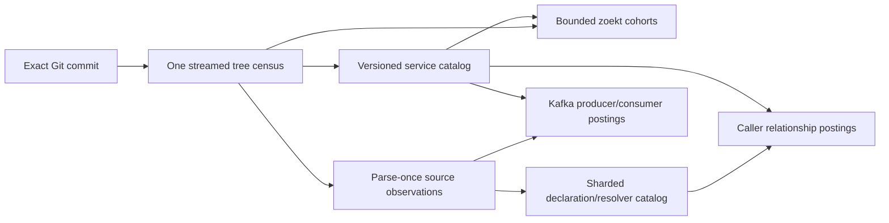

# Multi-unit large-monorepo exploration

**Status:** exploratory discussion record · **Recorded:** 2026-08-03

This document preserves a design conversation for later continuation. It is
not an ADR, active roadmap item, implementation plan, scale claim, or ticket
authorization. [PLAN.md](../PLAN.md) remains the architecture and decision
authority; [ROADMAP.md](./ROADMAP.md) and [BACKLOG.md](./BACKLOG.md) remain the
sequencing authorities.

## Question

How could phebs index a monorepo containing thousands of services, make all
searchable code available, and publish all supported static callers and Kafka
producer/consumer observations without requiring one manually configured
analysis unit or multiplying a full repository scan by the service count?

## Current boundary

The shipped Epic 30 model is structurally single-unit:

- configuration admits at most one exact analysis unit per repository;
- repository index state retains one `IndexedAnalysisUnit`;
- candidate, resolver, and caller generations bind that one unit digest and
  use repository-keyed current pointers;
- caller candidates cover the repository, but each complete caller generation
  resolves them against one unit's declaration set;
- Kafka producer and consumer evidence remains focused-local;
- historical publications and terminal job rows currently have unbounded
  retention postures.

Removing `analysis_units` restores whole-repository behavior, but it collapses
all services into one generation and does not establish large-monorepo scale.
Changing the configuration value into an array would also be insufficient: at
10,000 services, the current execution shape could imply 10,000 tree walks,
focused builds, local projections, resolver catalogs, and target-bound caller
scans for one commit.

Relevant current anchors:

- [single-unit configuration](../internal/config/config.go)
- [repository index state](../internal/store/store.go)
- [candidate generation identity](../internal/candidate/model.go)
- [caller generation identity](../internal/callerleaf/model.go)
- [caller execution](../internal/callerexecute/execute.go)
- [Kafka candidate policy](../internal/extract/candidate_policies.go)

## Working thesis

Logical service units should become views over shared repository generations,
not the physical work boundary for every analysis.



The desired cost boundary is approximately:

```text
tree entries + distinct supported source bytes + emitted observations
```

rather than:

```text
service units x repository bytes
```

## Proposed service-catalog plane

Publish one immutable, commit-bound catalog containing thousands of units:

- stable unit keys and versioned semantic scope digests;
- canonical primary and supporting paths;
- shared, generated, typed, and unowned path roles;
- many-to-many path-to-unit membership;
- evidence-backed discovery origin;
- explicit ambiguity, conflict, rejection, and unavailable states;
- a digest over the complete ordered catalog and membership projection.

Discovery should consume committed, versioned authority such as Bazel, Pants,
Buck, Backstage or custom service descriptors, `go.work`/`go.mod`, deployment
manifests, or reviewed directory conventions. Generic folder guessing cannot
honestly prove service identity. Detectors should produce inspectable
proposals; operator configuration should become a small override layer for
add, exclude, merge, split, rename, or role correction rather than the full
inventory.

One malformed service, ambiguous owner, oversized unit, or missing typed index
must not block the shared repository corpus or unrelated units. Automatic unit
discovery also does not imply automatic SCIP generation.

Repository source identity must be separated from indexed unit identity. One
unit completing cannot make every other unit appear current. Each unit needs
its own desired and active commit/digest/publication state, while the repository
source generation binds the mirror commit, census, and catalog authorities.

## Proposed search plane

Do not publish one zoekt shard set per unit. That would duplicate shared files
and create thousands of manifests, readers, mmaps, file descriptors, and cache
entries.

Instead, publish one exact repository corpus generation:

- assign every `(repository, revision, path)` to one physical rebuild cohort;
- let each cohort contain many services and emit size-driven zoekt shards;
- retain one complete root manifest over every cohort;
- map each service to the exact cohorts and paths it needs;
- search every cohort for **All code**;
- for a service query, select intersecting cohorts and include the exact path
  predicate inside the zoekt query.

The service predicate must not be a result-time filter because zoekt may have
already discarded lower-ranked valid matches. One physical owner per path is
the clean invariant; shared files receive multiple logical memberships without
being indexed repeatedly.

A retained spike should compare prefix-aware and hybrid routing across, for
example, 32/64/128 cohorts. It must prove service-result equality against a
dedicated per-unit oracle and all-code equality against a whole-repository
oracle, including adversarial ranking ties, broad queries, explicit
truncation, cold mmap/FD cost, and generation transitions.

Incremental search reuse is not yet established. Current zoekt shard metadata
embeds the Git revision, so unchanged cohort artifacts cannot simply be called
current at a new HEAD. A spike must prove safe metadata rebinding or a stable
cohort-corpus identity behind an outer commit-bound generation. Until then,
only bounded cohort rebuilds should be claimed.

## Proposed parse-once relationship plane

Read each eligible source blob once per exact commit and language-pack policy,
using bounded `git cat-file --batch` sessions rather than one child per blob.
Publish a bounded target-independent observation representation, not a generic
serialized AST. For Go, useful observations include:

- imports and aliases;
- receiver and generated-client type clues;
- constructor origin;
- selector method and exact source span;
- bounded local propagation;
- unsupported or dynamic-flow classification;
- Kafka API call, literal or same-file-constant topic, and dynamic-topic
  abstention.

One Go parse can feed gRPC, Thrift, Kafka producer, and Kafka consumer
projections while keeping semantic failures independent.

Publish a repository-wide resolver catalog partitioned by language, protocol,
and import-path namespace/hash. Declaration and generated-symbol identity stays
separate from unit ownership. Join source observations to descriptors once and
store caller postings by exact operation identity. Project target and source
paths onto zero, one, or many units afterward; changing unit boundaries should
not require another source scan.

Kafka postings can be keyed directly by literal topic, separately for producer
and consumer semantics. A topic remains a source spelling, not a cluster,
environment, or runtime identity. Dynamic topics remain unresolved and must
never be attached to a guessed literal.

Large postings should be sorted immutable artifacts with sparse key indexes.
SurrealDB should retain jobs, current roots, progress, fences, and bounded
summaries rather than becoming a frequently scanned store for millions of
relationship rows.

## Completeness and publication

Preserve the strongest T30.6 property: partial work never masquerades as a
complete graph.

```text
source root       -> every source partition terminal
catalog root      -> every declaration namespace terminal
relationship root -> exact source/catalog roots and every join partition terminal
```

The previous complete root remains visible until its replacement is complete.
Progress may be visible before publication, but **all callers** or the complete
topic graph is current only when every required partition settles. One broken
unit should not block unrelated unit publications; a repository-wide
same-commit claim requires every included projection to reference the same
source and catalog roots.

High-cardinality roots should use bounded member manifests or a Merkle-style
root rather than one giant database row.

## Meaning of "all"

The honest definition is:

> Every admitted source file was processed under the named language packs and
> limits, and every resulting resolved, ambiguous, unsupported, and unresolved
> observation is represented in one complete publication.

It cannot mean every runtime caller or topic relationship. The current caller
plane recognizes selected direct Go gRPC and Thrift shapes. Kafka recognizes
selected Go Sarama and `kafka-go` shapes. Reflection, dependency injection,
unsupported languages, cross-file dynamic topic construction, missing
generated metadata, and runtime configuration remain explicit gaps. Each new
language/client pack needs its own bounded policy, join keys, abstention
vocabulary, neutral fixtures, and validation.

## Incremental work, scheduling, and retention

For a new commit:

- perform one streamed census or a separately validated bounded tree delta;
- reuse content-addressed parse artifacts for unchanged blob identities;
- parse only changed/new supported blobs;
- rebuild only changed declaration namespaces;
- rejoin only source partitions that import affected namespaces;
- reproject only changed unit membership;
- reuse Kafka observations for unchanged blobs.

Scheduling needs generation-scoped work identities, bounded fan-out pages,
resource-class worker pools, repository fairness, per-repository concurrency
tokens, commit coalescing, stale-worker fences, and fresh-attempt successors.
One job should complete one bounded chunk rather than draining thousands of
units in one turn.

Bounded terminal-job and artifact retention is a prerequisite. Roots should
include current catalog/unit/relationship pointers, active reader leases, and
durable proof or Investigation pins. Removed units become tombstones;
unpinned artifacts are reclaimed in bounded steps under explicit age, count,
byte, and disk-watermark policies. The current unbounded historical posture
cannot safely be multiplied by thousands of units and commits.

## Migration and deployment boundary

A side-by-side migration could:

- preserve whole-repository behavior as the default;
- import today's configured unit as a one-entry explicit catalog while
  preserving its `analysis-unit-v1` digest;
- write new v2 namespaces and roots without relabeling old authority;
- dual-read and single-write during transition;
- cut over only when exact replacement publications exist;
- retain proof-pinned v1 material until a reviewed GC policy may reclaim it.

A single node may support thousands of services only if it performs one census
per commit, batches Git reads, parses source facts once, incrementally schedules
affected work, exposes lag honestly, and has bounded retention. Fleet execution
begins when measured catch-up/query SLOs, disk/CPU limits, or availability
requirements exceed one node. The present local SurrealDB child, local artifact
directories, and process-local registries are not a fleet design.

## Possible future sequence

No work below is scheduled.

1. Neutral 1,000/5,000-service measurement and authority-inventory spike.
2. Retention and terminal-task lifecycle prerequisite.
3. Versioned service catalog, explicit inventory input, and v1 migration.
4. Shared repository census and membership artifacts.
5. Bounded all-code search cohorts and exact service predicates.
6. Batch Git reader and content-addressed source-observation partitions.
7. Namespace-sharded declaration/generated resolver catalog.
8. Caller joins, global Kafka postings, and unit projections.
9. Atomic relationship roots, incremental scheduler, keyed readers, and GC.
10. Catalog/progress UI, operations guidance, and retained large demo.

## Questions for the next discussion

1. What committed authority currently defines services and build targets in
   the intended monorepo?
2. During a new HEAD rollout, should a lagging unit be excluded until exact or
   may its last complete generation remain visible with an explicit stale
   label?
3. Which caller languages, RPC frameworks, and Kafka clients are required
   beyond the currently supported Go shapes?
4. What are the representative unit count, file count, source bytes, shared
   path fan-out, commit frequency, and acceptable initial/incremental catch-up
   times?
5. How should shared libraries, generated trees, declarations, deployment
   descriptors, and unowned source map to units?
6. Does the first milestone need only single-node operation, or must its
   artifact and coordination contracts be fleet-portable from the start?
7. Should **All services at one commit** remain unavailable until every unit is
   exact, while individual units may serve explicitly stale last-complete
   generations?

## Non-decisions retained by this record

- No new epic or ticket is scheduled.
- No service-discovery authority or pattern is selected.
- No numeric unit, cohort, shard, relationship, retention, or SLO limit is
  frozen.
- No claim is made that one node can support a particular corpus.
- No new accuracy, completeness, runtime-use, migration, decommission, or
  production-registration claim is created.
